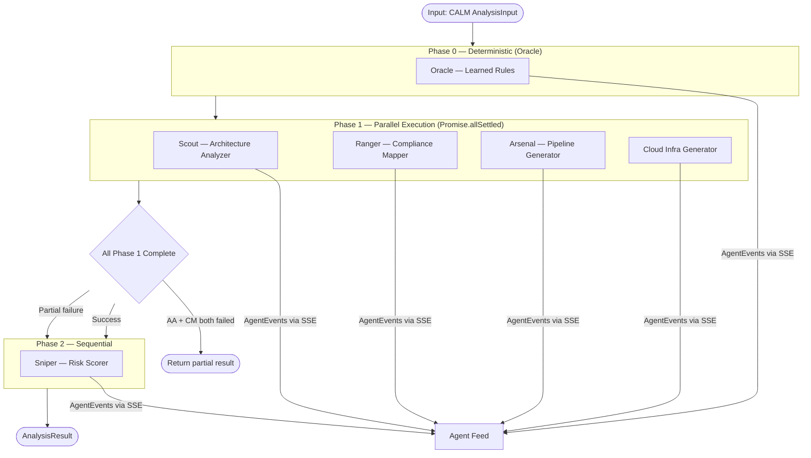

# Agent System

CALMGuard uses a multi-agent AI architecture where six specialized agents collaborate to analyze CALM architectures. This page covers agent design, orchestration, configuration, and the knowledge injection system.

## The Agent Squad

| Callsign | Agent | Phase | Role |
|----------|-------|-------|------|
| **HQ** | Orchestrator | All | Coordinate multi-agent lifecycle — Phase 0 pre-checks, parallel Phase 1, sequential Phase 2, event streaming, result aggregation |
| **Oracle** | Learning Engine | 0 | Fire deterministic rules from previously learned patterns — zero-latency, no LLM calls |
| **Scout** | Architecture Analyzer | 1 (parallel) | Extract structural insights — components, data flows, trust boundaries, security zones |
| **Ranger** | Compliance Mapper | 1 (parallel) | Map CALM controls to SOX, PCI-DSS, FINOS CCC, NIST-CSF, SOC2. Identify gaps, generate per-framework scores |
| **Arsenal** | Pipeline Generator | 1 (parallel) | Generate DevSecOps CI pipelines with SAST, secret detection, SCA, SBOM — plus security-focused Terraform IaC |
| **Sniper** | Risk Scorer | 2 (sequential) | Aggregate Phase 1 results into weighted risk assessment — overall score, per-framework scores, node-level heat map |

## Orchestration Flow



### Graceful Degradation

Phase 1 uses `Promise.allSettled` — if one agent fails, the others continue. Phase 2 (Risk Scorer) is skipped if both Architecture Analyzer AND Compliance Mapper fail, since it depends on their combined output. If only one fails, Risk Scorer runs on partial data with a lower-confidence score.

## Agent Configuration

Each agent has a YAML configuration file in the `agents/` directory, following an AOF-inspired schema:

```yaml
# agents/compliance-mapper.yaml
apiVersion: calmguard/v1
kind: Agent
metadata:
  name: compliance-mapper
  displayName: Compliance Mapper
  icon: shield
  color: "#3b82f6"
spec:
  role: |
    You are a compliance expert specializing in financial services regulations.
    Given a CALM architecture's controls and relationships, map them to the
    four supported frameworks (SOX, PCI-DSS, NIST-CSF, FINOS-CCC) and identify gaps.
  model:
    provider: google
    model: gemini-2.0-flash
    temperature: 0.1
  skills:
    - sox-compliance
    - pci-dss-compliance
    - nist-csf-compliance
    - finos-ccc-compliance
  inputs:
    - type: AnalysisInput
  outputs:
    - type: ComplianceMapping
  maxTokens: 8192
```

## SSE Event Types

All agents emit events via the `AgentEventEmitter` (global singleton). These are sent to the client via SSE:

| Event Type | When Emitted | Contains |
|------------|-------------|---------|
| `started` | Agent begins | Agent identity, timestamp |
| `thinking` | Intermediate reasoning | Message describing current analysis step |
| `finding` | A compliance finding | Message + severity (critical/high/medium/low/info) |
| `completed` | Agent finishes successfully | Final result data |
| `error` | Agent encounters an error | Error message |

### Event Schema

```typescript
interface AgentEvent {
  type: 'started' | 'thinking' | 'finding' | 'completed' | 'error';
  agent: {
    name: string;
    displayName: string;
    icon: string;
    color: string;
  };
  message?: string;
  severity?: 'critical' | 'high' | 'medium' | 'low' | 'info';
  data?: unknown;
  timestamp: string; // ISO 8601
}
```

## SKILL.md Knowledge Injection

Each agent has associated "skills" — Markdown files in `skills/` that contain compliance knowledge injected into the LLM prompt:

```
skills/
  sox-compliance.md       # SOX Section 302/404/802/906 requirements
  pci-dss-compliance.md   # PCI-DSS v4.0 requirements 1-12
  nist-csf-compliance.md  # NIST CSF 2.0 core functions
  finos-ccc-compliance.md # FINOS Common Cloud Controls
```

Skills are loaded at agent initialization and injected into the system prompt. This "knowledge injection" pattern allows compliance rules to be updated without changing agent code.

### Skill Loading

```typescript
// Simplified from src/lib/agents/registry.ts
const skillCache = new Map<string, string>();

async function loadSkill(skillName: string): Promise<string> {
  if (skillCache.has(skillName)) return skillCache.get(skillName)!;
  const content = await fs.readFile(`skills/${skillName}.md`, 'utf-8');
  skillCache.set(skillName, content);
  return content;
}
```

Module-level caching avoids repeated file I/O — skills are loaded once per server process.

## Agent Implementation Pattern

Each agent follows this pattern:

```typescript
// src/lib/agents/compliance-mapper.ts
import { generateObject } from 'ai';
import { z } from 'zod';
import { agentEventEmitter } from '../ai/streaming';
import { loadAgentConfig, loadSkills } from './registry';
import { getProvider } from '../ai/providers';

// 1. Define Zod output schema
const complianceMappingSchema = z.object({
  frameworkCoverage: z.record(z.string(), z.number()),
  controlMappings: z.array(z.object({
    nodeId: z.string(),
    frameworkId: z.string(),
    controlId: z.string(),
    status: z.enum(['compliant', 'partial', 'non-compliant', 'not-applicable']),
  })),
  gaps: z.array(z.object({
    nodeId: z.string(),
    framework: z.string(),
    description: z.string(),
    severity: z.enum(['critical', 'high', 'medium', 'low']),
  })),
});

export async function runComplianceMapper(input: AnalysisInput): Promise<ComplianceMapping> {
  const config = await loadAgentConfig('compliance-mapper');
  const skills = await loadSkills(config.spec.skills);
  const provider = getProvider(config.spec.model.provider);

  // 2. Emit started event
  agentEventEmitter.emit({
    type: 'started',
    agent: { name: config.metadata.name, ...config.metadata },
    timestamp: new Date().toISOString(),
  });

  // 3. Call LLM with generateObject
  const { object } = await generateObject({
    model: provider(config.spec.model.model),
    schema: complianceMappingSchema,
    system: buildSystemPrompt(config.spec.role, skills),
    prompt: buildUserPrompt(input),
    maxTokens: config.spec.maxTokens,
  });

  // 4. Emit findings as they're extracted from the result
  for (const gap of object.gaps) {
    agentEventEmitter.emit({
      type: 'finding',
      agent: { name: config.metadata.name, ...config.metadata },
      message: gap.description,
      severity: gap.severity,
      timestamp: new Date().toISOString(),
    });
  }

  // 5. Emit completed
  agentEventEmitter.emit({
    type: 'completed',
    agent: { name: config.metadata.name, ...config.metadata },
    data: object,
    timestamp: new Date().toISOString(),
  });

  return object;
}
```

## Retry Logic

All agents use exponential backoff retry logic for transient LLM failures:

```typescript
async function withRetry<T>(
  fn: () => Promise<T>,
  maxAttempts = 3,
  baseDelayMs = 1000,
): Promise<T> {
  for (let attempt = 1; attempt <= maxAttempts; attempt++) {
    try {
      return await fn();
    } catch (error) {
      if (attempt === maxAttempts) throw error;
      await sleep(baseDelayMs * Math.pow(2, attempt - 1));
    }
  }
  throw new Error('Max retries exceeded');
}
```

## Adding a New Agent

To add a new agent to CALMGuard:

1. Create `agents/my-agent.yaml` with the AOF-inspired config
2. Create `src/lib/agents/my-agent.ts` following the implementation pattern above
3. Add the agent to `src/lib/agents/orchestrator.ts` in the appropriate phase
4. Create any required `skills/my-skill.md` knowledge files
5. Update the Zustand store and dashboard to display the new agent's results
