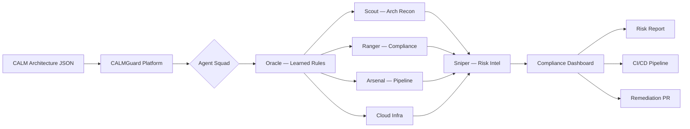

# CALMGuard — CALM-Native Continuous Compliance

> Financial institutions manage thousands of architecture decisions, each with compliance implications. When architectures change, compliance teams scramble to reassess risk. CALMGuard eliminates that scramble.

## The Problem

Modern financial systems are complex, distributed, and constantly evolving. Every architecture decision — from adding a new microservice to changing a data flow — carries compliance implications across multiple regulatory frameworks: SOX, PCI-DSS, NIST-CSF, and FINOS CCC.

Today, compliance review is:
- **Manual and slow**: teams use spreadsheets, email chains, and quarterly audits
- **Reactive not proactive**: compliance gaps discovered after deployment, not before
- **Siloed**: architecture teams and compliance teams work from different documents
- **Expensive**: specialist consultants required for each assessment

## The Solution

CALMGuard reads [FINOS CALM](https://github.com/finos/architecture-as-code) architecture definitions and analyzes them with a squad of 6 AI agents to produce real-time compliance reports — streaming live to a dashboard as agents work in parallel.

## Key Features

| Feature | Description |
|---------|-------------|
| **Real-time AI Analysis** | 6 specialized agents stream findings as they work |
| **6 Compliance Frameworks** | SOX, PCI-DSS, NIST-CSF, FINOS CCC, SOC2, Protocol Security coverage |
| **Architecture Graph** | Visual CALM node graph with compliance coloring |
| **Risk Heat Map** | Node-level risk visualization across frameworks |
| **Generated CI/CD Pipelines** | Security scanning configs auto-generated from your architecture |
| **Findings and Remediation** | Prioritized findings with actionable recommendations |

## Architecture-as-Code, Compliance-as-Code

CALMGuard is built on the principle that if your architecture is code (CALM), your compliance should be too. By ingesting CALM documents — the emerging FINOS standard for architecture-as-code — CALMGuard makes compliance continuous, automated, and developer-friendly.

### CALM at a Glance

CALM (Common Architecture Language Model) is a FINOS open standard that lets you describe software architectures in machine-readable JSON. CALMGuard reads these definitions and applies AI reasoning to find compliance gaps before they reach production.

## Built for DTCC/FINOS Innovate Hackathon 2026

CALMGuard was built by Team OpsFlow at the [DTCC/FINOS Innovate](https://innovate.dtcc.com) AI Hackathon (February 23-27, 2026) as a demonstration of how AI can make compliance engineering as fast and rigorous as modern software engineering.

**Next:** [Get Started](/getting-started)
