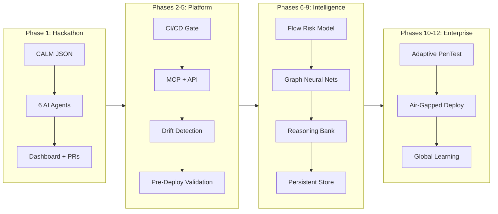

# Product Roadmap

CALMGuard is designed as a **platform**, not a point solution. The hackathon demonstrates the core loop — upload CALM, analyze with agents, generate compliance artifacts. The roadmap below charts the path from hackathon prototype to enterprise-grade continuous compliance platform.

## Vision

> Every architecture decision in financial services triggers an automatic, auditable compliance assessment — before it reaches production, not after.

## Phases

### Phase 1: Foundation (Hackathon - Delivered)

What we built in 5 days:

| Capability | Status |
|-----------|--------|
| 6-agent AI squad with 3-phase orchestration | Shipped |
| 7 compliance skill files (SOX, PCI-DSS, NIST-CSF, FINOS-CCC, SOC2, Protocol Security, DevSecOps) | Shipped |
| Self-learning engine with deterministic rule promotion | Shipped |
| Multi-version CALM support (v1.0, v1.1, v1.2) | Shipped |
| 3 GitOps PR types (DevSecOps CI, Compliance Remediation, Cloud Infra) | Shipped |
| Real-time SSE dashboard with React Flow architecture graphs | Shipped |
| Programmatic remediation (LLM identifies gaps, code applies fixes) | Shipped |

---

### Phase 2: Intelligent Pipeline Generation

**Goal:** DevSecOps pipelines that are derived from architecture, not templated.

Current Arsenal generates a good baseline CI pipeline. Phase 2 makes it architecture-aware and compliance-justified:

| Capability | Description |
|-----------|-------------|
| **DAST Integration** | Dynamic Application Security Testing stages triggered by webclient nodes with public interfaces |
| **mTLS Verification** | Pipeline steps that validate mutual TLS certificates match CALM relationship declarations |
| **Database Encryption Checks** | Automated validation that database nodes have encryption-at-rest controls matching their data-classification |
| **Audit Log Verification** | Pipeline gates that verify audit logging is configured for all nodes marked CONFIDENTIAL or RESTRICTED |
| **Policy-as-Code Gates** | OPA/Rego policy gates derived from CALM controls — fail the pipeline if architecture drifts from declared controls |
| **Adaptive Stage Selection** | Machine learning on past analyses to predict which security stages are most relevant for a given architecture pattern |

---

### Phase 3: Runtime Drift Detection

**Goal:** Detect when deployed infrastructure diverges from the declared CALM architecture.

```
CALM Architecture (declared) ←→ Live Infrastructure (actual)
         ↓                              ↓
    Expected state              Cloud API / K8s API
         ↓                              ↓
              Drift Detector Agent
                     ↓
         Compliance Alert + Auto-PR
```

| Capability | Description |
|-----------|-------------|
| **CALM vs Actual Infra** | Compare CALM node declarations against live cloud resources (AWS, Azure, GCP) via provider APIs |
| **Kubernetes Drift** | Compare CALM service/network declarations against running K8s workloads, network policies, and service meshes |
| **Continuous Monitoring** | Scheduled scans (hourly/daily) that detect new drift since last check |
| **Auto-Remediation PRs** | When drift is detected, auto-generate a PR to either update the CALM file or fix the infrastructure |
| **Drift Severity Scoring** | Classify drift by compliance impact — a missing encryption control is critical, a naming mismatch is informational |

---

### Phase 4: Pre-Deployment Validation

**Goal:** Block non-compliant changes before they reach production.

| Capability | Description |
|-----------|-------------|
| **CI Gate** | GitHub Action that validates CALM changes on every PR — blocks merge if compliance score drops below threshold |
| **Architecture Review Bot** | PR comment bot that summarizes compliance impact of proposed CALM changes |
| **Shift-Left Compliance** | IDE integration (VS Code, Cursor) that flags compliance gaps as you edit CALM files |
| **Approval Workflows** | Route high-risk changes to compliance officers for manual approval before merge |

---

### Phase 5: CALMGuard as a Service (MCP + API)

**Goal:** Any tool, agent, or pipeline can invoke CALMGuard programmatically.

| Interface | Description |
|----------|-------------|
| **MCP Server** | Model Context Protocol server — Claude Code, Cursor, VS Code Copilot, and custom agents can analyze CALM architectures via tool calls |
| **REST API** | `POST /api/v1/analyze` — submit CALM JSON, receive structured compliance report. Stateless, cacheable, rate-limited |
| **CLI** | `calmguard analyze architecture.calm.json` — local analysis without a running server |
| **GitHub App** | Install on any repo — auto-analyzes CALM files on PRs, posts compliance summary as check/comment |
| **Webhook** | Push compliance events to Slack, Teams, PagerDuty, or custom endpoints |

---

### Phase 6: Flow-Based Risk Modeling

**Goal:** Risk assessment that follows data flows, not just static node inspection.

Current Sniper scores risk per-node and per-framework. Phase 6 models risk along CALM flow transitions:

| Capability | Description |
|-----------|-------------|
| **Flow Path Analysis** | Trace data flows from actor to database — identify the weakest link in each path |
| **Cascading Risk** | If a flow passes through an unencrypted hop, downstream nodes inherit elevated risk |
| **Attack Surface Mapping** | Map CALM flows to MITRE ATT&CK techniques — identify which flows are exposed to which threat vectors |
| **Blast Radius Estimation** | When a node is compromised, calculate which other nodes are reachable via CALM relationships |

---

### Phase 7: Secure Infrastructure as Code

**Goal:** Generate production-ready, compliance-justified infrastructure from CALM signals.

| Capability | Description |
|-----------|-------------|
| **Cloud-Native Terraform** | AWS VPC, Security Groups, IAM policies, RDS encryption — all derived from CALM node types and protocols |
| **Kubernetes Manifests** | Network policies, pod security standards, service mesh configs from CALM relationship declarations |
| **Helm Charts** | Parameterized Helm charts with compliance defaults baked in |
| **Compliance Annotations** | Every generated resource includes comments tracing back to the CALM control that justified it |
| **Multi-Cloud** | AWS, Azure, GCP — same CALM architecture, provider-specific secure IaC |

---

### Phase 8: Persistent Intelligence Store

**Goal:** Replace localStorage with a production-grade learning backend.

| Capability | Description |
|-----------|-------------|
| **PostgreSQL Backend** | Server-side pattern store with full ACID guarantees |
| **Cross-Team Learning** | Patterns discovered by one team are available to all teams (with approval gates) |
| **Versioned Skills** | Learning engine auto-appends promoted rules to skill files — skills evolve with every analysis |
| **Audit Trail** | Every pattern promotion, rule change, and analysis result is timestamped and attributable |
| **Admin Dashboard** | Review, approve, reject, and tune promoted rules before they become deterministic |

---

### Phase 9: Graph Intelligence & Self-Learning

**Goal:** Move beyond pattern matching to structural reasoning about architecture compliance.

| Capability | Description |
|-----------|-------------|
| **Graph Neural Networks** | GNN-based architecture analysis — learn compliance patterns from graph structure, not just node attributes |
| **Architecture Embeddings** | Vectorize CALM architectures for similarity search — "find architectures like mine that passed PCI audit" |
| **Reasoning Bank** | Curated vector store of compliance reasoning chains — reusable rationale for common architectural patterns |
| **SONA (Self-Organizing Neural Architecture)** | Self-learning agent that discovers new compliance patterns by analyzing structural similarities across architectures |
| **Federated Learning** | Learn from multiple organizations without sharing raw architecture data |

---

### Phase 10: Continuous Adaptive Penetration Testing

**Goal:** Automated, architecture-aware security testing that evolves with the system.

| Capability | Description |
|-----------|-------------|
| **CALM-Guided Pen Testing** | Use CALM flows to generate targeted penetration test plans — test the actual attack paths, not random endpoints |
| **Adaptive Test Generation** | Tests evolve based on architecture changes — new relationship added means new test cases generated |
| **Integration with Tools** | Orchestrate OWASP ZAP, Burp Suite, Nuclei based on CALM node types and protocols |
| **Compliance-Mapped Results** | Map pen test findings back to specific CALM controls and compliance framework requirements |

---

### Phase 11: Enterprise Deployment

**Goal:** Production-grade deployment for regulated financial institutions.

| Capability | Description |
|-----------|-------------|
| **Air-Gapped Deployment** | Docker/K8s deployment with no external API calls — local LLM (Ollama/vLLM) for air-gapped environments |
| **Multi-Tenancy** | Organization isolation with tenant-scoped data, learning stores, and skill files |
| **SSO/RBAC** | SAML/OIDC SSO, role-based access (admin, analyst, auditor, viewer), API key management |
| **SOC2 Type II Evidence** | Auto-generate evidence packages for SOC2 Type II audits from analysis history |
| **Compliance Reporting** | PDF/DOCX export, scheduled email digests, executive dashboards |

---

### Phase 12: Global Learning Network

**Goal:** A federated compliance intelligence network across the financial services industry.

| Capability | Description |
|-----------|-------------|
| **Anonymous Pattern Sharing** | Organizations contribute compliance patterns without revealing architecture details |
| **Industry Benchmarks** | "Your payment architecture is in the 73rd percentile for PCI-DSS compliance" |
| **Community Skills** | Open-source skill marketplace — community-contributed compliance knowledge for new frameworks |
| **Regulatory Updates** | When PCI-DSS 5.0 drops, the network propagates updated control mappings to all participants |
| **Cross-Org Learning** | Patterns that work across 10+ organizations get auto-promoted to industry best practices |

---

## Architecture Evolution



## Design Principles

These principles guide every phase of the roadmap:

1. **Architecture is the source of truth** — CALM documents drive all compliance decisions, pipeline generation, and risk scoring
2. **LLMs identify, code applies** — AI agents find gaps and reason about compliance; deterministic code applies changes to documents and infrastructure
3. **Grounded, not hallucinated** — Every compliance finding cites a specific control ID from an official framework. Closed reference tables prevent fabrication
4. **Continuous, not periodic** — Compliance is checked on every change, not quarterly. Drift is detected in hours, not months
5. **Open and extensible** — FINOS CALM standard, open-source skill files, community-contributed frameworks, MCP protocol for tool integration
