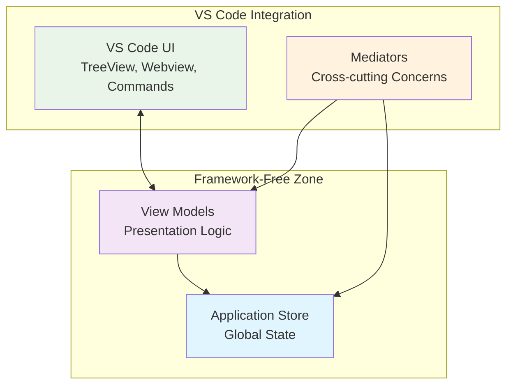

# CALM VS Code Extension - Developer Guide

## Architecture

The extension follows a **Redux Pattern + MVVM + Hexagonal Architecture** approach with clear separation of concerns:

### 🏗️ Core Architecture Principles



#### **MVVM (Model-View-ViewModel)**
- **Models**: `application-store.ts` - Zustand-based global state management
- **ViewModels**: Framework-free presentation logic (no `vscode` imports)
  - `TreeViewModel` - Tree structure and navigation
  - `EditorViewModel` - Editor interactions and positioning  
  - `DocifyViewModel` - Documentation generation state
  - `CalmModelViewModel` - Model data display
  - `TemplateViewModel` - Template processing and live mode
- **Views**: VS Code specific UI implementations (TreeDataProvider, WebviewPanel, etc.)
- **Controller**: `calm-extension-controller.ts` handles dependency wiring and VS Code lifecycle

#### **Hexagonal Architecture (Ports & Adapters)**
```
src/core/
├── ports/           # Interfaces (dependency inversion)
├── services/        # Core business logic
├── mediators/       # Cross-cutting concerns coordination
└── application-store.ts  # Central state management
```

#### **Mediator Pattern**
Mediators handle cross-cutting concerns without tight coupling:
- **RefreshService**: Coordinates model updates and UI refreshes
- **SelectionService**: Syncs selection across tree, editor, and preview
- **WatchService**: File system monitoring and change detection
- **StoreReactionMediator**: Reactive state management orchestration

### 📁 Project Structure

```
src/
├── application-store.ts         # Zustand store (global state)
├── calm-extension-controller.ts # Main orchestration controller
├── extension.ts                 # VS Code entry point
├── 
├── core/                        # Hexagonal architecture core
│   ├── ports/                   # Dependency inversion interfaces
│   ├── services/                # Business logic services
│   ├── mediators/               # Cross-cutting concern coordinators
│   └── emitter.ts              # Framework-free event system
│   
├── features/                    # Feature-based organization
│   ├── editor/                  # Editor integration (hover, CodeLens)
│   ├── preview/                 # Webview preview panel
│   │   ├── docify-tab/         # Documentation generation
│   │   ├── model-tab/          # Model data display
│   │   └── template-tab/       # Template processing
│   └── tree-view/              # Sidebar tree navigation
│       └── view-model/         # MVVM presentation logic
│
├── commands/                    # VS Code command implementations
├── models/                      # Model parsing and indexing
└── cli/                        # CLI integration (to be replaced)
```

## Development Setup

### Prerequisites
- VS Code 1.88+
- Node.js 20+

### Development Setup

1. **Install dependencies**:
   ```bash
   cd calm-plugins/vscode
   npm install
   ```

2. **Start development server**:
   ```bash
   npm run watch
   ```

3. **Launch Extension Development Host**:
   - Press `F5` in VS Code
   - Or use "Run CALM Extension" from the debug panel

### Building for Production

At the root project level

```bash
npm run package:vscode
```

This will ensure dependent projects are compiled first

### Testing

```bash
npm test                    # Run all tests
npm test -- --watch       # Run tests in watch mode
npm test -- tree-view     # Run specific test suite
```

**Test Coverage**: 109 tests across all ViewModels with comprehensive:
- State management validation
- Event emission testing  
- Resource cleanup verification
- Edge case handling

## Publishing

### GitHub Actions Publishing

The extension can be published via GitHub Actions using manual workflow dispatch:

1. **Navigate to Actions tab** in your GitHub repository
2. **Select "Build VS Code Extension"** from the workflow list
3. **Click "Run workflow"** button
4. **Choose your options**:
   - ☐ Leave unchecked: Build, test, and package only
   - ☑️ Check "Publish to VS Code Marketplace": Build, test, package, AND publish

**What it does**
- **Always runs**: Lint → Test → Package
- **Conditionally runs**: Publish (only when checkbox is selected)


**Prerequisites**
- Ensure `VSCE_PAT` secret is configured in repository settings
- Secret is only needed if you plan to publish

**VS Code Marketplace**
The extension will be published to the [VS Code Marketplace](https://marketplace.visualstudio.com/items?itemName=FINOS.calm-vscode-plugin).


## Developer Guide

### 🎯 Current Implementation Status

#### ✅ **Completed** 
- **MVVM Architecture**: Clean separation with framework-free ViewModels
- **Comprehensive Testing**: 109 tests covering all ViewModels
- **State Management**: Zustand-based reactive store  
- **Interactive Preview**: Cytoscape-powered graph with rich interactions
- **Tree Navigation**: Full CRUD operations with search/filter
- **Editor Integration**: Hover, CodeLens, and automatic refresh
- **Template System**: Handlebars processing with live mode

#### 📋 **In Progress/Planned**
- **Hexagonal Architecture Refinement**: Completing ports/adapters pattern
- **Mediator Coordination**: Fine-tuning cross-cutting concerns
- **CLI Integration Replacement**: `--scaffold` mode from docify CLI will replace most of the code in  `src/cli/` folder (See https://github.com/finos/architecture-as-code/issues/1563)
- **Model Updates**: Original [POC](https://github.com/finos/architecture-as-code/pull/1516) models in `src/models/` and settings need updating to potentially use models from @finos/calm-models and reduce use of any
- **Enhanced Validation**: Richer diagnostics and error reporting

### 🎯 Contribution Guidelines

#### **ViewModels Should**
- ✅ Be framework-free (no `vscode` imports)
- ✅ React to store state changes only
- ✅ Provide presentation-ready data
- ✅ Emit events for user intents
- ❌ **NOT** know about mediators directly

#### **Mediators Should** 
- ✅ Coordinate between different parts of the system
- ✅ Handle cross-cutting concerns (selection, refresh, etc.)
- ✅ Subscribe to store changes and ViewModel events
- ❌ **NOT** contain business logic
