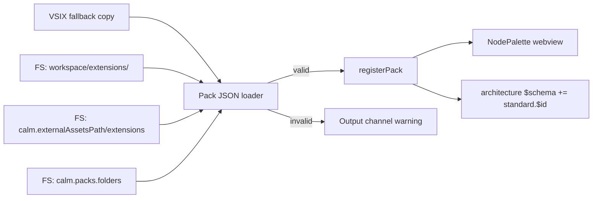

# CALM VS Code plugin — JSON extension packs — PRD


|                    |                                                                                                                                      |
| ------------------ | ------------------------------------------------------------------------------------------------------------------------------------ |
| **Owner / DRI**    | TBD                                                                                                                                  |
| **Status**         | Draft                                                                                                                                |
| **Version**        | 0.1                                                                                                                                  |
| **Last updated**   | 2026-09-19                                                                                                                           |
| **Target release** | TBD                                                                                                                                  |
| **Reviewers**      | eng lead                                                                                                                             |
| **Links**          | [Studio PRD §4.31](../../calm-studio/docs/prd.md) · [Pack JSON Schema](../../extensions/calm-extension-pack.schema.json) · [BBR V9](../../calm-studio/docs/BBR.MD) · [AGENTS.md](../AGENTS.md) |


> **TL;DR** — Palette packs in the VS Code plugin are duplicated TypeScript today and lag Studio (no ArchiMate, no `schemaUrl`). This revision reads the shared JSON packs from the **filesystem** (monorepo-root `extensions/`, workspace `extensions/`, extra folders), each pointing at a CALM Standard `$id`.


## Contents

- [1. Problem and background](#1-problem-and-background)
- [2. Goals, non-goals, and success metrics](#2-goals-non-goals-and-success-metrics)
- [3. Target users and use cases](#3-target-users-and-use-cases)
- [4. Proposed solution](#4-proposed-solution)
- [5. Requirements](#5-requirements)
- [6. UX and design](#6-ux-and-design)
- [7. Technical considerations](#7-technical-considerations)
- [8. Release criteria and rollout](#8-release-criteria-and-rollout)
- [9. Open questions and risks](#9-open-questions-and-risks)
- [10. Appendix and change log](#10-appendix-and-change-log)


## 1. Problem and background

The canvas palette is driven by `src/extensions/packs/*.ts`, a fork of CalmStudio packs. Two hosts therefore maintain two copies of labels, colors, icons, and type ids. The plugin already exposes `calm.packs.enabled` / `calm.packs.excludeNodes` and `calm.externalAssetsPath` (for `standards/`, `patterns/`, `templates/`, `nodes/`), but **there is no file format** that defines a palette pack. Adding a type still requires a TypeScript change, a rebuild, and a Marketplace release. ArchiMate exists in Studio and is missing here. Architecture `$schema` cannot pick up a pack Standard because `PackDefinition` in the plugin has no Standard URI.

**Why now:** BBR V9 requires one pack definition reusable across Studio, this plugin, Hub, and CLI, loaded from a file. Canonical files live at the **monorepo root** `extensions/`. The plugin must read them from the filesystem instead of growing the TypeScript fork.

**Current state**


| Area                         | State                                                                                          |
| ---------------------------- | ---------------------------------------------------------------------------------------------- |
| Pack source                  | TypeScript in `src/extensions/packs/` (10 packs; no ArchiMate)                                 |
| Runtime type                 | `PackDefinition` without `schemaUrl` / Standard                                                |
| Palette                      | `initAllPacks()` in `NodePalette.tsx` at module load                                           |
| Enable / hide                | Settings `calm.packs.enabled`, `calm.packs.excludeNodes`                                       |
| External assets              | `calm.externalAssetsPath` — standards, patterns, templates, nodes; **not** packs               |
| Architecture `$schema`       | Not written from pack Standard                                                                 |


## 2. Goals, non-goals, and success metrics

**Goals**

- One JSON pack format at repo-root `extensions/`; the plugin **reads pack files from disk**.
- Each pack carries a CALM Standard reference (`standard.$id`) used when the host writes architecture `$schema`.
- Palette parity with Studio for the 11 bundled packs, including ArchiMate.
- Invalid or unknown pack files fail closed (log + skip), never crash the webview.

**Non-goals**

- Marketplace / install UI for packs.
- Authoring or editing CALM Standard JSON Schema documents in the plugin.
- Unifying canvas layout with CALM Hub (Studio BBR V8).
- Deleting the TypeScript pack modules in the same drop if a dual-load adapter is safer — follow-up once JSON load is proven.
- Changing `calm.packs.enabled` semantics except to include `archimate`.

**Success metrics**


| Metric                                      | Baseline                         | Target                                              | By when |
| ------------------------------------------- | -------------------------------- | --------------------------------------------------- | ------- |
| Add a palette type without plugin rebuild   | Edit TS + rebuild + reload       | Drop `*.extension.json` into a configured folder    | v0.1    |
| Bundled pack count vs Studio                | 10 (no ArchiMate)                | 11, same `typeId` set as Studio JSON                | v0.1    |
| Broken pack file                            | N/A (compile-time only)          | Warning in Output; other packs still load           | v0.1    |


## 3. Target users and use cases

- **Primary persona:** Architect editing CALM JSON in VS Code with the CALM Canvas webview.
- **Key use cases:**
  1. Open this monorepo (or any workspace with `extensions/`) → palette is built from pack JSON **on disk**, not from TypeScript.
  2. Place `ai:agent` → if the document has no `$schema` yet, write CALM 1.2 meta-schema plus `standard.$id` from the AI pack.
  3. Team drops `difa-arch.extension.json` into workspace `extensions/` (or `calm.packs.folders`) → palette gains those types after file watch.
  4. `calm.packs.enabled: ["core", "archimate"]` hides cloud packs, same as today.
- **Not for:** Users who only want JSON language features without the canvas.

## 4. Proposed solution

Treat a pack as **data**. The extension host reads `*.extension.json` from the **filesystem**, validates against [calm-extension-pack.schema.json](../../extensions/calm-extension-pack.schema.json), maps it to the existing `PackDefinition` runtime type, and registers it. The webview does not read disk; it receives pack DTOs over postMessage.



**Load order (later wins on the same `id`):**

1. Fallback copy inside the VSIX (`dist/extensions/packs/`) — used when the workspace has no `extensions/` folder (Marketplace users).
2. Folder `extensions/` at the **workspace root**, read with Node `fs` (this is the monorepo layout when the repo is opened).
3. `extensions/` under `calm.externalAssetsPath`, if configured (Node `fs`).
4. Extra directories from `calm.packs.folders` (relative or absolute filesystem paths).

Opening `architecture-as-code` as the workspace therefore loads [`extensions/packs/`](../../extensions/packs/) from disk without a rebuild. Same `id` overwrites. Same `typeId` in two different pack ids is a warning; first registered mapping stays unless the later pack replaces the whole pack id.

**Standard vs pack file:** the pack is the palette catalog (nodes, relationships, icons). The Standard is a CALM JSON Schema overlay under `extensions/standards/` (`standard.href`). The pack **points at** the Standard via `standard.$id`. When the canvas creates the first node from a pack, the extension host writes `$schema` as `[calm 1.2 meta, standard.$id]` — including when that URI is not yet on calm.finos.org. Validation uses the local `href`, not a network fetch. Core writes only `calm.json`.

**Settings (additive)**

| Setting                    | Change                                                                 |
| -------------------------- | ---------------------------------------------------------------------- |
| `calm.packs.enabled`       | Document `archimate`. Empty = all packs (unchanged).                   |
| `calm.packs.excludeNodes`  | Unchanged.                                                             |
| `calm.externalAssetsPath`  | Also scan `extensions/*.extension.json`.                               |
| `calm.packs.folders`       | **New.** Extra directories of pack JSON.                               |

**Watch:** workspace pack files use `FileSystemWatcher`; on change, reset registry, reload, postMessage `packsUpdated` so the webview rebuilds the palette without restarting the Extension Host.

## 5. Requirements

| ID  | User story | Priority | Acceptance criteria | Status |
| --- | ---------- | -------- | ------------------- | ------ |
| V-R1 | As an architect I want the canvas palette loaded from JSON pack files so Studio and VS Code share one definition. | P0 | - [ ] Canonical files are monorepo-root `extensions/packs/*.extension.json` - [ ] Startup **reads pack JSON from the filesystem** (workspace `extensions/`, then settings paths) - [ ] VSIX may embed a fallback copy for workspaces without that folder - [ ] 11 packs including ArchiMate - [ ] Each `typeId` matches Studio JSON - [ ] TypeScript `src/extensions/packs/*.ts` is not the runtime source | Open |
| V-R2 | As an architect I want each pack to reference its CALM Standard so new architectures get the right `$schema`. | P0 | - [ ] Runtime `PackDefinition` has `schemaUrl` = pack `standard.$id` - [ ] First node from a pack with Standard writes `$schema` array: CALM 1.2 meta + `standard.$id` - [ ] Core pack writes only the 1.2 meta-schema (`calm.json`); no overlay `href` - [ ] Proposed Standard URIs are still written; schema is loaded from `standard.href` on disk (`extensions/standards/`) | Open |
| V-R3 | As an architect I want extra packs from the workspace so my org types appear without a plugin release. | P0 | - [ ] Load `extensions/*.extension.json` (and `extensions/packs/`) from workspace root via `fs` - [ ] Also `calm.externalAssetsPath/extensions/` and `calm.packs.folders` - [ ] Same `id` overwrites earlier load - [ ] File watch (`fs.watch` / VS Code watcher) refreshes palette - [ ] `calm.packs.enabled` still filters | Open |
| V-R4 | As an architect I want a bad pack file to be skipped so the canvas still works. | P0 | - [ ] Schema validation before register - [ ] Invalid JSON / schema fail → Output `[WARN]`, skip file - [ ] Remaining packs load - [ ] Duplicate `typeId` across different pack ids → warning | Open |
| V-R5 | As an architect I want ArchiMate nodes in the VS Code palette with the same defaults as Studio. | P1 | - [ ] `archimate` pack present - [ ] `rectangleLayout` honored by canvas node renderer (or documented fallback to generic node) - [ ] `defaults.metadata` applied on place | Open |

**Assumptions**

- Canonical pack JSON lives at monorepo-root `extensions/`. The plugin loads it with Node `fs`. A VSIX fallback copy is allowed only when the workspace has no `extensions/` folder.
- Inline SVG in JSON is acceptable in the webview (`dangerouslySetInnerHTML` or equivalent already used for TS icon strings).
- CALM Standard documents are **not** required to be on disk for the palette to show; `$id` is a URI written into `$schema`. Resolution for validate stays `CalmSchemaRegistry` / `calm.schemas.additionalFolders`.

## 6. UX and design

No new panel. Palette groups stay pack `label` + badge from `color.badge`.

On pack reload: palette sections replace in place; canvas nodes already placed keep their `node-type` (unknown type → existing generic `extension` node).

If a configured folder is missing: silent skip (same as missing `templates/` today).

Output channel `CALM Canvas` logs: loaded pack ids, skipped files, overwrite of bundled `id`.

## 7. Technical considerations

**Do not change:** MVVM / hexagonal split; ViewModels stay free of `vscode` imports. Loader belongs in `src/extensions/` (framework-free parse + registry) with a thin adapter in `src/extension/services/` for `fs` + watchers. Webview receives pack DTOs via existing postMessage (do not read `fs` in the webview).

**Mapping JSON → `PackDefinition`**

| JSON field | Runtime |
| ---------- | ------- |
| `id`, `label`, `version`, `color`, `nodes[]` | same |
| `nodes[].icon` string | `icon` SVG string |
| `nodes[].icon.href` | resolve against pack file directory; inline SVG if `image/svg+xml`, else keep href for `` |
| `standard.$id` | `schemaUrl` |
| `standard.href` | resolve vs pack file; register in schema registry for validate |
| `nodes[].rectangleLayout`, `isContainer`, `defaultChildren`, `defaults.metadata` | add to plugin `NodeTypeEntry` (today missing `rectangleLayout`) |

**Build / tests:** tests read `extensions/packs/` from the monorepo via filesystem (relative to repo root). Optional VSIX copy of the same folder is fallback, not the development load path.

**Implementation order**

1. Add `schemaUrl` / optional node fields to plugin `types.ts`.
2. JSON loader + schema validation + tests that **read** `extensions/packs/` from disk.
3. `initAllPacks()` becomes FS load (workspace `extensions/` first).
4. `calm.packs.folders` + `externalAssetsPath` + watcher + `packsUpdated`.
5. First-node `$schema` envelope (parity with Studio `documentEnvelope.ts`).
6. ArchiMate rendering (`rectangleLayout`) if GenericNode is insufficient.

**Constraints / do not change**

- DO NOT change CALM 1.2 nested `relationship-type` shape.
- DO NOT invent a second pack JSON format for the plugin.
- DO NOT fetch `standard.$id` from the network in the webview (TLS / air-gapped). Validate using bundled + configured schema folders.
- DO NOT make compile-time `import` of pack JSON the only load path — Node `fs` (and watchers) are required.
- Follow `AGENTS.md` in this package.

## 8. Release criteria and rollout

- [ ] V-R1–V-R4 acceptance criteria met (P0)
- [ ] Unit tests: parse 11 packs; reject invalid pack; overwrite by `id`; enabled filter
- [ ] `npm test --workspace calm-plugins/vscode` passes
- [ ] Manual: F5 on this monorepo → palette loads from workspace `extensions/packs/` on disk
- [ ] Manual: drop `extensions/foo.extension.json` → type appears after save (watcher)
- [ ] Manual: corrupt JSON in that folder → Output warning, other packs remain
- [ ] Rollout: no feature flag; release note: packs are JSON; `calm.packs.folders` added
- [ ] Rollback: revert loader to TS packs only if JSON load blocks activation (keep TS as fallback for one release if needed)

## 9. Open questions and risks


| # | Question / risk | Severity | Owner | Status |
| - | --------------- | -------- | ----- | ------ |
| 1 | Canonical home of pack JSON | — | PM | **Resolved** — monorepo root `extensions/`; load from filesystem |
| 2 | Should `rectangleLayout` be implemented in the ReactFlow `GenericNode` or a new node type? | Medium | eng | Open |
| 3 | Write `$schema` for unpublished Standard URIs | — | PM | **Resolved** — write `$id`; load schema from `standard.href` on disk |
| 4 | Watcher debounce and webview race if user edits a pack while dragging from palette | Low | eng | Open — debounce ≥ 300 ms |
| 5 | License of inline SVG when packing JSON into the Marketplace VSIX | Medium | eng | Open — same icons as current TS |


## 10. Appendix and change log

**Data model (pack file, abbreviated)**

```json
{
  "$schema": "https://calm.finos.org/schemas/calm-extension-pack.schema.json",
  "$id": "https://calm.finos.org/extensions/packs/ai.extension.json",
  "id": "ai",
  "label": "AI / Agentic",
  "version": "1.0.0",
  "standard": {
    "$id": "https://calm.finos.org/extensions/ai/ai.standard.json",
    "$schema": "https://json-schema.org/draft/2020-12/schema",
    "href": "../standards/ai.standard.json",
    "calmVersion": "1.2",
    "status": "proposed"
  },
  "color": { "bg": "#f5f0ff", "border": "#8b5cf6", "stroke": "#7c3aed", "badge": "[AI]" },
  "nodes": [{ "typeId": "ai:llm", "label": "LLM", "icon": "<svg>...</svg>", "color": {} }]
}
```

**Definition of Done**

- [ ] P0 acceptance criteria met
- [ ] Tests for loader, validation, and registry overwrite
- [ ] Settings contribution documented in README
- [ ] No remaining runtime import of `src/extensions/packs/*.ts` except tests that assert JSON parity

**Change log**


| Date       | Version | Author | Change |
| ---------- | ------- | ------ | ------ |
| 2026-09-19 | 0.1     | stakeholder | Initial draft: JSON packs at repo-root `extensions/`, filesystem load, Standard `$id` |
