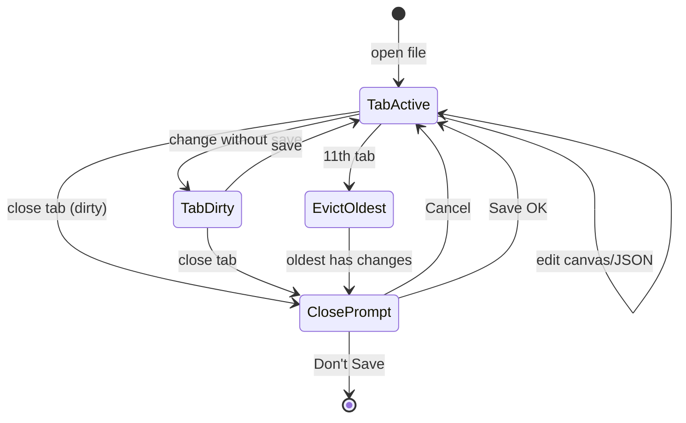
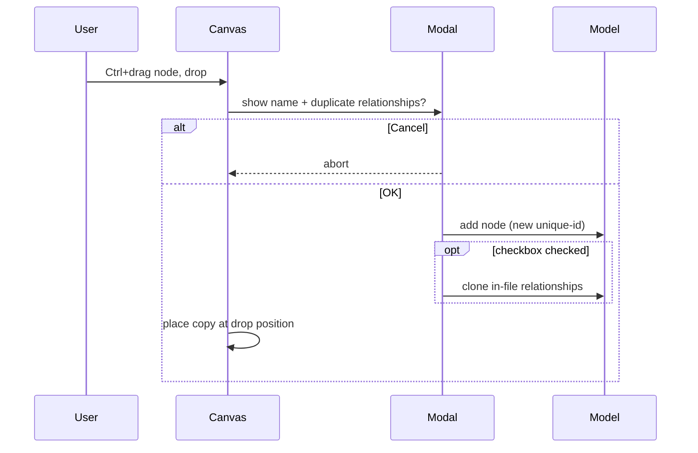
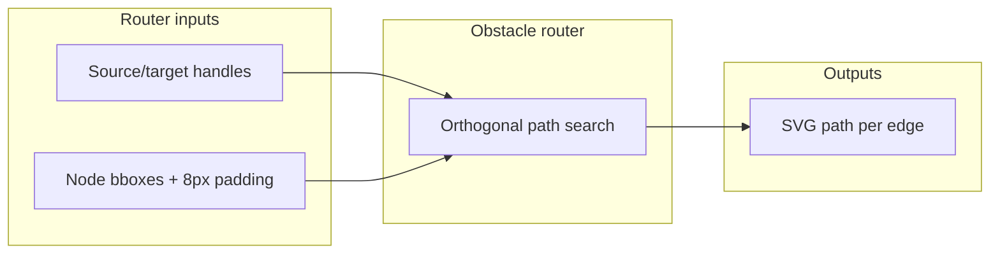
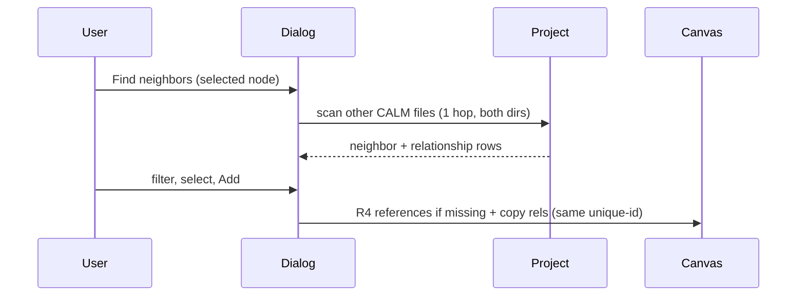
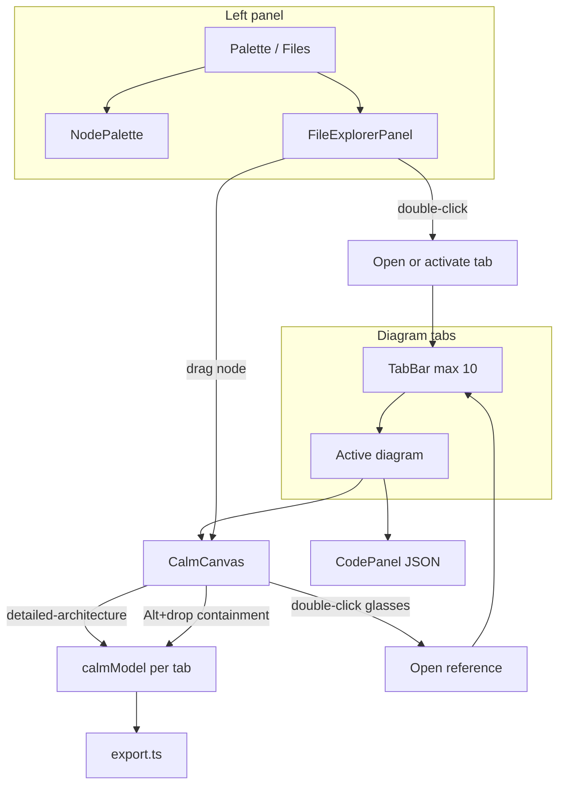
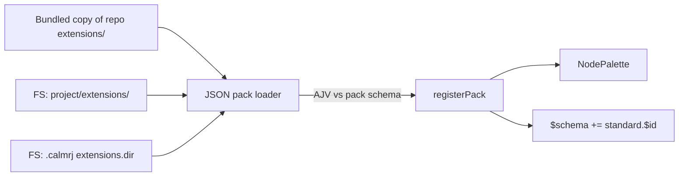
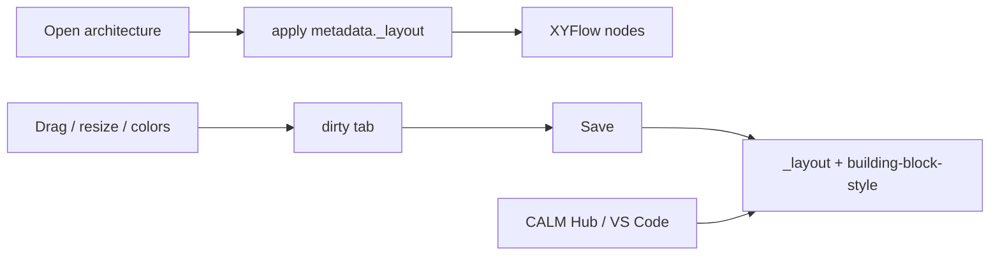

# CALM Studio — Modeling Extensions and Editor Fixes — PRD


|                        |                                                                                                                                                                                                                                                                                        |
| ---------------------- | -------------------------------------------------------------------------------------------------------------------------------------------------------------------------------------------------------------------------------------------------------------------------------------- |
| **Owner / DRI**        | TBD                                                                                                                                                                                                                                                                                    |
| **Status**             | Draft                                                                                                                                                                                                                                                                                  |
| **Version**            | 0.29                                                                                                                                                                                                                                                                                   |
| **Last updated**       | 2026-09-20                                                                                                                                                                                                                                                                             |
| **Target release**     | TBD                                                                                                                                                                                                                                                                                    |
| **Reviewers**          | eng lead, design                                                                                                                                                                                                                                                                       |
| **Supported browsers** | **Chrome**, **Safari** (current + previous major versions)                                                                                                                                                                                                                             |
| **Links**              | [BBR.MD](./BBR.MD) · [AGENTS.md](../AGENTS.md) · [CALM 1.2](https://calm.finos.org/release/1.2/) · [Pack schema](../../extensions/calm-extension-pack.schema.json) · [VS Code pack PRD](../../calm-plugins/vscode/docs/prd.md) · [IDEA V4](./ideas/IDEA-calmrj-project-and-extract.md) |


> **TL;DR** — We will extend CALM Studio with a folder browser panel for CALM files and drag-and-drop references via `detailed-architecture`, **multiple diagrams in tabs** with a JSON editor bound to the active tab, and **visual navigation to referenced diagrams** (glasses icon). We will add **structured** `metadata` **editing** in the properties panel, including field scaffolding per extension schema, and a **read-only mode** for reference nodes with `details.detailed-architecture`. **V3** polishes the file panel (reveal active file, refresh node list on save), adds **Ctrl+drag node duplication** with an optional relationship copy dialog, **focuses the referenced node** after drill-down navigation, and delivers **full diagram layout** — no overlapping boxes plus **obstacle-aware edge routing** on auto-layout, manual placement, and label resize (#16 in R23). **V4** adds a **project file** (`*.calmrj`) for Spectral ruleset selection, directory/naming conventions, and **extract node → separate diagram** (parent becomes a `detailed-architecture` stub). **V5** adds **Find neighbors** (project-wide 1-hop links → add as references + relationships with preserved `unique-id`), **session diagram filter/fog** (focus neighbors or single metadata value), **Save all** dirty tabs, and **VS Code–style tab close** (left / right / all, one summary dirty dialog). **V6** adds **Radial** to the layout menu, **project-folder templates** from `.calmrj`, a **working Docker deploy**, **hidden containment edges** with a container-header shortcut into relationship properties, a **node-type fog mode**, and **Find usage** (reference stubs + relationship endpoints in other files → open diagram). **V7** merges `composed-of` / `deployed-in` to **one relationship per type per container** (`nodes[]` in properties), uses **Alt+drop / Alt+extract** for containment, adds **file/directory pickers** in project settings, and offers **CALM CLI patterns** in the template picker via the existing `@finos/calm-shared` generate pipeline (not a new generator). **V9** moves extension packs out of TypeScript into **one JSON file per pack** (schema + Standard `$id`), loadable from disk and reusable with the VS Code plugin. **V8** unifies canvas persistence with CALM Hub and the VS Code plugin (`metadata._layout` + `building-block-style`), packs container children into a **near-square grid**, removes the container visual max-size clip, draws visible relationships as **bezier**, validates against CLI patterns, and lets Project settings edit `naming` and `patterns`. **V8.1** loads Hub patterns (namespaces as picker tabs) and lets users browse/reference Hub architectures. **V8.2** visualizes and graphically edits CLI patterns (Hub PatternGraph parity), adds generic metadata editing for nodes and relationships, and fixes the Ctrl+duplicate editor freeze. **V10** lets users **create folders, create named files, and move folders** from a **right-click menu on the Files-tree row** (**New file** asks for the name immediately), defaults **Save As** to the selected folder plus a naming-pattern filename, overlays **user-home config** under the project file, splits settings into **tabs**, upgrades metadata to **enum dropdowns** and a **nested JSON dialog**, adds **Shift / marquee multi-select** with a **Select / Pan left-button toggle** and a **canvas mini-map** (click pans the current viewport), alignment tools, **arranges containers into a table**, lets teams **disable bundled packs**, and **opens Hub `detailed-architecture` URLs** in read-only editors (JSON locked; no Hub insert onto those tabs), and **resolves canonical `$id` URLs** through a project `url-mapping.json` (path in `.calmrj`). We will fix critical JSON editor, export, and container sizing bugs. Earlier iterations add automatic `$schema` in the JSON header (CALM 1.2 + extension Standard), required fields when creating elements, and direction reversal for all relationship types.

## Contents

- [1. Problem and context](#1-problem-and-context)
- [2. Goals, non-goals, and success metrics](#2-goals-non-goals-and-success-metrics)
- [3. Target users and use cases](#3-target-users-and-use-cases)
- [4. Proposed solution](#4-proposed-solution) — includes [§4.31 JSON extension packs (V9)](#431-json-extension-packs-p1--bbr-v9), [§4.32 Hub-compatible layout (V8)](#432-hub-compatible-layout-and-container-grid-p1--bbr-v8), [§4.33 Hub patterns and browse (V8.1)](#433-hub-patterns-and-document-browse-p1--bbr-v81), [§4.34 Pattern canvas and generic metadata (V8.2)](#434-pattern-canvas-generic-metadata-and-ctrl-copy-freeze-p1p0--bbr-v82), [§4.35 Project folders, config overlay, and Hub read-only (V10)](#435-project-folders-config-overlay-multi-select-and-hub-read-only-p1--bbr-v10)
- [5. Requirements](#5-requirements)
- [6. UX and design](#6-ux-and-design)
- [7. Technical aspects](#7-technical-aspects)
- [8. Release criteria and rollout](#8-release-criteria-and-rollout)
- [9. Open questions and risks](#9-open-questions-and-risks)
- [10. Appendix and change log](#10-appendix-and-change-log)

## 1. Problem and context

CALM Studio today lets users model architecture in a single file with a palette of node types, but it lacks multi-file project workflows and cross-document node referencing. **The editor supports only one open diagram at a time** — switching between files replaces the window content instead of working in tabs, which complicates navigation in multi-file projects and tracking references. Nodes with `details.detailed-architecture` lack a clear visual indicator and quick navigation to the target diagram. **In V3**, even with the Files panel and tabs, users still lose orientation in large trees (no reveal for the active file), see stale node previews after save, cannot duplicate in-diagram nodes with optional relationship copy, land on a detail diagram without the referenced node in view, and suffer overlapping boxes or edges drawn through nodes after label resize or auto-layout. **In V4**, there is still no project-level config: teams cannot attach folder-scoped Spectral rules on top of core CALM validation, nor encode directory/naming conventions for new diagram files. Splitting a growing node into its own diagram requires manual file creation, path math, and stub wiring. **In V5**, architects cannot discover project-wide neighbors of a selected node and pull them onto the current diagram as references; cannot temporarily fog the canvas to highlight focus neighbors or metadata; lack **Save all** for many dirty tabs; and lack VS Code–style bulk tab close (left / right / all). **In V6**, auto-layout has only layered directions (no Radial); templates are bundled only (FluxNova/OpenGRIS), not loaded from the project; Docker files exist but the documented compose path is not a reliable one-command deploy; containment relationships (`composed-of` / `deployed-in`) are drawn as edges **and** as nested containers, so the canvas is noisy and relationship properties are hard to reach; fog filter has no node-type mode; there is no reverse lookup of where a node is referenced. **In V7**, saving a container with several children writes **one CALM relationship per child** instead of one `composed-of`/`deployed-in` with `nodes[]`; nesting is created by plain drag-into with no type choice; project settings paths are typed by hand; CALM CLI **patterns** cannot be used as Studio templates. **In V9**, palette packs live only as TypeScript (`packages/extensions/src/packs/*.ts`). The VS Code plugin duplicates that tree and already diverges (no ArchiMate, no Standard URI). A team cannot add a node type without a code change, and there is no file contract that Hub or CLI can load. **In V8**, container children pack along one axis (ELK `rectpacking` with extreme `aspectRatio`), so nested diagrams look like a strip instead of a table; the XYFlow resize handle can be larger than the painted container; node positions and colors do not round-trip through Hub or the VS Code plugin; visible edges are not bezier; pattern **validation** is missing (V7 only generates); Project settings show `naming` as read-only. **In V8.1**, patterns come only from the local `patterns.dir`; there is no Hub URL in `.calmrj` / `~/.calm.json` and no way to browse Hub architectures as references. **In V8.2**, a CLI pattern is an opaque generate card — Studio cannot show or edit it as a graph the way Hub `PatternGraph` does; relationship `metadata` has no generic editor; **Ctrl+duplicate sometimes freezes the editor**. **In V10**, the Files tree cannot create or move folders, nor create a **named** CALM file in the folder under the pointer (today: File → New Untitled then Save As); Save As ignores the selected tree folder and naming patterns; project settings is a single long form with no user-home overlay; nested `metadata` is inline and enums are not always dropdowns; multi-select is Meta-click rather than Shift + marquee, with no alignment toolbar, and left-drag cannot switch between pan and select; there is **no canvas mini-map** of the current viewport; containers have no “arrange to table” command; bundled packs cannot be turned off; Hub `detailed-architecture` URLs still mix with R16 outside-project infoboxes; Hub tabs do not lock the JSON editor, and Hub catalog items can still be dropped onto a read-only diagram; canonical `$id` / `$schema` / `$ref` URLs (Standards, Patterns) have no project `url-mapping.json` equivalent to `calm validate -u`, so Studio cannot find the local artifact from the URL. At the same time, the editor suffers from regressions in the JSON panel (repeated selection, jumping cursor), export omits relationships when nodes are visually nested in containers, and when the type changes to a container the element size no longer matches its visualization.

**Why now:** Users work with real CALM projects (multiple JSON files, cross-file references, enterprise naming like CEngineering), but must switch manually outside the studio and maintain project conventions by hand. Palette packs cannot be reused across Studio and VS Code without duplicating TypeScript. Layouts authored in Studio are lost in Hub and the VS Code plugin, so the three tools cannot share a diagram. Hub documents must not be edited in Studio (JSON still writable today). Editor and export bugs undermine trust in the tool as the source of truth for CALM 1.2 documents.

**Current state (from code analysis):**


| Area                         | State                                                                                                     |
| ---------------------------- | --------------------------------------------------------------------------------------------------------- |
| `$schema` in JSON header     | Missing — model store holds only `{ nodes, relationships }`                                               |
| Required fields on create    | Partial — e.g. missing `description` on new nodes; missing `metadata` scaffold per extension schema       |
| `metadata` editing in UI     | Missing — properties panel has only `customMetadata` (free keys), not CALM `metadata` or extension fields |
| Reference node — properties  | Missing — nodes with `details.detailed-architecture` can still be edited (should be read-only)            |
| Relationship direction swap  | Missing — source/destination are read-only in `EdgeProperties`                                            |
| Folder panel                 | Missing — left panel is only `NodePalette`                                                                |
| Multiple diagrams (tabs)     | Missing — one active document, switching = content replacement                                            |
| Reference navigation         | Missing — references without glasses icon and without opening the target                                  |
| JSON re-selection            | Bug — `$effect` in `CodePanel` depends on `value`                                                         |
| Cursor at start              | Bug — full `calmJson` replacement on sync                                                                 |
| Export without relationships | **Fixed** — merge canvas + model; SVG/PNG with inline stroke on edges (see §7.1)                          |
| Container size               | Bug — promoted node lacks container dimensions                                                            |
| Reveal file in tree          | Missing — no button to locate active tab's file in Files panel                                            |
| Node list refresh on save    | Missing — `handleSave` does not re-parse nodes for explorer tree                                          |
| Ctrl+drag duplicate          | Missing — only clipboard paste; no modal, no relationship copy                                            |
| Focus after reference nav    | Missing — `handleNavigateReference` opens tab but does not select target node                             |
| Layout overlap / edges       | Partial — text-based box sizing exists; ELK uses fixed dims; edges do not avoid boxes                     |
| Project file (`.calmrj`)     | Missing — no project config, ruleset selection, or naming conventions                                     |
| Folder Spectral rules        | Missing — only built-in / core validation                                                                 |
| Extract node → diagram       | Missing — manual file create + stub wiring                                                                |
| Find neighbors (project)     | Missing — no dialog to pull 1-hop linked nodes from other project files                                   |
| Diagram filter / fog         | Missing — no highlight/fog by focus neighbors or metadata                                                 |
| Save all                     | Missing — save only active tab                                                                            |
| Bulk tab close               | Missing — close one tab only; no close left/right/all                                                     |
| Radial layout                | Missing — dropdown is layered directions only (DOWN / RIGHT / UP)                                         |
| Project templates            | Missing — picker lists bundled templates only; `.calmrj` has no `templates.dir`                           |
| Docker deploy                | Partial — `Dockerfile` / `Dockerfile.static` / compose exist; documented one-command path unreliable      |
| Containment edge display     | Drawn as canvas edges **and** nested boxes — duplicate visualization                                      |
| Container → relationship UI  | Missing — no header icon to load containment relationship into properties                                 |
| Fog by node-type             | Missing — R29 modes are focus neighbors and single metadata value only                                    |
| Find usage                   | Missing — no reverse lookup of reference stubs / relationship endpoints in other files                    |
| Multi-child containment JSON | `flowToCalm` emits one 1:1 rel per child; CALM `nodes[]` not round-tripped                                |
| Alt+drop containment         | Drag-into without modifier already nests + `composed-of`; no type picker; no Alt extract                  |
| Project path pickers         | Settings fields are free-text paths only                                                                  |
| CLI patterns in picker       | Missing — picker is `_template` architecture JSON only; no `calm generate` / shared instantiate           |
| JSON extension packs (V9)    | Missing — packs are TypeScript only; no shared file; VS Code fork diverges                                |
| Container child packing      | One-axis strip — ELK `rectpacking` `aspectRatio` 99 / 0.01; not a near-square row/column table            |
| Container visual vs resize   | Bug — NodeResizer / layout bbox can exceed painted container (CSS `max-width` / clip)                     |
| Persist canvas layout        | Missing — positions not written to `metadata._layout` (Hub / VS Code map)                                 |
| Persist node colors          | Missing — no `metadata.building-block-style` `{ background, text }`                                       |
| Relationship line style      | Orthogonal / smooth-step — not bezier                                                                     |
| Pattern validation           | Missing — V7 generate only; no `calm validate -p` equivalent                                              |
| Edit naming / patterns       | Project settings: `naming` display-only; `patterns.dir` path only                                         |
| Hub pattern catalog          | Missing — no Hub URL; picker has no namespace tabs                                                        |
| Hub architecture browse      | Missing — `http(s)` `detailed-architecture` is out-of-project infobox only (R16)                          |
| Pattern graph view / edit    | Missing — pattern is generate-only; no Hub-like PatternGraph canvas                                       |
| Generic relationship metadata| Partial — R17 is pack-schema forms; no generic node/rel editor                                            |
| Ctrl+duplicate freeze        | Bug — editor can hang after Ctrl+copy / duplicate (V8.2)                                                  |
| Files tree folder create/move| Header buttons on selection — not the row under the pointer                                               |
| Files tree new file          | Missing — File → New Untitled only; no name-first create in the tree folder                               |
| Save As defaults             | System picker only — not the selected Files-tree folder; filename not from `naming.patterns`              |
| User-home config overlay     | Missing — only project `*.calmrj`; SPA cannot silently read `~` (R53 #52)                                 |
| Settings UI                  | One long dialog — not tabs per `.calmrj` block                                                            |
| Metadata enum / nested JSON  | Partial — R17/R57 inline; enums not guaranteed dropdowns; nested objects not a separate dialog            |
| Multi-select + align         | XYFlow `Shift` box / `Meta` multi; no Shift+click additive; no alignment / same-size toolbar              |
| Canvas left-button mode      | Left-drag empty canvas always marquees; pan only middle/right — no Select/Pan toggle                      |
| Canvas mini-map              | Missing — theme tokens exist; no overview of the current viewport; no click-to-pan                        |
| Container arrange to table   | Layout packs on auto-layout (R46); no explicit table command with optional rows/cols                      |
| Disable bundled packs        | Missing — all bundled `*.extension.json` always load                                                      |
| Hub URL in editor            | Partial — R54 glasses for inserted Hub refs; other Hub `detailed-architecture` URLs still R16 infobox     |
| Hub document JSON lock       | Partial — Hub tab canvas read-only (#57); JSON panel still editable; Hub insert onto that tab allowed     |
| URL → local artifact file    | Missing — no `.calmrj` mapping path; `$id` not resolved like CLI `-u url-mapping.json`                    |


## 2. Goals, non-goals, and success metrics

**Goals**

- Enable browsing a project folder and quickly switching between CALM files in the browser.
- Support **working with multiple diagrams in tabs simultaneously** (max. 10), including safe closing with a save prompt.
- Support adding references to nodes from other files via standard CALM `detailed-architecture` and **quick navigation to the referenced diagram**.
- Remove blocking JSON editor, export, and container bugs.
- **V3:** Speed up orientation in large projects (reveal file, fresh node list), support safe in-file node duplication, and make reference drill-down and auto-layout trustworthy on real diagrams.
- **V4:** Persist project config in `*.calmrj` (Spectral rulesets, directory/naming conventions); **extract** a node into its own diagram file with a confirm dialog and parent stub reference.
- **V5:** Discover **project-wide 1-hop neighbors** of the selected node and add them as references (plus relationships with preserved `unique-id`); **session-only** canvas filter/fog by focus neighbors or a single metadata value; **Save all** dirty tabs; **bulk tab close** (left / right / all) with one summary dirty dialog.
- **V6:** Offer **Radial** auto-layout; load **project templates** from a folder in `.calmrj` (merged with bundled); ship a **documented working Docker image**; hide **containment edges** and open their properties from a **container header icon**; add **node-type** as a third fog-filter mode; **Find usage** of the selected node in other project files.
- **V7:** One `composed-of` and one `deployed-in` per container (`nodes[]`); **Alt+drop** to nest / **Alt+extract** to remove; filesystem pickers for project path fields; **CALM patterns** in the template picker generated via existing shared `instantiate` (not a new engine).
- **V9:** Define each extension pack as a JSON file (schema + CALM Standard `$id`); load bundled packs from those files; optionally load extra packs from the project; share the same files with the VS Code plugin.
- **V8:** Pack container children into a **near-square row/column grid**; make the painted container match its edit/layout size; persist **Hub/VS Code** `metadata._layout` and per-node `building-block-style`; draw visible relationships as **bezier**; validate architectures against CLI patterns with the shared CALM stack; edit `.calmrj` `naming` and `patterns` in Project settings.
- **V8.1:** Load patterns from a configured CALM Hub (`.calmrj` `hub.url` or CLI `~/.calm.json` `calmHubUrl`); show Hub **namespaces as tabs** in the pattern picker; browse Hub architectures and insert them as `detailed-architecture` references.
- **V8.2:** Visualize and graphically edit CLI patterns (Hub PatternGraph parity); generic `metadata` editing for **nodes and relationships**; fix the Ctrl+duplicate editor freeze.
- **V10:** Create folders, **create named files**, and move folders from a **right-click menu on the Files-tree row under the pointer** (New file asks for the name immediately); Save As uses the selected tree folder and a naming-pattern filename; load **user-home config** then overlay the project file; split Project settings into **tabs**; enum dropdowns + nested JSON in a dialog; **Shift + marquee** multi-select with a **Select / Pan** left-button toggle, a **canvas mini-map** (click to pan the viewport), alignment / same-size / table tools; **arrange container to table**; disable bundled extension packs; open Hub `detailed-architecture` URLs as **read-only** editors (JSON locked; no Hub insert onto those tabs); resolve canonical artifact `$id` URLs through a project **`url-mapping.json`** (path in `.calmrj`).

**Non-goals**

- Desktop (Tauri) folder panel version — deferred; first iteration web only (File System Access API).
- Full extension pack management in UI (install, marketplace).
- ArchiMate / C4 specific workflows beyond the existing mode.
- Automatic file sync on disk when changes occur in another window (watch mode).
- File tree virtualization for folders with 100+ JSON files — risk accepted in v1.
- **Split view** (two diagrams side by side) — deferred; v1 uses tabs only.
- **Duplicate tabs for the same file** — one file = one tab; reopening only switches to the active tab.
- **Global undo/redo across tabs** — deferred; undo/redo applies **only within the active tab** (see #11).
- **Generic metadata editor for arbitrary JSON Schema** without bundled pack schema — **in scope for V8.2 (R57)**; V1/R17 still scaffolds from the active pack first.
- **Opening links outside the project in the editor** — deferred for **local filesystem** paths; infobox + external browser tab (see #10). **V8.1** Hub `http(s)` architectures are in scope as Hub browse / Hub URL references (R54), not as a generic “open any URL in the editor”.
- **Authoring Spectral rules in the UI** — V4 selects/enables existing ruleset files; rule authoring stays in external editors.
- **Per-rule toggle inside a ruleset** — V4 enables/disables whole ruleset paths only (#19).
- **Hard-coded CEngineering layout only** — naming is configurable; CEngineering is a bundled default profile, not the sole structure (#20).
- **Persisting diagram filter/fog** to `.calmrj` or disk — V5 is session-only (#26).
- **Multi-hop neighbor discovery** or graph path search — V5 is 1 hop only (#24).
- **Multi-select metadata filter values** — V5 allows a single value (#26).
- **Moving or deleting** the source relationship from its home file when adding a neighbor — V5 **copies** the relationship into the current diagram with the same `unique-id` (#23).
- **Authoring CALM Standard documents in the Studio UI** — V9 ships Standard JSON files under `extensions/standards/`; Studio does not provide an in-app Standard editor.
- **Pack marketplace / install UI** — still out; V9 is file load only (bundled + project folder).
- **Deleting TypeScript pack modules in the same drop** — JSON is the runtime source; TS may remain as a generator (`extensions/export-from-ts.mjs`) until JSON load is proven.
- **Spawning** `calm` **CLI** (child process) from the browser Studio — V7 **imports** generate from `@finos/calm-shared`; V8 **imports** pattern validate from the same stack (`calm validate -p` semantics). Do not spawn CLI; do not reimplement instantiate/validate (#42, #53).
- **Writing layouts to Hub’s server-side layout API** — V8 persists `metadata._layout` **inside the architecture JSON** (same map Hub and the VS Code plugin already read). Pushing a separate Hub layout resource is out of scope.
- **Writing Hub documents or Hub patterns back to the server** — V8.1/V8.2 are **read + local save**. Pattern graphic edit writes the **project file** under `patterns.dir`. Hub PUT/POST of architectures or patterns is out of scope (#54).
- **Reading** `~/.calm.json` **in the browser SPA** — the File System Access API cannot see the user home directory. Browser uses `.calmrj` `hub.url` only. `calmHubUrl` from `~/.calm.json` applies when the host can read the home file (Tauri / Node / VS Code) (#52).
- **A second layout file format** — do not invent Studio-only coordinates. The map is Hub `LayoutMap` / VS Code `metadata._layout` (#50).
- **File pickers for** `naming.patterns` **templates** (`{{name}}` tokens) — those stay text fields in the V8 naming editor; pickers still cover rulesets, `urlMapping.path`, search roots, `templates.dir`, `patterns.dir`, `extensions.dir` (#41, R44, R52, R75).
- **Merging** `composed-of` **and** `deployed-in` **into one relationship** — still **at most one of each type** per container, never a mixed type (#35).
- **Containment without Alt** — V7 does **not** create or remove `composed-of` / `deployed-in` (or `parentId`) on plain drag (#37).
- **Replacing bundled templates** when a project folder is set — V6 **merges**; same `_template.id` overwrites the bundled entry (#30).
- **CALM Hub in the Studio Docker stack**, image publish to GHCR/CI — V6 is Studio SPA image + docs only (#31).
- **Mounting a host architecture repo into the container as the project folder** — File System Access stays in the **browser**; Docker only serves the SPA (#31).
- **Deleting or rewriting** `composed-of` / `deployed-in` in JSON when hiding their canvas edges — V6 hides the **line** only (#32).
- **Combining fog modes (AND)** — V6 node-type is a **third independent** mode, not stacked on neighbors/metadata (#33).
- **Find usage of the current file** — scan is **other** project files only, same exclusion as R28 (#34).
- **Silent read of user home in the browser SPA** — V10 user-defaults still require an explicit File System Access grant (or a persisted handle). Desktop hosts may read `~/.calmrj` (#52, #59).
- **Rewriting Hub `http(s)` `detailed-architecture` URLs on folder move** — V10 rewrites **relative file** links only. Hub URLs stay unchanged (#61).
- **Git-aware move / rename tracking** — out of scope; Studio uses the File System Access API only.
- **Rename, delete, copy, or paste folders/files** — V10 folder menu is **New folder**, **New file**, and **Move** only (R59–R60, R71–R72). No OS “Open in Explorer”, no clipboard cut.
- **Folder commands only in the Files header** — V10 entry is the **row context menu** (right-click). Header keeps Open folder / Reveal / Settings / Hub; New folder / New file / Move are not header-primary (#63).
- **Alignment of edges** — V10 group tools apply to **nodes** (and selected containers), not to relationship paths.
- **Disabling project-overlay packs** — V10 `extensions.disabled` targets **bundled** pack ids. Extra packs from `extensions.dir` stay loadable unless the user removes them from disk.
- **Unlocking Hub documents for in-place edit** — still out; Hub PUT/POST remains out of scope (#54). V10 **tightens** read-only: JSON panel locked; Hub catalog insert onto that tab forbidden.
- **Persisting canvas mouse mode in `.calmrj`** — Select/Pan is session UI only (R73). No third “zoom” mouse tool; no V/H letter shortcuts (toolbar + Space).
- **Mini-map hide/show, zoom-from-minimap, or editing nodes from the mini-map** — V10 mini-map is always visible; click (or drag the viewport mask) only **pans**. Zoom stays wheel / existing controls (R74).
- **In-app editor for `url-mapping.json` entries** — V10 only **picks the mapping file** in project config (R75). Teams edit the JSON in the repo (same file as `calm validate -u`).
- **Mapping Hub instance URLs** (`/calm/namespaces/…/architectures/…`) — those stay Hub (R69). Mapping is for canonical `$id` / `$schema` / `$ref` artifacts (Standards, Patterns, schemas).

**Success metrics**


| Metric                                         | Baseline                 | Target                                                          | Due  |
| ---------------------------------------------- | ------------------------ | --------------------------------------------------------------- | ---- |
| Switch between CALM files in folder            | Manual open dialog       | ≤ 2 clicks (double-click in tree)                               | v1   |
| JSON export contains all diagram relationships | Broken when nested       | 100% of canvas relationships in export                          | v1   |
| JSON editing without unwanted selection        | Selection on every sync  | 0 unwanted full-select during editing                           | v1   |
| Cursor during JSON editing                     | Jumps to start           | Cursor stays in place while typing                              | v1   |
| Cross-file reference                           | Not supported            | Drag node → `detailed-architecture` ref in model                | v1   |
| Diagrams open simultaneously                   | 1                        | Up to 10 tabs, switching ≤ 1 click                              | v1.1 |
| Open referenced diagram from canvas            | Not available            | Double-click glasses → activate existing tab                    | v1.1 |
| Metadata editing in properties panel           | customMetadata only      | Schema-driven form for extension packs                          | v1.1 |
| Accidental reference node edit in properties   | Possible                 | 0 mutations via properties UI for references                    | v1.1 |
| Duplicate tab for same file                    | —                        | 0 duplicates — always switch to existing tab                    | v1.1 |
| Locate active file in Files tree               | Manual scroll/search     | ≤ 2 clicks (reveal button)                                      | v3   |
| Node list matches saved file                   | Stale until re-expand    | 100% refresh within 1 s after save                              | v3   |
| In-file node duplicate (Ctrl+drag)             | Clipboard only           | Modal flow ≤ 3 actions; new `unique-id`                         | v3   |
| Referenced node visible after drill-down       | Tab opens, no focus      | Target node selected + in viewport within 1 s                   | v3   |
| Overlapping boxes after text resize            | Overlap on long labels   | 0 overlaps on reference test diagrams after layout              | v3   |
| Edges through node interiors (manual layout)   | Common on drag/resize    | 0 interior intersections when alternate path exists             | v3   |
| Load / create project config on Open folder    | Not available            | Auto-load `*.calmrj` or Create wizard ≤ 2 clicks                | v4   |
| Extra Spectral rulesets applied with core CALM | Core only                | Enabled rulesets from `.calmrj` run on validate                 | v4   |
| Extract node to new diagram file               | Manual                   | Dialog + stub + child file ≤ 4 actions                          | v4   |
| Find neighbors across project                  | Manual tree browse       | Dialog lists 1-hop peers; add ≤ 3 actions                       | v5   |
| Fog non-matching nodes/edges on filter         | Not available            | Match highlighted; others fogged; clear ≤ 1 click               | v5   |
| Save all dirty tabs                            | Save active only         | All dirty tabs saved (Untitled → Save As) ≤ 2 clicks            | v5   |
| Bulk close tabs (left / right / all)           | Close one at a time      | VS Code menu; one summary dirty dialog                          | v5   |
| Radial auto-layout from toolbar                | Layered directions only  | Radial in same dropdown; selected node = center                 | v6   |
| Load templates from project folder             | Bundled only             | `.calmrj` `templates.dir` merged into picker                    | v6   |
| One-command Docker Studio                      | Files exist, path broken | `compose up --build` serves SPA; healthcheck green              | v6   |
| Containment shown twice (edge + nest)          | Both visible             | Nesting only; header icon opens relationship props              | v6   |
| Fog by node-type                               | Neighbors / metadata     | Third mode; multi-select types on diagram                       | v6   |
| Find where a node is used                      | Manual tree browse       | Dialog of stubs + rel endpoints; open + focus                   | v6   |
| One composed-of / deployed-in per container    | One rel per child        | Single rel with `nodes[]`; properties edit members              | v7   |
| Alt+drop / Alt+extract containment             | Plain drag-into          | Alt required; first drop picks type                             | v7   |
| Pick project paths from disk                   | Type relative paths      | Directory picker for dirs; file picker for files                | v7   |
| Generate from CALM CLI pattern                 | `_template` JSON only    | Pattern cards in picker; shared instantiate; new tab            | v7   |
| Palette pack as JSON shared with VS Code       | TypeScript per host      | Load `*.extension.json`; Standard `$id` in `$schema`            | v9   |
| Extra org pack without Studio rebuild          | Code change required     | Drop JSON into project `extensions/` (FS load); palette updates | v9   |
| Container children in a near-square grid       | One-axis strip           | Rows+columns; bounding box width ≈ height                       | v8   |
| Painted container matches resize/layout size   | Visual clip / max-width  | Graphic grows with NodeResizer / ELK bbox                       | v8   |
| Layout round-trip with Hub and VS Code         | Positions lost on reopen | `metadata._layout` `{ unique-id: { x, y, w, h } }`              | v8   |
| Node colors round-trip with VS Code            | Pack colors only         | `building-block-style` `{ background, text }` on node metadata  | v8   |
| Visible relationship line style                | Orthogonal / smooth-step | Bezier for `connects` / `interacts`                             | v8   |
| Validate architecture against a CLI pattern    | Generate only            | Shared validate; findings in Problems                           | v8   |
| Edit naming + patterns in Project settings     | Display-only naming      | Structured editor writes `.calmrj`                              | v8   |
| Hub patterns in the picker                     | Local `patterns.dir`     | Namespaces as tabs; Hub URL from `.calmrj` or `~/.calm.json`    | v8.1 |
| Reference a Hub architecture from Studio       | Infobox / browser only   | Browse Hub; `detailed-architecture` Hub URL                     | v8.1 |
| See / edit a CLI pattern as a graph            | Generate card only       | PatternGraph-like canvas; save pattern JSON                     | v8.2 |
| Generic metadata on nodes and relationships    | Pack form / node-only    | Schema or free-form editor for both                             | v8.2 |
| Editor usable after Ctrl+duplicate             | Intermittent freeze      | 0 hangs on duplicate + continue editing                         | v8.2 |
| Create folder from Files tree                  | Header button / none     | Right-click row → **New folder** under that node; naming default | v10  |
| Create file from Files tree                    | File → New Untitled      | Right-click → **New file**; name dialog immediately; write + open | v10  |
| Move folder with descendants                   | Header Move / OS         | Right-click folder → **Move**; tabs follow; relative DA rewritten | v10  |
| Save As directory + filename                   | System picker only       | Tree selection + naming-pattern filename                        | v10  |
| User config overlay                            | Project `.calmrj` only   | User file then project overlay (project wins)                   | v10  |
| Enum / nested metadata                         | Inline / mixed widgets   | Schema enum = dropdown; nested JSON in dialog                   | v10  |
| Multi-select + align                           | Meta-click / Shift box   | Shift+click + marquee; align / distribute / same size           | v10  |
| Left mouse: pan vs select                      | Marquee always; pan MMB/RMB | Toolbar **Select / Pan**; Space = temporary pan                 | v10  |
| Canvas overview / jump                         | None                     | Mini-map of nodes + current viewport; click pans to that point  | v10  |
| Hub document JSON lock                         | Canvas RO, JSON editable | Hub-sourced tab: canvas + JSON locked; no Hub insert            | v10  |
| Resolve artifact URL to a local file           | Network / missing / href | `.calmrj` `urlMapping.path` → `url-mapping.json` (`calm -u`)    | v10  |


## 3. Target users and use cases

**Primary persona:** Architect / developer modeling CALM 1.2 architecture in the browser, working with a repository of multiple JSON files.

**Key use cases**

1. **UC-1 — Browse project:** User selects the project root folder and sees a tree of JSON files in the left panel.
2. **UC-2 — Open file:** Double-click on a CALM file opens the diagram in a tab (or activates an already open tab). Closing a tab with unsaved changes prompts to save (R15).
3. **UC-3 — Preview nodes in file:** Under a CALM file in the tree, nodes are visible (`name` + icon by `node-type`).
4. **UC-4 — Cross-file reference:** User drags a node from another file onto the canvas → a reference is created via `detailed-architecture`.
5. **UC-5 — Reliable JSON editing:** Editing in the Code panel without cursor jumping and repeated full-element selection.
6. **UC-6 — Correct export:** JSON/SVG/PNG export contains relationships matching the diagram.
7. **UC-7 — Multiple diagrams in tabs:** User opens several CALM files; each **unique** file has at most one tab. Reopening the same file only **switches to the existing tab** (no duplicate). The active tab determines canvas, properties, and JSON panel.
8. **UC-8 — Navigate to reference:** User double-clicks the glasses icon to open the target diagram in the editor if it lies within the selected project folder; otherwise an infobox "Link leads outside project" with a link opening in a new browser tab.
9. **UC-9 — Metadata in properties:** User edits structured node `metadata` in the properties panel (e.g. ArchiMate `owner`, `archimate.layer`, `lifecycle`) per the active pack's extension schema.
10. **UC-10 — Read-only reference:** User selects a reference node (`details.detailed-architecture`) — properties panel shows values read-only; edits are made in the target diagram or via glasses navigation.
11. **UC-11 — Reveal active file:** User works in a tab with a project file; clicks **Reveal in tree** → if Palette is active, panel switches to Files → tree expands ancestors, scrolls to file, highlights it.
12. **UC-12 — Fresh node preview after save:** User adds/renames nodes, saves → expanded file entry in Files panel shows updated node list without manual collapse/expand.
13. **UC-13 — Duplicate node in diagram:** User holds **Ctrl**, drags an existing node, drops → modal asks for name and optional relationship copy → new node appears at drop position with new `unique-id`.
14. **UC-14 — Drill-down with context:** User double-clicks glasses on reference → target diagram opens → the **source** node (matching reference `unique-id`) is selected and brought into view.
15. **UC-15 — Readable layout:** User runs auto-layout or edits long labels → boxes do not overlap; relationship lines route around **all** node bounds (including manually placed nodes after resize), never through box interiors.
16. **UC-16 — Project config:** User opens a folder; Studio loads `*.calmrj` (or offers Create). User enables Spectral ruleset paths and naming profile; settings persist in the project file.
17. **UC-17 — Extract to diagram:** User selects a node → **Extract to diagram** → confirms folder/filename (defaults from naming config) → child file is written; parent node becomes a reference stub; child opens in a tab.
18. **UC-18 — Find neighbors:** User selects a node → **Find neighbors** (toolbar or context menu) → dialog lists 1-hop linked nodes from **other** project files (inbound + outbound), filterable by node-type and relationship-type → multi-select → Add inserts references (R4) and copies relationships with **same** `unique-id`; if neighbor already on canvas, only the missing relationship is added.
19. **UC-19 — Diagram filter / fog:** User enables filter by **focus neighbors** (selected node, 1 hop) or by **one metadata value** (keys from document header schema; values present on the diagram) → matching nodes/edges stay clear; others appear fogged. Filter is session-only; clear restores full opacity.
20. **UC-20 — Save all:** User chooses **Save all** → every dirty tab is saved; Untitled tabs prompt Save As in sequence.
21. **UC-21 — Bulk close tabs:** User right-clicks a tab → Close tabs to the left / Close tabs to the right / Close all → dirty targets handled in **one** summary dialog (Save all / Don't save / Cancel); Close all includes the current tab.
22. **UC-22 — Radial layout:** User picks **Radial** in the layout dropdown and runs auto-layout → nodes arrange radially; if a node is selected it is the center, otherwise ELK chooses.
23. **UC-23 — Project templates:** User opens a folder whose `.calmrj` sets `templates.dir` → Template picker lists bundled templates plus JSON files from that folder (same `_template` metadata); duplicate id replaces the bundled card.
24. **UC-24 — Docker Studio:** Operator runs the documented compose/build from the monorepo root → nginx SPA is reachable with a passing healthcheck.
25. **UC-25 — Containment without extra edges:** Nested nodes show as containers only; `composed-of` / `deployed-in` lines are hidden. User clicks the header icon → properties show that containment relationship (menu if more than one).
26. **UC-26 — Fog by node type:** User sets filter mode **Node type**, multi-selects types present on the diagram → matching nodes stay clear; others and their edges fog. Independent of neighbors/metadata modes.
27. **UC-27 — Find usage:** User selects a node → **Find usage** → dialog lists reference stubs and relationship endpoints in **other** project files → Open activates/opens the diagram and focuses the hit.
28. **UC-28 — Merged containment:** User has several children in a container → JSON has **one** `composed-of` (and/or **one** `deployed-in`) with `nodes: […]`. Properties lists members; user can remove a child from the list.
29. **UC-29 — Alt containment:** User holds **Alt**, drops a node onto another → if that target has no containment rel, a type picker (composed-of / deployed-in); if one type exists, the child is appended to `nodes[]`; if both exist, the session **last-used** type for that container is used. **Alt+drag out** of a container removes the child from that relationship and un-nests. Plain drag does not change containment.
30. **UC-30 — Path pickers:** In Project settings, user picks a folder (search roots, `templates.dir`, `patterns.dir`) or a file (ruleset path) via the system picker; stored path is project-relative.
31. **UC-31 — Pattern as template:** User opens a project with `.calmrj` `patterns.dir` → Template picker lists pattern files as cards. Selecting one runs the **existing** generate pipeline (options dialog if the pattern has choices) and opens a **new untitled** tab with the architecture.
32. **UC-32 — JSON extension pack:** User opens a project folder that contains `extensions/` (same layout as the monorepo root). Studio reads pack JSON **from disk** via File System Access; extra path from `.calmrj` `extensions.dir`. Palette merges packs; `standard.$id` is written into architecture `$schema` on first use. Without an open folder, Studio uses the bundled copy of repo-root `extensions/`.
33. **UC-33 — Square container grid:** User runs layout on a container with many children → children sit in rows and columns; the nested group’s width and height are similar (not a single long row or column).
34. **UC-34 — Container visual follows resize:** User enlarges a container with the resize handle → the painted border/header/body grow to the same size; no leftover empty resize frame around a clipped graphic.
35. **UC-35 — Layout persists:** User places nodes, saves, closes the tab, reopens the file (Studio, Hub, or VS Code) → positions and sizes match `metadata._layout`. User sets node background/text colors → they persist as `building-block-style` and render in Hub/plugin.
36. **UC-36 — Bezier relationships:** User draws or loads `connects` / `interacts` → canvas (and SVG/PNG export) shows bezier curves. Hidden containment (R35) stays hidden.
37. **UC-37 — Validate with pattern:** User picks a CLI pattern and **Validate** → Studio runs the shared CALM pattern validator (same rules as `calm validate -p`); Problems lists findings; core CALM validation still runs (R25).
38. **UC-38 — Edit naming and patterns:** User opens Project settings → edits `naming.profile`, `rootDirs`, `naming.patterns` templates, and the `patterns` section → Save writes `.calmrj`; Extract (R27) and the pattern picker use the new values.
39. **UC-39 — Hub pattern tabs:** User configures Hub URL → pattern picker shows a tab per Hub namespace plus a **Local** tab for `patterns.dir`. Selecting a Hub pattern runs the existing generate flow (R41) into a new untitled tab.
40. **UC-40 — Hub browse and reference:** User opens **Hub** browse → lists namespaces / architectures / versions → insert onto the canvas as a reference whose `detailed-architecture` is the Hub URL; glasses navigation uses Hub when the URL is in-Hub (R54), not the out-of-project infobox.
41. **UC-41 — Pattern as diagram:** User opens a CLI pattern (local or Hub) → canvas shows nodes/relationships like Hub PatternGraph. User edits graphically → Save writes pattern JSON to `patterns.dir` (Hub write-back out of scope).
42. **UC-42 — Generic metadata:** User selects a node or relationship → Metadata section edits pack fields **and** extra keys; changes sync to JSON.
43. **UC-43 — Duplicate without freeze:** User Ctrl+drags a node, confirms the modal, continues editing (JSON panel, canvas, undo) → editor stays responsive.
44. **UC-44 — New folder:** User **right-clicks** a Files-tree row (the node under the pointer) → **New folder** → name is prefilled from the project naming pattern (or a prompted name substituted into `{{name}}`) → folder appears on disk and in the tree under that directory (file row → parent directory; empty tree / project root → project root).
45. **UC-45 — Move folder:** User **right-clicks** a folder row → **Move** (or drag) → descendants move with it; Files tree refreshes; open tabs whose files moved stay bound to the new path; relative `detailed-architecture` in **other** project files (and in moved files) is rewritten to the new path.
46. **UC-46 — Save As with defaults:** User Save As → suggested folder is the Files-tree selection (directory, or parent of a selected file); suggested filename comes from `naming.patterns` for the primary node type (or document name).
47. **UC-47 — User then project config:** User has a user-defaults file. Opening a project loads that file first, then overlays `*.calmrj`. Project values win on conflict.
48. **UC-48 — Settings tabs:** User opens Project settings → one tab per config block (`naming`, `patterns`, `hub`, `extensions`, `validation`, `urlMapping`, …).
49. **UC-49 — Metadata enums and nested dialog:** User selects a node/relationship → enum fields are dropdowns from the schema. Nested objects show as a preview; **Edit** opens a dialog of nested fields (same enum/dropdown rules). Panel does not inline-edit the nested tree.
50. **UC-50 — Shift / marquee multi-select:** User holds **Shift** and clicks nodes to add/remove them from the selection, or drags a rectangle on empty canvas → nodes inside the live rectangle are selected. Group tools: move, align row/column/axis, even spacing, same width/height/both, arrange as table.
51. **UC-51 — Arrange container to table:** User selects a container → **Arrange to table** (default packing like R46, or explicit rows × columns) → children reflow; container resizes so they fit.
52. **UC-52 — Disable bundled packs:** User lists pack ids in config → those bundled packs do not appear in the palette (core may be disabled). Project extra packs still load.
53. **UC-53 — Open Hub detailed-architecture:** User double-clicks glasses on a Hub URL (inserted or typed) → Hub architecture opens in a **read-only** editor tab (canvas + JSON locked). Hub catalog insert onto that tab is blocked.
54. **UC-54 — New file:** User **right-clicks** a Files-tree row → **New file** → a dialog **immediately asks for the file name** → empty CALM architecture is written into that directory and opened in a tab. Cancel / empty name writes nothing.
55. **UC-55 — Mouse pan / select:** User toggles **Select** vs **Pan** on the canvas (or holds **Space**) → left-drag either marquees or pans. Release Space restores the previous mode.
56. **UC-56 — Canvas mini-map:** User sees a mini-map of the diagram with the **current viewport** marked. Clicking a point on the mini-map **pans** the canvas so that world position is in view (viewport moves to the click). Zoom is unchanged.
57. **UC-57 — URL → local artifact:** User sets `.calmrj` `urlMapping.path` to a `url-mapping.json` (same shape as CALM CLI `-u` / CEngineering-App). Studio resolves canonical `$id` / `$schema` / `$ref` URLs to project files; validate and schema load use that map and do **not** fetch the URL.

**Not for:** Users outside officially supported browsers (**Chrome**, **Safari**). Firefox, Edge, and older versions without File System Access API — file panel unavailable, rest of studio may work with limitations.

## 4. Proposed solution

### 4.1 Left panel — Palette / Files toggle

Replace the permanent `NodePalette` with a two-mode toggle in the same left column:

- **Palette** — existing behavior (node types from packs).
- **Files** — folder tree with JSON files; for CALM files, expandable node list.

Folder selection via File System Access API (`showDirectoryPicker`). Recursive load of `.json` files with lazy parsing for node lists.

### 4.2 Cross-file reference

When dropping a node from the file panel onto the canvas, a new node is added to the current diagram that:

1. Copies display from the source node (`name`, `node-type`, `description`).
2. Sets `details.detailed-architecture` to a **relative path** from the file currently open in the editor to the source `.json` file.

The shape is verified against `[calm/release/1.2/meta/core.json](../../../calm/release/1.2/meta/core.json)`: `detailed-architecture` is a **string** (URL or file path), not an object. The property belongs under `node.details`, not at the node root.

```json
{
  "unique-id": "ref-api-gateway",
  "node-type": "system",
  "name": "API Gateway",
  "description": "Reference to external architecture",
  "details": {
    "detailed-architecture": "architectures/api-gateway.json"
  }
}
```

The relative path is computed against the location of the currently edited file within the selected project folder (e.g. `../data/api-gateway.json`).

### 4.3 Bug fixes (P0)

- **JSON re-selection:** Run selection effect only on `selectedNodeId` / `selectedEdgeId` change, not on every `value` change.
- **Cursor:** Separate local CodeMirror state from model sync — do not overwrite the entire document when the editor has focus; patch/diff or suppress external updates.
- **Export relationships:** Merge canvas state with loaded model on persist/export; preserve `relationships` from model if canvas edges are not yet linked; infer `composed-of` from `parentId`; add inline `stroke` to edge paths in SVG/PNG (see §7.1).
- **Container:** When promoting to container, set default dimensions (300×200, consistent with palette).

### 4.4 Tabbed diagram editor (P1)

Newly opened diagrams (from file panel, toolbar Open, drag-drop, reference navigation) open in **tabs** below the toolbar:

- Each tab = one diagram (own model, canvas state, dirty flag, file handle / relative path).
- **No duplicates:** the same file (`relativePath` or `fileHandle`) may have **only one tab** in TabBar. Reopening (double-click in tree, Open, drop, glasses, recent files) **does not create a new tab** — only activates the existing one.
- **Active tab** drives canvas, properties panel, and **JSON editor** — Code panel always shows JSON for the active diagram.
- **Close tab** (× on tab): if the diagram has unsaved changes, show **Save / Don't Save / Cancel** dialog (same pattern as when switching files).
- **Limit of 10 tabs:** when opening an 11th **new** diagram, automatically close the **oldest open** tab (**FIFO** by `openedAt` — open order, not last access); closing it uses the same unsaved guard as manual close.
- Tab switch **does not require** a dialog (context change only); dirty state remains per tab.
- **Undo/redo** (Ctrl+Z / Ctrl+Y): applies **only to the active tab** — each tab has its own history stack; switching tabs restores its undo/redo context.
- Tab label = file name; unsaved diagram shows `•` (dirty) indicator.




### 4.5 Reference — glasses icon and navigation (P1)

Nodes with `details.detailed-architecture` (reference elements from R4 or manually set) show a **glasses icon** on the canvas to highlight that they link to another diagram:

- Icon is part of the node component (does not cover the whole node), with tooltip e.g. "Open referenced diagram".
- **Double-click on glasses icon** (not the whole node) attempts to open the target diagram:
  - Path from `detailed-architecture` is resolved against the current file / project root folder (folder selected in file panel).
  - **Target inside project:** open in editor tab (new, or switch to existing — no duplicate).
  - **Target outside project** (relative path leads outside root, absolute path, `http(s)://` URL, or file unavailable via FS API): **do not open in editor**. Instead show an **infobox** with text **"Link leads outside project"** and a clickable link to the original `detailed-architecture` value. Click opens target in a **new browser tab** (`target="_blank"`, `rel="noopener noreferrer"`) — outside CalmStudio editor.
- If target inside project physically does not exist (file deleted), show error in editor (toast / banner), canvas unchanged.

### 4.6 Model extensions (P1 — schema and properties)

- On first element from palette, write CALM 1.2 `$schema` and extension Standard URL to JSON header from `standard.$id` in the pack JSON (`PackDefinition.schemaUrl` is the runtime alias).
- When creating node/relation, fill required fields per schema (core + extension).
- In properties panel, button to reverse direction for all relationship variants.

### 4.7 Metadata in properties and read-only reference (P1)

`metadata` **editing (BBR line 13)**

A CALM node/relationship may carry a `metadata` object (distinct from `customMetadata`). For extension packs (e.g. ArchiMate) the schema defines required and optional fields — see `[calm-archimate-extension.schema.json](../packages/calm-core/src/schemas/calm-archimate-extension.schema.json)`.

Properties panel adds a **Metadata** section with a form driven by the active pack's schema:

- Load extension pack JSON Schema (`standard.$id` / `PackDefinition.schemaUrl` or bundled schema in `calm-core`).
- Show fields per `required` / `properties` (enum select, string input, nested objects e.g. `metadata.archimate`).
- Validate input against schema before writing to model (same rules as CALM validator).

**Scaffold on element create**

On drop / place from palette or relation create, the new element gets **all required metadata fields** with default values per schema and `node-type` **mapping** (decision #14):

- ArchiMate node: `metadata.owner` (placeholder, e.g. `"TBD"`), `metadata.archimate.element` = `node-type`, `metadata.archimate.layer` and `metadata.archimate.viewpoint` from lookup table in pack (`archimate.ts` / `archimateMetadataDefaults`).
- Fields without explicit mapping: first valid value from schema `enum`; if none — validator warns after create.

**Default** `node-type` **→** `layer` **/** `viewpoint` **mapping (ArchiMate)**


| Prefix / `node-type`                                                                                                                                                | `layer`     | `viewpoint`                                                                    |
| ------------------------------------------------------------------------------------------------------------------------------------------------------------------- | ----------- | ------------------------------------------------------------------------------ |
| `archimate:business*`                                                                                                                                               | Business    | `SystemContext`                                                                |
| `archimate:application*`, `archimate:dataObject`, `archimate:dataStore`                                                                                             | Application | `ApplicationCooperation` (`dataObject` / `dataStore` → `InformationStructure`) |
| `archimate:node`, `archimate:device`, `archimate:systemSoftware`, `archimate:technology*`, `archimate:artifact`, `archimate:path`, `archimate:communicationNetwork` | Technology  | `TechnologyDeployment`                                                         |


Lookup is part of ArchiMate pack definition — single source of truth for palette, scaffold, and validation.

Scaffold also applies to **R11** (required core fields) — `metadata` is a separate branch beyond `unique-id`, `name`, `description`.

**Read-only properties for references (BBR line 14)**

Nodes with non-empty `details.detailed-architecture` are **reference proxies** — canonical data lives in the target file.

- Properties panel for such a node: **fully read-only** — no editable fields (decision #13).
- Show banner: "Reference node — edit the source diagram" + action "Open source" (glasses / R16).
- Also show `details.detailed-architecture` (read-only); changing the link target **is not** in properties — user edits JSON directly or deletes reference and creates a new one.
- JSON editor: editing reference node remains possible (power user) — properties UI intentionally blocks all proxy node mutations.

### 4.8 Reveal active file in Files tree (P1 — BBR V3)

In the **Files** panel header (next to **Open folder**), add a **Reveal in tree** button (icon: crosshair / target / locate):

- Enabled when a project folder is open **and** the active tab has a `relativePath` within that folder.
- **Decision #18 (confirmed):** If the left panel is on **Palette**, **auto-switch to Files** before reveal — button is always reachable from toolbar/context without requiring the user to find the Files tab first.
- On click: expand all ancestor directories, expand the file row if collapsed, scroll the file row into view (`scrollIntoView`), apply a temporary highlight (same `.current` style or pulse).
- If the file is not in the current tree (e.g. Save As outside project, untitled tab), show a short toast: *"Current file is not in the open project folder."*
- Does **not** change the active tab or open files — navigation only within the tree.

### 4.9 Refresh node list on save (P1 — BBR V3)

After a **successful** save of a file that has a `relativePath` in the open project:

1. Re-parse the saved JSON (`loadCalmNodesForFile`).
2. Update the in-memory explorer tree (`updateFileInTree` + `setExplorerTree`).
3. If the file row was expanded in the UI, keep it expanded and refresh the child node list in place.

Applies to **Save** and **Save As** when the resulting file path lies under the project root. No full tree rescan — only the saved file entry is updated.

### 4.10 Ctrl+drag node duplication (P1 — BBR V3)

When the user **holds Ctrl** (or Cmd on macOS) while dragging an **existing canvas node** and drops it on the canvas or **inside a container**:

1. **Do not move** the original node — create a **copy** at the drop position.
2. **Decision #17 (confirmed):** If dropped **inside a container**, after the modal confirms, apply the same containment rules as a normal drop (`parentId` + `composed-of` / `deployed-in` edge) to the **new** copy only — the original node stays in place.
3. Show a **modal dialog** before the copy is finalized:
  - **Name** field (required), pre-filled with `{original name} (copy)`.
  - **Checkbox:** *"Duplicate relationships"* — default **unchecked**.
  - Checkbox state is **persisted** in `sessionStorage` (key e.g. `calm-studio.duplicateRelationships`) and restored on next open.
  - Buttons: **OK** / **Cancel** — Cancel aborts; original node unchanged.
4. New node gets a **new** `unique-id` (`nanoid`); copies `node-type`, `description`, `metadata`, `details` from source (except `unique-id` and user-edited `name`).
5. **Relationship duplication** (only when checkbox checked):
  - Duplicate only `relationships` records **in the current file** where the original node's `unique-id` appears as source, target, actor, container, or child.
  - Rewire duplicated relationships to the **new** `unique-id` where the old id appeared.
  - **Do not** duplicate the nodes on the other end of relationships.
  - **Do not** follow or duplicate cross-file references (`details.detailed-architecture`) beyond copying the field on the node itself.
  - **Do not** recursively duplicate connected subgraphs.
6. Visual feedback during drag: cursor/copy badge when Ctrl is held (distinct from normal move).
7. **Out of scope:** duplicating reference-proxy nodes dragged from Files panel (existing R4 behavior unchanged).




### 4.11 Focus referenced node after drill-down (P1 — BBR V3)

Extend `handleNavigateReference` (glasses navigation, R16):

1. Before navigation, capture the reference node's `unique-id` (`calmId` on canvas / model).
2. Open or activate the target diagram tab (existing behavior).
3. After the target model and canvas load, **select** the node whose `unique-id` matches the captured id.
4. **Bring into view:** center or `fitView` on that node (padding ~40 px); do not reset zoom below user's current min zoom if tab was already open.
5. If the id is **missing** in the target file (stale reference): show non-blocking warning toast; tab still opens; no selection.
6. Properties panel and JSON editor sync to the focused node when found.

### 4.12 Layout — no overlap, edges avoid boxes (P1 — BBR V3, R23)

Improve diagram readability when labels grow, after auto-layout, and when nodes are **manually placed or resized** without re-running layout.

**Node sizing**

- Before ELK layout, pass **measured** width/height from canvas (`estimateRectangleNodeSize` / actual node dimensions) into `elkLayout.ts` instead of fixed 180×70 defaults where available.
- After layout apply, re-run a **collision pass** or increase `elk.spacing.nodeNode` / `elk.layered.spacing` until no two sibling nodes' bounding boxes intersect on reference test diagrams.
- When a label resize widens/tallens a node on canvas, update that node's stored dimensions and treat the new bbox as an obstacle for edge routing (see below).

**Edge routing — full obstacle avoidance (#16 confirmed, in scope for R23)**

Relationship edges must **not** draw through node bounding boxes when an alternate path exists. This applies to **all** rendering modes:


| Mode                   | Requirement                                                                             |
| ---------------------- | --------------------------------------------------------------------------------------- |
| After **auto-layout**  | Use ELK edge sections / bend points where available; otherwise obstacle router          |
| **Manual placement**   | Pinned or free-dragged nodes — edges re-route around obstacles without requiring layout |
| **After label resize** | Recompute affected edge paths when node dimensions change                               |


**Obstacle model**

- Obstacle = axis-aligned bounding box of every **visible** node on the active canvas (including containers and nested children in world coordinates).
- Add a **padding margin** (default 8 px) around each obstacle so edges do not graze labels.
- Source and target nodes of an edge are excluded from obstacles for that edge (only intermediate nodes block the path).

**Routing algorithm (engineering choice, acceptance-tested)**

- Replace naive `getSmoothStepPath` with an **obstacle-aware orthogonal router** shared by all edge components (`ConnectsEdge`, `InteractsEdge`, `ComposedOfEdge`, `DeployedInEdge`, `OptionsEdge`).
- Router input: source/target handle positions + list of obstacle rects.
- Router output: SVG path with orthogonal segments and bend points that **do not intersect** obstacle interiors.
- Re-run routing when: edge added/removed, node moved, node resized, container child layout changes, zoom/pan does **not** require re-route (world-space obstacles).
- **Best-effort fallback:** if no zero-intersection path exists in reasonable search bounds, minimize intersection count and prefer routing along canvas periphery; never silently revert to a path through the source/target node itself.

**Triggers**

- Auto-layout button (existing) — positions + ELK edge routes where available.
- **Live:** node drag end, property edit that changes `name`/dimensions, paste/duplicate — obstacle router runs for affected edges.
- Optional toast when label resize causes node overlap with a sibling: *"Run layout to fix overlaps"* — overlap fix remains manual; edge routing still updates.




### 4.13 Project file `*.calmrj` (P1 — BBR V4)

When the user opens a project folder (R1), Studio looks for **exactly one** `*.calmrj` file in the **folder root** (case-insensitive match on extension).


| Situation            | Behavior                                                                                                                       |
| -------------------- | ------------------------------------------------------------------------------------------------------------------------------ |
| One `*.calmrj` found | Load as active project config                                                                                                  |
| None found           | Offer **Create project** wizard (defaults from bundled profile); user may skip and work without project features until created |
| Multiple `*.calmrj`  | Error toast; ask user to keep one file in root                                                                                 |


**Format:** JSON. **Filename:** any (e.g. `onebank.calmrj`, `project.calmrj`). The file is the home for:

1. Enabled **Spectral** ruleset paths (relative to project root).
2. **Directory structure + naming conventions** used by Extract (R27).
3. **Templates folder** (`templates.dir`) used by the template picker (R33).
4. **Patterns folder** (`patterns.dir`) used to list CALM CLI patterns in the same picker (R41).
5. **CALM Hub URL** (`hub.url`) used by V8.1 pattern tabs and Hub browse (R53–R54). Overrides `calmHubUrl` from `~/.calm.json` when both exist (#52).
6. **URL → file mapping** (`urlMapping.path`) used to resolve canonical `$id` / `$schema` / `$ref` to a local file (R75). Same JSON as CALM CLI `-u` / CEngineering-App `url-mapping.json`.
7. Future diagram-related settings (placeholder object allowed; unused keys ignored with forward compatibility).

```json
{
  "$schema": "https://calmstudio.local/schemas/calmrj-1.0.json",
  "version": 1,
  "name": "onebank",
  "validation": {
    "rulesets": [
      { "path": "validation/team-rules.yaml", "enabled": true },
      { "path": "validation/pci.yaml", "enabled": false }
    ]
  },
  "naming": {
    "profile": "cengineering-archimate",
    "rootDirs": {
      "application-component": "application-components"
    },
    "patterns": {
      "archimate:applicationComponent": {
        "dir": "appcomp.{{name}}",
        "file": "{{name}}.appcomp.json"
      },
      "archimate:applicationService": {
        "dir": "appserv.{{name}}",
        "file": "{{name}}.appserv.json"
      },
      "archimate:applicationInterface": {
        "dir": "ep.{{name}}",
        "file": "{{name}}.ep.json"
      }
    }
  },
  "templates": { "dir": "templates" },
  "patterns": { "dir": "patterns" },
  "hub": { "url": "http://localhost:8080" },
  "urlMapping": { "path": "url-mapping.json" },
  "diagrams": {}
}
```

- **Core CALM schema validation is always on** — project rulesets **supplement**, never replace it (#19).
- UI: Project settings panel (or Files header menu) to toggle `enabled` per ruleset path and pick/edit naming profile.
- Selecting a ruleset records the choice in `.calmrj` (write via FS API when user saves project settings or on Create).

**Bundled default profile** `cengineering-archimate` uses stereotype + slugified **element name** (`appserv.test-service`, `ep.get-users`, `appcomp.bem`). Extract places **one subfolder** under the **current diagram’s directory** (not from project root via unique-id). Patterns remain **editable** in `.calmrj` (#20).

### 4.14 Folder Spectral validation (P1 — BBR V4)

- Ruleset files live in the project (typical path `validation/*.yaml` or `*.json`); `.calmrj` only stores relative paths + `enabled`.
- On validate (toolbar / save / Problems panel): run core CALM validation, then each **enabled** Spectral ruleset against the active document (and optionally all open tabs — engineering choice; acceptance: at least active document).
- Missing ruleset file → non-blocking warning, other rules still run.
- **Out of scope:** in-app Spectral rule authoring; per-rule toggles inside a ruleset.

### 4.15 Naming conventions for new paths (P1 — BBR V4)

Used primarily by **Extract to diagram** (and future “New diagram from type” flows):

1. Resolve `node-type` against `naming.patterns` in `.calmrj`. Template token `{{name}}` is the slugified node **display name** (not `unique-id`).
2. Default folder = `dirname(current diagram)` + **one** subfolder from `dir` (e.g. `…/bem/` + `appserv.test-service`).
3. If profile is `cengineering-archimate` and pattern missing, fall back to bundled defaults for known ArchiMate stereotypes.
4. If still unmapped: open Extract dialog with **empty** relative folder/file fields and a warning — user must fill paths manually; Extract is not blocked (#20).
5. Dialog always lets the user **confirm or edit** folder and filename; config values are **defaults only**.

### 4.16 Extract node to separate diagram (P1 — BBR V4, #21)

**Command:** context menu / properties action **Extract to diagram** on a selected canvas node (not on reference stubs that already have `detailed-architecture`).

**Dialog (modal):**

```
┌─ Extract to diagram ──────────────────────────┐
│ Folder: […/bem/appserv.test-service________]  │  ← under current diagram
│ File:   [test-service.appserv.json_________]  │  ← from element name
│                                               │
│ ⚠ No naming pattern for this node-type       │  ← only if unmapped
│                                               │
│              [Cancel]  [Extract]              │
└───────────────────────────────────────────────┘
```

**On Extract (atomic, best-effort with rollback on write failure):**

1. **Child architecture** = selected node + **containment descendants** (via `composed-of` / `deployed-in` / canvas `parentId`) + relationships whose **all** endpoints lie inside that node set.
2. Write child CALM JSON to `folder/file` under project root (create intermediate directories). Path relative to project; overwrite requires confirm if file exists.
3. In **parent** diagram: remove extracted nodes and internal relationships from the model; replace the selected node with a **stub** that keeps the **same** `unique-id`, display fields (`name`, `node-type`, `description`), and sets `details.detailed-architecture` to the **relative path** from the parent file to the new child (R4 / CALM 1.2 string).
4. **External relationships** (one endpoint outside the extract set) **remain on the stub** in the parent — do not move to the child.
5. Mark parent dirty; write child file; refresh Files tree for new path (R20-style); **open child in a new tab** (or activate if somehow already open).
6. Stub shows glasses icon (R16); properties read-only (R18).

```mermaid
sequenceDiagram
  participant User
  participant Dialog
  participant Parent
  participant FS
  participant Tabs

  User->>Dialog: Extract to diagram
  Dialog-->>User: folder/file defaults from .calmrj
  User->>Dialog: confirm / edit, Extract
  Dialog->>FS: write child architecture
  Dialog->>Parent: stub + detailed-architecture; drop extracted subgraph
  Dialog->>Tabs: open child tab
```


**Allowed types:** all node types. Reference proxies (already have `detailed-architecture`) — Extract **disabled**.

### 4.17 Find neighbors (P1 — BBR V5, #23–#25)

**Command:** toolbar action **Find neighbors** and node context menu **Find neighbors** — both require exactly one selected canvas node. Disabled when no project folder is open or no node selected.

**Scan:** Across **all CALM JSON files in the project except the active diagram file**. For the selected node's `unique-id`, collect relationships where that id is an endpoint (**inbound and outbound**, all CALM relationship variants). Depth = **1 hop** only — no transitive expansion.

**Dialog:**

- List rows: neighbor `name`, `node-type` icon, relationship-type, direction (in/out), source file path.
- Filters: by **node-type** and by **relationship-type** (multi-select or dropdown; empty = no filter).
- Multi-select neighbors; **Add** applies selection; Cancel leaves diagram unchanged.

**On Add (#23 confirmed):**

1. For each selected neighbor **not** already on the canvas: insert as a **reference** identical to R4 (`unique-id` from source, `details.detailed-architecture` = relative path to the neighbor's home file, copy `name` / `node-type` / `description`).
2. For each selected neighbor **already** on the canvas: **do not** duplicate the node — only add the relationship if missing.
3. Copy the relationship object into the **current** diagram's `relationships[]`, keeping the **same** `unique-id` and CALM nested shape as in the source file. Do **not** remove or mutate the relationship in the source file.
4. If a relationship with that `unique-id` already exists in the current diagram, skip (idempotent).
5. Place new reference nodes near the selected node (engineering: offset grid); mark diagram dirty.




### 4.18 Diagram filter / fog (P1 — BBR V5, #26)

**Control:** canvas toolbar (or overlay) filter control — modes:

1. **Focus neighbors** — requires a selected (focused) node; matches that node plus **direct** 1-hop neighbors on the **current diagram** (inbound + outbound). Nodes/edges not in the match set are fogged.
2. **Metadata value** — pick **one** metadata key from keys defined by the extension schema(s) referenced in the document header (`$schema` / pack schema), then pick **one** value from values **actually present** on nodes currently on the diagram. Matching nodes stay clear; non-matching nodes and edges fogged.

**Visual:** matching elements full opacity / emphasis; non-matching nodes **and edges** reduced opacity (fog / mist). Session-only — not written to `.calmrj` or JSON. Clear filter restores default rendering. Switching tabs clears or isolates filter per tab (engineering: per-tab session state preferred). **V6 R36** adds a third independent mode (node type) — see §4.25.

### 4.19 Save all (P1 — BBR V5, #27)

Toolbar / File menu **Save all**:

- Iterates **dirty tabs only** (clean tabs skipped).
- Tabs with a known path: save in place (same as Save).
- **Untitled** / no path: show **Save As** dialog for that tab, then continue; Cancel on Save As aborts the remainder and leaves remaining dirty tabs dirty.
- After each successful save under project root, apply R20-style tree refresh for that file.
- Report failures (permission, disk) without silent skip of remaining tabs — stop or continue with error toast (engineering: continue with aggregate error summary preferred).

### 4.20 Bulk close tabs (P1 — BBR V5, #28)

Tab context menu (VS Code–style):


| Action                  | Scope                                                         |
| ----------------------- | ------------------------------------------------------------- |
| Close                   | Current tab only (existing R15)                               |
| Close tabs to the left  | All tabs left of the **clicked** tab (not necessarily active) |
| Close tabs to the right | All tabs right of the clicked tab                             |
| Close all               | **All** tabs including the current / clicked tab              |


If the close set contains one or more dirty tabs, show **one** summary dialog listing dirty files: **Save all** / **Don't save** / **Cancel**. Save all uses R30 semantics for that subset (including Save As for Untitled). Cancel leaves all tabs unchanged. Clean tabs in the set close without prompts.

### 4.21 Radial layout (P1 — BBR V6, #29)

Add **Radial** as a fourth item in the existing canvas layout dropdown (same control as Top to Bottom / Left to Right / Hierarchical). Choosing Radial and clicking Auto-layout runs ELK `radial` instead of `layered`. Direction options stay layered algorithms; Radial ignores the layered direction.

**Center (#29):** if exactly one node is selected on the active canvas, that node is the radial root; otherwise ELK picks the center. Nested containers keep `parentId` nesting; radial applies to the graph ELK already receives (same containment flattening rules as layered).

### 4.22 Project templates (P1 — BBR V6, #30)

`.calmrj` optional block:

```json
"templates": { "dir": "templates" }
```

`dir` is a project-relative folder. On Open folder / project load, scan that folder recursively for `.json` files. A file is a template when it is valid CALM JSON **and** has `_template` with at least `id`, `name`, `category` (same shape as bundled FluxNova/OpenGRIS). Invalid or non-template JSON is **skipped** with a non-blocking warning (toast or Files-panel note); project load still succeeds.

**Merge (#30):** register project templates **after** bundled ones. Same `_template.id` **overwrites** the bundled entry. Empty / missing `dir` or missing folder → picker unchanged (bundled only). Template picker categories include project categories as extra tabs. Loading a template still strips `_template` before applying to the canvas (existing `loadTemplate` behavior).

### 4.23 Docker deploy (P1 — BBR V6, #31)

Make **one documented command** from the **monorepo root** produce a running Studio:

- `docker compose -f calm-studio/docker-compose.yml up --build` (or equivalent in README)
- Build context = monorepo root; use the **multi-stage** `calm-studio/Dockerfile` (not the pre-built `Dockerfile.static` path unless a second documented flow is explicit)
- Serve the static SPA on the mapped port (today `5173:80`); nginx healthcheck must pass
- README: build/run, URL, healthcheck, and the limitation that the container **serves the UI only** — opening a project still uses the **browser** File System Access API against the user’s machine

Out of scope: CALM Hub in the same compose, GHCR publish, mounting architecture files into the container as a substitute for Open folder.

### 4.24 Hidden containment edges (P1 — BBR V6, #32)

Do **not** draw canvas edges for `composed-of` and `deployed-in`. Containment remains visible only as nested boxes (`parentId`). `connects` and `interacts` stay drawn. JSON **keeps** the containment relationships unchanged.

SVG/PNG export must match the canvas (no containment lines).

**Header icon** on a container node (parent with containment children):


| Containment relationships on that node | Click                                                                                                        |
| -------------------------------------- | ------------------------------------------------------------------------------------------------------------ |
| 0                                      | Icon hidden or disabled                                                                                      |
| 1                                      | Select that relationship; properties panel shows `EdgeProperties` (same as selecting the hidden edge)        |
| 2+                                     | Small menu: `name` or `unique-id` + variant (`composed-of` / `deployed-in`) → then same properties selection |


Icon lives in the **container header**, not on child nodes. Does not mark the diagram dirty by itself (selection only).

### 4.25 Node-type fog mode (P1 — BBR V6, #33)

Extend R29 with a **third independent** mode (not AND with neighbors/metadata):

1. Focus neighbors (V5)
2. Metadata value (V5)
3. **Node type** (V6) — multi-select of `node-type` values **present on the current diagram**; matching nodes stay clear; non-matching nodes **and edges** fogged

Radio still includes Off. Session-only; per-tab state preferred. Clear restores full opacity.

### 4.26 Find usage (P1 — BBR V6, #34)

**Find usage** in toolbar **and** node context menu (same entry pattern as R28). Requires one selected node and an open project folder. Scan all project CALM files **except** the active diagram (honor `neighbors.searchRoots` when set).

A **hit** is either:

1. **Reference stub** — a node with the same `unique-id` **and** `details.detailed-architecture` set
2. **Relationship endpoint** — a relationship in that file whose endpoints include the selected `unique-id` (`connects` source/destination, `composed-of` container or nodes, `deployed-in` container or nodes, `interacts` actor or nodes)

Dialog lists file path, kind (`node` / `relationship`), node `name` or relationship `name`/`unique-id` and variant. Empty state: no usages in other files. Selecting a row **Open** (or double-click) opens/activates the file tab (R15/R2) and focuses: node → select + viewport (R22); relationship → select the corresponding edge (or its container if the edge is hidden by R35). Read-only — does not copy or mutate other files.

### 4.27 Merged containment relationships (P1 — BBR V7, #35)

CALM 1.2 already models `composed-of` / `deployed-in` as **one relationship** with `container` + `nodes[]`. Studio today expands that to one canvas edge per child and `flowToCalm` writes **one relationship per child**. V7 round-trips the canonical shape.

**Invariant:** for a given container `unique-id`, at most **one** `composed-of` and at most **one** `deployed-in` in the architecture JSON.

- **On load / save:** multiple 1:1 relationships of the same variant sharing a container are **merged**. Keep the **first** `unique-id` (document order); union `nodes[]`; keep description/metadata/controls from that first relationship. Extra relationship ids are dropped (diagram becomes dirty if the file changed).
- **On canvas:** hidden edges (R35) may still exist 1:1 internally; persist via `flowToCalm` **must** emit the merged `nodes[]` form (use `data.calmRelId`).
- **Properties (R38):** for `composed-of` / `deployed-in`, show **container** and an editable **member list** (`nodes[]`) — add/remove child unique-ids. Removing the last member **deletes** that relationship and un-nests remaining visual children. Do not present this as `connects` source/destination.
- Header icon (R35): still 1 rel → properties, 2 rels (`composed-of` + `deployed-in`) → menu.

### 4.28 Alt+drop / Alt+extract containment (P1 — BBR V7, #36, #37)

**Alt (Option on macOS) is required** to create or remove containment JSON and `parentId`. Plain drag does not nest into a container and does not add/remove `composed-of` / `deployed-in`.

**Alt+drop** node A onto node B (B becomes container):


| Existing containment on B | Action                                                                                                                        |
| ------------------------- | ----------------------------------------------------------------------------------------------------------------------------- |
| None                      | Modal: **Composed of** / **Deployed in**. Creates one relationship (`nodes: [A]`) + `parentId`. Records last-used type for B. |
| Exactly one variant       | Append A to that relationship’s `nodes[]` (idempotent if already listed) + nest.                                              |
| Both variants             | Append to the session **last-used** variant for B. If none recorded this session, show the same type picker.                  |


Last-used is **in-memory per container** `unique-id`, not written to `.calmrj`.

**Alt+drag out** of a container: remove A from **every** containment relationship of that parent that lists A. If a relationship’s `nodes[]` becomes empty, delete that relationship. Clear `parentId`. Marks dirty.

Do not change R21 Ctrl+drag duplicate (Ctrl is not Alt). Dropping a **copy** inside a container still nests the copy (#17): no containment rel on the target → same type picker as first Alt+drop; one variant → append to `nodes[]`; both → last-used (else picker).

### 4.29 Project settings path pickers (P1 — BBR V7, #41)

In Project settings, path fields are not typed only as text:


| Field                   | Picker                                                              |
| ----------------------- | ------------------------------------------------------------------- |
| Spectral ruleset `path` | **File** picker (`showOpenFilePicker`); store project-relative path |
| `neighbors.searchRoots` | **Directory** picker                                                |
| `templates.dir`         | **Directory** picker                                                |
| `patterns.dir`          | **Directory** picker                                                |


If the chosen handle is **outside** the open project folder → error, do not write. User may still edit the text field. `naming.patterns.dir` / `.file` stay text (`{{name}}` tokens).

### 4.30 CALM CLI patterns in the template picker (P1 — BBR V7, #38–#40, #42)

`.calmrj` optional `patterns.dir` (project-relative), **separate** from `templates.dir`. Recursively scan `.json` that look like CALM **patterns** (JSON Schema document: `$schema` / `$id`, `type: object`, `properties.nodes` with `prefixItems` / `const` — **not** `_template` architecture JSON). Invalid files skipped with warning (same as R33).

Picker shows pattern cards alongside bundled/project `_template` cards (distinct badge **Pattern**). Selecting a pattern:

1. If the pattern has generate **options** / choices → **dialog** equivalent to interactive `calm generate` (`CalmChoice`).
2. Run generate **in memory** by **importing** `@finos/calm-shared` (`flattenAllOf`, `selectChoices`, `instantiate`). Do **not** spawn `calm` CLI. Do **not** copy a new instantiate implementation. `runGenerate` writes files via Node `fs` — wrap instantiate for the browser; use bundled SchemaDirectory / CALM meta schemas already available to Studio.
3. Open a **new untitled tab** with the generated architecture (never overwrite the current tab). User saves via Save As.

Missing/empty `patterns.dir` → no pattern cards (bundled `_template` templates unchanged).

```json
{
  "unique-id": "ref-api-gateway",
  "node-type": "archimate:applicationComponent",
  "name": "API Gateway",
  "description": "Reference to external architecture",
  "details": {
    "detailed-architecture": "architectures/api-gateway.json"
  },
  "metadata": {
    "owner": "platform-team",
    "archimate": {
      "layer": "Application",
      "element": "archimate:applicationComponent",
      "viewpoint": "ApplicationCooperation"
    }
  }
}
```




### 4.31 JSON extension packs (P1 — BBR V9)

BBR V9: one definition per extension, reusable across Studio, VS Code, Hub, and CLI, loadable from a file.

**Two documents, not one**


| Document                                | Role                                                                      | Example `$id`                                                                                 |
| --------------------------------------- | ------------------------------------------------------------------------- | --------------------------------------------------------------------------------------------- |
| **Extension pack** (`*.extension.json`) | Tooling catalog: palette labels, colors, icons, `typeId`, container flags | `https://calm.finos.org/extensions/packs/ai.extension.json`                                   |
| **CALM Standard** (JSON Schema)         | Validates architecture overlay (extra `node-type` values, `metadata`, …)  | ArchiMate: `https://calm.finos.org/extensions/archimate/calm-archimate-extension.schema.json` |


The pack **points at** the Standard. It does not embed it. Hosts write `standard.$id` into architecture `$schema` (alongside CALM 1.2 `calm.json`) when the pack is first used — same behavior as today’s `PackDefinition.schemaUrl`.

Canonical schema: `[extensions/calm-extension-pack.schema.json](../../extensions/calm-extension-pack.schema.json)` at the **monorepo root**. One file per pack under `[extensions/packs/](../../extensions/packs/)`. Matching CALM Standard JSON Schema under `[extensions/standards/](../../extensions/standards/)` (`standard.href`). Catalog: `[extensions/index.json](../../extensions/index.json)`. VS Code implementation: [calm-plugins/vscode/docs/prd.md](../../calm-plugins/vscode/docs/prd.md).

**Load from the filesystem (required).** Pack JSON is not compiled into TypeScript. Every host reads `*.extension.json` from disk (Studio: File System Access on the open folder; VS Code / CLI / Hub: native `fs`). A bundled copy in the SPA/VSIX is only a **fallback** when no folder is open.

**Load order (later same** `id` **wins)**

1. Fallback bundled copy of repo-root `extensions/packs/` (palette when no project folder).
2. Open project root: directory named `extensions/` (same layout as the monorepo: `packs/*.extension.json` or loose `*.extension.json`).
3. Optional `.calmrj` `extensions.dir` — extra filesystem path, project-relative; directory picker like R40.
4. Invalid file: warning, skip; other packs still register.




**Runtime mapping:** JSON → existing `PackDefinition` (`schemaUrl` = `standard.$id`). Palette, scaffold (`defaults.metadata`, `relationshipDefaults`), and `$schema` envelope consume the registry only — not TypeScript pack modules.

**Core pack:** `standard.$id` is `https://calm.finos.org/release/1.2/meta/calm.json` (no local `href`). First core node writes only that URI (do not duplicate it in a `$schema` array).

**Standards on disk:** every non-core pack has a Standard file at `extensions/standards/{id}.standard.json`. ArchiMate is a copy of the existing overlay schema (`status: published`). Other packs ship a proposed overlay that enumerates pack `node-type` values. Hosts write `standard.$id` into architecture `$schema` even if that URI is not yet published on calm.finos.org; validation uses `standard.href` on the filesystem.

**Relationships:** each pack lists palette relationship types. Core and cloud/tech packs expose the five CALM 1.2 variants (`connects`, `composed-of`, `deployed-in`, `interacts`, `options`). ArchiMate lists ArchiMate relationship names mapped to those variants.

**Do not:** marketplace UI; author/edit Standard JSON Schema in the Studio UI; fetch `standard.$id` from the network in the browser (use `standard.href` / bundled / project schema folders, same as R10).

### 4.32 Hub-compatible layout and container grid (P1 — BBR V8)

BBR V8 (lines 66–90): container children in a **table** (rows and columns) whose bounding box is close to a **square**; painted container size follows the layout/resize bbox; persist layout and colors in the **same JSON Hub and the VS Code plugin already use**; visible relationships as **bezier**; validate with the CALM CLI pattern stack; edit `naming` and `patterns` in Project settings.

**Container child packing**

Today `elkLayout.ts` uses ELK `rectpacking` with `elk.aspectRatio` `99` (DOWN) or `0.01` (RIGHT) — a one-axis strip. V8:

- Arrange **direct children** of a container in a 2D grid (rows and columns), not a single row or column.
- Choose row/column counts so the nested group’s **width ≈ height** (aspect ratio target **~1**). Empty cells allowed.
- Applies on auto-layout for that container (including when children have internal `connects` / `interacts` — do not fall back to a one-axis layered strip for the nested group).
- Nested `parentId` containment is unchanged. Top-level Radial / layered dropdown (R32) still applies to the **root** graph.

**Container visual size (R47)**

The XYFlow node (NodeResizer / ELK `w`/`h`) **is** the graphic. Remove CSS max-size clips that keep the painted header/body smaller than the layout bbox (today: `.label { max-width: 140px }` and any equivalent `max-width` / `overflow: hidden` on the expanded container that prevents the body from filling `width: 100%; height: 100%`). After the user resizes a container, the dashed border, header, and body fill the new size. R9 (minimum 300×200 on promote) still applies.

**Layout persistence — same map as Hub and VS Code (#50)**

Store positions on the **architecture** document, not a Studio-only sidecar:

```json
{
  "metadata": {
    "_layout": {
      "slp.appcomp-slp": { "x": 2127, "y": -785, "w": 250, "h": 60 }
    }
  }
}
```

- Key = node `unique-id`. Value = `{ x, y, w, h }` (integers). Same `LayoutMap` as `calm-hub-ui/src/model/layout.ts` and the VS Code plugin (`metadata._layout`).
- **Write** on every successful document save (and Save all). Include every node currently on the canvas (containers and children).
- **Read** on open: apply `_layout` to canvas positions/sizes **before** auto-layout. Missing ids get a default placement; extra ids are ignored.
- Running auto-layout updates canvas positions; the next save overwrites `_layout`.
- Do **not** call Hub’s server-side layout REST resource from Studio. Hub already reads this map when the architecture JSON is imported.

**Node colors — VS Code `building-block-style` (#51)**

```json
{
  "unique-id": "slp.appcomp-slp",
  "metadata": {
    "building-block-style": {
      "background": "#a9e22c",
      "text": "#6a2216"
    }
  }
}
```

- Lives on **node** `metadata` (not architecture `metadata`). Properties: color pickers for background and text; omit the object when both are unset.
- Canvas and SVG/PNG export honor the colors. Hub / VS Code already understand this key (`fidelity-style` is a read-only alias if present).

**Bezier relationships (R50)**

Visible `connects` and `interacts` edges use a **cubic Bezier** line style (XYFlow bezier / `getBezierPath`), including SVG/PNG export. `composed-of` / `deployed-in` stay **hidden** (R35). Obstacle routing (R23) may keep waypoints: segments between waypoints are Bezier, not 90° elbows (#55).

**Pattern validation (R51, #53)**

- Command equivalent: `calm validate -p <pattern> -a <architecture> -u <url-mapping.json>` (and the associated Standard when `$schema` lists it).
- **Import** `@finos/calm-shared` validate / instantiate helpers — same rule as R41. Do **not** spawn the `calm` CLI in the browser.
- Entry: Validate toolbar / Problems; user selects a pattern (local `patterns.dir` and, after V8.1, Hub tabs). Core CALM + Spectral (R25) still run.
- When `.calmrj` `urlMapping.path` is set (R75), pass that map into the shared validator (CLI `-u` semantics). Missing / empty mapping → validate without a map (bundled CALM schemas still apply).
- Findings appear in Problems; a missing pattern file is a warning, not a crash.

**Project settings — `naming` and `patterns` (R52)**

R26 already stores editable patterns in `.calmrj`; the settings UI is display-only today. V8 adds a structured editor:

- `naming.profile`, `naming.rootDirs`, each `naming.patterns[node-type].dir` / `.file` (text templates with `{{name}}` — still **no** file picker for tokens, #41).
- `patterns.dir` (existing picker) plus any other keys under the `patterns` object.
- Save writes `.calmrj`. Invalid JSON / empty required fields → inline error, no write.



### 4.33 Hub patterns and document browse (P1 — BBR V8.1)

BBR V8.1: load patterns from a configured CALM Hub; each **namespace is a tab** in the pattern picker; browse and reference Hub elements and diagrams.

**Hub URL resolution (#52)**

1. `.calmrj` `hub.url` if set (project wins).
2. Else `calmHubUrl` from CALM CLI `~/.calm.json` when the host can read the user home directory (Tauri, Node, VS Code). Same key as `calm init-config`.
3. Browser SPA **cannot** read `~/.calm.json`. If `hub.url` is unset, Hub tabs are hidden and the UI explains that the project file (or a desktop host) must set the URL.

Optional Project settings field: Hub URL (text; validate absolute `http(s)`). Directory picker does **not** apply.

**Pattern picker tabs (R53)**

```
[ Local ] [ onebank ] [ finos ] …
```

- **Local** = R41 `patterns.dir` (and bundled if any).
- One tab per Hub namespace returned by the Hub API (`GET /calm/namespaces` or equivalent). Failed Hub fetch → toast; Local still works.
- Hub pattern cards use the same **Pattern** badge and generate dialog as R41 (in-memory instantiate → new untitled tab). Do not overwrite the current tab (#39).

**Browse and reference Hub architectures (R54)**

- Hub catalog UI: namespace → architectures → versions (read-only list).
- **Insert as reference:** new canvas node (or update selected) with `details.detailed-architecture` set to the Hub architecture URL (the same string Hub already uses in `detailed-architecture`).
- **Open from glasses:** if the URL host matches the configured Hub, load that version into a **read-only** tab (or switch to an existing Hub tab keyed by URL). Do **not** treat configured Hub URLs as R16 “outside project” infoboxes.
- Local file paths keep R16 behavior.
- **Out of scope:** PUT/POST back to Hub; Hub auth UI beyond what the shared Hub client already supports; editing Hub documents in place.

### 4.34 Pattern canvas, generic metadata, and Ctrl-copy freeze (P1/P0 — BBR V8.2)

BBR V8.2: visualize CLI patterns like CALM Hub; graphically edit those patterns; generic metadata for nodes **and** relationships; freeze after Ctrl+duplicate.

**Pattern visualization (R55)**

Open a pattern (picker **Open pattern**, or a dedicated Pattern tab) on a canvas equivalent to Hub `PatternGraph`: nodes and relationships from the pattern JSON Schema (`properties.nodes` prefixItems / const, relationship slots). Read-only until R56. Layout may reuse `_layout` on the pattern document when present.

**Graphical pattern edit (R56)**

- Add/remove/move pattern nodes and relationships on that canvas.
- Save writes the **pattern JSON Schema file** under `patterns.dir` (File System Access). Round-trip must still be a valid CALM CLI pattern so R41 generate works.
- Hub-listed patterns: edit a **local copy** (Save As into `patterns.dir`). No Hub write-back (#54).

**Generic metadata (R57)**

Extends R17:

- **Metadata** section on both `NodeProperties` and `EdgeProperties`.
- Pack JSON Schema fields first (R17). Additional keys: generic object editor (string / number / boolean / nested JSON) so teams can set `building-block-style`, `_layout` is **not** edited here (canvas owns layout).
- Changes sync model, canvas, and JSON. Reference nodes stay read-only (R18).

**Ctrl+duplicate freeze (R58, P0)**

After Ctrl+drag duplicate (R21) — including when the user confirms the modal and when they use Ctrl+A / copy during the flow — the editor must remain interactive: canvas pointer events, JSON panel typing, undo, and tab switch. Reproduce, add a regression test, and fix the hang (likely a `$effect` / history / selection loop after the copy lands).

### 4.35 Project folders, config overlay, multi-select, and Hub read-only (P1 — BBR V10)

BBR V10: edit the Files-tree directory structure from a **right-click menu on the row under the pointer** (New folder, **New file**, Move); Save As from the selected folder + naming pattern; user-home config under the project file; settings tabs; metadata enums + nested dialog; Shift / marquee multi-select and group layout; **Select / Pan left-button toggle**; **canvas mini-map** (click to pan); arrange container to table; disable bundled packs; open Hub `detailed-architecture` in a locked editor; **resolve canonical artifact URLs** via project `url-mapping.json`.

**Folder create, new file, and move (R59–R60, R71–R72)**

- Folder commands run from a **context menu on the Files-tree row under the pointer** (right-click). The click selects that row first — that is the node the user is on. Click outside or Escape closes the menu. Browser default menu is suppressed only on the Files tree.
- **New folder** creates under the right-clicked **directory**. Right-click on a **file** → parent directory. Right-click on empty tree / project root → project root. Default name from `naming.patterns` / `naming.rootDirs` (prompt for `{{name}}` when the template needs it). User can edit before create. Writes on disk via File System Access; tree refreshes without a full re-open.
- **New file** uses the same target directory. A dialog **asks for the file name immediately** (name field empty and focused; placeholder allowed; no Untitled tab first). Empty name / Cancel → no write. Missing `.json` suffix is added. Path separators are rejected. Existing file → overwrite confirm. Writes an **empty CALM architecture** (same envelope as File → New: `$schema` + empty `nodes` / `relationships`) onto disk, refreshes the tree, and **opens the file in a tab**. File → New (Untitled) is unchanged. No extra folder picker in this dialog.
- **Move** appears on **folder** rows only (including nested folders and files). Confirm overwrite if the destination exists. Open tabs whose files moved keep the same tab identity and update `relativePath` / handles. Warn if the moved tree contains files that are open and dirty.
- Header keeps Open folder / Reveal / Settings / Hub. **New folder**, **New file**, and **Move** are not header-primary (#63). Drag-move inside the project remains allowed (R60).
- After the disk move, **rewrite relative file** `details.detailed-architecture` in the project so links still resolve (#61):
  - Files **outside** the moved tree that pointed **into** it → new relative path from that file to the new location.
  - Files **inside** the moved tree that pointed **outside** it → new relative path from the file’s new location to the same target.
  - Two files that moved **together** → recompute relative path (often unchanged).
  - **Do not** rewrite Hub `http(s)` URLs or paths outside the open project.
  - Persist rewrites to disk for clean files; patch open tabs in memory (clean tabs save the path rewrite; dirty tabs stay dirty with updated paths). Parse failure → abort the whole move (no half-moved tree).

**Save As defaults (R61)**

When the user chooses Save As (or Untitled save):

- Default **directory** = currently selected Files-tree folder, or the parent of a selected file, else project root.
- Default **filename** = `naming.patterns[node-type].file` for the primary selected node (or the architecture’s main node-type if one is obvious), with `{{name}}` from the document `name` / `unique-id`. User can still change both.

**User config overlay (R62)**

Same JSON shape as `*.calmrj`.

1. Load **user defaults** (if present).
2. Overlay the project `*.calmrj`. Project values **win** on conflict. Objects deep-merge; arrays replace when the project key is present (#60).

Browser SPA: no silent `~` read (#52, #59). User picks a defaults file once; persist the handle in IndexedDB (same pattern as extra `extensions.dir`). Desktop / Tauri later: `~/.calmrj` without a picker.

**Settings tabs (R63)**

Project settings (and the user-defaults editor when shown) split into **one tab per top-level config block** (`naming`, `patterns`, `hub`, `extensions`, `validation`, `templates`, `neighbors`, `urlMapping`, …). Empty / unused blocks still get a tab with the existing editor for that object.

**Metadata enums and nested dialog (R64)**

Extends R17 / R57:

- Schema `enum` (and `const` with a small allowed set) → **dropdown**, not a free text field.
- Nested objects / arrays: properties panel shows a **read-only preview**. **Edit** opens a **dialog** of the same field widgets (enums still dropdowns). Commit writes the nested value; Cancel leaves the model unchanged. `_layout` stays canvas-owned (R48).

**Multi-select and group tools (R65–R66)**

- **Shift+click** adds or removes a node from the selection (does not replace it). **Ctrl+drag** remains duplicate (R21) — do not steal Ctrl for multi-select.
- **Marquee** (only in **Select** mouse mode, R73): pointer-down on empty canvas + drag draws a live rectangle; nodes whose bounds intersect the rectangle are selected on pointer-up. Visualize the rectangle and candidate nodes during the drag.
- With 2+ selected nodes (not a Hub read-only tab): **move as a group**; align to a **row** (top / bottom / horizontal axis) or **column** (left / right / vertical axis); **even spacing** in the row or column; **same width**, **same height**, **same width and height**; **arrange as table** (layout container / grid). Edges are not alignment targets.

**Left mouse: Select vs Pan (R73)**

Left-button drag on the canvas is either **select** or **pan**, not both at once.

- A canvas control toggles **Select** (pointer) and **Pan** (hand). The pressed mode is visible (`aria-pressed`).
- **Select** (default on editable tabs): left-drag on empty canvas = marquee (R65); left-drag on a node moves it; middle- and right-drag still pan.
- **Pan:** left-drag pans the viewport, including when the pointer starts on a node (nodes do not move). A **click** with no drag on a node still selects it (properties). Cursor is grab / grabbing.
- Hold **Space** = temporary Pan until release, then restore the previous mode. Ignored while focus is in an input, dialog, or the JSON editor.
- Hub / read-only tabs stay **Pan** (no marquee). Wheel zoom is unchanged. Mode is session-only — not written to `.calmrj`. Do not use Ctrl or Shift as the mode key (#62).

**Canvas mini-map (R74)**

A compact **overview** of the diagram sits on the canvas (bottom-right; does not cover Select/Pan or the alignment toolbar).

- Nodes on the diagram appear on the mini-map. A **mask / rectangle** shows the **current viewport** and updates as the user pans or zooms the main canvas.
- **Click** a point on the mini-map → the main viewport **pans** so that world position is the **center** of the visible canvas. **Zoom is unchanged.**
- Dragging the viewport mask (or click-drag on the mini-map) is the same pan — it does not zoom and does not select or move nodes.
- Visible on editable **and** Hub / read-only tabs (view navigation only). Empty diagrams still show the mini-map; a click still pans.
- Does not steal Select/Pan, Shift, Ctrl+duplicate, or Files-tree / tab context menus. Not written to `.calmrj`. No hide control and no zoom-from-minimap in V10.

**Arrange container to table (R67)**

On a selected container: **Arrange to table**. Default packing = R46 near-square grid. Optional explicit **rows × columns**. After packing, **resize the container** so children fit (R47 visual size still matches the bbox).

**Disable bundled packs (R68)**

`.calmrj` / user defaults `extensions.disabled: string[]` of **bundled** pack ids. Those packs do not appear in the palette. Core may be disabled. Extra packs from `extensions.dir` are not listed here. If the palette would be empty, show a message; do not auto-re-enable core.

```json
{
  "extensions": {
    "dir": "standards",
    "disabled": ["aws", "ai"]
  }
}
```

**Hub `detailed-architecture` and locked editors (R69–R70)**

- Any `details.detailed-architecture` whose host matches configured `hub.url` opens in a **Hub editor tab** (glasses, or Open). Do not use the R16 outside-project infobox for those URLs (extends R54).
- Tabs whose **source is Hub** (architecture or pattern loaded from Hub, not a local file) are **read-only**: canvas, properties, **and JSON**. Palette drop and Hub catalog **Insert** onto that tab are disabled. Local files stay editable; R18 still leaves JSON editable on a **local** file that contains reference stubs.

**URL → local artifact (`urlMapping`, R75)**

When Studio must find a file for a **canonical URL** (`$id`, `$schema` entry, `$ref`, Pattern / Standard URI), it uses a **url-mapping** file — the same contract as `calm validate -u` and CEngineering-App `url-mapping.json`.

`.calmrj` (and user defaults overlay, R62):

```json
{
  "urlMapping": { "path": "url-mapping.json" }
}
```

- `path` is **project-relative**. Project settings: **file picker** (same rules as R40 — inside project, stored relative). Text field remains editable.
- Mapping file shape: JSON object, keys = absolute canonical URLs, values = paths **relative to the mapping file** (not to the project root), resolved like shared `readUrlMappingFile`:

```json
{
  "https://schemas.difa.creditas.cz/calm/standards/difa-standard.json": "standards/difa-standard.json",
  "https://schemas.difa.creditas.cz/calm/patterns/difa-architecture-base.json": "patterns/difa-architecture-base.json"
}
```

**Resolve order** for an `http(s)` URL:

1. Host matches configured `hub.url` → Hub (R69). **Do not** look up Hub instance URLs in the mapping.
2. Exact key in the mapping → local file (mapping-file directory + value).
3. Else → warning; **no network fetch** in the browser (same as R10 / R43). Bundled CALM meta schemas still apply.

**Callers:** pattern validate (R51, CLI `-u`); loading Standard / Pattern / schema `$ref` for validation and metadata forms; any other “artifact by `$id`” lookup in the open project. Missing mapping path, missing file, or invalid JSON → empty map + warning; project load and validate still run.

Do **not** invent a second mapping format. Do **not** edit mapping entries in the settings UI (teams edit the JSON in the repo). Do **not** rewrite Hub catalog URLs.

```
┌─ Files ───────────────────────────────────────────────┐
│ org-onebank/                                          │
│   components-int/     ← right-click                   │
│     ┌ context menu ─────────────┐                     │
│     │ New folder…               │                     │
│     │ New file…                 │                     │
│     │ Move…                     │                     │
│     └───────────────────────────┘                     │
│     c/                                                │
│       coa.appcomp.json                                │
└───────────────────────────────────────────────────────┘

┌─ Save As ─────────────────────────────────────────────┐
│ Folder:  components-int/c/     (from tree selection)  │
│ File:    coa.appcomp.json      (from naming.patterns) │
└───────────────────────────────────────────────────────┘

┌─ Config load ─────────────────────────────────────────┐
│ 1. User defaults (~/.calmrj or granted FSA file)      │
│ 2. Overlay project *.calmrj  (project wins)           │
└───────────────────────────────────────────────────────┘
```

**Out of scope for V10:** git mv; rewriting Hub `http(s)` URLs; Hub PUT/POST; silent home-directory read in the SPA; aligning edges; disabling extra project packs by id; folder rename/delete/copy; OS Explorer; generating a template into New file (empty architecture only); persisting Select/Pan in `.calmrj`; a third zoom mouse tool; mini-map hide/show or zoom-from-minimap; in-app mapping-table editor.

## 5. Requirements

### Iteration 1 — P0


| ID  | User story                                                                               | Priority | Acceptance criteria                                                                                                                                                                                                                                                                                                                                                                                                                       | Status |
| --- | ---------------------------------------------------------------------------------------- | -------- | ----------------------------------------------------------------------------------------------------------------------------------------------------------------------------------------------------------------------------------------------------------------------------------------------------------------------------------------------------------------------------------------------------------------------------------------- | ------ |
| R1  | As an architect I want to select a project folder so I can see all CALM files in a tree. | P0       | - [ ] "Open folder" button in file panel - [ ] Uses `showDirectoryPicker` (web) - [ ] Tree shows folders and `.json` files hierarchically - [ ] Graceful error if API unavailable (recommend Chrome/Safari) - [ ] After page refresh restore folder access without new selection (persist `FileSystemDirectoryHandle`) - [ ] Works in **Chrome** and **Safari**                                                                           | Open   |
| R2  | As an architect I want to double-click to open a CALM file from the panel.               | P0       | - [ ] Double-click on `.json` opens new tab, or **switches to existing** for same file (no duplicate) - [ ] After open/activate, canvas and JSON panel of active tab update                                                                                                                                                                                                                                                               | Open   |
| R3  | As an architect I want to see nodes under a CALM file.                                   | P0       | - [ ] Expanding file shows `nodes[]` - [ ] Label = `name` attribute - [ ] Icon by `node-type` (same resolver as palette) - [ ] Non-CALM JSON files without sub-nodes (file only)                                                                                                                                                                                                                                                          | Open   |
| R4  | As an architect I want to drag a node from another file onto the diagram as a reference. | P0       | - [ ] Drag from file panel to canvas creates new node - [ ] `unique-id` = node ID in source file - [ ] `details.detailed-architecture` = relative path to source file - [ ] Shape matches CALM 1.2 (`string` under `details`) - [ ] Copied `name`, `node-type`, `description` from source - [ ] Reference visually distinct on canvas - [ ] **Forbidden** drag node from same file as currently open (no drop, disabled visual indicator) | Open   |
| R5  | As a user I want to switch between type palette and file panel.                          | P0       | - [ ] Palette / Files toggle in left panel - [ ] Existing palette behavior unchanged - [ ] Remember last mode in session                                                                                                                                                                                                                                                                                                                  | Open   |
| R6  | As a user I want to edit JSON without repeated full-element selection.                   | P0       | - [ ] When editing JSON with selected node, full block is not re-selected repeatedly - [ ] Scroll/highlight to selected node only on selection change                                                                                                                                                                                                                                                                                     | Open   |
| R7  | As a user I want to edit JSON without cursor jumping to start.                           | P0       | - [ ] When typing in Code panel cursor stays in place - [ ] Applies even when no element selected on canvas                                                                                                                                                                                                                                                                                                                               | Open   |
| R8  | As a user I want to export diagram including all relationships.                          | P0       | - [x] JSON export contains `relationships` matching canvas - [x] Nesting in container creates `composed-of` relationship - [x] SVG/PNG export shows edges (inline stroke, works with `file://`) - [x] Empty canvas with loaded model does not export empty JSON                                                                                                                                                                           | Done   |
| R9  | As a user I want container to have correct size after type change.                       | P0       | - [ ] After change/promotion to container dimensions ≥ 300×200 (or fit children) - [ ] Nested nodes visually inside container                                                                                                                                                                                                                                                                                                             | Open   |


### Iteration 2 — P1 (tabs, references, schema)


| ID  | User story                                                                                            | Priority | Acceptance criteria                                                                                                                                                                                                                                                                                                                                                                                                                                                                                                                                                                                                     | Status |
| --- | ----------------------------------------------------------------------------------------------------- | -------- | ----------------------------------------------------------------------------------------------------------------------------------------------------------------------------------------------------------------------------------------------------------------------------------------------------------------------------------------------------------------------------------------------------------------------------------------------------------------------------------------------------------------------------------------------------------------------------------------------------------------------- | ------ |
| R15 | As an architect I want to open diagrams in tabs so I can work with multiple files at once.            | P1       | - [ ] New **not yet open** diagram opens in tab (file panel, Open, drop, demo, reference navigation) - [ ] **Same file again:** no new tab — only activate existing (match `relativePath` or `fileHandle`) - [ ] Active tab drives canvas, properties, and JSON editor - [ ] Tab switch without dialog; dirty state per tab - [ ] **Undo/redo only within active tab** (per-tab history stack) - [ ] Close tab: Save / Don't Save / Cancel dialog on unsaved changes - [ ] Max. **10** tabs; on 11th new file evict **FIFO** (oldest `openedAt`, not LRU) + unsaved guard - [ ] Label = file name + dirty indicator `•` | Open   |
| R16 | As an architect I want to see glasses on reference node and open target diagram.                      | P1       | - [ ] Node with `details.detailed-architecture` shows glasses icon on canvas - [ ] Tooltip explains it is a reference - [ ] Double-click on glasses (not whole node) - [ ] Target **inside project:** editor tab (new or existing, no duplicate) - [ ] Target **outside project:** infobox "Link leads outside project" + clickable link; click → new **browser** tab (not editor) - [ ] Resolve relative path against current file / project root - [ ] Error when file missing inside project without editor crash                                                                                                    | Open   |
| R10 | As an architect I want `$schema` written to JSON on first element.                                    | P1       | - [ ] First node from palette adds document header - [ ] Base: `https://calm.finos.org/release/1.2/meta/calm.json` - [ ] Extension URL from pack `standard.$id` (`schemaUrl` alias) - [ ] Round-trip: import → edit → export preserves header                                                                                                                                                                                                                                                                                                                                                                           | Open   |
| R11 | As an architect I want new elements to have required fields per schema.                               | P1       | - [ ] New node: `unique-id`, `node-type`, `name`, `description` (default text) - [ ] New relation: `unique-id`, `relationship-type` in correct CALM 1.2 nested shape - [ ] Extension pack: scaffold required fields in `metadata` per pack schema (see R17) - [ ] Validation passes without missing required fields                                                                                                                                                                                                                                                                                                     | Open   |
| R12 | As an architect I want to reverse relationship direction in properties panel.                         | P1       | - [ ] "Reverse direction" button on selected edge - [ ] `connects`: swap source ↔ destination - [ ] `interacts`: swap actor ↔ nodes - [ ] `composed-of` / `deployed-in`: **swap container ↔ nodes** - [ ] Canvas and JSON update atomically                                                                                                                                                                                                                                                                                                                                                                             | Open   |
| R17 | As an architect I want to edit node/relationship `metadata` in properties panel per extension schema. | P1       | - [ ] **Metadata** section in `NodeProperties` / `EdgeProperties` (separate from `customMetadata`) - [ ] Form generated from active pack extension JSON Schema (`schemaUrl` / bundled) - [ ] Support `required`, `enum`, nested objects (e.g. `metadata.archimate`) - [ ] Changes sync model, canvas, and JSON panel - [ ] On create from palette: fill all **required** metadata fields with defaults (R11) - [ ] Missing required fields after importing old file: validator warns; UI offers "Fill missing metadata"                                                                                                 | Open   |
| R18 | As an architect I want reference nodes not editable in properties panel.                              | P1       | - [ ] Detection: `details.detailed-architecture` is non-empty string - [ ] Properties panel **fully read-only** for node and edge with cross-file reference (#13) - [ ] **No exception** — including `details.detailed-architecture`, `name`, `metadata` - [ ] Banner + "Open source" action (R16) - [ ] Properties UI edits do not call `updateNodeProperty` / `onmutate` - [ ] JSON editor remains editable (power user)                                                                                                                                                                                              | Open   |


### Iteration 3 — P1 (BBR V3 — file panel polish, duplication, layout)


| ID  | User story                                                                                            | Priority | Acceptance criteria                                                                                                                                                                                                                                                                                                                                                                                                                                                                                                                                                                                                                                                                                                                                                                                                                               | Status |
| --- | ----------------------------------------------------------------------------------------------------- | -------- | ------------------------------------------------------------------------------------------------------------------------------------------------------------------------------------------------------------------------------------------------------------------------------------------------------------------------------------------------------------------------------------------------------------------------------------------------------------------------------------------------------------------------------------------------------------------------------------------------------------------------------------------------------------------------------------------------------------------------------------------------------------------------------------------------------------------------------------------------- | ------ |
| R19 | As an architect I want to reveal the active file in the Files tree so I can orient in large projects. | P1       | - [ ] **Reveal in tree** button in Files panel header - [ ] Enabled when folder open + active tab has `relativePath` in project - [ ] **#18:** If left panel on Palette, auto-switch to Files before reveal - [ ] Expands ancestor folders, scrolls file into view, highlights row - [ ] Disabled + tooltip when active file not in project - [ ] Does not switch diagram tabs or open files                                                                                                                                                                                                                                                                                                                                                                                                                                                      | Open   |
| R20 | As an architect I want the Files node list to update after I save so previews stay accurate.          | P1       | - [ ] After successful **Save** / **Save As** under project root, re-parse that file's nodes - [ ] `updateFileInTree` + `setExplorerTree` refresh in-memory tree - [ ] Expanded file row stays expanded; child node list updates in place - [ ] No full directory rescan - [ ] Renamed/new nodes visible without manual collapse/expand                                                                                                                                                                                                                                                                                                                                                                                                                                                                                                           | Open   |
| R21 | As an architect I want to duplicate a node with Ctrl+drag and optionally copy its relationships.      | P1       | - [ ] **Ctrl** (Cmd on macOS) + drag existing canvas node → copy on drop, original stays - [ ] Modal: name (required, default `{name} (copy)`), checkbox *Duplicate relationships* (default **off**) - [ ] Checkbox remembers last state in `sessionStorage` - [ ] New node: new `unique-id`, user name, other fields copied from source - [ ] If checked: duplicate in-file `relationships` involving old id, rewire to new id - [ ] **Do not** duplicate peer nodes or recurse into other files - [ ] **#17:** Drop inside container → copy nested in container (`parentId` + containment edge on copy only) - [ ] Cancel leaves diagram unchanged - [ ] Copy cursor/badge while Ctrl held                                                                                                                                                      | Open   |
| R22 | As an architect I want the referenced node focused after opening a detail diagram.                    | P1       | - [ ] Glasses navigation captures reference `unique-id` before open - [ ] After target tab loads: select node with matching `unique-id` - [ ] Viewport scrolls/zooms so node is visible (center or `fitView` with padding) - [ ] Properties + JSON selection sync to focused node - [ ] Missing id: toast warning, tab still opens, no crash                                                                                                                                                                                                                                                                                                                                                                                                                                                                                                      | Open   |
| R23 | As an architect I want layout without overlapping boxes and edges that avoid nodes.                   | P1       | - [ ] Auto-layout uses measured node dimensions where available (not fixed 180×70 only) - [ ] After layout on bundled reference diagrams: **0** overlapping node bounding boxes among siblings - [ ] **#16 / full R23:** Shared obstacle-aware edge router for all edge types - [ ] Edges do not intersect obstacle interiors (8 px padding) on auto-layout **and** manual placement - [ ] After label resize widens a node, affected edges re-route without running layout - [ ] Pinned / manually dragged nodes participate as obstacles for other edges - [ ] Long labels widen boxes without causing post-layout overlap on reference tests - [ ] Manual verification: `app.architecture.json` → layout → export SVG shows readable spacing - [ ] Manual verification: drag node between two others → connecting edges route around obstacles | Open   |


### Iteration 4 — P1 (BBR V4 — project file, Spectral rules, extract)


| ID  | User story                                                                                                  | Priority | Acceptance criteria                                                                                                                                                                                                                                                                                                                                                                                                                                                                                                                                                                                                                                   | Status |
| --- | ----------------------------------------------------------------------------------------------------------- | -------- | ----------------------------------------------------------------------------------------------------------------------------------------------------------------------------------------------------------------------------------------------------------------------------------------------------------------------------------------------------------------------------------------------------------------------------------------------------------------------------------------------------------------------------------------------------------------------------------------------------------------------------------------------------- | ------ |
| R24 | As an architect I want a `*.calmrj` project file so project settings live with the folder.                  | P1       | - [ ] On Open folder: detect one root `*.calmrj` (case-insensitive) and load it - [ ] Zero files → **Create project** wizard (or skip) - [ ] Multiple → error; do not guess - [ ] JSON format; any filename; writable via FS API - [ ] Stores `validation.rulesets[]`, `naming` profile/patterns, extensible `diagrams` object - [ ] Create seeds bundled profile `cengineering-archimate` (#20)                                                                                                                                                                                                                                                      | Open   |
| R25 | As an architect I want folder Spectral rulesets that supplement core CALM validation.                       | P1       | - [ ] Core CALM schema validation **always** runs - [ ] Enabled ruleset paths from `.calmrj` run via Spectral against at least the active document - [ ] UI to enable/disable ruleset entries; persists to `.calmrj` - [ ] Paths relative to project root - [ ] Missing file → warning, other rules continue - [ ] **No** in-app rule authoring; **no** per-rule toggles (#19)                                                                                                                                                                                                                                                                        | Open   |
| R26 | As an architect I want naming/directory conventions in the project so new diagram paths have sane defaults. | P1       | - [ ] `.calmrj` `naming.patterns` map `node-type` → `dir` + `file` templates - [ ] Bundled default profile `cengineering-archimate` (AppComp / AppServ / Endpoint style paths) - [ ] Patterns editable; not hard-coded as sole layout (#20) - [ ] Unmapped type → Extract dialog with empty path fields + warning (not blocked)                                                                                                                                                                                                                                                                                                                       | Open   |
| R27 | As an architect I want to extract a node into its own diagram and leave a reference stub in the parent.     | P1       | - [ ] **Extract to diagram** on selected node (disabled if already a reference stub) - [ ] Modal: folder + filename, defaults from R26; user can edit - [ ] Child file = node + containment descendants + relationships fully inside set - [ ] Parent: stub keeps **same** `unique-id`, sets `details.detailed-architecture` relative path (#21) - [ ] External relationships stay on stub in parent - [ ] Create dirs as needed; overwrite confirm if file exists - [ ] Open child tab after success; Files tree shows new file - [ ] Stub gets glasses (R16) and read-only properties (R18) - [ ] All node types allowed except existing references | Open   |


### Iteration 5 — P1 (BBR V5 — neighbors, filter/fog, save all, bulk tab close)


| ID  | User story                                                                                             | Priority | Acceptance criteria                                                                                                                                                                                                                                                                                                                                                                                                                                                                                                                                                                                                                 | Status |
| --- | ------------------------------------------------------------------------------------------------------ | -------- | ----------------------------------------------------------------------------------------------------------------------------------------------------------------------------------------------------------------------------------------------------------------------------------------------------------------------------------------------------------------------------------------------------------------------------------------------------------------------------------------------------------------------------------------------------------------------------------------------------------------------------------- | ------ |
| R28 | As an architect I want to find project-wide neighbors of the selected node and add them as references. | P1       | - [ ] **Find neighbors** in toolbar **and** node context menu (#25) - [ ] Requires one selected node + open project folder - [ ] Scan all project CALM files **except** active diagram; 1 hop; inbound + outbound (#24) - [ ] Dialog: list with filters by node-type and relationship-type; multi-select; Add / Cancel - [ ] New neighbors inserted as R4 references - [ ] Relationships copied into current diagram with **same** `unique-id` (#23); source file unchanged - [ ] Neighbor already on canvas → add missing relationship only - [ ] Idempotent if relationship `unique-id` already present - [ ] Marks diagram dirty | Open   |
| R29 | As an architect I want to fog the diagram so only filtered nodes/edges stand out.                      | P1       | - [ ] Filter control on canvas/toolbar - [ ] Mode **Focus neighbors:** selected node + direct 1-hop peers on current diagram; others fogged - [ ] Mode **Metadata:** one key from header/pack schema + one value from values present on diagram - [ ] Fog applies to non-matching **nodes and edges** (#26) - [ ] Session-only; not persisted to `.calmrj` or JSON - [ ] Clear filter restores full opacity - [ ] Per-tab session state preferred                                                                                                                                                                                   | Open   |
| R30 | As an architect I want Save all so every dirty tab is written without switching tabs.                  | P1       | - [ ] **Save all** command (toolbar or File menu) - [ ] Saves **dirty tabs only** (#27) - [ ] Path known → save in place - [ ] Untitled → **Save As** then continue; Cancel Save As aborts remainder - [ ] Successful project saves trigger R20 tree refresh - [ ] Aggregate error feedback if any save fails                                                                                                                                                                                                                                                                                                                       | Open   |
| R31 | As an architect I want VS Code–style close left / right / all tabs with one dirty dialog.              | P1       | - [ ] Tab context menu: Close tabs to the left, Close tabs to the right, Close all - [ ] Close all **includes** current tab (#28) - [ ] Left/right relative to the **clicked** tab - [ ] If close set has dirty tabs → **one** summary dialog: Save all / Don't save / Cancel - [ ] Save all in dialog uses R30 semantics for that subset - [ ] Cancel leaves tab bar unchanged - [ ] Clean tabs close without extra prompts                                                                                                                                                                                                        | Open   |


### Iteration 6 — P1 (BBR V6 — radial, project templates, Docker, containment UI, node-type fog, find usage)


| ID  | User story                                                                                                     | Priority | Acceptance criteria                                                                                                                                                                                                                                                                                                                                                                                                                                                                                                        | Status |
| --- | -------------------------------------------------------------------------------------------------------------- | -------- | -------------------------------------------------------------------------------------------------------------------------------------------------------------------------------------------------------------------------------------------------------------------------------------------------------------------------------------------------------------------------------------------------------------------------------------------------------------------------------------------------------------------------- | ------ |
| R32 | As an architect I want Radial in the layout menu so hub-and-spoke diagrams lay out without layered directions. | P1       | - [ ] **Radial** is a fourth option in the existing layout dropdown (#29) - [ ] Auto-layout uses ELK `radial` when Radial is selected - [ ] Exactly one selected node → that node is the radial center - [ ] No / multi selection → ELK chooses the center - [ ] Nested `parentId` containment preserved - [ ] Layered options (Top to Bottom / Left to Right / Hierarchical) unchanged                                                                                                                                    | Open   |
| R33 | As an architect I want templates from the project folder listed in the picker alongside bundled ones.          | P1       | - [ ] `.calmrj` optional `templates.dir` (project-relative) - [ ] Recursive scan of `.json` with `_template.id` / `name` / `category` (#30) - [ ] Registered **after** bundled; same id **overwrites** bundled - [ ] Invalid files skipped with warning; project load not blocked - [ ] Missing/empty dir → bundled only - [ ] Picker shows project categories; `loadTemplate` still strips `_template`                                                                                                                    | Open   |
| R34 | As an operator I want a documented Docker deploy that builds and serves Studio in one command.                 | P1       | - [ ] From monorepo root: compose (or documented equivalent) **build + run** using multi-stage `calm-studio/Dockerfile` (#31) - [ ] SPA reachable on mapped port; nginx healthcheck passes - [ ] README: command, URL, healthcheck, browser-FS limitation - [ ] `Dockerfile.static` either fixed to a documented pre-build flow or clearly secondary - [ ] No Hub service, no GHCR publish in this story                                                                                                                   | Open   |
| R35 | As an architect I want containment shown only as nested boxes, with a header icon to edit the relationship.    | P1       | - [ ] Canvas does **not** draw `composed-of` / `deployed-in` edges (#32) - [ ] Nesting via `parentId` unchanged; JSON relationships unchanged - [ ] `connects` / `interacts` still drawn - [ ] SVG/PNG matches canvas (no containment lines) - [ ] Container header icon: 1 rel → select it in properties; 2+ → menu then properties; 0 → hidden/disabled - [ ] Selection does not dirty the diagram                                                                                                                       | Open   |
| R36 | As an architect I want to fog the diagram by node type as a third filter mode.                                 | P1       | - [ ] Third **independent** mode **Node type** next to Off / Focus neighbors / Metadata (#33) - [ ] Multi-select of `node-type` values present on the current diagram - [ ] Matching nodes clear; non-matching nodes **and edges** fogged - [ ] Session-only; Clear restores opacity; per-tab state preferred                                                                                                                                                                                                              | Open   |
| R37 | As an architect I want to find where the selected node is used in other project files and open that diagram.   | P1       | - [ ] **Find usage** in toolbar **and** node context menu (#34) - [ ] Requires one selected node + open project - [ ] Scan other project files only (same roots as R28) - [ ] Hits: reference stubs (same `unique-id` + `detailed-architecture`) **and** relationships where the id is an endpoint - [ ] Dialog: path, kind (node / relationship), name/id/variant - [ ] Open/double-click → tab + focus node or select edge (hidden containment → select via R35 icon/container) - [ ] Empty state; read-only (no writes) | Open   |


### Iteration 7 — P1 (BBR V7 — merged containment, Alt gestures, path pickers, CLI patterns)


| ID  | User story                                                                                                            | Priority | Acceptance criteria                                                                                                                                                                                                                                                                                                                                                                                                                                                                                                                                                                                                                                                                                                                                                                                         | Status |
| --- | --------------------------------------------------------------------------------------------------------------------- | -------- | ----------------------------------------------------------------------------------------------------------------------------------------------------------------------------------------------------------------------------------------------------------------------------------------------------------------------------------------------------------------------------------------------------------------------------------------------------------------------------------------------------------------------------------------------------------------------------------------------------------------------------------------------------------------------------------------------------------------------------------------------------------------------------------------------------------- | ------ |
| R38 | As an architect I want one composed-of and one deployed-in per container, with properties editing the member list.    | P1       | - [ ] At most **one** `composed-of` and **one** `deployed-in` per container `unique-id` (#35) - [ ] Load **and** save merge same-type 1:1 rels: keep first `unique-id` (document order); union `nodes[]`; drop extras (dirty if file changed) - [ ] `flowToCalm` emits `container` + `nodes[]`, not one rel per child - [ ] Properties: container + editable member list (add/remove unique-ids); last member removed → delete rel + un-nest - [ ] Do **not** mix types into one relationship - [ ] Header icon (R35): 1 rel → properties; both types → menu                                                                                                                                                                                                                                                | Open   |
| R39 | As an architect I want Alt+drop to nest a node and Alt+extract to remove it from composed-of / deployed-in.           | P1       | - [ ] **Alt required** to create or remove containment JSON and `parentId`; plain drag does neither (#37) - [ ] Alt+drop onto node with **no** containment rel → type picker Composed of / Deployed in; create rel `nodes: [child]` + nest; record last-used - [ ] Exactly one variant on target → append child to that `nodes[]` (idempotent) + nest - [ ] Both variants → append to session **last-used** for that container; none this session → same picker (#36) - [ ] Last-used is in-memory `Map<containerId, variant>`, not `.calmrj` - [ ] Alt+drag out → remove child from every parent rel that lists it; empty `nodes[]` → delete that rel; clear `parentId`; dirty - [ ] R21 Ctrl+drag unchanged (Ctrl ≠ Alt); copy dropped in container still nests per #17 using picker / append / last-used | Open   |
| R40 | As an architect I want to pick directories and files from disk in Project settings instead of typing paths.           | P1       | - [ ] Directory picker: `neighbors.searchRoots`, `templates.dir`, `patterns.dir` (#41) - [ ] File picker: Spectral ruleset `path` and `urlMapping.path` (R75) (`showOpenFilePicker`) - [ ] Store **project-relative** paths - [ ] Handle outside project folder → error, do not write - [ ] Text field still editable - [ ] `naming.patterns` dir/file templates stay text (`{{name}}`)                                                                                                                                                                                                                                                                                                                                                                                                                                                 | Open   |
| R41 | As an architect I want CALM CLI patterns from the project listed as templates and generated with the existing engine. | P1       | - [ ] `.calmrj` optional `patterns.dir` (project-relative), **separate** from `templates.dir` (#38) - [ ] Recursive scan: JSON Schema patterns (`$schema`/`$id`, `properties.nodes` prefixItems/const) — **not** `_template` files - [ ] Invalid skipped with warning; missing/empty dir → no pattern cards - [ ] Distinct **Pattern** badge in picker - [ ] Options/choices → dialog equivalent to `calm generate` (`CalmChoice`) (#40) - [ ] Generate **in memory** by importing `@finos/calm-shared` (`flattenAllOf`, `selectChoices`, `instantiate`); do **not** spawn CLI; do **not** reimplement instantiate (#42) - [ ] Result opens a **new untitled** tab; never overwrite current tab (#39)                                                                                                       | Open   |


### Iteration 8 — P1 (BBR V9 — JSON extension packs)


| ID  | User story                                                                                                      | Priority | Acceptance criteria                                                                                                                                                                                                                                                                                                                                                                                                                                                                                                                                                                                                                             | Status |
| --- | --------------------------------------------------------------------------------------------------------------- | -------- | ----------------------------------------------------------------------------------------------------------------------------------------------------------------------------------------------------------------------------------------------------------------------------------------------------------------------------------------------------------------------------------------------------------------------------------------------------------------------------------------------------------------------------------------------------------------------------------------------------------------------------------------------- | ------ |
| R42 | As an architect I want each extension pack defined as JSON so Studio, VS Code, Hub, and CLI can share one file. | P1       | - [ ] Pack files validate against `extensions/calm-extension-pack.schema.json` - [ ] Canonical location: **monorepo root** `extensions/packs/` (11 files, including ArchiMate) - [ ] Each pack includes `relationships[]` (five CALM variants, or ArchiMate names mapped to those variants) - [ ] Non-core Standard JSON Schema files in `extensions/standards/` - [ ] Catalog `extensions/index.json` lists `id` + `href` + `standard` - [ ] Runtime `PackDefinition` is populated from JSON **read from the filesystem**, not from `src/packs/*.ts` - [ ] VS Code consumes the **same** files (see plugin PRD); do not invent a second format | Open   |
| R43 | As an architect I want each pack to reference its CALM Standard so `$schema` on new documents is correct.       | P1       | - [ ] Required `standard.$id` on every pack (CALM Standard JSON Schema URI) - [ ] Non-core packs have `standard.href` to `extensions/standards/*.standard.json` - [ ] R10 uses `standard.$id` (runtime `schemaUrl`) and validates via local `href` - [ ] Core pack: only `https://calm.finos.org/release/1.2/meta/calm.json` (no `href`) - [ ] Other packs: `$schema` array = CALM 1.2 meta + `standard.$id` - [ ] Write the URI even if it is not published on calm.finos.org (no network fetch)                                                                                                                                               | Open   |
| R44 | As an architect I want extra packs from the project folder so org types appear without a Studio rebuild.        | P1       | - [ ] After Open folder, scan project `extensions/` on disk (File System Access) - [ ] `.calmrj` optional `extensions.dir` (project-relative extra FS path), separate from `templates.dir` / `patterns.dir` - [ ] Recursive `*.extension.json`; invalid skipped with warning - [ ] Same `id` overwrites earlier load - [ ] Directory picker in Project settings (same rules as R40) - [ ] Missing folder → fallback bundled copy only - [ ] Changing a pack file on disk refreshes the palette (re-read after save / explicit refresh; full watch is R14)                                                                                       | Open   |
| R45 | As an architect I want a bad pack file skipped so the palette still works.                                      | P1       | - [ ] Schema validation before `registerPack` - [ ] Invalid JSON / schema fail → toast or console warning; other packs load - [ ] Duplicate `typeId` across different pack ids → warning                                                                                                                                                                                                                                                                                                                                                                                                                                                        | Open   |


### Iteration 9 — P1 (BBR V8 — container grid, Hub layout, bezier, pattern validate)


| ID  | User story                                                                                                                    | Priority | Acceptance criteria                                                                                                                                                                                                                                                                                                                                                                                                                                                                                                                                                                                                                          | Status |
| --- | ----------------------------------------------------------------------------------------------------------------------------- | -------- | -------------------------------------------------------------------------------------------------------------------------------------------------------------------------------------------------------------------------------------------------------------------------------------------------------------------------------------------------------------------------------------------------------------------------------------------------------------------------------------------------------------------------------------------------------------------------------------------------------------------------------------------- | ------ |
| R46 | As an architect I want container children laid out in a near-square table, not a single strip.                                | P1       | - [ ] Auto-layout packs **direct children** of a container into **rows and columns** (#56) - [ ] Nested group bounding-box aspect ratio ≈ **1** (not ELK `aspectRatio` 99 / 0.01) - [ ] Works with 1, 4, 9, and 10 children (last row may be short) - [ ] Internal `connects` / `interacts` among children do **not** revert the group to a one-axis strip - [ ] Root Radial / layered dropdown (R32) unchanged - [ ] Nested `parentId` preserved | Open   |
| R47 | As an architect I want the painted container to grow when I resize its edit bounds.                                           | P1       | - [ ] XYFlow / ELK `w`/`h` equals the visible container (header + body + border) - [ ] No CSS max-size that clips the graphic smaller than the resize handle (remove `.label` `max-width: 140px` clip on expanded containers, or equivalent) - [ ] After NodeResizer, dashed border fills the new box - [ ] R9 minimum 300×200 on promote still holds                                                                                                                                                                                                                                                                                         | Open   |
| R48 | As an architect I want node positions saved so Hub and the VS Code plugin reopen the same layout.                             | P1       | - [ ] On save: architecture `metadata._layout` map keyed by `unique-id` → `{ x, y, w, h }` (integers) - [ ] Shape matches Hub `LayoutMap` and VS Code plugin (`calm-hub-ui/src/model/layout.ts`) (#50) - [ ] On open: apply `_layout` **before** auto-layout; missing ids default; extra keys ignored - [ ] Auto-layout then save updates `_layout` - [ ] Do **not** call Hub layout REST; do **not** invent a second format - [ ] Round-trip: Studio save → Hub / VS Code shows the same positions | Open   |
| R49 | As an architect I want node colors saved so Hub and the VS Code plugin show the same fill and text.                           | P1       | - [ ] Properties: background + text color pickers - [ ] Persist on **node** `metadata.building-block-style` `{ background, text }` (#51) - [ ] Omit object when both unset - [ ] Canvas + SVG/PNG use the colors - [ ] Read VS Code alias `fidelity-style` if `building-block-style` absent | Open   |
| R50 | As an architect I want visible relationships drawn as bezier curves.                                                          | P1       | - [ ] `connects` and `interacts` render as cubic Bezier (XYFlow bezier / `getBezierPath`) - [ ] SVG/PNG export matches canvas - [ ] `composed-of` / `deployed-in` stay hidden (R35) - [ ] If R23 waypoints exist, segments between them are Bezier, not orthogonal elbows (#55)                                                                                                                                                                                                                                                                                                                                                              | Open   |
| R51 | As an architect I want to validate an architecture against a CALM CLI pattern with the same engine as the CLI.                | P1       | - [ ] Validate action accepts a pattern from `patterns.dir` (Hub patterns in R53) - [ ] Semantics match `calm validate -p` + optional `-u` (R75) + core CALM / Standard from `$schema` - [ ] **Import** `@finos/calm-shared` — do **not** spawn `calm` (#53) - [ ] Findings in Problems; missing pattern → warning - [ ] R25 Spectral still runs                                                                                                                                                                                                                                                                                                                    | Open   |
| R52 | As an architect I want to edit the project `naming` and `patterns` sections in settings instead of only seeing a summary.     | P1       | - [ ] Project settings editor for `naming.profile`, `rootDirs`, and each `naming.patterns` `dir`/`file` template - [ ] Editor for `.calmrj` `patterns` object (`dir` plus any extra keys) - [ ] Save writes `.calmrj`; Extract (R27) and pattern picker (R41) use new values - [ ] `{{name}}` tokens stay **text** — no file picker (#41) - [ ] Invalid values → inline error, no write | Open   |


### Iteration 10 — P1 (BBR V8.1 — Hub patterns and browse)


| ID  | User story                                                                                                          | Priority | Acceptance criteria                                                                                                                                                                                                                                                                                                                                                                                                                                                                                                                                                     | Status |
| --- | ------------------------------------------------------------------------------------------------------------------- | -------- | ----------------------------------------------------------------------------------------------------------------------------------------------------------------------------------------------------------------------------------------------------------------------------------------------------------------------------------------------------------------------------------------------------------------------------------------------------------------------------------------------------------------------------------------------------------------------- | ------ |
| R53 | As an architect I want Hub patterns listed by namespace as tabs next to local CLI patterns.                         | P1       | - [ ] Hub URL: `.calmrj` `hub.url` overrides; else `~/.calm.json` `calmHubUrl` when home is readable (#52) - [ ] Browser SPA: Hub tabs only if `hub.url` set; never attempt to read `~/.calm.json` - [ ] Pattern picker: **Local** tab + one tab per Hub namespace - [ ] Hub fetch fail → toast; Local still works - [ ] Selecting a Hub pattern uses R41 generate (shared instantiate, new untitled tab, #39) | Open   |
| R54 | As an architect I want to browse Hub architectures and drop them onto the diagram as references.                    | P1       | - [ ] Catalog UI: namespace → architecture → version (read-only) - [ ] Insert reference: `details.detailed-architecture` = Hub URL - [ ] Glasses on that URL: open **read-only** Hub tab (or switch existing); **not** R16 out-of-project infobox when host matches configured Hub - [ ] Local paths keep R16 - [ ] No Hub PUT/POST of architectures or patterns (#54)                                                                                                                                                                                                | Open   |


### Iteration 11 — P1 / P0 (BBR V8.2 — pattern canvas, generic metadata, Ctrl+copy freeze)


| ID  | User story                                                                                                       | Priority | Acceptance criteria                                                                                                                                                                                                                                                                                                                                                                                                                          | Status |
| --- | ---------------------------------------------------------------------------------------------------------------- | -------- | -------------------------------------------------------------------------------------------------------------------------------------------------------------------------------------------------------------------------------------------------------------------------------------------------------------------------------------------------------------------------------------------------------------------------------------------- | ------ |
| R55 | As an architect I want to see a CLI pattern as a diagram the way CALM Hub shows PatternGraph.                    | P1       | - [ ] Open pattern (local file or Hub card) → canvas of pattern nodes/relationships - [ ] Visual parity with Hub `PatternGraph` (nodes, relationships, empty state) - [ ] Read-only until R56 - [ ] Apply `_layout` on the pattern document when present | Open   |
| R56 | As an architect I want to edit a CLI pattern graphically and save it.                                            | P1       | - [ ] Add/remove/move nodes and relationships on the pattern canvas - [ ] Save writes a valid CALM CLI pattern JSON Schema under `patterns.dir` - [ ] R41 generate still works on the saved file - [ ] Hub patterns: Save As local copy only — no Hub write-back (#54)                                                                                                                                                                       | Open   |
| R57 | As an architect I want generic `metadata` editing on both nodes and relationships.                               | P1       | - [ ] Metadata section on node **and** relationship properties - [ ] Pack schema fields (R17) plus extra keys (string/number/boolean/nested JSON) - [ ] Sync to model, canvas, JSON - [ ] Do **not** edit `_layout` here (R48 owns it) - [ ] Reference nodes remain read-only (R18)                                                                                                                                                          | Open   |
| R58 | As a user I want the editor to keep working after I duplicate a node with Ctrl.                                  | P0       | - [ ] After R21 Ctrl+drag duplicate (OK and Cancel), canvas, JSON panel, undo, and tab switch stay responsive - [ ] No hang when Ctrl+A / copy is used during or immediately after the flow - [ ] Regression test covers the freeze path (effect / history / selection loop)                                                                                                                                                                 | Open   |


### Iteration 12 — P1 (BBR V10 — folders, config overlay, multi-select, Hub read-only)


| ID  | User story                                                                                                              | Priority | Acceptance criteria                                                                                                                                                                                                                                                                                                                                                                                                                                                                                                                                                                                                                         | Status |
| --- | ----------------------------------------------------------------------------------------------------------------------- | -------- | ------------------------------------------------------------------------------------------------------------------------------------------------------------------------------------------------------------------------------------------------------------------------------------------------------------------------------------------------------------------------------------------------------------------------------------------------------------------------------------------------------------------------------------------------------------------------------------------------------------------------------------------- | ------ |
| R59 | As an architect I want to create a folder in the Files tree using the project naming pattern.                           | P1       | - [ ] **New folder** from the **right-click menu** on the target row (R71) - [ ] Target = right-clicked directory; file row → parent; none → project root - [ ] Default name from `naming.patterns` / `rootDirs` (prompt for `{{name}}` when needed); user can edit - [ ] Creates the directory on disk (FSA); tree shows it without re-open - [ ] Cancel / empty name → no write - [ ] Invalid name (path separators) → inline error                                                                                                  | Open   |
| R60 | As an architect I want to move a folder including its nested folders and files, with references in other files updated. | P1       | - [ ] **Move** from the **right-click menu** on that folder (R71); drag within the project still allowed - [ ] Descendants move with the folder - [ ] Destination exists → confirm overwrite / cancel - [ ] Open tabs for moved files keep identity; `relativePath` / handles update - [ ] Dirty moved files: warn before move; Cancel leaves disk unchanged - [ ] Rewrite relative file `details.detailed-architecture` in **other** project files and in **moved** files so links still resolve (#61) - [ ] Hub `http(s)` URLs unchanged - [ ] Persist rewrites; patch open tabs; parse failure aborts the whole move - [ ] Files tree refreshes to the new location | Open   |
| R61 | As an architect I want Save As to start from the selected tree folder and a naming-pattern filename.                    | P1       | - [ ] Default directory = selected Files-tree folder, or parent of selected file, else project root - [ ] Default filename from `naming.patterns` for the primary node-type (or document name / `unique-id`) - [ ] User can change folder and filename before write - [ ] Existing R30 Untitled / overwrite confirm unchanged                                                                                                               | Open   |
| R62 | As an architect I want user-home defaults loaded first and then overlaid by the project file.                           | P1       | - [ ] Same schema as `*.calmrj` - [ ] Load order: user defaults → project overlay; **project wins** - [ ] Objects deep-merge; arrays replace if the project key is present (#60) - [ ] Browser: explicit picker + persisted FSA handle; **no silent `~` read** (#52, #59) - [ ] Desktop later: `~/.calmrj` without picker - [ ] Missing user file → project only, no error | Open   |
| R63 | As an architect I want Project settings split into tabs, one per config block.                                          | P1       | - [ ] One tab per top-level `.calmrj` object (`naming`, `patterns`, `hub`, `extensions`, `validation`, `templates`, `neighbors`, `urlMapping`, …) - [ ] Existing editors for those blocks remain (R52, R40, R53, R75) - [ ] Save still writes one project file - [ ] User-defaults editor uses the same tab layout when shown                                                                                                                              | Open   |
| R64 | As an architect I want schema enums as dropdowns and nested JSON edited in a dialog, with a preview in the panel.       | P1       | - [ ] Pack / CALM schema `enum` → dropdown of allowed values (R17/R57) - [ ] Nested object/array: panel **preview only** (not inline tree edit) - [ ] **Edit** opens a dialog of nested fields; same enum/dropdown rules - [ ] OK writes nested value; Cancel no-op - [ ] Do not edit `_layout` here (R48) - [ ] Reference nodes remain read-only (R18)                                                                                    | Open   |
| R65 | As an architect I want to multi-select nodes with Shift+click and a drag rectangle.                                     | P1       | - [ ] **Shift+click** adds/removes the node; does not replace the selection - [ ] In **Select** mode (R73): pointer-down on empty canvas + drag: live rectangle; intersecting nodes selected on pointer-up - [ ] Rectangle and candidate nodes visualized during drag - [ ] **Ctrl+drag** still duplicates (R21) — do not use Ctrl as the multi-select modifier - [ ] Disabled on Hub read-only tabs (R70)                                                                                                                                 | Open   |
| R66 | As an architect I want alignment, even spacing, and same-size tools on a multi-selection.                               | P1       | - [ ] Enabled when **2+** nodes selected on an editable tab - [ ] Move selection as a group - [ ] Align **row**: top / bottom / horizontal axis - [ ] Align **column**: left / right / vertical axis - [ ] Even spacing in the row or column - [ ] Same width; same height; same width **and** height - [ ] Arrange selection as **table** (grid) - [ ] Updates `_layout` on save (R48) - [ ] Edges are not alignment targets                                                                                                                                                | Open   |
| R67 | As an architect I want to arrange a container’s children into a table and resize the container to fit.                  | P1       | - [ ] **Arrange to table** on selected container - [ ] Default packing = R46 near-square grid - [ ] Optional explicit rows × columns - [ ] Container bbox grows/shrinks so children fit; painted size matches (R47) - [ ] Children stay in the same containment relationship (`nodes[]`)                                                                                                                                                                                                                      | Open   |
| R68 | As an architect I want to turn off bundled extension packs in configuration.                                            | P1       | - [ ] `extensions.disabled` array of bundled pack `id`s in user and/or project config - [ ] Disabled packs do not appear in the palette - [ ] Core pack **may** be disabled - [ ] Extra packs from `extensions.dir` are **not** targeted by this list - [ ] Empty palette → message; do not auto-re-enable core - [ ] Project overlay still wins (R62)                                                                                                                                                         | Open   |
| R69 | As an architect I want Hub `detailed-architecture` URLs to open in the editor, not as an outside-project infobox.       | P1       | - [ ] Glasses / Open on a Hub URL (host matches `hub.url`) → Hub tab keyed by URL (or switch existing) - [ ] Applies to browse-inserted **and** typed Hub URLs - [ ] Local relative paths keep R16 - [ ] Load failure → toast; no crash; tab not left half-initialized - [ ] No Hub PUT/POST (#54)                                                                                                                                            | Open   |
| R70 | As an architect I want Hub-sourced editors fully locked, including JSON, with no Hub insert onto those diagrams.        | P1       | - [ ] Hub-sourced tab (architecture or pattern from Hub, not a local file): canvas, properties, **and JSON** read-only - [ ] Palette drop and Hub catalog **Insert** disabled on that tab - [ ] Local files remain editable; R18 JSON exception still applies to **local** files that contain reference stubs - [ ] Banner explains read-only + source Hub URL                                                                                 | Open   |
| R71 | As an architect I want folder actions on a right-click menu of the Files-tree node I am on.                             | P1       | - [ ] **Right-click** a folder or file row (or empty tree / root) opens a context menu at the pointer - [ ] The clicked row becomes the selection (the node the user is on) before the menu shows - [ ] Folder row: **New folder**, **New file**, **Move** (R59–R60, R72) - [ ] File row: **New folder**, **New file** (parent dir); **Move** hidden or disabled - [ ] Empty / root: **New folder**, **New file** at project root; **Move** hidden - [ ] Escape / click outside / left-click elsewhere closes the menu - [ ] Does not steal canvas or tab right-click menus - [ ] Header New folder / Move / New file are not required (#63) | Open   |
| R72 | As an architect I want to create a new CALM file from the Files-tree menu by naming it in a dialog.                     | P1       | - [ ] **New file** on the same target directory as R59 - [ ] Dialog **asks for the file name immediately** (name field empty and focused; no Untitled tab first; no extra folder picker) - [ ] Cancel / empty name → no write - [ ] Invalid name (path separators) → inline error - [ ] Missing `.json` suffix is added - [ ] Existing path → overwrite confirm / cancel - [ ] Writes an empty CALM architecture (same envelope as File → New) - [ ] Tree refreshes; file **opens in a tab** (or activates if already open) - [ ] File → New Untitled remains unchanged | Open   |
| R73 | As an architect I want to switch the left mouse button between panning the canvas and selecting nodes.                  | P1       | - [ ] Canvas control toggles **Select** / **Pan** (pointer vs hand); pressed state visible (`aria-pressed`) - [ ] Editable tabs default to **Select** - [ ] Hub / read-only tabs locked to **Pan** (no marquee) - [ ] Select: left-drag empty canvas = marquee (R65); left-drag node = move; middle/right-drag still pans - [ ] Pan: left-drag pans the viewport even if started on a node (nodes do not move); click without drag still selects - [ ] Hold **Space** = temporary Pan; release restores previous mode - [ ] Space ignored when focus is in an input, dialog, or JSON editor - [ ] Cursor grab/grabbing in Pan - [ ] Wheel zoom unchanged - [ ] Does not steal Ctrl (R21) or Shift (R65) - [ ] Session-only; not written to `.calmrj` | Open   |
| R74 | As an architect I want a mini-map of the canvas so I can jump the current viewport by clicking it.                      | P1       | - [ ] Mini-map visible on the canvas (bottom-right) on editable and Hub/read-only tabs - [ ] Shows diagram nodes and a **mask for the current viewport**; mask tracks pan/zoom - [ ] **Click** a point → main viewport **pans** so that world position is centered; **zoom unchanged** - [ ] Dragging the mask / click-drag on the mini-map also pans; does not select or move nodes - [ ] Empty diagram: mini-map still shown; click still pans - [ ] Does not cover Select/Pan or the alignment toolbar - [ ] Does not steal Shift, Ctrl+duplicate, or canvas context menus - [ ] Not written to `.calmrj`; no hide control; no zoom-from-minimap | Open   |
| R75 | As an architect I want canonical artifact URLs resolved to local files via a project `url-mapping.json`.                | P1       | - [ ] `.calmrj` `urlMapping.path` (project-relative) points at a mapping file; optional; missing → empty map - [ ] File picker in Project settings (R40 rules: inside project, relative path) - [ ] JSON shape = CALM CLI `-u` / CEngineering-App: `{ "<canonical-url>": "<path relative to mapping file>" }` - [ ] Values resolve against the mapping file directory (shared `readUrlMappingFile` semantics) - [ ] Exact URL key match; used for `$id` / `$schema` / `$ref` / Pattern / Standard lookup and R51 validate (`-u`) - [ ] Hub instance URLs (`hub.url`) skip the map (R69) - [ ] Unmapped URL → warning; **no browser network fetch** - [ ] Invalid / missing mapping file → warning; empty map; load/validate continue - [ ] No in-app table editor for entries; no second mapping format | Open   |


### Iteration 13 — P2


| ID  | User story                                             | Priority | Acceptance criteria                                   | Status |
| --- | ------------------------------------------------------ | -------- | ----------------------------------------------------- | ------ |
| R13 | As a desktop user I want the same file panel in Tauri. | P2       | - [ ] Parity with web version via Tauri FS API        | Open   |
| R14 | As a user I want to watch file changes on disk.        | P2       | - [ ] File watcher for open folder (optional refresh) | Open   |


**Assumptions**

- CALM 1.2 nested `relationship-type` remains the canonical format (see `AGENTS.md`).
- File System Access API is available in target browsers — official support: **Chrome** and **Safari**.
- `details.detailed-architecture` (string, relative path) is the accepted cross-file reference approach in CALM 1.2.
- Spectral engine used for project rulesets is compatible with `calm validate` / shared validation stack where feasible.
- The same relationship `unique-id` may appear in more than one diagram file when neighbors are imported (intentional copy for local visibility; source of truth remains the home file until a future sync story).
- Docker Studio is a static nginx SPA; File System Access runs in the host browser, not against the container filesystem (#31).
- Project template files use the same `_template` envelope as bundled templates; non-conforming JSON in `templates.dir` is ignored with a warning (#30).
- CALM 1.2 `composed-of` / `deployed-in` already use `container` + `nodes[]`; Studio’s 1:1 canvas edges are a projection, not the persisted shape (#35).
- Browser Studio cannot spawn `calm` CLI or call `runGenerate` (Node `fs.writeFileSync`); generation wraps `instantiate` in memory with bundled SchemaDirectory / CALM meta schemas (#42).
- Last-used containment type is session memory only; a new browser session with both variants on a container shows the type picker again (#36).
- Bundled pack JSON in monorepo-root `extensions/` is the source of truth; hosts **load it from the filesystem**. TypeScript `src/packs/*.ts` is a generator only after V9. SPA/VSIX may embed a copy only for when no folder is open.
- A pack file is not a CALM Standard. `standard.$id` is the Standard’s JSON Schema `$id` (CALM definition of Standard).
- Architecture `metadata._layout` is the Hub/VS Code `LayoutMap` (unique-id → `{ x, y, w, h }`). Studio does not own a second layout schema (#50).
- Node colors persist as node `metadata.building-block-style` (`background`, `text`), matching the VS Code plugin (#51).
- Browser Studio still cannot spawn `calm` CLI; pattern **validate** (R51) imports the same shared stack as generate (R41) (#53).
- Browser SPA cannot read `~/.calm.json`. Hub features in the browser require `.calmrj` `hub.url` (#52).
- Hub browse/reference is read-only against the Hub API; graphic pattern edits save to the project filesystem (#54).
- User defaults use the same JSON shape as `*.calmrj`. Project overlay wins. Browser never reads `~` without a granted handle (#52, #59).
- Folder move rewrites relative file `detailed-architecture` across the project (inbound and outbound); Hub URLs unchanged; open tabs retarget (#61).
- Shift is the multi-select modifier; Ctrl+drag remains duplicate (R21). Marquee starts on empty canvas, not on a node (node drag still moves).
- `extensions.disabled` lists **bundled** pack ids only; extra `extensions.dir` packs stay until removed from disk.
- Canonical `$id` / `$schema` / `$ref` resolution uses the same `url-mapping.json` object as CALM CLI `-u` (keys = URLs, values relative to the mapping file). Path to that file lives in `.calmrj` `urlMapping.path`. Hub instance URLs are not mapping keys (#67).

## 6. UX and design

### Left panel — toggle

```
┌─────────────────────────┐
│ [Palette] [Files]       │
├─────────────────────────┤
│ 📁 Open folder  ⊕ Reveal│  ← Reveal in tree (R19)
│ ▼ src/                  │
│   ▼ architectures/      │
│     📄 api-gateway.json │  ← highlighted when active
│       ○ API Gateway     │
│       ○ Auth Service    │
│     📄 data-layer.json  │
│   config.json           │
│   onebank.calmrj        │  ← project file (R24)
└─────────────────────────┘
```

### File panel — interactions


| Action                 | Behavior                                                                                               |
| ---------------------- | ------------------------------------------------------------------------------------------------------ |
| Single-click file      | Select (highlight)                                                                                     |
| Double-click file      | New tab, or **switch** to existing for same file (no duplicate)                                        |
| Drag node to canvas    | Create reference only from **another** file (self-ref forbidden)                                       |
| Expand file            | Lazy load nodes (parse JSON)                                                                           |
| Double-click glasses   | Inside project: editor tab; outside project: infobox + browser link (R16)                              |
| **Reveal in tree**     | If Palette active → switch to Files; expand ancestors, scroll to active tab file, highlight (R19, #18) |
| After **Save**         | Refresh node preview list for saved file if in project (R20)                                           |
| Open folder            | Load `*.calmrj` or offer Create project (R24)                                                          |
| **Extract to diagram** | Context menu on node → path dialog → child file + parent stub (R27)                                    |
| **Find neighbors**     | Toolbar + node context menu → dialog → add references + copy relationships (R28)                       |
| **Find usage**         | Toolbar + node context menu → dialog of stubs + rel endpoints in other files → open + focus (R37)      |
| **Save all**           | Toolbar / File menu → dirty tabs only; Untitled → Save As (R30)                                        |


### Find neighbors dialog (V5, R28)

```
┌─ Find neighbors ──────────────────────────────────────┐
│ Filters: [node-type ▼]  [relationship-type ▼]         │
├───────────────────────────────────────────────────────┤
│ ☑ Auth Service     connects→   auth-service.json      │
│ ☑ User DB          connects←   data-layer.json        │
│ ☐ Billing API      interacts→  billing.json           │
├───────────────────────────────────────────────────────┤
│                         [Cancel]  [Add selected]      │
└───────────────────────────────────────────────────────┘
```

- Scan excludes active diagram; 1 hop both directions.
- Already-on-canvas neighbors: Add only missing relationship.

### Diagram filter / fog (V5, R29)

```
┌─ Filter ──────────────────────────────────────────────┐
│ ( ) Off  (•) Focus neighbors  ( ) Metadata  ( ) Type  │
│ Metadata key: [owner ▼]  Value: [platform-team ▼]     │
│ Node types:  ☑ service  ☑ database  ☐ actor           │
│                                              [Clear]  │
└───────────────────────────────────────────────────────┘
```

- Matching nodes/edges full opacity; others fogged (including edges).
- Session-only; not persisted.
- **Type** mode is independent of Focus neighbors / Metadata (R36).

### Find usage dialog (V6, R37)

```
┌─ Find usage ──────────────────────────────────────────┐
│ Node: API Gateway (api-gateway)                       │
├───────────────────────────────────────────────────────┤
│ 📄 overview.json     node          stub               │
│ 📄 billing.json      relationship  connects           │
│ 📄 platform.json     relationship  composed-of        │
├───────────────────────────────────────────────────────┤
│                         [Cancel]  [Open selected]     │
└───────────────────────────────────────────────────────┘
```

- Scan excludes active diagram (same roots as R28).
- Open focuses the stub node or selects the relationship (R35 if containment edge is hidden).

### Containment type picker (V7, R39)

```
┌─ Containment type ────────────────────┐
│ Nest “Auth Service” in “Platform”?    │
│                                       │
│ ( ) Composed of                       │
│ ( ) Deployed in                       │
│                                       │
│              [Cancel]  [OK]           │
└───────────────────────────────────────┘
```

- Shown on **first** Alt+drop onto a node with no containment rel, or when **both** variants exist and there is no session last-used for that container.
- Cancel leaves diagram unchanged (no `parentId`, no relationship).

### Containment properties — member list (V7, R38)

```
┌─ Relationship: composed-of ───────────┐
│ unique-id: platform-composed (ro)     │
│ container: platform                   │
├─ Members (nodes) ─────────────────────┤
│  • auth-service                   [×] │
│  • user-db                        [×] │
│  [+ Add node unique-id ▼]             │
└───────────────────────────────────────┘
```

- Not `connects` source/destination. Removing the last member deletes the relationship and un-nests remaining visual children.
- Swap (R12) still swaps `container` with the whole `nodes[]` list.

### Project settings path pickers (V7, R40)

```
┌─ Project settings ────────────────────────────────────┐
│ Ruleset path: [validation/team-rules.yaml] [Browse…]  │  ← file picker
│ Search roots: [architectures]              [Browse…]  │  ← directory
│ Templates:    [templates]                  [Browse…]  │  ← directory
│ Patterns:     [patterns]                   [Browse…]  │  ← directory
└───────────────────────────────────────────────────────┘
```

- Stored value is project-relative. Outside project → error, no write.
- `naming.patterns` templates stay text (`{{name}}`).

### Pattern generate (V7, R41)

```
┌─ Generate from pattern ───────────────────────────────┐
│ Pattern: trades-api                                   │
│ Options (CalmChoice) — same as `calm generate`        │
│   [choice fields…]                                    │
│                                                       │
│                         [Cancel]  [Generate]          │
└───────────────────────────────────────────────────────┘
```

- Template picker shows pattern cards with a **Pattern** badge next to `_template` cards.
- Generate uses imported `@finos/calm-shared` instantiate (not CLI spawn). Result → **new untitled** tab.

### Project settings — naming and patterns (V8, R52)

```
┌─ Project settings ────────────────────────────────────┐
│ Naming profile: [cengineering-archimate________]      │
│ rootDirs.application-component: [application-components]
│                                                       │
│ Patterns (node-type → dir / file)                     │
│  archimate:applicationComponent                       │
│    dir:  [appcomp.{{name}}______________]             │
│    file: [{{name}}.appcomp.json_________]             │
│  [+ Add pattern]                                      │
│                                                       │
│ patterns.dir: [patterns]              [Browse…]       │
│ Hub URL:      [http://localhost:8080]                 │  ← V8.1, R53
│                                      [Save]           │
└───────────────────────────────────────────────────────┘
```

- `{{name}}` tokens stay text. Hub URL is a text field (absolute `http(s)`).

### Pattern picker — Hub namespace tabs (V8.1, R53)

```
┌─ Templates / patterns ────────────────────────────────┐
│ [ Local ] [ onebank ] [ finos ]                       │
│  ┌ Pattern ┐  ┌ Pattern ┐                             │
│  │ trades  │  │ payments│                             │
└───────────────────────────────────────────────────────┘
```

- Local tab = `patterns.dir`. Other tabs = Hub namespaces. Generate still opens a new untitled architecture tab (R41).

### Hub browse (V8.1, R54)

```
┌─ CALM Hub ────────────────────────────────────────────┐
│ Namespace: [onebank ▼]                                │
│ Architecture          Version                         │
│  coa.appcomp          1.0.1                           │
│  slp.appcomp          1.0.0     [Insert reference]    │
└───────────────────────────────────────────────────────┘
```

- Insert sets `details.detailed-architecture` to the Hub URL. Glasses open a read-only Hub tab.

### Files tree folders, new file, and Save As (V10, R59–R61, R71–R72)

```
┌─ Files ───────────────────────────────────────────────┐
│ 📁 org-onebank/                                       │
│    📁 components-int/          ← right-click          │
│       ┌ New folder… ────────────────────────────────┐ │
│       │ New file…                                   │ │
│       │ Move…                                       │ │
│       └─────────────────────────────────────────────┘ │
│       📁 c/                                           │
│          📄 coa.appcomp.json                          │
└───────────────────────────────────────────────────────┘

┌─ New file ────────────────────────────────────────────┐
│ File name: [________________]  ← focused, empty       │
│                              [Cancel]  [Create]       │
└───────────────────────────────────────────────────────┘

┌─ Save As ─────────────────────────────────────────────┐
│ Folder: [components-int/c/     ▼]  (tree selection)   │
│ File:   [coa.appcomp.json       ]  (naming.patterns)  │
│                              [Cancel]  [Save]         │
└───────────────────────────────────────────────────────┘
```

- New folder / New file / Move write through File System Access; tree refreshes in place. Entry is the **right-click menu on that row** (R71–R72).
- New file asks for the name immediately, writes an empty CALM architecture, and opens the tab. File → New Untitled is unchanged (#64).
- After move, rewrite relative `detailed-architecture` in other files and in moved files so links still resolve. Hub URLs unchanged (#61).

### Project settings tabs (V10, R63)

```
┌─ Project settings ────────────────────────────────────┐
│ [naming] [patterns] [hub] [extensions] [validation] … │
│                                                       │
│  (editor for the selected block)                      │
└───────────────────────────────────────────────────────┘
```

### Metadata nested dialog (V10, R64)

```
┌─ Properties — Metadata ───────────────────────────────┐
│ layer:     [Business        ▼]   ← schema enum        │
│ archimate: { … }  [preview]  [Edit…]                  │
└───────────────────────────────────────────────────────┘

┌─ Edit nested metadata ────────────────────────────────┐
│ viewpoint: [Application     ▼]                        │
│ … nested fields …                                     │
│                              [Cancel]  [OK]           │
└───────────────────────────────────────────────────────┘
```

### Multi-select, mouse mode, and mini-map (V10, R65–R67, R73–R74)

```
┌─ Canvas ──────────────────────────────────────────────┐
│  [Select] [Pan]                      ┌ mini-map ───┐  │
│                                      │  ▢ nodes     │  │
│   Select: left-drag empty → marquee  │  ┌viewport┐  │  │
│   Pan:    left-drag anywhere → pan   │  └────────┘  │  │
│                                      └ click → pan ─┘  │
└───────────────────────────────────────────────────────┘
```

- Shift+click toggles membership. Marquee on empty canvas (Select mode) shows a live rectangle and highlighted candidates.
- Group toolbar when 2+ selected: align row/column/axis, even spacing, same size, arrange as table.
- Container **Arrange to table**: default R46 grid or rows × columns; container resizes to fit.
- Hub / read-only tabs stay Pan. Mode is session-only.
- Mini-map (bottom-right): current viewport mask; **click** pans the main view to that point; zoom unchanged (R74).

### Hub read-only tab (V10, R69–R70)

- Banner: “Read-only — loaded from CALM Hub”. JSON editor non-editable. Hub Insert and palette drop disabled.

### Pattern canvas (V8.2, R55–R56)

```
┌─ Pattern: trades-api ─────────────────────────────────┐
│  [Save]  (writes patterns.dir JSON Schema)            │
│  ┌ node ┐     bezier      ┌ node ┐                    │
│  │  A   │ ─────────────── │  B   │                    │
└───────────────────────────────────────────────────────┘
```

- Hub PatternGraph parity for layout of pattern nodes/relationships. Hub-sourced patterns: Save As into `patterns.dir`.

### Ctrl+drag duplicate modal (V3, R21)

```
┌─ Duplicate node ──────────────────────┐
│ Name: [API Gateway (copy)________]    │
│                                       │
│ [ ] Duplicate relationships           │  ← default off; remembers last state
│                                       │
│              [Cancel]  [OK]           │
└───────────────────────────────────────┘
```

- Shown on Ctrl+drop of an existing node (canvas or inside container).
- OK creates copy at drop position; if inside container, nests copy with containment edge (#17).
- Cancel aborts.

### Extract to diagram modal (V4, R27)

```
┌─ Extract to diagram ──────────────────────────┐
│ Folder: [application-components/bem________]  │
│ File:   [bem.appcomp.json__________________]  │
│                                               │
│              [Cancel]  [Extract]              │
└───────────────────────────────────────────────┘
```

- Defaults from `.calmrj` naming; user may edit both fields.
- Extract writes child, rewrites parent stub, opens child tab.

### Diagram tabs (P1)

```
┌──────────────────────────────────────────────────────────────┐
│ Toolbar                                                      │
├──────────────────────────────────────────────────────────────┤
│ [api-gateway.json •] [data-layer.json] [overview.json]  [+]  │
├──────────────────────────────────────────────────────────────┤
│  Canvas (active tab)               │  Properties           │
├────────────────────────────────────┴───────────────────────┤
│  JSON editor — active tab content                            │
└──────────────────────────────────────────────────────────────┘
```


| Action                 | Behavior                                                                         |
| ---------------------- | -------------------------------------------------------------------------------- |
| Click tab              | Activate diagram; JSON panel switches to its content                             |
| Open already open file | **Do not add** tab — only switch to existing                                     |
| × on tab               | Close; if dirty → Save / Don't Save / Cancel dialog                              |
| Open 11th **new** file | Close oldest tab (FIFO) + unsaved guard                                          |
| Ctrl+Z / Ctrl+Y        | Undo/redo **active tab only** (per-tab history)                                  |
| New diagram (no file)  | Tab "Untitled" or similar label                                                  |
| Right-click tab        | Close / Close left / Close right / Close all (R31)                               |
| Close all              | Includes current tab; one summary dirty dialog (#28)                             |
| **Save all**           | Dirty tabs only; Untitled → Save As (R30)                                        |
| Layout dropdown        | Top to Bottom / Left to Right / Hierarchical / **Radial** (R32)                  |
| **Find usage**         | Toolbar + node context menu (R37)                                                |
| Container header icon  | Load hidden containment relationship into properties (R35)                       |
| **Alt+drop** on node   | Nest into target; type picker / append / last-used (R39)                         |
| **Alt+drag out**       | Un-nest; remove child from containment `nodes[]` (R39)                           |
| Template picker        | Bundled + project `_template` + **Pattern** cards from `patterns.dir` (R33, R41) |


### Reference node — glasses (P1)

```
┌─────────────────────────┐
│  👓  API Gateway        │  ← glasses icon in node header
│      (reference)        │
└─────────────────────────┘
```

- Icon visible only if `details.detailed-architecture` exists (truthy string).
- Single-click node = standard selection; double-click glasses = navigation (no drill-down on whole node).

**Infobox — link outside project (R16):**

```
┌─────────────────────────────────────────────┐
│  Link leads outside project                 │
│                                             │
│  ../external/other-repo/arch.json           │  ← click = new browser tab
│                                    [Close]  │
└─────────────────────────────────────────────┘
```

- Infobox is modal or dismissable banner over canvas (not new editor tab).
- Link shows raw `detailed-architecture` value (or absolute URL after resolution).
- **Do not** `fetch` or `showDirectoryPicker` for targets outside selected folder.

### Properties — reverse direction (P1)

On selected edge in `EdgeProperties`, swap button (↔) with label by variant:


| Variant       | Swap action                   |
| ------------- | ----------------------------- |
| `connects`    | Swap `source` ↔ `destination` |
| `interacts`   | Swap `actor` ↔ `nodes`        |
| `composed-of` | Swap `container` ↔ `nodes`    |
| `deployed-in` | Swap `container` ↔ `nodes`    |


### Properties — metadata (P1, R17)

```
┌─ Node: API Gateway ─────────────────┐
│ unique-id: api-gw        (readonly) │
│ name: [API Gateway____________]     │
│ description: [................]     │
├─ Metadata (ArchiMate) ─────────────┤
│ owner: [platform-team_________]     │
│ lifecycle: [active ▼]               │
│ archimate.layer: [Application ▼]    │
│ archimate.viewpoint: [AppCoop ▼]    │
├─ Custom metadata ───────────────────┤
│ (existing key-value editor)         │
└─────────────────────────────────────┘
```

### Properties — reference node read-only (P1, R18)

```
┌─ Reference node (read-only) ────────┐
│ ⓘ Node links to another diagram.    │
│   [Open source 👓]                  │
│ name: API Gateway                   │
│ detailed-architecture:              │
│   ../arch/api-gateway.json (ro)   │
│ (all fields disabled — #13)       │
└─────────────────────────────────────┘
```

### Wireframes / prototype

TBD — Figma link after review.

## 7. Technical aspects

### Affected modules


| Module                         | File(s)                                                                                                    | Change                                                                                          |
| ------------------------------ | ---------------------------------------------------------------------------------------------------------- | ----------------------------------------------------------------------------------------------- |
| File explorer (new)            | `apps/studio/src/lib/explorer/`                                                                            | FileTreePanel, folder scan, node preview, handle persist (IndexedDB)                            |
| **Reveal + save refresh (V3)** | `FileExplorerPanel.svelte`, `+page.svelte` (`handleSave`)                                                  | R19 reveal button; R20 post-save `loadCalmNodesForFile`                                         |
| **Duplicate modal (V3)**       | `CalmCanvas.svelte`, `DuplicateNodeDialog.svelte` (new), `calmModel.svelte.ts`                             | Ctrl+drag detection; relationship clone in current file only (R21)                              |
| **Reference focus (V3)**       | `+page.svelte` (`handleNavigateReference`), `CalmCanvas.svelte`                                            | Post-open select + `fitView` by `unique-id` (R22)                                               |
| **Layout (V3)**                | `elkLayout.ts`, `rectangleNodeSize.ts`, `edgeRouting/` (new), edge components                              | Measured dims → ELK; obstacle router shared by all edges (R23, #16)                             |
| **Project + extract (V4)**     | `apps/studio/src/lib/project/` (new), validation Spectral bridge, Extract dialog                           | Load/create `.calmrj`; ruleset enable; naming resolve; extract subgraph (R24–R27)               |
| **Find neighbors (V5)**        | `apps/studio/src/lib/neighbors/` (new), dialog, project scan                                               | 1-hop scan excl. active file; R4 insert + copy rel same `unique-id` (R28)                       |
| **Diagram filter/fog (V5)**    | canvas overlay / toolbar filter, edge+node opacity                                                         | Session focus-neighbor + single metadata filter (R29)                                           |
| **Save all + bulk close (V5)** | TabBar context menu, `+page.svelte` save/close orchestration                                               | Save dirty only; Close left/right/all + summary dialog (R30–R31)                                |
| **Radial layout (V6)**         | `elkLayout.ts`, canvas toolbar dropdown                                                                    | ELK `radial`; selected node = center (#29, R32)                                                 |
| **Project templates (V6)**     | `templates/registry.ts`, `.calmrj` `templates.dir`, TemplatePicker                                         | Merge after bundled; same id overwrites (#30, R33)                                              |
| **Docker (V6)**                | `calm-studio/Dockerfile`, `docker-compose.yml`, README                                                     | Multi-stage from monorepo root; healthcheck; docs (#31, R34)                                    |
| **Containment UI (V6)**        | `projection.ts` / canvas edges, container node header, `EdgeProperties`                                    | Hide `composed-of`/`deployed-in` lines; header icon → properties (#32, R35)                     |
| **Node-type fog (V6)**         | canvas/toolbar filter (R29 control)                                                                        | Third independent mode; multi-select types on diagram (#33, R36)                                |
| **Find usage (V6)**            | `apps/studio/src/lib/usage/` (new), reuse project scan                                                     | Stubs + rel endpoints excl. active file; open + focus (#34, R37)                                |
| **Merged containment (V7)**    | `projection.ts` (`flowToCalm` / `calmToFlow`), `EdgeProperties`                                            | Merge 1:1 → `nodes[]` on load/save; member-list properties (#35, R38)                           |
| **Alt containment (V7)**       | `CalmCanvas.svelte`, `containment.ts`                                                                      | Alt-only nest/un-nest; type picker; last-used map (#36, #37, R39)                               |
| **Path pickers (V7)**          | Project settings UI, File System Access                                                                    | Directory/file pickers; project-relative; reject outside (#41, R40)                             |
| **CLI patterns (V7)**          | Template picker, `.calmrj` `patterns.dir`, wrap `@finos/calm-shared` instantiate                           | Pattern cards; choices dialog; in-memory generate; new untitled tab (#38–#40, #42, R41)         |
| **JSON packs (V9)**            | repo-root `extensions/`, FS pack loader, `initAllPacks`, `documentEnvelope.ts`, `.calmrj` `extensions.dir` | Read `*.extension.json` from disk; `schemaUrl` = `standard.$id`; project merge (R42–R45)        |
| **Container grid (V8)**        | `elkLayout.ts`, `ContainerNode.svelte`                                                                     | Rectpacking / grid `aspectRatio` ~1; painted size = NodeResizer bbox (R46–R47)                  |
| **Layout persist (V8)**        | `projection.ts`, `calmModel.svelte.ts`, save path                                                          | `metadata._layout` Hub `LayoutMap`; apply on open (R48)                                         |
| **Node colors (V8)**           | `NodeProperties.svelte`, node components, export                                                           | `building-block-style` on node metadata (R49)                                                   |
| **Bezier edges (V8)**          | `ConnectsEdge` / `InteractsEdge`, `obstacleRouter.ts`, export                                              | Cubic Bezier line style (R50)                                                                   |
| **Pattern validate (V8)**      | Problems / validate toolbar, wrap `@finos/calm-shared`                                                     | `calm validate -p` semantics; no CLI spawn (R51)                                                |
| **Naming editor (V8)**         | `ProjectSettingsDialog.svelte`, `.calmrj`                                                                  | Edit `naming` + `patterns` objects (R52)                                                        |
| **Hub patterns (V8.1)**        | pattern picker tabs, Hub client, `.calmrj` `hub.url`                                                       | Namespace tabs; URL from project or `~/.calm.json` (R53)                                        |
| **Hub browse (V8.1)**          | Hub catalog UI, reference insert, glasses                                                                  | Hub URL `detailed-architecture`; read-only Hub tab (R54)                                        |
| **Pattern canvas (V8.2)**      | new pattern canvas (Hub `PatternGraph` parity)                                                             | Visualize + edit CLI pattern JSON; save to `patterns.dir` (R55–R56)                             |
| **Generic metadata (V8.2)**    | `MetadataForm.svelte`, `NodeProperties` / `EdgeProperties`                                                 | Pack schema + extra keys on node and relationship (R57)                                         |
| **Ctrl+copy freeze (V8.2)**    | `DuplicateNodeDialog`, canvas `$effect` / history                                                          | Regression test + hang fix (R58)                                                                |
| **Folder create/move (V10)**   | Files tree context menu, File System Access                                                                | Right-click row → New folder / New file / Move; descendants; retarget tabs; rewrite file `detailed-architecture` (R59–R61, R71–R72) |
| **New file (V10)**             | Files tree context menu, empty architecture write                                                          | Name dialog immediately; write empty CALM file; open tab (R72, #64)                             |
| **Save As defaults (V10)**     | `handleSaveAs`, naming resolve                                                                             | Tree selection + `naming.patterns` filename (R61)                                               |
| **User config overlay (V10)**  | project load path, IDB handle                                                                              | User file then project; SPA picker only (R62)                                                   |
| **Settings tabs (V10)**        | `ProjectSettingsDialog.svelte`                                                                             | One tab per `.calmrj` block (R63)                                                               |
| **Metadata dialog (V10)**      | `MetadataForm.svelte`                                                                                      | Enum dropdown; nested preview + dialog (R64)                                                    |
| **Multi-select / align (V10)** | `CalmCanvas.svelte`, selection toolbar                                                                     | Shift+click + marquee; align / distribute / same size (R65–R66)                                 |
| **Mouse Select / Pan (V10)**   | `CalmCanvas.svelte` panOnDrag / selectionOnDrag                                                            | Toolbar toggle + Space temporary pan; Hub locked to Pan (R73)                                   |
| **Canvas mini-map (V10)**      | `CalmCanvas.svelte` MiniMap                                                                                | Overview + viewport mask; click pans (zoom unchanged) (R74)                                     |
| **Container table (V10)**      | layout / container command                                                                                 | Arrange to table; resize container (R67)                                                        |
| **Disable bundled packs (V10)**| pack loader, `.calmrj` `extensions.disabled`                                                               | Hide listed bundled ids from palette (R68)                                                      |
| **Hub URL + JSON lock (V10)**  | glasses / Hub tab, `CodePanel`                                                                             | Hub `detailed-architecture` opens RO; JSON locked; no Hub insert (R69–R70)                      |
| **Tab manager (new)**          | `apps/studio/src/lib/tabs/`                                                                                | TabBar, per-tab model/canvas state, FIFO limit 10, close/evict guards                           |
| Layout                         | `apps/studio/src/routes/+page.svelte`                                                                      | Palette/Files toggle, TabBar, active tab → canvas + JSON                                        |
| JSON sync                      | `apps/studio/src/lib/editor/CodePanel.svelte`, `useJsonSync.ts`                                            | Fix selection + cursor; bind to active tab                                                      |
| **Reference UI**               | `apps/studio/src/lib/canvas/nodes/*.svelte`, `projection.ts`                                               | Glasses icon, `isReference`, navigation to `detailed-architecture`                              |
| Containment                    | `apps/studio/src/lib/canvas/containment.ts`, `CalmCanvas.svelte`                                           | Alt+drop / Alt+extract; sizing; no nest on plain drag (R39)                                     |
| Export                         | `apps/studio/src/lib/io/export.ts`, `exportImagePrep.ts`                                                   | CALM round-trip; SVG/PNG capture; **do not restrict** `includeStyleProperties` in html-to-image |
| Model merge (export)           | `apps/studio/src/lib/stores/calmModel.svelte.ts`, `projection.ts`                                          | `buildPersistedArchitecture`, `getExportJson`, `flowToCalm` / `calmToFlow`                      |
| Model store (P1)               | `apps/studio/src/lib/stores/calmModel.svelte.ts`                                                           | Document envelope (`$schema`)                                                                   |
| Properties (P1)                | `NodeProperties.svelte`, `EdgeProperties.svelte`, `MetadataForm.svelte` (new)                              | Schema-driven `metadata` editor; read-only reference mode (R17, R18)                            |
| Metadata scaffold (P1)         | `calmModel.svelte.ts`, `CalmCanvas.svelte`, `projection.ts`                                                | Default `metadata` on create from pack schema                                                   |
| Extensions (P1)                | repo-root `extensions/packs/*.extension.json`, FS loader in `packages/extensions`                          | `standard.$id` → `schemaUrl`; lookup `node-type` → layer/viewpoint from pack `defaults` (#14)   |


### Tab manager — concept (P1)

```typescript
interface DiagramTab {
  id: string;
  label: string;                    // file name
  fileHandle: FileSystemFileHandle | string | null;
  relativePath: string | null;      // within project root
  modelSnapshot: CalmArchitecture;  // or reference to isolated store
  canvasState: { nodes; edges };    // Svelte Flow state
  historyStack: UndoSnapshot[];     // per-tab undo/redo (see history.svelte)
  isDirty: boolean;
  cleanSnapshot: string;            // JSON for dirty detection
  openedAt: number;                 // FIFO: first open time (do not change on tab switch)
}

const MAX_TABS = 10;

// Before opening new tab: findTabByFile(relativePath | fileHandle)
// → if exists, activateTab(existing) and return (no duplicate)
```

- On tab switch: serialize departing tab state (including history stack), load target state.
- **Undo/redo:** `history.svelte` (or equivalent) per tab — Ctrl+Z/Y affects only active diagram; no shared history across tabs.
- **Eviction (FIFO):** on 11th new file close tab with **smallest** `openedAt` (open order). Switching active tab **does not change** `openedAt` — not LRU.
- When evicting oldest tab: same `ensureCanProceedWithUnsavedChanges` as manual close. Eviction **does not run** when activating already open file.
- **DO NOT** change global single `calmModel` store without migration — either tab-scoped store, or map `tabId → state`.

### Reference navigation — path resolution (R16)

```typescript
// Concept: resolveDetailedArchitecturePath(
//   currentFileRelativePath,
//   detailedArchitecture: string,
//   projectRootHandle
// ) → { kind: 'in-project'; relativePath: string }
//    | { kind: 'out-of-project'; href: string }
//    | { kind: 'missing-in-project' }
```

- **in-project:** target path after normalization lies under `projectRootHandle` → open in TabBar editor.
- **out-of-project:** relative path leads outside root, or is `http(s)://` / absolute path → infobox "Link leads outside project", link `window.open(href, '_blank', 'noopener,noreferrer')`.
- **missing-in-project:** path is in project but file does not exist → error message, no external link infobox.
- If target already has open editor tab (match on `relativePath` or `fileHandle`), **only activate** — never create duplicate tab.

### Ctrl+drag duplicate — relationship clone rules (R21)

```typescript
// Concept: duplicateRelationshipsForNode(
//   architecture: CalmArchitecture,
//   oldId: string,
//   newId: string
// ) → CalmRelationship[]
//
// For each relationship in architecture.relationships where oldId appears
// in any endpoint role (connects source/dest, interacts actor/nodes,
// composed-of/deployed-in container/nodes):
//   - shallow-clone relationship with new unique-id
//   - replace oldId with newId in the same role(s)
//   - leave all other node ids unchanged
// Do NOT add nodes; do NOT traverse detailed-architecture targets.
```

Persist checkbox default in `sessionStorage`:

```typescript
const DUPLICATE_RELS_KEY = 'calm-studio.duplicateRelationships';
// default when unset: false
```

### Reference navigation — post-open focus (R22)

```typescript
// After openCalmFileAfterConfirm resolves:
// pendingReferenceFocus = { tabId, uniqueId } from glasses click
// onTabCanvasReady(tabId):
//   selectNode(uniqueId)
//   fitView({ nodes: [id], padding: 0.2, duration: 200 })
//   clear pendingReferenceFocus
```

### Obstacle-aware edge routing (R23, #16)

Pure TypeScript module — **no** `.svelte.ts` imports (vitest-friendly, same rule as `elkLayout.ts`).

```typescript
// apps/studio/src/lib/canvas/edgeRouting/obstacleRouter.ts

export interface ObstacleRect {
  id: string;
  x: number;
  y: number;
  width: number;
  height: number;
}

export interface RouteEdgeInput {
  source: { x: number; y: number; position: Position };
  target: { x: number; y: number; position: Position };
  obstacles: ObstacleRect[];  // excludes source/target node ids for this edge
  padding?: number;           // default 8
}

export interface RouteEdgeResult {
  path: string;               // SVG d attribute (orthogonal segments)
  labelX: number;
  labelY: number;
  intersectionCount: number;  // 0 = success; >0 only in best-effort fallback
}

export function routeEdgeOrthogonal(input: RouteEdgeInput): RouteEdgeResult;
export function collectNodeObstacles(
  nodes: FlowNode[],
  excludeIds: Set<string>,
  padding?: number
): ObstacleRect[];
```

**Integration**


| File                                     | Change                                                                            |
| ---------------------------------------- | --------------------------------------------------------------------------------- |
| `edgeRouting/obstacleRouter.ts`          | Core router + unit tests                                                          |
| `edgeRouting/useRoutedEdgePath.ts`       | Svelte helper: derive path from nodes + edge endpoints                            |
| `edges/ConnectsEdge.svelte` (+ siblings) | Replace `getSmoothStepPath` with `routeEdgeOrthogonal`                            |
| `CalmCanvas.svelte`                      | On `onNodeDragStop`, `onNodesChange` (dimensions), trigger edge path invalidation |
| `rectangleNodeSize.ts`                   | Emit dimension change event when label estimate changes                           |
| `elkLayout.ts`                           | Pass measured sizes; map ELK `sections` to stored bend hints when present         |


**Intersection test (acceptance)**

```typescript
// pathIntersectsRectInterior(svgPath, rect, padding) → boolean
// Used in tests: assert false for all obstacles except source/target
```

**Export:** `exportImagePrep.ts` must capture routed paths as rendered (inline stroke unchanged from R8).

### File System Access API (web)

```typescript
// Concept — folder selection
const handle = await window.showDirectoryPicker({ mode: 'read' });
// Recursive iteration of entries, filter *.json
// Lazy parse: on file expand load nodes[]
```

**Persist folder permission (R1):**

After folder selection save `FileSystemDirectoryHandle` to **IndexedDB** (e.g. via `idb-keyval` or native wrapper). On app start:

1. Load handle from IndexedDB.
2. Verify via `queryPermission({ mode: 'read' })`.
3. If state is `prompt`, ask user for `requestPermission` (one click, not new folder selection).
4. If handle invalid (folder deleted, permission denied), show "Folder unavailable" and offer "Open folder" again.

**Tree performance (accepted risk):**

In v1 **no tree virtualization**. With 100+ JSON files loading may be slower — risk accepted; optimization (virtualization, lazy scan) only after real feedback (P2+).

**Limitations:** Requires secure context (HTTPS / localhost). Officially supported browsers: **Chrome** and **Safari** (current + previous major versions). Other browsers (Firefox, Edge, …) are not test targets — if FS API missing show clear message recommending Chrome/Safari. Handle persist requires IndexedDB serialization of `FileSystemDirectoryHandle` (supported in Chrome and Safari).

### Browser compatibility


| Browser                      | Support        | Note                                                 |
| ---------------------------- | -------------- | ---------------------------------------------------- |
| **Google Chrome**            | ✅ Official     | Reference file panel implementation                  |
| **Safari**                   | ✅ Official     | FS API + persist handle — verify in CI/smoke tests   |
| Firefox                      | ❌ Out of scope | File panel unavailable                               |
| Microsoft Edge               | ❌ Out of scope | Not required (despite Chromium core)                 |
| Older Chrome/Safari versions | ❌              | Without `showDirectoryPicker` — graceful degradation |


### Cross-file reference — data model (verified CALM 1.2)

Source: `calm/release/1.2/meta/core.json` → `defs.node.properties.details.properties.detailed-architecture` type `string`.

```json
{
  "unique-id": "ref-api-gateway",
  "node-type": "system",
  "name": "API Gateway",
  "description": "Reference to external architecture",
  "details": {
    "detailed-architecture": "../architectures/api-gateway.json"
  }
}
```

**Path generation rules (R4):**

- Always **relative path** against the file currently open in the editor.
- Normalize to POSIX style (`/`).
- **Self-reference forbidden:** drag node from same file as currently open diagram is not performed — node in tree under active file is non-draggable (or drop on canvas is ignored).

**Relative path computation:**

```typescript
// Concept: currentFile = path of open diagram within root folder
// sourceFile = path of source .json from tree
const relativePath = pathRelative(dirname(currentFile), sourceFile);
```

### Extension `$schema` — central registry in pack (P1)

Add optional `schemaUrl` to `PackDefinition`:

```typescript
export interface PackDefinition {
  id: string;
  label: string;
  version: string;
  /** CALM extension schema URL for this pack (e.g. ArchiMate, AWS extension). */
  schemaUrl?: string;
  color: PackColor;
  nodes: NodeTypeEntry[];
}
```

On first element from pack without `schemaUrl` / `standard.$id`, only base CALM 1.2 schema is written. Define values in `extensions/packs/*.extension.json` (`standard.$id`), not hardcoded in UI. TypeScript `src/packs/*.ts` is not the runtime source after V9.

### 7.1 Relationship export fix (R8) — implemented 2026-07-08

**Symptoms (BBR line 30):** JSON export did not contain `relationships` (only nodes/containers); SVG/PNG either without edges, or "empty" diagram.

**Causes:**

1. **JSON:** `buildPersistedArchitecture` / `getExportJson` took only canvas `edges[]`. On file load or nesting via `parentId` without edge record, `relationships` from model were dropped. Empty canvas (`nodes=[]`, `edges=[]`) returned `{"nodes":[],"relationships":[]}` even with loaded model.
2. **SVG (edges invisible):** `html-to-image` clones DOM without Svelte Flow CSS variables (`--xy-edge-stroke`) — paths without inline `stroke` are invisible when opened as `file://`.
3. **SVG (regression "empty" export):** Restricted `includeStyleProperties` in `html-to-image` **replaces** default CSS property list — node styles disappear (background, border, dimensions). Diagram looks empty; fix = **do not use** `includeStyleProperties`, handle edges only via inline stroke.

**Solution:**


| Area                 | File                  | Behavior                                                                                                                                                                                                                                                   |
| -------------------- | --------------------- | ---------------------------------------------------------------------------------------------------------------------------------------------------------------------------------------------------------------------------------------------------------- |
| Merge model + canvas | `calmModel.svelte.ts` | `buildPersistedArchitecture(nodes, edges, { preserveMissingFromModel })` — with empty canvas edges preserve `relationships` from model; with empty canvas and model return envelope; flag `canvasHasTopology` only with actual edges (not just `parentId`) |
| Projection           | `projection.ts`       | `inferContainmentEdgesFromParentIds()` in `flowToCalm`; `calmToFlow` / `flowToCalm` round-trip                                                                                                                                                             |
| JSON export          | `+page.svelte`        | `getExportJson(nodes, edges)` before `exportAsCalm`                                                                                                                                                                                                        |
| SVG/PNG              | `exportImagePrep.ts`  | `inlineFlowEdgeStylesForExport()` — before capture add `stroke`, `stroke-width`, `fill` on `.svelte-flow__edge-path` and markers; restore after capture                                                                                                    |
| SVG/PNG              | `export.ts`           | `captureViewportImage()` without `includeStyleProperties`; `await tick()` before export in UI                                                                                                                                                              |


**Regression tests:**

- `apps/studio/src/tests/calmModel.test.ts` — preserve relationships, empty canvas fallback
- `apps/studio/src/tests/io/app-architecture-export.test.ts` — 49 relationships from `app.architecture.json`
- `apps/studio/src/tests/io/exportImagePrep.test.ts` — inline stroke on path/markers

**Manual verification:** Load `app.architecture.json` → Export CALM JSON (`relationships.length === 49`) → Export SVG (visible boxes and lines in browser and as downloaded file).

### Containment → relationship

On `makeContainment(parentId, childId)`:

1. Set Svelte Flow `parentId` (existing).
2. **New:** Create edge with `relationship-type.composed-of` (or `deployed-in` by context).
3. Set default container dimensions (300×200 min).

### JSON editor — sync strategy

- Selection effect: dependency only on `selectedNodeId` / `selectedEdgeId`.
- Value sync: when CodeMirror focused do not overwrite from model; debounced push from editor to model preserved.

### Dependencies

- `@calmstudio/calm-core` — validation, relationship helpers
- `@calmstudio/extensions` — icons and pack metadata
- Existing `fileState.svelte.ts` — dirty flag, current file path

### Tests

Extend / add:

- `apps/studio/src/tests/containment.test.ts` — edge creation on containment
- `apps/studio/src/tests/io/exportImagePrep.test.ts` — inline stroke for SVG/PNG export
- `apps/studio/src/tests/io/app-architecture-export.test.ts` — relationships in JSON export (SND `app.architecture.json`)
- `apps/studio/src/tests/sync-integration.test.ts` — cursor/selection stability
- `apps/studio/src/tests/file-explorer.test.ts` — new (parse, tree build)
- `apps/studio/src/tests/tabs.test.ts` — new (FIFO, max 10, dirty close)
- `apps/studio/src/tests/reference-navigation.test.ts` — new (path resolve, tab dedup)
- `apps/studio/src/tests/explorer/revealInTree.test.ts` — new (expand ancestors, scroll target) (V3)
- `apps/studio/src/tests/explorer/saveRefreshNodes.test.ts` — new (R20 tree update after save) (V3)
- `apps/studio/src/tests/duplicateNode.test.ts` — new (Ctrl+drag modal, relationship rewire) (V3)
- `apps/studio/src/tests/reference-focus.test.ts` — new (post-nav select + viewport) (V3)
- `apps/studio/src/tests/layout/overlap.test.ts` — new (no sibling overlap after layout) (V3)
- `apps/studio/src/tests/layout/obstacleRouter.test.ts` — new (orthogonal routing, padding, resize re-route, manual drag) (V3, #16)
- `apps/studio/src/tests/project/calmrj.test.ts` — new (load/create, multiple-file error) (V4)
- `apps/studio/src/tests/project/namingResolve.test.ts` — new (pattern templates, unmapped fallback) (V4)
- `apps/studio/src/tests/project/extractNode.test.ts` — new (subgraph, stub id, external rels) (V4)
- `apps/studio/src/tests/neighbors/findNeighbors.test.ts` — new (scan excl. active, 1 hop, both dirs, filters) (V5)
- `apps/studio/src/tests/neighbors/addNeighbors.test.ts` — new (R4 insert, rel unique-id copy, already-on-canvas) (V5)
- `apps/studio/src/tests/filter/diagramFog.test.ts` — new (focus neighbors, metadata single value, edge fog) (V5)
- `apps/studio/src/tests/tabs/saveAll.test.ts` — new (dirty only, Untitled Save As abort) (V5)
- `apps/studio/src/tests/tabs/bulkClose.test.ts` — new (left/right/all, one summary dialog) (V5)
- `apps/studio/src/tests/layout/radialLayout.test.ts` — new (ELK radial; selected node as center) (V6)
- `apps/studio/src/tests/templates/projectTemplates.test.ts` — new (scan `templates.dir`, merge, id overwrite, skip invalid) (V6)
- `apps/studio/src/tests/canvas/hideContainmentEdges.test.ts` — new (no composed-of/deployed-in edges; JSON unchanged) (V6)
- `apps/studio/src/tests/canvas/containerRelIcon.test.ts` — new (1 rel select; 2+ menu) (V6)
- `apps/studio/src/tests/filter/nodeTypeFog.test.ts` — new (third mode, multi-select types, edge fog) (V6)
- `apps/studio/src/tests/usage/findUsage.test.ts` — new (stubs + rel endpoints, excl. active, open focus) (V6)
- `apps/studio/src/tests/containment/mergeRelationships.test.ts` — new (same-type merge, keep first id, union nodes[], no mixed types) (V7)
- `apps/studio/src/tests/containment/flowToCalmNodesArray.test.ts` — new (`flowToCalm` emits one rel with `nodes[]`) (V7)
- `apps/studio/src/tests/canvas/altContainment.test.ts` — new (Alt nest/un-nest; picker; last-used; plain drag no-op) (V7)
- `apps/studio/src/tests/project/pathPickers.test.ts` — new (relative path; reject outside project) (V7)
- `apps/studio/src/tests/templates/patternCards.test.ts` — new (scan `patterns.dir`; skip `_template`; skip invalid) (V7)
- `apps/studio/src/tests/templates/generateFromPattern.test.ts` — new (wrap instantiate in memory; new untitled tab; no CLI spawn) (V7)
- `packages/extensions/src/json-pack-loader.test.ts` — new (validate 11 bundled JSON packs; reject invalid; `standard.$id` → `schemaUrl`) (V9)
- `apps/studio/src/tests/layout/containerGrid.test.ts` — new (row/column packing; aspect ≈ 1; not 99/0.01 strip) (V8)
- `apps/studio/src/tests/layout/layoutPersist.test.ts` — new (`_layout` write/read; integer x,y,w,h; missing ids) (V8)
- `apps/studio/src/tests/canvas/buildingBlockStyle.test.ts` — new (persist colors; `fidelity-style` alias) (V8)
- `apps/studio/src/tests/canvas/bezierEdges.test.ts` — new (connects/interacts bezier; containment hidden) (V8)
- `apps/studio/src/tests/validation/patternValidate.test.ts` — new (shared validate; no CLI spawn; Problems) (V8)
- `apps/studio/src/tests/project/namingPatternsSettings.test.ts` — new (settings write `naming` + `patterns`) (V8)
- `apps/studio/src/tests/hub/hubPatterns.test.ts` — new (URL resolution; namespace tabs; SPA skips `~/.calm.json`) (V8.1)
- `apps/studio/src/tests/hub/hubBrowse.test.ts` — new (insert Hub URL reference; glasses skip R16 infobox) (V8.1)
- `apps/studio/src/tests/patterns/patternGraph.test.ts` — new (pattern canvas from schema; save round-trip) (V8.2)
- `apps/studio/src/tests/properties/genericMetadata.test.ts` — new (node + relationship extra keys) (V8.2)
- `apps/studio/src/tests/canvas/ctrlDuplicateFreeze.test.ts` — new (post-duplicate editor still updates) (V8.2)
- `apps/studio/src/tests/explorer/folderCreateMove.test.ts` — new (new folder naming default; move descendants; tab path update; rewrite relative `detailed-architecture` inbound/outbound; Hub URL unchanged) (V10)
- `apps/studio/src/tests/explorer/newFileFromTree.test.ts` — new (name-first dialog; append `.json`; empty architecture write; open tab; cancel writes nothing) (V10)
- `apps/studio/src/tests/project/saveAsDefaults.test.ts` — new (tree folder + naming filename) (V10)
- `apps/studio/src/tests/project/userConfigOverlay.test.ts` — new (user then project; project wins; arrays replace) (V10)
- `apps/studio/src/tests/project/settingsTabs.test.ts` — new (one tab per top-level block) (V10)
- `apps/studio/src/tests/properties/metadataEnumDialog.test.ts` — new (enum dropdown; nested preview + dialog commit/cancel) (V10)
- `apps/studio/src/tests/canvas/shiftMarqueeSelect.test.ts` — new (Shift+click additive; marquee intersection) (V10)
- `apps/studio/src/tests/canvas/mousePanSelectMode.test.ts` — new (Select vs Pan left-drag; Space temporary pan; Hub locked to Pan) (V10)
- `apps/studio/src/tests/canvas/canvasMinimap.test.ts` — new (minimap present; click pans viewport; zoom unchanged) (V10)
- `apps/studio/src/tests/canvas/selectionAlign.test.ts` — new (align row/column/axis; even spacing; same size) (V10)
- `apps/studio/src/tests/layout/arrangeContainerTable.test.ts` — new (default grid + rows/cols; container resize) (V10)
- `apps/studio/src/tests/project/disabledBundledPacks.test.ts` — new (`extensions.disabled` hides bundled ids) (V10)
- `apps/studio/src/tests/hub/hubDetailedArchitectureOpen.test.ts` — new (Hub URL skips R16 infobox) (V10)
- `apps/studio/src/tests/hub/hubReadonlyJsonLock.test.ts` — new (JSON locked; Hub insert blocked) (V10)
- `apps/studio/src/tests/project/urlMappingResolve.test.ts` — new (`urlMapping.path`; values relative to mapping file; Hub URL skipped; missing file = empty map) (V10)
- `components/EdgeProperties.test.ts` — swap direction (P1)
- `components/MetadataForm.test.ts` — schema-driven fields, enum/required (P1)
- `reference-readonly.test.ts` — properties locked when `detailed-architecture` set (P1)

## 8. Release criteria and rollout

### Definition of Done — iteration 12 (P1, BBR V10)

- [ ] All acceptance criteria R59–R75 met
- [ ] Unit tests: folder create default; new file name-first write + open tab; folder move + tab retarget + rewrite relative `detailed-architecture`; Save As defaults; user then project overlay; settings tabs; enum dropdown + nested dialog; Shift+click + marquee; Select/Pan left-button + Space; mini-map click pans; align/same-size; container table; disabled bundled packs; Hub URL open; Hub JSON lock + insert blocked; `urlMapping.path` resolves `$id` to a file (values relative to mapping file)
- [ ] Manual smoke: right-click a tree folder → New folder using naming default; folder appears under that row
- [ ] Manual smoke: right-click a folder → New file → type a name → empty architecture on disk and open tab; Cancel writes nothing; File → New Untitled still works
- [ ] Manual smoke: right-click a folder → Move with nested files → tree + open tab path update; other files’ relative `detailed-architecture` point to the new path; Hub URLs unchanged
- [ ] Manual smoke: Save As → folder = tree selection; filename from `naming.patterns`
- [ ] Manual smoke: user defaults + project overlay → project `hub.url` wins
- [ ] Manual smoke: Project settings shows one tab per block
- [ ] Manual smoke: enum field is a dropdown; nested object Edit dialog OK/Cancel
- [ ] Manual smoke: Shift+click two nodes; marquee selects a cluster; align top + same width
- [ ] Manual smoke: canvas **Pan** → left-drag pans; **Select** → left-drag marquees; hold Space pans then restores Select
- [ ] Manual smoke: mini-map shows the current viewport; click a corner → canvas pans there; zoom unchanged
- [ ] Manual smoke: container Arrange to table (default and 2×3) → container grows to fit
- [ ] Manual smoke: `extensions.disabled` includes `core` → core gone from palette
- [ ] Manual smoke: glasses on Hub URL → read-only tab; JSON not editable; Hub Insert disabled
- [ ] Manual smoke: `.calmrj` `urlMapping.path` → Standard `$id` in `$schema` loads the mapped local file; Validate uses the map (`-u`); unmapped URL warns without fetch
- [ ] `npm run test --workspace=@calmstudio/studio` passes

### Definition of Done — iteration 11 (P1/P0, BBR V8.2)

- [ ] All acceptance criteria R55–R58 met
- [ ] Unit tests: pattern canvas from fixture schema; Save round-trip still instantiates (R41); generic metadata on node and edge; post-duplicate no hang
- [ ] Manual smoke: open a CLI pattern → graph resembles Hub PatternGraph; edit + Save → generate still works
- [ ] Manual smoke: Hub pattern → Save As into `patterns.dir` (no Hub write)
- [ ] Manual smoke: extra metadata key on a `connects` edge appears in JSON
- [ ] Manual smoke: Ctrl+drag duplicate 10 times, then type in JSON panel — no freeze
- [ ] `npm run test --workspace=@calmstudio/studio` passes

### Definition of Done — iteration 10 (P1, BBR V8.1)

- [ ] All acceptance criteria R53–R54 met
- [ ] Unit tests: `hub.url` overrides `calmHubUrl`; browser path ignores `~/.calm.json`; namespace tabs; Hub URL on `detailed-architecture`
- [ ] Manual smoke: `.calmrj` Hub URL → picker shows Local + namespace tabs → generate untitled tab
- [ ] Manual smoke: Hub down → toast; Local patterns still generate
- [ ] Manual smoke: Insert Hub architecture → glasses opens read-only Hub tab; local relative path still uses R16
- [ ] `npm run test --workspace=@calmstudio/studio` passes

### Definition of Done — iteration 9 (P1, BBR V8)

- [ ] All acceptance criteria R46–R52 met
- [ ] Unit tests: container grid aspect ≈ 1; `_layout` round-trip; `building-block-style`; bezier path; pattern validate import; naming editor write
- [ ] Manual smoke: container with 9 children → near-square table after layout
- [ ] Manual smoke: resize container → painted graphic fills the handle box
- [ ] Manual smoke: save → JSON has `metadata._layout`; reopen (or load in VS Code / Hub) → same positions
- [ ] Manual smoke: set node colors → `building-block-style` in JSON; export SVG uses them
- [ ] Manual smoke: `connects` is bezier; containment still has no line
- [ ] Manual smoke: Validate with a CLI pattern → Problems; no `calm` process
- [ ] Manual smoke: Project settings edit `naming.patterns` + Save → Extract uses new template
- [ ] `npm run test --workspace=@calmstudio/studio` passes

### Definition of Done — iteration 8 (P1, BBR V9)

- [ ] All acceptance criteria R42–R45 met
- [ ] Unit tests: parse 11 JSON packs from `extensions/packs/`; reject invalid pack; FS `extensions/` overwrite by `id`; `$schema` from `standard.$id`
- [ ] Manual smoke: Studio palette matches previous TypeScript packs (type ids + labels)
- [ ] Manual smoke: Open folder = monorepo (or project with `extensions/`) → packs load from disk; first drop writes Standard URI into `$schema`
- [ ] Manual smoke: corrupt JSON in project `extensions/` → warning; other packs remain
- [ ] `npm run test --workspace=@calmstudio/studio` and `--workspace=@calmstudio/extensions` pass

### Definition of Done — iteration 7 (P1, BBR V7)

- [ ] All acceptance criteria R38–R41 met
- [ ] Unit tests for merge/`nodes[]` round-trip, Alt nest/un-nest, path pickers, pattern scan + in-memory generate
- [ ] Manual smoke: container with 3 children → save JSON has one `composed-of` with `nodes` length 3; properties member list matches
- [ ] Manual smoke: load file with two 1:1 `composed-of` on same container → merged; extra `unique-id` dropped
- [ ] Manual smoke: Alt+drop first child → type picker; second child of same type → appended, no picker; both types → last-used
- [ ] Manual smoke: plain drag onto node does **not** nest; Alt+drag out removes from `nodes[]` and un-nests
- [ ] Manual smoke: Project settings Browse for `templates.dir` / ruleset file → project-relative path; pick outside project → error
- [ ] Manual smoke: `patterns.dir` with a CLI pattern → Pattern card → options dialog if needed → new untitled tab; current tab unchanged
- [ ] `npm run test --workspace=@calmstudio/studio` passes

### Definition of Done — iteration 6 (P1, BBR V6)

- [ ] All acceptance criteria R32–R37 met
- [ ] Unit tests for radial center, project templates merge/overwrite, hidden containment edges + header icon, node-type fog, find usage scan/open
- [ ] Manual smoke: Radial with one node selected → that node at center; no selection → layout still completes
- [ ] Manual smoke: `.calmrj` `templates.dir` with one new template + one id clash → picker shows extra card and overwritten bundled name
- [ ] Manual smoke: `docker compose -f calm-studio/docker-compose.yml up --build` from monorepo root → SPA + healthcheck
- [ ] Manual smoke: nested container → no containment lines; header icon opens EdgeProperties; JSON still has `composed-of`/`deployed-in`
- [ ] Manual smoke: Node type fog multi-select → unmatched nodes/edges fogged; Clear restores
- [ ] Manual smoke: Find usage → stub in file A + connects in file B → Open focuses each; current file not listed

### Definition of Done — iteration 5 (P1, BBR V5)

- [x] All acceptance criteria R28–R31 met
- [x] Unit tests for neighbor scan/add, fog filter, Save all, bulk close
- [x] Manual smoke: Find neighbors → filter by type → Add → references + edges with same `unique-id` as source
- [x] Manual smoke: neighbor already on canvas → only missing relationship added
- [x] Manual smoke: Focus neighbors filter → peers clear, others + edges fogged; Clear restores
- [x] Manual smoke: Metadata filter one key/value from values on diagram
- [x] Manual smoke: Save all with 3 dirty tabs + 1 Untitled (Save As) + 1 clean (skipped)
- [x] Manual smoke: Close tabs to the left / right / Close all with multiple dirty → one summary dialog

### Definition of Done — iteration 4 (P1, BBR V4)

- [x] All acceptance criteria R24–R27 met
- [x] Unit tests for `.calmrj` load/create, naming resolve, extract subgraph + stub
- [x] Manual smoke: Open folder without `.calmrj` → Create → file appears in root
- [x] Manual smoke: enable Spectral ruleset → validate shows extra findings on fixture
- [x] Manual smoke: Extract AppComp-like node → child path from defaults → stub + glasses → open child tab
- [x] Manual smoke: extract nested container → children move to child file; external `connects` stays on stub
- [x] Manual smoke: unmapped node-type → warning + empty path fields still extractable after manual path

### Definition of Done — iteration 3 (P1, BBR V3)

- [x] All acceptance criteria R19–R23 met
- [x] Unit tests for reveal, save refresh, duplicate, reference focus, layout overlap
- [x] Manual smoke: 10+ files → switch tabs → Reveal in tree scrolls correctly
- [x] Manual smoke: add node → save → Files preview updates without re-expand
- [x] Manual smoke: Ctrl+drag → modal → duplicate with/without relationships
- [x] Manual smoke: glasses → target opens → referenced node selected and visible
- [x] Manual smoke: long labels → auto-layout → no overlaps in `app.architecture.json`
- [x] Manual smoke: drag node between two connected peers → edges route around without layout (#16)
- [x] Manual smoke: widen node name in properties → incident edges re-route live

### Definition of Done — iteration 2 (P1)

- [x] All acceptance criteria R15–R18 and R10–R12 met
- [x] Unit tests for tab manager and reference navigation
- [x] Manual smoke: 3+ tabs → switch → JSON sync → close with dialog → 11th file eviction
- [x] Manual smoke: reference node → double-click glasses → open target in editor (in-project)
- [x] Manual smoke: ArchiMate node → metadata form → validation → export JSON
- [x] Manual smoke: reference node → properties read-only → glasses navigation to source

### Definition of Done — iteration 1 (P0)

- [x] All acceptance criteria R1–R9 met
- [x] Unit and integration tests for new and fixed behavior
- [x] `npm run test --workspace=@calmstudio/studio` passes
- [x] `npm run typecheck --workspace=@calmstudio/studio` without errors
- [x] Manual smoke test: open folder → switch file → drag reference → export JSON with relationships
- [x] Supported browser documentation (Chrome, Safari)
- [x] File panel smoke test in Chrome **and** Safari

### Rollout

- Feature without feature flag (basic left panel UX change)
- Release note: new file panel, editor and export fixes

## 9. Open questions and risks


| #   | Question / risk                                                                                  | Severity | Owner  | Status                                                                                                            |
| --- | ------------------------------------------------------------------------------------------------ | -------- | ------ | ----------------------------------------------------------------------------------------------------------------- |
| 1   | ~~Exact JSON shape~~ `detailed-architecture`                                                     | —        | eng    | **Resolved** — `details.detailed-architecture: string` per CALM 1.2                                               |
| 2   | ~~Relative vs. absolute URL~~                                                                    | —        | eng    | **Resolved** — always relative path                                                                               |
| 3   | ~~Safari / Firefox File System Access API support~~                                              | —        | PM     | **Resolved** — official support Chrome + Safari                                                                   |
| 4   | ~~Swap semantics for~~ `composed-of`                                                             | —        | design | **Resolved** — swap container ↔ nodes                                                                             |
| 5   | ~~Extension~~ `$schema` ~~URL registry~~                                                         | —        | eng    | **Resolved** — `schemaUrl` in `PackDefinition`                                                                    |
| 6   | ~~Performance with large folders (100+ JSON)~~                                                   | —        | PM     | **Risk accepted** — no virtualization in v1                                                                       |
| 7   | ~~Preserve folder permission after refresh~~                                                     | —        | eng    | **Resolved** — persist `FileSystemDirectoryHandle` in IndexedDB                                                   |
| 8   | ~~Drag node from same file as current~~                                                          | —        | PM     | **Resolved** — forbid (no drag / no drop)                                                                         |
| 9   | ~~Eviction order at 11 tabs (FIFO vs LRU)~~                                                      | —        | PM     | **Resolved** — FIFO by `openedAt` (open order, not LRU)                                                           |
| 10  | ~~Opening reference outside selected project folder~~                                            | —        | PM     | **Resolved** — not in editor; infobox "Link leads outside project" + link in new browser tab                      |
| 11  | ~~Undo/redo scope with multiple tabs~~                                                           | —        | eng    | **Resolved** — undo/redo only within active tab (per-tab stack)                                                   |
| 12  | ~~Duplicate tabs for same file~~                                                                 | —        | PM     | **Resolved** — always switch to existing tab, never duplicate                                                     |
| 13  | ~~Editing~~ `details.detailed-architecture` ~~in read-only reference panel~~                     | —        | PM     | **Resolved** — properties **fully read-only**, including link path; change only via JSON or new reference         |
| 14  | ~~Default ArchiMate~~ `viewpoint` ~~/~~ `layer` ~~on scaffold~~                                  | —        | eng    | **Resolved** — lookup `node-type` → `layer` + `viewpoint` in ArchiMate pack (table §4.7)                          |
| 15  | ~~JSON/SVG export without relationships / empty SVG~~                                            | —        | eng    | **Resolved** — merge model+canvas, inline edge stroke, no `includeStyleProperties` (§7.1, R8)                     |
| 16  | ~~Edge obstacle routing for manually placed nodes after resize~~                                 | —        | PM     | **Confirmed** — full in-scope for R23: shared orthogonal obstacle router, live on drag/resize (#16)               |
| 17  | ~~Ctrl+drag into container while duplicating~~                                                   | —        | PM     | **Confirmed** — duplicate at drop position; drop inside container → apply containment on **copy** only (#17)      |
| 18  | ~~Reveal when Files panel on Palette tab~~                                                       | —        | PM     | **Confirmed** — auto-switch left panel to Files tab on Reveal click (#18)                                         |
| 19  | ~~Project validation rules format / selection granularity~~                                      | —        | PM     | **Resolved** — Spectral rulesets; `.calmrj` path + enabled flag; core CALM always on; no per-rule toggle          |
| 20  | ~~Naming conventions hard-coded vs configurable~~                                                | —        | PM     | **Resolved** — configurable patterns in `.calmrj` + bundled `cengineering-archimate` default                      |
| 21  | ~~Extract node semantics (subgraph, stub id, external rels)~~                                    | —        | PM     | **Resolved** — children+internal rels to child; same `unique-id` stub; external rels stay on parent stub          |
| 22  | `.calmrj` ~~discovery / create~~                                                                 | —        | PM     | **Resolved** — one root `*.calmrj`; Create wizard if missing; error if multiple                                   |
| 23  | ~~Neighbor relationship insert semantics~~                                                       | —        | PM     | **Resolved** — copy relationship into current diagram with **same** `unique-id`; source file unchanged (#23)      |
| 24  | ~~Neighbor scan scope / depth / direction~~                                                      | —        | PM     | **Resolved** — other project files only; 1 hop; inbound + outbound; already-on-canvas → rel only (#24)            |
| 25  | ~~Find neighbors entry points~~                                                                  | —        | PM     | **Resolved** — toolbar **and** node context menu (#25)                                                            |
| 26  | ~~Diagram filter persistence and modes~~                                                         | —        | PM     | **Resolved** — session-only; focus 1-hop neighbors; single metadata value; fog nodes **and** edges (#26)          |
| 27  | ~~Save all scope / Untitled~~                                                                    | —        | PM     | **Resolved** — dirty tabs only; Untitled → Save As (#27)                                                          |
| 28  | ~~Bulk close dirty handling~~                                                                    | —        | PM     | **Resolved** — VS Code menu; Close all includes current; one summary dialog (#28)                                 |
| 29  | ~~Radial layout placement and center~~                                                           | —        | PM     | **Resolved** — fourth dropdown item; selected node = center; else ELK chooses (#29)                               |
| 30  | ~~Project templates vs bundled~~                                                                 | —        | PM     | **Resolved** — `templates.dir` in `.calmrj`; same `_template` shape; merge; same id overwrites (#30)              |
| 31  | ~~Docker scope~~                                                                                 | —        | PM     | **Resolved** — working multi-stage image + docs; no Hub compose; no GHCR; browser FS limitation (#31)             |
| 32  | ~~Containment edge hiding and property access~~                                                  | —        | PM     | **Resolved** — hide `composed-of` and `deployed-in`; header icon; 2+ → menu (#32)                                 |
| 33  | ~~Node-type filter vs existing fog modes~~                                                       | —        | PM     | **Resolved** — third independent mode; multi-select types on diagram (#33)                                        |
| 34  | ~~Find usage hit definition~~                                                                    | —        | PM     | **Resolved** — stubs (id + `detailed-architecture`) **and** relationship endpoints in other files (#34)           |
| 35  | ~~Merge composed-of / deployed-in on the same container~~                                        | —        | PM     | **Resolved** — max one of each type; merge 1:1 on load/draw; keep first `unique-id`; union `nodes[]` (#35)        |
| 36  | ~~Alt+drop when both containment types exist~~                                                   | —        | PM     | **Resolved** — append to session last-used for that container; else type picker (#36)                             |
| 37  | ~~Alt vs plain drag for containment~~                                                            | —        | PM     | **Resolved** — Alt required to nest/un-nest; plain drag does neither (#37)                                        |
| 38  | ~~Where CLI patterns are configured~~                                                            | —        | PM     | **Resolved** — `.calmrj` `patterns.dir`, separate from `templates.dir` (#38)                                      |
| 39  | ~~Where generated architecture opens~~                                                           | —        | PM     | **Resolved** — always a new untitled tab (#39)                                                                    |
| 40  | ~~Pattern generate options UX~~                                                                  | —        | PM     | **Resolved** — dialog with the same choices as `calm generate` (#40)                                              |
| 41  | ~~Which settings fields get filesystem pickers~~                                                 | —        | PM     | **Resolved** — dirs: search roots, `templates.dir`, `patterns.dir`; files: ruleset paths **and** `urlMapping.path` (R75); not naming tokens (#41) |
| 42  | ~~Generate engine: CLI spawn vs import~~                                                         | —        | PM     | **Resolved** — import `@finos/calm-shared` instantiate in memory; do not spawn CLI; do not reimplement (#42)      |
| 43  | Docker compose context mismatch (`Dockerfile.static` vs monorepo `Dockerfile`)                   | Medium   | eng    | Open — R34 must pick one working documented path                                                                  |
| 44  | ELK radial quality on nested containers                                                          | Low      | eng    | Open — keep `parentId`; accept ELK default if nested radial is poor                                               |
| 45  | Browser wrap of `runGenerate` (Node `fs`) vs public `instantiate` API                            | Medium   | eng    | Open — R41 must use exported shared functions; if only `runGenerate` writes disk, wrap instantiate only           |
| 46  | Canonical home of pack JSON (Studio `definitions/` vs repo-root `extensions/` vs shared package) | —        | PM     | **Resolved** — monorepo root `extensions/`; hosts load from the filesystem (#46)                                  |
| 47  | Write `$schema` for `status: proposed` Standard URIs that 404 today                              | —        | PM     | **Resolved** — write the URI; validate from `standard.href` on disk (#47)                                         |
| 48  | Inline SVG in JSON vs external `icon.href` files                                                 | Low      | eng    | **Resolved for v1** — inline SVG (parity with TS); `href` allowed by schema                                       |
| 49  | Relationship types in pack JSON                                                                  | —        | PM     | **Resolved** — required `relationships[]`; core variants on most packs; ArchiMate mapped names (#49)              |
| 50  | Layout persist format vs Hub / VS Code                                                           | —        | PM     | **Resolved** — architecture `metadata._layout` `LayoutMap` `{ unique-id: { x, y, w, h } }`; write on save (#50)   |
| 51  | Where node colors live                                                                           | —        | PM     | **Resolved** — node `metadata.building-block-style` `{ background, text }`; VS Code `fidelity-style` alias (#51)  |
| 52  | Hub URL source in browser vs desktop                                                             | —        | PM     | **Resolved** — `.calmrj` `hub.url` wins; else `~/.calm.json` `calmHubUrl` when home is readable; SPA never reads home (#52) |
| 53  | Pattern validate: CLI spawn vs import                                                            | —        | PM     | **Resolved** — import `@finos/calm-shared` (same as R41 generate); do not spawn `calm` (#53)                       |
| 54  | Hub document write-back                                                                          | —        | PM     | **Resolved** — out of scope; Hub is read + local Save As for patterns (#54)                                       |
| 55  | Bezier vs R23 orthogonal obstacle router                                                         | Medium   | eng    | Open — AC: visible edges are Bezier; keep R23 waypoints if present; segments between waypoints are Bezier         |
| 56  | Container grid when children have internal edges                                                 | —        | PM     | **Resolved** — still a 2D near-square table; do not fall back to a one-axis strip (#56)                           |
| 57  | Hub architecture tab: edit vs read-only                                                          | —        | PM     | **Resolved** — Hub-sourced tab fully read-only (canvas, properties, **JSON**); no Hub insert (R70). Local files remain editable. R18 JSON exception is **local** files only. |
| 58  | Ctrl+duplicate freeze root cause                                                                 | Medium   | eng    | Open — R58 is P0; fix the hang (effect/history/selection); add regression test                                    |
| 59  | User-defaults file location in the browser                                                       | —        | PM     | **Resolved** — same schema as `.calmrj`; SPA: picker + IDB handle; no silent `~`. Desktop later: `~/.calmrj` (#59) |
| 60  | User vs project merge for arrays                                                                 | —        | PM     | **Resolved** — objects deep-merge; arrays replace when the project key is present; project wins (#60)             |
| 61  | Rewrite `detailed-architecture` on folder move                                                   | —        | PM     | **Resolved** — rewrite **relative file** links inbound and outbound so they still resolve; Hub URLs unchanged; persist + patch open tabs; abort on parse failure (#61) |
| 62  | Multi-select modifier vs Ctrl+duplicate                                                          | —        | PM     | **Resolved** — Shift+click additive + marquee; Ctrl+drag stays R21 duplicate (#62)                                |
| 63  | Folder actions: header buttons vs tree context menu                                              | —        | PM     | **Resolved** — **Right-click** the Files-tree row under the pointer; menu holds New folder / New file / Move (R71–R72). Header is not the primary entry. Rename/delete/copy out of scope. |
| 64  | New file: Untitled then Save As vs name-first dialog                                             | —        | PM     | **Resolved** — dialog **asks for the file name immediately**; write empty CALM architecture into the tree node’s directory and open the tab. File → New Untitled unchanged (#64). |
| 65  | Left mouse: always marquee vs switchable pan                                                     | —        | PM     | **Resolved** — canvas **Select / Pan** toggle; default Select; Space = temporary Pan; Hub/read-only locked to Pan; session-only (#65). |
| 66  | Canvas overview: none vs mini-map click-to-pan                                                   | —        | PM     | **Resolved** — always-visible mini-map (bottom-right); click pans viewport to that point (centered); zoom unchanged; no hide/zoom-from-minimap (#66). |
| 67  | How Studio finds a local file for a canonical `$id` URL                                          | —        | PM     | **Resolved** — `.calmrj` `urlMapping.path` → `url-mapping.json` (CALM CLI `-u` / CEngineering-App shape); values relative to the mapping file; Hub instance URLs skip the map; no network fetch (#67). |


## 10. Appendix and change log

### Glossary


| Term                     | Meaning                                                                                                |
| ------------------------ | ------------------------------------------------------------------------------------------------------ |
| Pack                     | Extension bundle of node types (aws, ai, core, …)                                                      |
| `detailed-architecture`  | CALM link to detailed architecture in another file                                                     |
| Containment              | Visual nesting of node in container on canvas                                                          |
| Tab                      | One open diagram instance in TabBar (max. 1 per file)                                                  |
| FIFO eviction            | On 11th new file close tab with smallest `openedAt`                                                    |
| Undo/redo                | Per tab — not shared across TabBar                                                                     |
| Document envelope        | CALM JSON header (`$schema`, metadata)                                                                 |
| CALM `metadata`          | Structured node/relationship object validated by extension schema                                      |
| `customMetadata`         | Free key-value pairs outside CALM/extension schema (existing UI)                                       |
| Reference node           | Node with `details.detailed-architecture` — proxy to another file                                      |
| Reveal in tree           | Scroll Files panel to active tab's project file (R19)                                                  |
| Relationship clone       | In-file only; rewire endpoints to new `unique-id` (R21)                                                |
| Obstacle router          | Orthogonal path around node bboxes; shared by all edge components (R23, #16)                           |
| `.calmrj` / project file | JSON project config at folder root — rulesets, naming, `templates.dir`, `patterns.dir`, `hub.url` (R24, R33, R41, R53) |
| Extract to diagram       | Move node subgraph to new file; parent becomes `detailed-architecture` stub (R27)                      |
| Naming profile           | Template map `node-type` → dir/file; default `cengineering-archimate` (R26)                            |
| Find neighbors           | Project-wide 1-hop peers of selected node; add as R4 refs + copy rels (R28)                            |
| Diagram fog              | Session filter: dim non-matching nodes/edges (R29)                                                     |
| Save all                 | Persist all dirty tabs; Untitled → Save As (R30)                                                       |
| Bulk tab close           | Close left / right / all with one summary dirty dialog (R31)                                           |
| Radial layout            | ELK `radial` option in the layout dropdown; selected node = center (R32)                               |
| Project templates        | `.calmrj` `templates.dir`; merge with bundled; same id overwrites (R33)                                |
| Docker Studio            | Multi-stage nginx SPA from monorepo root; documented compose (R34)                                     |
| Hidden containment edge  | `composed-of` / `deployed-in` not drawn; nesting remains (R35)                                         |
| Container rel icon       | Header control to load containment relationship into properties (R35)                                  |
| Node-type fog            | Third independent R29 mode; multi-select types (R36)                                                   |
| Find usage               | Reverse lookup of stubs + relationship endpoints in other files (R37)                                  |
| Merged containment       | Max one `composed-of` and one `deployed-in` per container; `nodes[]` (R38)                             |
| Alt+drop / Alt+extract   | Alt nests or un-nests; first drop picks type; append to existing (R39)                                 |
| Last-used containment    | Session `Map<containerId, variant>`; not persisted (R39, #36)                                          |
| Path picker              | File/directory picker in Project settings; project-relative path (R40)                                 |
| CALM pattern             | CLI JSON Schema pattern in `patterns.dir`; generate via shared instantiate (R41)                       |
| Extension pack JSON      | `*.extension.json` palette catalog; not a CALM Standard (R42)                                          |
| CALM Standard            | JSON Schema overlay; referenced from pack `standard.$id` (R43)                                         |
| `extensions.dir`         | Extra FS folder of pack JSON; project root `extensions/` is scanned first (R44)                        |
| `_layout`                | Architecture `metadata` map unique-id → `{ x, y, w, h }`; Hub / VS Code `LayoutMap` (R48)              |
| `building-block-style`   | Node `metadata` `{ background, text }` colors shared with the VS Code plugin (R49)                     |
| Container grid           | Row/column packing of container children; bounding box close to square (R46)                           |
| Bezier relationship      | Cubic Bezier line style for visible `connects` / `interacts` (R50)                                     |
| Pattern validate         | Shared `calm validate -p` (+ `-u` when `urlMapping.path` is set) without spawning CLI (R51, R75)       |
| `urlMapping.path`        | Project-relative path to `url-mapping.json`; keys = canonical URLs; values relative to that file (R75) |
| `hub.url`                | `.calmrj` CALM Hub base URL; overrides CLI `calmHubUrl` (R53)                                          |
| Hub namespace tab        | Pattern picker tab per Hub namespace next to Local (R53)                                               |
| Pattern canvas           | Hub PatternGraph-like editor for CLI pattern JSON Schema (R55–R56)                                     |
| User defaults            | User-home `.calmrj`-shaped file loaded before the project overlay (R62)                                |
| Config overlay           | User file first, project `*.calmrj` wins; objects deep-merge; arrays replace (R62, #60)                |
| Settings tab             | One Project settings tab per top-level config block (R63)                                              |
| Nested metadata dialog   | Preview in panel; edit nested JSON in a modal (R64)                                                    |
| Marquee select           | Drag rectangle on empty canvas in **Select** mode; intersecting nodes selected (R65, R73)              |
| Select / Pan mode        | Left-button role: marquee vs pan viewport; Space temporary Pan (R73)                                   |
| Canvas mini-map          | Overview of nodes + current viewport mask; click pans (R74)                                            |
| Group align              | Row/column/axis align, even spacing, same size, table on a multi-selection (R66)                       |
| Arrange to table         | Pack container children into a grid and resize the container (R67)                                     |
| `extensions.disabled`    | Bundled pack ids hidden from the palette (R68)                                                         |
| Hub-sourced tab          | Editor whose document was loaded from Hub — fully read-only including JSON (R70)                       |
| Files-tree context menu  | Right-click on the tree row under the pointer; New folder / New file / Move (R71–R72)                  |


### Implementation order

1. **Bugfixes** (R6, R7, R8, R9) — independent, high impact
2. **File panel base** (R1, R5) — folder selection, toggle
3. **Tree and open** (R2, R3)
4. **Drag reference** (R4)
5. **Diagram tabs** (R15) — tab manager, JSON per tab, FIFO + close guard
6. **Reference navigation** (R16) — glasses, double-click → open target
7. **P1 schema/properties** (R10–R12, R17–R18) — `$schema`, required fields, swap direction, metadata editor, reference read-only
8. **V3 file panel polish** (R19, R20) — reveal in tree, save refresh
9. **V3 duplication** (R21) — Ctrl+drag modal + optional relationship clone
10. **V3 reference focus** (R22) — extend glasses navigation
11. **V3 layout** (R23) — measured ELK dims, overlap fix, **full obstacle edge routing (#16)**
12. **V4 project file** (R24, R26) — load/create `.calmrj`, naming profile
13. **V4 Spectral rules** (R25) — enable paths; supplement core validation
14. **V4 extract** (R27) — dialog, subgraph move, stub, open child tab
15. **V5 find neighbors** (R28) — project scan, dialog, R4 + rel copy
16. **V5 filter/fog** (R29) — focus neighbors + metadata single value
17. **V5 Save all + bulk close** (R30–R31) — dirty save; left/right/all
18. **V6 radial** (R32) — dropdown + ELK `radial` + selected center
19. **V6 project templates** (R33) — `.calmrj` `templates.dir` merge
20. **V6 Docker** (R34) — compose from monorepo root + README
21. **V6 containment UI** (R35) — hide lines; header icon → properties
22. **V6 node-type fog** (R36) — third independent filter mode
23. **V6 find usage** (R37) — stubs + rel endpoints; open + focus
24. **V7 merge containment** (R38) — `nodes[]` round-trip + member-list properties
25. **V7 Alt gestures** (R39) — Alt+drop / Alt+extract; type picker; last-used
26. **V7 path pickers** (R40) — directory/file pickers in Project settings
27. **V7 CLI patterns** (R41) — `patterns.dir` cards + in-memory instantiate
28. **V9 JSON packs** (R42–R45) — repo-root `extensions/`, filesystem load, Standard `$id`
29. **V8 container grid + visual size** (R46–R47)
30. **V8 layout + colors** (R48–R49) — `_layout` + `building-block-style`
31. **V8 bezier + pattern validate + naming editor** (R50–R52)
32. **V8.1 Hub patterns + browse** (R53–R54)
33. **V8.2 pattern canvas + generic metadata** (R55–R57)
34. **V8.2 Ctrl+copy freeze** (R58) — P0; may land earlier if the hang blocks V8 work
35. **V10 folders + new file + Save As** (R59–R61, R71–R72)
36. **V10 user overlay + settings tabs** (R62–R63)
37. **V10 metadata dialog** (R64)
38. **V10 multi-select + mouse mode + mini-map + align + container table** (R65–R67, R73–R74)
39. **V10 disable bundled packs** (R68)
40. **V10 Hub open + JSON lock** (R69–R70)
41. **V10 URL mapping** (R75) — `.calmrj` path + resolve `$id` for validate / schema load
42. **P2 desktop / watch** (R13, R14)

### Constraints for AI coding agent

- **DO NOT CHANGE** nested `relationship-type` format — flat shape is not valid CALM.
- **DO NOT CHANGE** `AGENTS.md` CALM 1.2 rules for controls/decorators.
- Follow Svelte 5 runes, TypeScript strict.
- Tests required for P0 bugfixes and file panel.
- **R23 / #16:** implement `obstacleRouter.ts` as pure TS; all five edge components must use it — do not leave some on `getSmoothStepPath`.
- **R27 / #21:** extract stub must keep the same `unique-id` as the source node; external relationships stay on the parent stub.
- **R25 / #19:** never disable core CALM schema validation when applying project Spectral rulesets.
- **R28 / #23:** when adding neighbors, copy relationships with the **same** `unique-id`; never delete or rewrite the source file's relationship.
- **R29 / #26:** diagram fog is session-only — do not persist filter state to `.calmrj` or architecture JSON.
- **R33 / #30:** project templates merge after bundled; overwrite on `_template.id` only — do not drop bundled templates when `templates.dir` is unset.
- **R34 / #31:** do not add CALM Hub to Studio compose; document browser File System Access limitation.
- **R35 / #32:** hide containment **edges** only — do not delete `composed-of` / `deployed-in` from the model.
- **R36 / #33:** node-type fog is a separate mode — do not AND it with focus-neighbors or metadata.
- **R37 / #34:** find usage is read-only; do not copy or rewrite other files.
- **R38 / #35:** persist at most one `composed-of` and one `deployed-in` per container; merge 1:1 children into `nodes[]`; do not mix types.
- **R39 / #37:** do not nest or un-nest on plain drag — Alt is required. Last-used type is session memory only (#36).
- **R40 / #41:** pickers only for search roots, `templates.dir`, `patterns.dir`, ruleset files, and `urlMapping.path`; do not add pickers for `naming.patterns` tokens.
- **R41 / #42:** import `@finos/calm-shared` (`flattenAllOf`, `selectChoices`, `instantiate`); do **not** spawn `calm` CLI; do **not** reimplement instantiate. Open a new untitled tab (#39).
- **R42–R45:** do not invent a second pack JSON format; load pack JSON from the **filesystem** (File System Access / Node `fs`); bundled copy is fallback only when no folder is open; do not fetch `standard.$id` over the network in the browser; do not author Standard documents in Studio.
- **R46:** container children in a 2D near-square grid — do not keep `elk.aspectRatio` 99 / 0.01 as the nested packing rule.
- **R47:** painted container must fill the layout/resize bbox — do not leave a CSS max-size that clips the graphic.
- **R48 / R49:** persist Hub/VS Code `metadata._layout` and node `building-block-style` only — do not invent a Studio layout file; do not call Hub layout REST from Studio.
- **R50:** bezier for visible `connects` / `interacts` only — do not draw containment edges (R35).
- **R51 / R53:** import `@finos/calm-shared` for validate and Hub-pattern generate; do **not** spawn `calm` CLI.
- **R52:** edit `naming` and `patterns` in settings; do **not** add file pickers for `{{name}}` tokens (#41).
- **R54 / R56:** Hub is read-only; pattern Save writes `patterns.dir`; no Hub PUT/POST.
- **R57:** generic metadata on nodes **and** relationships; do not put `_layout` in that form (R48).
- **R58:** fix the freeze; do not disable Ctrl+duplicate (R21) as a workaround.
- **R59 / R60 / R71:** folder commands from the **right-click menu on the Files-tree row**; create/move on disk via FSA; **do** rewrite relative file `detailed-architecture` in other files and in moved files (#61). Do **not** rewrite Hub URLs. Abort the move if a rewrite parse fails. Do **not** add rename/delete/copy. Header New folder / New file / Move are not required (#63).
- **R72 / #64:** **New file** on the same menu; dialog asks for the name immediately (empty focused field); write empty CALM architecture (same envelope as File → New) then open the tab. Do **not** go through Untitled then Save As. Do **not** generate a template. File → New Untitled stays.
- **R61:** Save As defaults from Files-tree selection + naming pattern; user can still change both.
- **R62 / #59 / #60:** user defaults then project overlay; project wins; SPA needs a granted handle — do not silent-read `~`.
- **R63:** settings tabs map to existing `.calmrj` blocks — do not invent a second config schema.
- **R64:** enum → dropdown; nested JSON → dialog (panel preview only); do not put `_layout` in that form.
- **R65 / #62:** Shift+click + marquee in **Select** mode; do **not** steal Ctrl from R21 duplicate.
- **R73 / #65:** left-button **Select / Pan** toggle + Space temporary pan; Hub locked to Pan; session-only; do **not** persist in `.calmrj`; do **not** use Ctrl/Shift as the mode key.
- **R74 / #66:** canvas mini-map with current-viewport mask; **click pans** (center on click); do **not** change zoom; do **not** select/move nodes from the mini-map; do **not** add hide/show or persist in `.calmrj`.
- **R75 / #67:** resolve canonical `$id` via `.calmrj` `urlMapping.path` + CLI-shaped `url-mapping.json`; values relative to the mapping file; do **not** fetch unmapped URLs; do **not** map Hub instance URLs; do **not** invent a second format or an in-app mapping table.
- **R66 / R67:** group tools on nodes; container arrange-to-table resizes the container (R47).
- **R68:** `extensions.disabled` is bundled pack ids only — do not use it to hide `extensions.dir` packs.
- **R69 / R70:** Hub URLs open in the editor; Hub-sourced tabs lock JSON; no Hub insert onto those tabs; no Hub PUT/POST (#54).
- **R13 / R14:** still P2 — do not implement Tauri/watch in Iterations 8–12.

### Change log


| Date       | Version | Author           | Change                                                                                                                                                                                    |
| ---------- | ------- | ---------------- | ----------------------------------------------------------------------------------------------------------------------------------------------------------------------------------------- |
| 2026-06-28 | 0.1     | AI + stakeholder | Initial draft from BBR.MD, priority and decision refinement                                                                                                                               |
| 2026-06-28 | 0.2     | stakeholder      | CALM 1.2 schema verification, relative paths, swap, pack registry                                                                                                                         |
| 2026-06-28 | 0.3     | stakeholder      | Self-reference on drag forbidden (#8)                                                                                                                                                     |
| 2026-06-28 | 0.4     | stakeholder      | Folder persist (#7), performance risk acceptance (#6)                                                                                                                                     |
| 2026-06-28 | 0.5     | stakeholder      | Supported browsers: Chrome + Safari (#3)                                                                                                                                                  |
| 2026-06-29 | 0.6     | stakeholder      | BBR lines 10–11: diagram tabs (R15), glasses + navigation (R16)                                                                                                                           |
| 2026-06-29 | 0.7     | stakeholder      | No duplicate tabs — switch to existing (#12)                                                                                                                                              |
| 2026-06-29 | 0.8     | stakeholder      | Undo/redo per tab — decision #11 resolved                                                                                                                                                 |
| 2026-06-29 | 0.9     | stakeholder      | Reference outside project: infobox + external link (#10)                                                                                                                                  |
| 2026-06-29 | 0.10    | stakeholder      | Tab eviction: FIFO by openedAt (#9)                                                                                                                                                       |
| 2026-07-03 | 0.11    | stakeholder      | BBR lines 13–14: metadata editor + scaffold (R17), read-only reference properties (R18)                                                                                                   |
| 2026-07-03 | 0.12    | stakeholder      | Decision #13: reference properties fully read-only; #14: scaffold layer/viewpoint from `node-type`                                                                                        |
| 2026-07-08 | 0.13    | eng              | **R8 done:** JSON/SVG/PNG export with relationships; §7.1 model merge, inline edge stroke, no `includeStyleProperties`                                                                    |
| 2026-07-16 | 0.14    | stakeholder      | **BBR V3 (lines 19–24):** R19–R23 reveal in tree, save refresh, Ctrl+drag duplicate, reference focus, layout overlap; iteration 4 = former P2 (R13–R14)                                   |
| 2026-07-16 | 0.15    | stakeholder      | **Confirmed #17, #18:** container drop on duplicate; auto-switch to Files on Reveal                                                                                                       |
| 2026-07-16 | 0.16    | stakeholder      | **Confirmed #16:** full obstacle-aware edge routing in R23 scope (manual placement + resize)                                                                                              |
| 2026-07-21 | 0.17    | stakeholder      | **BBR V4 (lines 26–30):** R24–R27 `.calmrj`, Spectral rulesets, naming profile, extract-to-diagram; R13–R14 → Iteration 5; decisions #19–#22                                              |
| 2026-07-26 | 0.18    | stakeholder      | **BBR V5 (lines 48–55):** R28–R31 find neighbors, diagram fog, Save all, bulk tab close; R13–R14 → Iteration 6; decisions #23–#28                                                         |
| 2026-09-01 | 0.19    | stakeholder      | **BBR V6 (lines 58–64):** R32–R37 radial, project templates, Docker, hidden containment + header icon, node-type fog, find usage; V7 ignored; R13–R14 → Iteration 7; decisions #29–#34    |
| 2026-09-01 | 0.20    | stakeholder      | **BBR V7 (lines 65–70):** R38–R41 merged containment `nodes[]`, Alt+drop/extract, path pickers, CLI patterns via shared instantiate; V8 ignored; R13–R14 → Iteration 8; decisions #35–#42 |
| 2026-09-19 | 0.21    | stakeholder      | **BBR V9:** JSON packs at repo-root `extensions/`; FS load; Standards in `extensions/standards/`; relationships in packs; `standard.$id` written even if unpublished; core → `calm.json`  |
| 2026-09-20 | 0.22    | stakeholder      | **BBR V8 / V8.1 / V8.2 (lines 66–99):** container square grid; visual size = resize bbox; Hub/VS Code `_layout` + `building-block-style`; bezier; pattern validate; naming/patterns edit; Hub pattern tabs + browse; pattern canvas; generic metadata; Ctrl+copy freeze P0; R13–R14 → Iteration 12 |
| 2026-09-20 | 0.23    | stakeholder      | **BBR V10 (lines 103–119):** folder create/move; Save As from tree + naming; user-home config overlay; settings tabs; metadata enum + nested dialog; Shift/marquee multi-select + align; container arrange-to-table; disable bundled packs; Hub `detailed-architecture` in editor; Hub JSON lock; R13–R14 → Iteration 13 |
| 2026-09-20 | 0.24    | stakeholder      | **R60 / #61:** folder move **does** rewrite relative `detailed-architecture` in other files (and in moved files); Hub URLs unchanged |
| 2026-09-20 | 0.25    | stakeholder      | **R71 / #63:** folder work as **right-click context menu** on the Files-tree row under the pointer; menu holds New folder / Move |
| 2026-09-20 | 0.26    | stakeholder      | **R72 / #64:** **New file** on the same menu; dialog asks for the name immediately; write empty CALM architecture and open tab; File → New Untitled unchanged |
| 2026-09-20 | 0.27    | stakeholder      | **R73 / #65:** canvas **Select / Pan** left-button toggle; Space = temporary pan; Hub/read-only locked to Pan |
| 2026-09-20 | 0.28    | stakeholder      | **R74 / #66:** canvas **mini-map** of the current viewport; click pans the main view to that point; zoom unchanged |
| 2026-09-20 | 0.29    | stakeholder      | **R75 / #67:** resolve artifact location from canonical URL via project `url-mapping.json` (CLI `-u` / CEngineering-App shape); path in `.calmrj` `urlMapping.path` |


### Session decisions (2026-06-28)


| Decision                    | Choice                                                                                           |
| --------------------------- | ------------------------------------------------------------------------------------------------ |
| `$schema` in header         | CALM 1.2 + extension URL per pack (P1)                                                           |
| File panel placement        | Palette / Files toggle in left panel                                                             |
| Cross-file reference type   | CALM `detailed-architecture`                                                                     |
| File panel platform         | Web only (File System Access API)                                                                |
| Relationship direction swap | All variants (P1)                                                                                |
| P0 scope                    | File panel + bugfixes                                                                            |
| `detailed-architecture`     | `details.detailed-architecture` as string (CALM 1.2)                                             |
| Path in reference           | Relative to current file                                                                         |
| Swap `composed-of`          | Swap container ↔ nodes                                                                           |
| Extension schema URL        | `schemaUrl` in `PackDefinition` (per pack)                                                       |
| Self-reference drag         | Forbid — nodes from other files only                                                             |
| Folder persist              | IndexedDB + `FileSystemDirectoryHandle`                                                          |
| Large folder performance    | Risk accepted, no virtualization v1                                                              |
| Supported browsers          | Chrome + Safari (current + previous major)                                                       |
| Diagram tabs                | Max 10, FIFO eviction (`openedAt`), JSON bound to active tab                                     |
| Limit eviction              | FIFO — not LRU; tab switch does not change `openedAt`                                            |
| Duplicate file              | Do not add tab — switch to existing                                                              |
| Close tab                   | Save / Don't Save / Cancel dialog when dirty                                                     |
| Reference icon              | Glasses on node with `detailed-architecture`                                                     |
| Open from reference         | In project: editor tab; outside project: infobox + browser                                       |
| Reference outside project   | Infobox "Link leads outside project"; click → new browser tab                                    |
| Undo/redo scope             | Only within active tab (per-tab history stack)                                                   |
| Metadata scaffold           | On create from pack fill required `metadata` per extension schema                                |
| Reference properties        | Read-only in UI if `details.detailed-architecture` set — **all fields** (#13)                    |
| ArchiMate scaffold          | `layer` + `viewpoint` from lookup table by `node-type` (#14)                                     |
| Metadata vs custom          | `metadata` = schema-driven (R17); `customMetadata` = free keys (existing)                        |
| SVG/PNG edge export         | Inline `stroke` via `exportImagePrep.ts`; **no** `includeStyleProperties` in html-to-image (#15) |
| JSON relationship export    | `buildPersistedArchitecture` merge canvas + model; empty canvas → preserve loaded model (#15)    |
| Reveal in tree              | Button in Files header; expand ancestors + scroll; auto-switch to Files tab (#18, confirmed)     |
| Save → tree refresh         | Re-parse saved file only via `loadCalmNodesForFile` (R20)                                        |
| Ctrl+drag duplicate         | Modal on drop; new `unique-id`; optional in-file relationship clone (#17, confirmed)             |
| Duplicate rels default      | Checkbox **unchecked**; persist last state in `sessionStorage`                                   |
| Reference drill-down        | Select + viewport focus on source `unique-id` in target file (R22)                               |
| Layout overlap              | Measured dims to ELK; zero sibling overlap on reference diagrams (R23)                           |
| Edge obstacle routing       | **Confirmed (#16):** orthogonal router, all edge types, live on drag/resize — not deferred       |


### Session decisions (2026-07-16, BBR V3)


| Decision                 | Choice                                                                                                    |
| ------------------------ | --------------------------------------------------------------------------------------------------------- |
| Reveal button placement  | Files panel header, next to Open folder                                                                   |
| Reveal when on Palette   | **Confirmed (#18):** auto-switch left panel to Files tab on Reveal                                        |
| Save refresh scope       | Single file re-parse, not full tree rescan                                                                |
| Ctrl+drag trigger        | Hold Ctrl during drag; modal on **drop**                                                                  |
| Ctrl+drag into container | **Confirmed (#17):** copy at drop position; containment on copy only                                      |
| Duplicate default name   | `{original name} (copy)`                                                                                  |
| Duplicate relationships  | In-file only; rewire ids; never clone peer nodes                                                          |
| Checkbox persistence     | `sessionStorage`, default unchecked                                                                       |
| Post-nav focus id        | Reference node's `unique-id` (= source id in target file, R4)                                             |
| Layout overlap           | Measured dims to ELK; zero sibling overlap on reference diagrams (R23)                                    |
| Edge obstacle routing    | **Confirmed (#16):** shared orthogonal router; 8 px padding; all edge types; live re-route on drag/resize |


### Session decisions (2026-07-21, BBR V4)


| Decision                | Choice                                                                                          |
| ----------------------- | ----------------------------------------------------------------------------------------------- |
| Validation rules format | Spectral rulesets; paths + `enabled` in `.calmrj`; core CALM always on (#19)                    |
| Per-rule toggle         | Out of scope — whole ruleset only                                                               |
| Project file            | `*.calmrj` JSON, any name, one in root; Create if missing; error if multiple (#22)              |
| Naming                  | Configurable patterns + bundled `cengineering-archimate`; unmapped → empty path + warning (#20) |
| Extract subgraph        | Node + containment children + internal relationships (#21)                                      |
| Extract stub            | Same `unique-id` + `detailed-architecture` relative path                                        |
| External relationships  | Remain on stub in parent                                                                        |
| Extract node types      | All except existing reference stubs; open child tab after OK                                    |
| Iteration priority      | V4 = Iteration 4 (P1); Tauri/watch R13–R14 = Iteration 6 (after V5)                             |


### Session decisions (2026-07-26, BBR V5)


| Decision                     | Choice                                                                                        |
| ---------------------------- | --------------------------------------------------------------------------------------------- |
| Neighbor relationship insert | Copy into current diagram with **same** `unique-id`; source file unchanged (#23)              |
| Neighbor scan                | Other project files only (exclude active); 1 hop; inbound + outbound (#24)                    |
| Neighbor already on canvas   | Add missing relationship only; do not duplicate node (#24)                                    |
| Find neighbors entry         | Toolbar **and** node context menu (#25)                                                       |
| Diagram filter               | Session-only; focus 1-hop neighbors; single metadata key/value; fog nodes **and** edges (#26) |
| Metadata filter values       | Keys from header/pack schema; values from those present on the current diagram                |
| Save all                     | Dirty tabs only; Untitled → Save As; Cancel Save As aborts remainder (#27)                    |
| Bulk close                   | VS Code: left / right / all; Close all includes current; one summary dirty dialog (#28)       |
| Iteration priority           | V5 = Iteration 5 (P1, R28–R31); Tauri/watch R13–R14 = Iteration 6                             |


### Session decisions (2026-09-01, BBR V6)


| Decision                     | Choice                                                                                |
| ---------------------------- | ------------------------------------------------------------------------------------- |
| Radial in UI                 | Fourth item in the **same** layout dropdown; not a separate algorithm selector (#29)  |
| Radial center                | Exactly one selected node → that node is center; otherwise ELK chooses (#29)          |
| Project templates format     | Same `_template` metadata as bundled; `templates.dir` in `.calmrj` (#30)              |
| Project vs bundled templates | **Merge**; same `_template.id` overwrites bundled (#30)                               |
| Docker scope                 | Working multi-stage image + README; no Hub stack; no GHCR publish (#31)               |
| Docker vs Open folder        | Container serves SPA; project open stays browser File System Access (#31)             |
| Hidden containment variants  | Both `composed-of` and `deployed-in`; JSON unchanged (#32)                            |
| Multiple containment rels    | Header icon: 1 → properties; 2+ → menu (`name` / `unique-id` + variant) (#32)         |
| Node-type fog                | Third **independent** mode; multi-select types present on the diagram (#33)           |
| Find usage hits              | Reference stubs **and** relationship endpoints in **other** files; open + focus (#34) |
| BBR V7                       | Out of scope for this revision                                                        |
| Iteration priority           | V6 = Iteration 6 (P1, R32–R37); Tauri/watch R13–R14 = Iteration 8 (after V7)          |


### Session decisions (2026-09-01, BBR V7)


| Decision                   | Choice                                                                                                     |
| -------------------------- | ---------------------------------------------------------------------------------------------------------- |
| Merge when                 | Always **max 1** `composed-of` and **max 1** `deployed-in` per container; merge 1:1 on load/draw (#35)     |
| Merge identity             | Keep first `unique-id` (document order); union `nodes[]`; do **not** mix types (#35)                       |
| Alt+drop, both types exist | Append to session **last-used** type for that container; no last-used → type picker (#36)                  |
| Alt vs plain drag          | **Alt required** to create/remove containment (`parentId` + JSON); plain drag does neither (#37)           |
| Pattern source             | New `.calmrj` key `patterns.dir`, separate from `templates.dir` (#38)                                      |
| Generate UX                | Always a **new untitled tab** (#39)                                                                        |
| Pattern options            | **Dialog** with the same choices as `calm generate` (#40)                                                  |
| Settings pickers           | Directory: search roots, `templates.dir`, `patterns.dir`; file: ruleset paths; not `naming.patterns` (#41) |
| Path storage               | Project-relative; outside project → error (#41)                                                            |
| Generate engine            | **Import** `@finos/calm-shared` (`instantiate`, `flattenAllOf`, `selectChoices`); no CLI spawn (#42)       |
| BBR V8                     | Out of scope for this revision (superseded 2026-09-20)                                                     |
| Iteration priority         | V7 = Iteration 7 (P1, R38–R41); Tauri/watch R13–R14 = Iteration 8 (superseded)                             |


### Session decisions (2026-09-19, BBR V9)


| Decision               | Choice                                                                                                     |
| ---------------------- | ---------------------------------------------------------------------------------------------------------- |
| Pack file format       | JSON Schema `calm-extension-pack.schema.json`; one `*.extension.json` per pack (R42)                       |
| Standard reference     | Required `standard.$id` (CALM Standard JSON Schema `$id`); runtime alias `schemaUrl` (R43)                 |
| Canonical files        | Monorepo root `extensions/`; runtime loads from the filesystem (#46)                                       |
| Project extra packs    | Project `extensions/` on disk + optional `.calmrj` `extensions.dir`; same `id` overwrites (R44)            |
| Proposed Standard URIs | Written into `$schema`; local file at `standard.href` (`extensions/standards/`) (#47)                      |
| Pack relationships     | Required `relationships[]`; five CALM variants or ArchiMate map (#49)                                      |
| Core Standard          | `https://calm.finos.org/release/1.2/meta/calm.json` only; no local overlay href                            |
| Icons                  | Inline SVG in JSON for bundled packs; schema also allows `icon.href` (#48)                                 |
| VS Code                | Same JSON files; plugin-specific load/watch in [vscode/docs/prd.md](../../calm-plugins/vscode/docs/prd.md) |
| BBR V8                 | Still out of scope (Hub layout) — superseded 2026-09-20                                                    |
| Iteration priority     | V9 = Iteration 8 (P1, R42–R45); Tauri/watch R13–R14 = Iteration 9 (superseded)                             |


### Session decisions (2026-09-20, BBR V8 / V8.1 / V8.2)


| Decision                     | Choice                                                                                                                          |
| ---------------------------- | ------------------------------------------------------------------------------------------------------------------------------- |
| Container packing            | 2D rows+columns; nested bbox aspect ≈ 1; no one-axis `aspectRatio` 99 / 0.01 (#56)                                              |
| Container visual size        | Painted node fills XYFlow / ELK bbox; remove visual max-size clip (R47)                                                         |
| Layout persist format        | Architecture `metadata._layout` Hub/VS Code `LayoutMap` `{ unique-id: { x, y, w, h } }`; write on document save (#50)           |
| Node colors                  | Node `metadata.building-block-style` `{ background, text }`; read `fidelity-style` alias (#51)                                  |
| Relationship line style      | Bezier for visible `connects` / `interacts`; containment stays hidden (R35, R50)                                                |
| Pattern validate engine      | Import `@finos/calm-shared` (`calm validate -p` semantics); no CLI spawn (#53)                                                  |
| Naming / patterns UI         | Structured editor in Project settings; `{{name}}` tokens remain text (#41, R52)                                                 |
| Hub URL                      | `.calmrj` `hub.url` overrides; else `~/.calm.json` `calmHubUrl` when home is readable; SPA never reads home (#52)               |
| Hub pattern picker           | One tab per Hub namespace + Local (R53)                                                                                         |
| Hub architectures            | Browse + insert Hub URL as `detailed-architecture`; glasses → read-only Hub tab; no Hub write-back (#54, #57)                   |
| Pattern graphic edit         | Hub PatternGraph parity; Save to `patterns.dir`; Hub patterns Save As local only (R55–R56)                                      |
| Generic metadata             | Nodes **and** relationships; pack schema first, extra keys allowed; `_layout` not in that form (R57)                            |
| Ctrl+duplicate freeze        | P0 in V8.2 (R58); keep R21; add regression test                                                                                 |
| BBR V8 / V8.1 / V8.2         | **In scope** (R46–R58)                                                                                                          |
| Iteration priority           | V8 = Iteration 9; V8.1 = 10; V8.2 = 11; Tauri/watch R13–R14 = Iteration 12                                                      |


### Session decisions (2026-09-20, BBR V10)


| Decision                     | Choice                                                                                                                          |
| ---------------------------- | ------------------------------------------------------------------------------------------------------------------------------- |
| New folder default           | Name from `naming.patterns` / `rootDirs`; prompt for `{{name}}` when the template needs it (R59)                                |
| Folder command entry         | Right-click the Files-tree **row under the pointer**; menu: New folder, New file, Move (R71–R72, #63)                            |
| New file from tree           | Name-first dialog (empty focused field); write empty CALM architecture; open tab. Not Untitled then Save As (#64)                |
| Folder move                  | Descendants follow; retarget open tabs; **rewrite** relative file `detailed-architecture` inbound and outbound; Hub URLs unchanged (#61) |
| Save As defaults             | Directory = Files-tree selection (or parent of file); filename from `naming.patterns` (R61)                                     |
| User config                  | Same schema as `.calmrj`; load user then overlay project; project wins; objects deep-merge; arrays replace (#60)                |
| Browser home file            | No silent `~` read; picker + IDB handle. Desktop later: `~/.calmrj` (#52, #59)                                                  |
| Settings layout              | One tab per top-level config block (R63)                                                                                        |
| Metadata nested edit         | Panel preview only; Edit → dialog; schema `enum` → dropdown (R64)                                                               |
| Multi-select                 | Shift+click additive + marquee in Select mode; Ctrl+drag stays duplicate (R21, #62)                     |
| Mouse Select / Pan           | Toolbar toggle; default Select; Space temporary Pan; Hub locked to Pan; session-only (#65)              |
| Canvas mini-map              | Always visible (bottom-right); viewport mask; click pans to that point; zoom unchanged (#66)            |
| Group tools                  | Move; align row/column/axis; even spacing; same W/H/both; arrange as table (R66)                                                |
| Container table              | Arrange to table = R46 default or explicit rows×cols; resize container to fit (R67)                                             |
| Disable packs                | `extensions.disabled` = bundled pack ids; core allowed; extra `extensions.dir` packs not in this list (R68)                     |
| Hub URL from glasses         | Any Hub `detailed-architecture` opens Hub tab — not R16 infobox (R69, extends R54)                                              |
| Hub editor lock              | Hub-sourced tab: canvas + properties + **JSON** locked; no Hub insert / palette drop (R70). Local R18 JSON exception unchanged. |
| Hub write-back               | Still out of scope (#54)                                                                                                        |
| URL mapping                  | `.calmrj` `urlMapping.path` → CLI-shaped `url-mapping.json`; values relative to mapping file; Hub instance URLs skipped (#67)   |
| BBR V10                      | **In scope** (R59–R75)                                                                                                          |
| Iteration priority           | V10 = Iteration 12; Tauri/watch R13–R14 = Iteration 13                                                                          |


