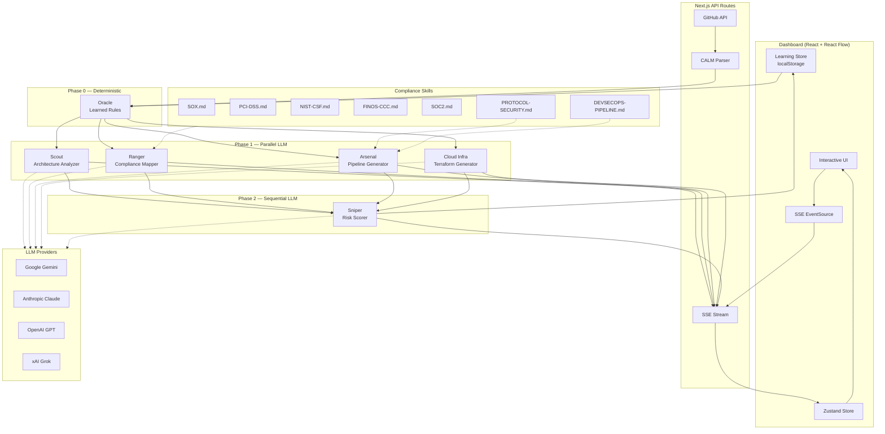

<p align="center">
  
</p>

<h1 align="center">CALMGuard</h1>

<p align="center">
  <strong>From Architecture-as-Code to Continuous Compliance — Automatically.</strong>
</p>

<p align="center">
  <a href="https://github.com/finos-labs/dtcch-2026-opsflow-llc/actions/workflows/ci.yml"></a>
  <a href="https://github.com/finos-labs/dtcch-2026-opsflow-llc/actions/workflows/semgrep.yml"></a>
  <a href="LICENSE"></a>
  
  
  
  
</p>

---

CALMGuard is a **CALM-native continuous compliance DevSecOps platform**. Describe your architecture using the [FINOS CALM](https://github.com/finos/architecture-as-code) standard, and CALMGuard deploys a squad of AI agents to analyze compliance gaps, score risk, and generate production-ready CI/CD pipelines — all streamed in real-time to an interactive dashboard.

Built for the **DTCC/FINOS Innovate.DTCC AI Hackathon** (Feb 23–27, 2026).


## Key Features

| AI Agent Squad | Compliance Skills | Learning Intelligence | GitOps Integration |
|:--------------:|:-----------------:|:---------------------:|:------------------:|
| 6 agents: Scout, Ranger, Arsenal, Sniper, Oracle, HQ | 7 skill files with 100+ KB of regulatory knowledge | Self-learning engine with pattern fingerprinting | Fetch CALM from GitHub, generate PRs |
| Multi-provider LLM: Gemini, Claude, GPT, Grok | SOX, PCI-DSS, NIST-CSF, FINOS-CCC, SOC2, Protocol Security | Auto-promotes patterns to deterministic rules after 3 observations | DevSecOps CI pipeline and compliance remediation PRs |
| Parallel Phase 1 + sequential Phase 2 orchestration | Closed Control ID Reference tables prevent LLM hallucination | Phase 0 Oracle fires instant findings before LLM agents start | Full repo-connected workflow with SHA tracking |

| CALM Parser | Real-Time Dashboard | DevSecOps Pipeline Generator |
|:-----------:|:-------------------:|:----------------------------:|
| Multi-version CALM support (v1.0, v1.1, v1.2) with Zod validation | React Flow architecture graphs with touring camera animation | GitHub Actions CI with 6 DevSecOps stages |
| Auto-detects version, normalizes legacy types, lenient parsing | Live SSE streaming with agent status indicators | SAST (Semgrep), SCA (Trivy), Secrets (Gitleaks), SBOM (Syft) |
| Demo architectures included | Compliance gauges, risk heat maps, exportable reports | Security-focused Terraform IaC from CALM signals |

## How It Works

```
┌─────────────┐     ┌──────────────────┐     ┌──────────────────┐     ┌─────────────────┐
│  1. Connect  │────▶│  2. Pre-Check     │────▶│  3. Analyze       │────▶│  4. Act          │
│  CALM JSON / │     │  Oracle fires     │     │  AI Agent Squad   │     │  PRs, Pipelines, │
│  GitHub Repo │     │  learned rules    │     │  scores & maps    │     │  Reports, Learn  │
└─────────────┘     └──────────────────┘     └──────────────────┘     └─────────────────┘
```

1. **Connect** — Upload a CALM architecture JSON, fetch from GitHub, or use built-in demos
2. **Pre-Check** — Oracle fires deterministic rules from previously learned patterns (zero-latency, no LLM)
3. **Analyze** — Squad of LLM agents assesses compliance across 5 frameworks, scores risks, generates CI pipelines and cloud infrastructure
4. **Act** — Generate CI/CD pipelines, remediation PRs, compliance reports — and learn patterns for next time

## Demo and Presentation

You could [Access the Presentation ->](https://github.com/finos-labs/dtcch-2026-opsflow-llc/blob/main/CALMGuard_Presentation_v4.0.pdf) usin this link. Following that watch the demo video by clicking the image below. 

[](https://youtu.be/0FB_n6fAWX0)

### [Watch the demo on YouTube](https://youtu.be/0FB_n6fAWX0)


## Quick Start

### Prerequisites

- **Node.js 22+** and **pnpm 9+**
- At least one LLM provider API key (Gemini is the default)

### Setup

```bash
git clone https://github.com/finos-labs/dtcch-2026-opsflow-llc.git
cd dtcch-2026-opsflow-llc
pnpm install
```

Create a `.env.local` file:

```bash
# Required: at least one provider
GOOGLE_GENERATIVE_AI_API_KEY=your-gemini-key

# Optional: additional LLM providers
ANTHROPIC_API_KEY=your-claude-key
OPENAI_API_KEY=your-openai-key
XAI_API_KEY=your-grok-key

# Optional: GitHub integration (enables PR generation)
GITHUB_TOKEN=your-github-token
```

### Run

```bash
pnpm dev          # Start dev server at http://localhost:3000
```

Visit the dashboard — click **"Demo Mode"** to see CALMGuard analyze a sample architecture without any API keys.

## Architecture



## Tech Stack

| Layer | Technology | Purpose |
|-------|-----------|---------|
| **Framework** | Next.js 15 (App Router) | Full-stack React with API routes |
| **Language** | TypeScript (strict) | Type-safe codebase, zero `any` |
| **AI** | Vercel AI SDK | Structured output via `generateObject` + Zod |
| **LLM Providers** | Gemini, Claude, GPT, Grok | Multi-provider with configurable default |
| **CALM** | @finos/calm-cli v1.33 | FINOS Architecture-as-Code — multi-version support (v1.0, v1.1, v1.2) |
| **Visualization** | React Flow + Recharts | Interactive architecture graphs + compliance charts |
| **State** | Zustand | Single store, SSE-driven updates |
| **UI** | shadcn/ui + Tailwind CSS | Dark theme, accessible components |
| **Validation** | Zod | Runtime schema validation for all data boundaries |
| **Streaming** | Server-Sent Events | Real-time agent event delivery |

## Agent System

CALMGuard runs a coordinated squad of 6 AI agents with tactical callsigns. LLM agents are defined as YAML configurations (`calmguard/v1` API) in [`agents/`](agents/):

| Callsign | Agent | Phase | Role | Model |
|----------|-------|-------|------|-------|
| **HQ** | Orchestrator | All | Coordinate multi-agent lifecycle — Phase 0 pre-checks, parallel Phase 1, sequential Phase 2, event streaming, result aggregation, graceful degradation | Controller (no LLM) |
| **Oracle** | Learning Engine | 0 | Fire deterministic rules from previously learned patterns — zero-latency, no LLM calls. Instant compliance findings before any AI agent starts | Deterministic (no LLM) |
| **Scout** | Architecture Analyzer | 1 | Extract structural insights — components, data flows, trust boundaries, security zones, protocol usage, deployment topology | Gemini 2.5-flash |
| **Ranger** | Compliance Mapper | 1 | Map CALM controls to SOX, PCI-DSS, FINOS CCC, NIST-CSF, SOC2. Assess compliance status, identify gaps, generate per-framework scores with auditor evidence | Gemini 2.5-flash |
| **Arsenal** | Pipeline Generator | 1 | Generate DevSecOps CI pipelines with SAST (Semgrep), secret detection (Gitleaks), SCA (Trivy), SBOM (Syft) — stages derived from CALM signals. Security-focused Terraform IaC from protocol requirements | Gemini 2.5-flash |
| **Sniper** | Risk Scorer | 2 | Aggregate all Phase 1 results into weighted risk assessment — overall score (0-100), per-framework scores, node-level risk heat map, executive summary | Gemini 2.5-flash |

**Three-phase orchestration:**

- **Phase 0 (Oracle):** Deterministic pre-checks — fires learned rules instantly, no LLM latency
- **Phase 1 (Parallel):** Scout + Ranger + Arsenal run concurrently via `Promise.allSettled`
- **Phase 2 (Sequential):** Sniper aggregates Phase 0 + Phase 1 results into final risk assessment

All agents emit typed SSE events (`started`, `thinking`, `finding`, `completed`) streamed to the dashboard in real-time.

## Compliance Skills

CALMGuard's compliance intelligence is powered by **skill files** — markdown documents in [`skills/`](skills/) that inject deep regulatory knowledge into agent prompts. Each skill file contains framework-specific control mappings, CALM field correlations, and **Closed Control ID Reference** tables with `CITE EXACTLY AS SHOWN` instructions to prevent LLM hallucination of control IDs.

| Skill File | Framework | Content | Agent |
|-----------|-----------|---------|-------|
| [`SOX.md`](skills/SOX.md) | Sarbanes-Oxley | SOX 404 ITGC controls, COSO framework mappings | Ranger |
| [`PCI-DSS.md`](skills/PCI-DSS.md) | PCI DSS 4.0 | 19 CALM-relevant requirements (Req 2.2.1–12.6.2), closed ID reference | Ranger |
| [`NIST-CSF.md`](skills/NIST-CSF.md) | NIST CSF 2.0 | 21 subcategory IDs across all 6 functions (GV, ID, PR, DE, RS, RC) | Ranger |
| [`FINOS-CCC.md`](skills/FINOS-CCC.md) | FINOS Common Cloud Controls | Cloud-native security controls | Ranger |
| [`SOC2.md`](skills/SOC2.md) | SOC2 TSC | 21 AICPA Trust Service Criteria (CC6.x, CC7.x, CC8.x, CC9.x) | Ranger |
| [`PROTOCOL-SECURITY.md`](skills/PROTOCOL-SECURITY.md) | Cross-framework | Protocol upgrade mappings (HTTP→HTTPS, FTP→SFTP, etc.) with PCI-DSS + NIST + SOC2 grounding | Arsenal |
| [`DEVSECOPS-PIPELINE.md`](skills/DEVSECOPS-PIPELINE.md) | DevSecOps CI | Compliance-first pipeline generation — stage selection rules, tool configs, CALM signal mapping | Arsenal |

Skills are loaded at runtime via `loadSkillsForAgent()` and injected as knowledge blocks in agent prompts. This gives agents grounded, auditable regulatory knowledge rather than relying on parametric LLM memory.

## Learning Intelligence

CALMGuard includes a **self-learning compliance engine** that gets smarter with every analysis:

1. **Pattern Extraction** — After each analysis, the engine fingerprints recurring compliance patterns from structural triggers (protocols, node types, relationships, missing controls)
2. **Confidence Tracking** — Each pattern tracks observation count and confidence score across runs
3. **Auto-Promotion** — When a pattern is observed 3+ times with 75%+ confidence, it's automatically promoted to a **deterministic rule**
4. **Phase 0 Pre-Checks** — On the next analysis, Oracle fires these deterministic rules instantly (no LLM) before any AI agent starts
5. **Persistence** — All patterns, rules, and run history persist in `localStorage` across sessions

The Learning Intelligence dashboard panel shows:
- **Intelligence Score** (0-100) — weighted from pattern coverage, confidence, rule maturity, and run history
- **Pattern Library** — all discovered compliance patterns sorted by confidence
- **Learning Curve** — Recharts visualization of intelligence growth over time

> *"Run it once, it learns. Run it three times, it auto-generates deterministic compliance rules. By run 4, Oracle fires instant findings before the LLM even starts."*

## Pipeline Generation Capabilities

Arsenal generates **DevSecOps CI pipelines** derived directly from CALM architectural signals. Every security stage maps to a decision visible in your architecture definition — making the pipeline auditable and compliance-justified.

### Generated Artifacts

| Artifact | What It Produces | Derived From |
|----------|-----------------|--------------|
| **GitHub Actions Workflow** | Complete CI YAML (40-60 lines) with multi-stage DevSecOps gates | CALM node types, protocols, relationships |
| **Security Scanning Configs** | Tool-specific configs (10-20 lines each) for 2-3 tools | CALM node types + compliance controls |
| **Infrastructure as Code** | Security-focused Terraform (20-40 lines) with compliance controls | CALM protocol requirements + relationships |
| **Recommendations** | 3-4 actionable items mapping CALM signals to compliance frameworks | Full CALM analysis |

### DevSecOps CI Stages

Generated pipelines include these stages, selected based on what CALM tells Arsenal about the architecture:

```
code-quality ──▶ ┌─ sast ─────────────┐
                 ├─ secret-detection ──┤ ──▶ build (compliance gate)
                 ├─ sca ──────────────┤
                 └─ sbom ─────────────┘
```

| Stage | Tool | Purpose | CALM Signal That Triggers It |
|-------|------|---------|------------------------------|
| **SAST** | Semgrep | Static code analysis — SQL injection, XSS, insecure crypto | Always (adapts rules to node types: DB→SQLi, webclient→XSS) |
| **Secret Detection** | Gitleaks | Detect leaked credentials, API keys, tokens | Always (universal compliance requirement) |
| **SCA** | Trivy / npm-audit | Dependency vulnerability scanning | `service` or `ecosystem` nodes present |
| **SBOM** | Syft | Software Bill of Materials for audit trail | Compliance controls present in CALM |
| **Code Quality** | ESLint + TypeCheck | Lint and type safety gate | Always |
| **Build** | Compile + artifacts | Final gate — only passes if all security stages pass | Always |

### Security Scanning Tools

| Tool | Category | What It Detects | When Selected |
|------|----------|----------------|---------------|
| **Semgrep** | SAST | Code patterns (SQLi, XSS, CSRF, insecure crypto, hardcoded secrets) | Always — rules tuned to CALM architecture |
| **CodeQL** | SAST | Language-specific vulnerability detection | Alternative for complex architectures |
| **Trivy** | SCA | Container and dependency CVEs | When service/database nodes present |
| **npm-audit** | SCA | Node.js dependency vulnerabilities | When webclient nodes present |
| **Gitleaks** | Secrets | Leaked credentials, API keys, private keys | Always |
| **Syft** | SBOM | Software Bill of Materials (CycloneDX format) | When compliance controls present |

### Infrastructure as Code

Terraform configs map CALM protocol requirements to cloud security controls:

| CALM Signal | Generated Terraform Rule |
|------------|------------------------|
| HTTPS relationships | Allow port 443, deny port 80 |
| Database connections | Restrict to service CIDR only |
| mTLS relationships | Reference certificate resources |
| Network segmentation | VPC/subnet isolation |

### CALM Signal → Pipeline Mapping

Arsenal reads the CALM architecture and makes deterministic decisions about what to include:

| CALM Signal | Pipeline Decision |
|-------------|------------------|
| Has `database` nodes | SAST with SQL injection rules |
| Has `webclient` nodes | SAST with XSS/CSRF rules, npm-audit for SCA |
| Has `service` nodes | Trivy dependency scanning |
| Has `ecosystem` nodes | SCA for supply chain risk |
| Uses HTTP (not HTTPS) | WARNING comment + upgrade recommendation |
| Has compliance controls | SBOM generation for audit trail |
| Any architecture | Secret detection + SAST + build gate |

> Arsenal is guided by the [`DEVSECOPS-PIPELINE.md`](skills/DEVSECOPS-PIPELINE.md) skill file — a compliance-first CI generation guide injected into its prompt at runtime.

## GitOps Integration

CALMGuard connects directly to GitHub repositories for a complete compliance-as-code workflow:

- **Fetch CALM from GitHub** — enter `owner/repo` and file path, CALMGuard fetches and parses the architecture
- **DevSecOps CI Pipeline PRs** — generate and push GitHub Actions workflows with security scanning
- **Compliance Remediation PRs** — generate CALM architecture changes that close compliance gaps
- **SHA Tracking** — all PRs track the source file SHA for auditability

Requires a `GITHUB_TOKEN` in `.env.local` for PR generation.

### Remediation in Action

CALMGuard doesn't just report compliance gaps — it fixes them. Here's a real CALM architecture before and after automated remediation:

| | Repository | Description |
|---|-----------|-------------|
| **Before** | [`payment-gateway.calm.json`](https://github.com/gjs-opsflo/payment-gateway-calm/blob/main/payment-gateway.calm.json) | Original architecture with compliance gaps — weak protocols, missing controls |
| **After** | [`payment-gateway.calm.json`](https://github.com/gjs-opsflo/calm-payment-gw03/blob/main/payment-gateway.calm.json) | CALMGuard-remediated — near 100% compliant across all 5 frameworks |

The remediation PR upgrades protocols (JDBC→TLS, HTTP→HTTPS), adds missing security controls (PCI-DSS, NIST-CSF, SOX, SOC2), and preserves all original architecture elements. LLM agents identify the gaps; deterministic code applies the fixes.

## Demo Architectures

Two production-realistic CALM architectures are included in [`examples/`](examples/):

| Architecture | Description |
|-------------|-------------|
| **Payment Gateway** | Multi-service payment processing with encryption, tokenization, PCI controls |
| **Trading Platform** | Real-time trading system with market data feeds, order management, risk engine |

## Multi-Version CALM Support

CALMGuard supports all three stable releases of the FINOS CALM specification — **v1.0, v1.1, and v1.2**. The parser automatically detects the version, normalizes fields to a common internal representation, and passes clean data to agents. No user action required — just upload any CALM file.

### Version Detection

Version is detected automatically by schema inference — examining which fields are present:

| Version | Detection Signal | Key Characteristics |
|---------|-----------------|---------------------|
| **CALM v1.0** | `calmSchemaVersion` field present | Legacy node types (`apigateway`, `microservice`), legacy relationship types (`uses`) |
| **CALM v1.1** | `description` on flow transitions, standard `node-type` enum | Standard node types (`service`, `database`, `webclient`, etc.) |
| **CALM v1.2** | Optional `decorators`, `timelines`, `adrs` fields | All v1.1 features plus ADRs and timeline tracking |

If version is ambiguous, the parser defaults to the latest (v1.2) and parses leniently.

### Legacy Type Mapping

CALM v1.0 uses node and relationship types that were renamed in v1.1. The parser maps these automatically:

| v1.0 Legacy Type | Maps To | Category |
|------------------|---------|----------|
| `apigateway` | `service` | Node type |
| `microservice` | `service` | Node type |
| `uses` | `connects` | Relationship type |

Unknown node types (e.g., `lambda`) are mapped to `service` — maximizing compatibility over strictness.

### Backward Compatibility

- **Missing fields** are filled with sensible defaults (empty string, empty array) — the file parses successfully, agents work with what's available
- **Lenient validation** accepts unknown field values and legacy aliases
- **Version badge** shown on the dashboard next to parsed node/relationship counts (e.g., "CALM v1.1 — 8 nodes, 6 relationships")
- **No breaking changes** — existing v1.1 demo files (payment-gateway, trading-platform) continue working without regression

> CALMGuard's parser extends the existing pattern of handling CALM CLI output with lenient aliases. Multi-version support is a parser-layer change — transparent to the AI agent system.

## Documentation

Full documentation is available in [`docs/`](docs/). Run locally with `pnpm docs:dev`, or browse directly on GitHub:

### Getting Started

| Guide | Description |
|-------|-------------|
| [Introduction](docs/docs/intro.md) | What CALMGuard is, the problem it solves, and key capabilities |
| [Getting Started](docs/docs/getting-started.md) | Setup, environment variables, running your first analysis |
| [Uploading Architectures](docs/docs/uploading-architectures.md) | CALM file format, validation, using demo architectures |
| [Reading Reports](docs/docs/reading-reports.md) | Dashboard walkthrough — interpreting compliance scores, heat maps, findings |

### Architecture & Internals

| Guide | Description |
|-------|-------------|
| [System Overview](docs/docs/architecture/system-overview.md) | Architecture diagram, data flow, SSE streaming, Zustand store |
| [Agent System](docs/docs/architecture/agent-system.md) | Agent definitions, orchestration phases, YAML configs, skill injection |
| [API Reference](docs/docs/api/reference.md) | HTTP endpoints — `POST /api/analyze`, `POST /api/calm/parse`, `GET /api/pipeline` |
| [Compliance Frameworks](docs/docs/compliance/frameworks.md) | NIST CSF, PCI DSS, SOX, FINOS CCC — how they map to CALM controls |

### Project

| Guide | Description |
|-------|-------------|
| [Product Roadmap](docs/docs/roadmap.md) | 12-phase path from hackathon prototype to enterprise compliance platform |
| [Contributing](docs/docs/contributing.md) | Development setup, branch naming, commit conventions, CI requirements |
| [Security](docs/docs/security.md) | Threat model, input validation, LLM output safety, responsible AI |
| [SECURITY.md](SECURITY.md) | Full security policy with AI-specific threat analysis |
| [CHANGELOG.md](CHANGELOG.md) | Release history and version details |

## Contributing

We welcome contributions! See [CONTRIBUTING.md](.github/CONTRIBUTING.md) for:

- Development setup and workflow
- Branch naming and commit conventions (Conventional Commits)
- CI pipeline requirements
- Code standards (TypeScript strict, Zod schemas, dark theme)

All commits must include a **DCO sign-off** (`git commit -s`).

## Roadmap — Path to Enterprise

CALMGuard is designed as a **platform**, not a point solution. The hackathon demonstrates the core compliance loop; the [full product roadmap](docs/docs/roadmap.md) charts 12 phases from prototype to enterprise-grade continuous compliance platform.

**Near-term (Phases 2-5):**

| Phase | Capability | Impact |
|-------|-----------|--------|
| Intelligent Pipelines | DAST, mTLS verification, policy-as-code gates derived from CALM signals | Pipelines that are architecture-aware, not templated |
| Runtime Drift Detection | CALM vs live infrastructure (AWS/Azure/GCP/K8s) comparison | Catch compliance drift in hours, not quarterly audits |
| Pre-Deployment Validation | CI gate + PR bot that blocks non-compliant changes | Shift-left compliance — fail fast, fix before production |
| CALMGuard as a Service | MCP server + REST API + CLI + GitHub App | Any tool, agent, or pipeline can invoke compliance checks |

**Mid-term (Phases 6-9):**

| Phase | Capability | Impact |
|-------|-----------|--------|
| Flow-Based Risk Modeling | Risk scoring along CALM data flows, cascading risk, blast radius estimation | Risk follows data paths, not just node attributes |
| Secure IaC Generation | Production-ready Terraform, K8s manifests, Helm charts from CALM | Infrastructure that is compliant by construction |
| Persistent Intelligence | PostgreSQL backend, cross-team learning, versioned skills | Enterprise-grade learning that survives restarts |
| Graph Intelligence | GNN-based architecture analysis, vectorized reasoning bank, architecture embeddings | Structural compliance reasoning beyond pattern matching |

**Long-term (Phases 10-12):**

| Phase | Capability | Impact |
|-------|-----------|--------|
| Adaptive Pen Testing | CALM-guided penetration testing that evolves with the architecture | Test actual attack paths, not random endpoints |
| Enterprise Deployment | Air-gapped, multi-tenant, SSO/RBAC, SOC2 Type II evidence | Production-ready for regulated financial institutions |
| Global Learning Network | Federated compliance intelligence, industry benchmarks, community skills | Cross-industry compliance knowledge that improves for everyone |

## Team

**OpsFlow LLC** — Built for DTCC/FINOS Innovate.DTCC AI Hackathon 2026

| Name | Role | Background |
|------|------|------------|
| [**Gourav J. Shah**](https://www.linkedin.com/in/gouravshah/) | Lead Engineer | DevOps domain expert with 19+ years hands-on expertise in cloud infrastructure, DevSecOps, container orchestration, and platform engineering. Creator of Agentic Ops Framework and KubeAgentiX. |
| [**Anoop Mehendale**](https://www.linkedin.com/in/anoopmehendale/) | Engineer | Serial entrepreneur with a track record of building and scaling enterprise technology companies. |

## Hackathon Context

This project was built for the [Innovate.DTCC AI Hackathon](https://innovate.dtcc.com/) (Feb 23–27, 2026), organized by **DTCC** and powered by **FINOS**. The challenge: leverage AI to improve DevSecOps workflows in financial services using the FINOS CALM (Common Architecture Language Model) standard.

CALMGuard demonstrates how **Architecture-as-Code** can be the foundation for automated, continuous compliance — turning static architecture documentation into living, actionable security intelligence.

## License

Copyright 2026 FINOS

Distributed under the [Apache License, Version 2.0](http://www.apache.org/licenses/LICENSE-2.0).

SPDX-License-Identifier: [Apache-2.0](https://spdx.org/licenses/Apache-2.0)

## Acknowledgements

- [**FINOS**](https://www.finos.org/) — Financial Open Source Foundation
- [**CALM**](https://github.com/finos/architecture-as-code) — Common Architecture Language Model
- [**DTCC**](https://www.dtcc.com/) — Depository Trust & Clearing Corporation
- [**Vercel AI SDK**](https://sdk.vercel.ai/) — Structured AI output framework
- [**shadcn/ui**](https://ui.shadcn.com/) — Beautiful accessible components
- [**React Flow**](https://reactflow.dev/) — Interactive graph visualization
