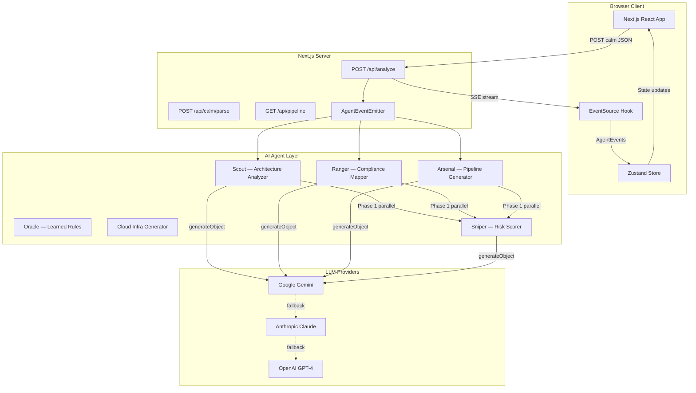
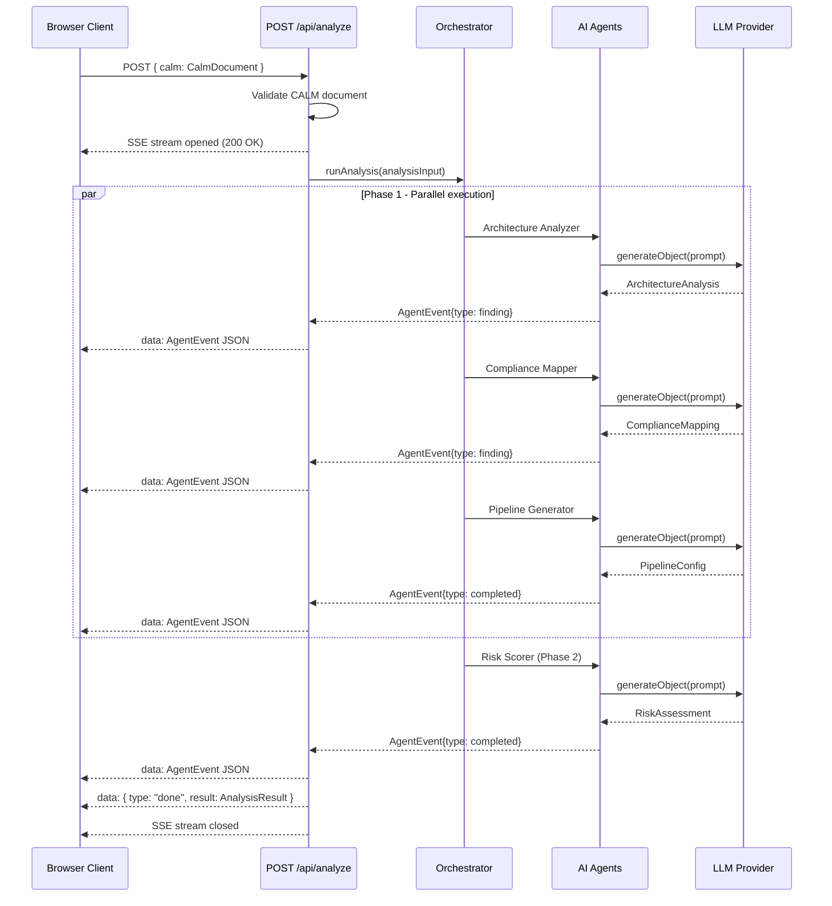

# System Overview

CALMGuard is built on Next.js 15 with a multi-agent AI architecture. This page covers the technical stack, system design, and key architectural decisions.

## Tech Stack

| Layer | Technology | Notes |
|-------|------------|-------|
| Framework | Next.js 15 (App Router) | Server Components, API Routes, SSE streaming |
| Language | TypeScript (strict mode) | No `any` types. Zod for all runtime validation |
| LLM SDK | Vercel AI SDK v6 | `generateObject` with Zod schemas for structured output |
| Default LLM | Google Gemini | `@ai-sdk/google`. Multi-provider support |
| UI | shadcn/ui + Tailwind CSS v4 | Dark theme, slate palette |
| Graph | React Flow (`@xyflow/react`) | Architecture visualization |
| Charts | Recharts | Compliance gauges, heat maps |
| State | Zustand | Flat state, SSE event updates |
| Validation | Zod | CALM parsing + agent output validation |
| Package Manager | pnpm | Workspace tooling |

## Architecture Diagram



## SSE Streaming Flow

Analysis results stream from server to client in real-time using Server-Sent Events (SSE):



## Directory Structure

```
src/
  app/
    api/
      analyze/route.ts        # POST /api/analyze — SSE streaming endpoint
      calm/parse/route.ts     # POST /api/calm/parse — validation endpoint
      pipeline/route.ts       # GET /api/pipeline — pipeline download
    dashboard/
      page.tsx                # Dashboard with tabs
      findings/page.tsx       # Findings detail page
      pipeline/page.tsx       # Pipeline preview page
    page.tsx                  # Landing page with architecture selector
    layout.tsx                # Root layout with providers

  lib/
    calm/
      parser.ts               # CALM JSON validation with Zod
      extractor.ts            # Convert CalmDocument -> AnalysisInput
      types.ts                # Zod schemas for CALM entities
    agents/
      orchestrator.ts         # Phase 1 (parallel) + Phase 2 (sequential)
      architecture-analyzer.ts
      compliance-mapper.ts
      pipeline-generator.ts
      risk-scorer.ts
      registry.ts             # Agent YAML config loader
      types.ts                # AgentEvent, AgentResult schemas
    ai/
      providers.ts            # LLM provider registry (Gemini, Anthropic, OpenAI)
      streaming.ts            # AgentEventEmitter (globalThis singleton)
    api/
      schemas.ts              # Request body Zod schemas
    compliance/
      frameworks.ts           # Framework definitions and control mapping
      scoring.ts              # Compliance score calculation
    pipeline/
      github-actions.ts       # GitHub Actions YAML generation

  components/
    ui/                       # shadcn/ui base components
    dashboard/
      ComplianceGauge.tsx     # SVG gauge with animation
      ArchitectureGraph.tsx   # React Flow graph
      RiskHeatMap.tsx         # Recharts heat map
      FindingsTable.tsx       # Findings with severity
      PipelinePreview.tsx     # Shiki-highlighted YAML
      AgentFeed.tsx           # Live agent event stream
    layout/
      Sidebar.tsx             # Navigation sidebar
      DashboardLayout.tsx     # Two-column layout

  hooks/
    use-agent-stream.ts       # EventSource + SSE event handling
    use-calm-parser.ts        # CALM file parsing hook

  store/
    analysis-store.ts         # Zustand store (flat state)

agents/                       # YAML agent definitions (AOF-inspired)
  architecture-analyzer.yaml
  compliance-mapper.yaml
  pipeline-generator.yaml
  risk-scorer.yaml

skills/                       # Compliance knowledge for LLM prompts
  sox-compliance.md
  pci-dss-compliance.md
  nist-csf-compliance.md
  finos-ccc-compliance.md

examples/                     # Demo CALM architecture files
  trading-platform.json
  payment-gateway.json
```

## Key Design Decisions

### SSE over WebSockets

Server-Sent Events (SSE) were chosen over WebSockets for agent streaming because:
- SSE works natively with Next.js API routes on Vercel serverless
- One-way (server-to-client) data flow is sufficient for streaming agent events
- No additional infrastructure required

### Zustand over Redux

Zustand was selected for client-side state management because:
- Minimal boilerplate for SSE event updates
- Flat state structure avoids nested mutation issues
- Works well with React 19 concurrent features

### generateObject over generateText

All agents use Vercel AI SDK's `generateObject` with Zod schemas rather than `generateText` because:
- Structured output enforced at the LLM call level
- Type-safe agent results without string parsing
- Zod validation catches LLM hallucinations in schema

### globalThis Singleton for AgentEventEmitter

The `AgentEventEmitter` uses `globalThis` singleton pattern to survive Next.js hot module reloads in development. Without this, the emitter instance used in `/api/analyze` would differ from the one subscribed to by agents after a hot reload.

### Edge Runtime Compatibility

Instead of Node.js `EventEmitter`, a simple listener-pattern emitter is used for SSE event broadcasting. This maintains compatibility with Vercel's Edge Runtime if needed, and avoids memory leaks from uncleaned Node.js listeners.
