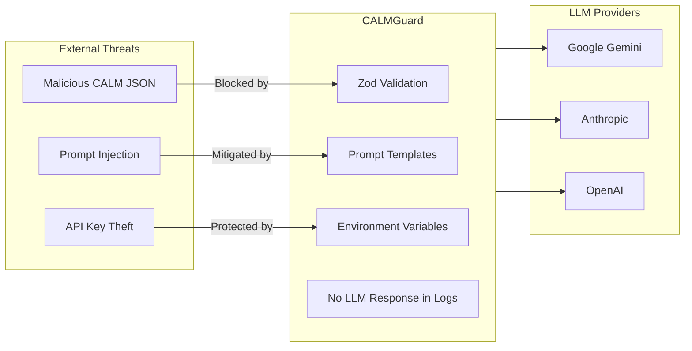

# Security

## Threat Model

CALMGuard processes sensitive architecture documents and routes them through external LLM APIs. The key threats and mitigations are:



## Threat Scenarios and Mitigations

### 1. Malicious CALM JSON Input

**Threat:** An attacker submits malformed or malicious CALM JSON to the `/api/analyze` endpoint to cause server errors, DoS, or prototype pollution.

**Mitigations:**
- All CALM input is validated through Zod schemas before processing
- Zod validation rejects unknown fields and enforces strict types
- Validation failures return 400 with schema error details — no input reaches agents
- No `eval()` or dynamic code execution on CALM content

### 2. Prompt Injection via CALM Content

**Threat:** An attacker embeds LLM instruction overrides in CALM node names or descriptions (e.g., "IGNORE PREVIOUS INSTRUCTIONS").

**Mitigations:**
- CALM content is injected into prompts as structured JSON data, not as raw strings in the system prompt
- LLM providers' built-in safety systems catch obvious injection attempts
- Agent outputs are validated via Zod schemas — unexpected outputs are rejected, not used
- LLM responses are never executed as code

### 3. API Key Exposure

**Threat:** LLM API keys are logged, leaked in responses, or committed to source control.

**Mitigations:**
- API keys are loaded only from environment variables — never hardcoded
- `.env.local` is in `.gitignore`
- API keys are never returned in API responses
- Server-side API calls only — keys never reach the browser

### 4. Information Disclosure via Error Messages

**Threat:** Detailed error messages expose internal system structure to attackers.

**Mitigations:**
- Production errors return generic messages; details logged server-side only
- LLM provider errors (rate limits, timeouts) are caught and returned as generic "Analysis failed" messages
- Stack traces never included in API responses

## Security Practices

### Input Validation

All API endpoints validate input with Zod before processing:

```typescript
// POST /api/analyze validates before any agent runs
const bodyResult = analyzeRequestSchema.safeParse(bodyRaw);
if (!bodyResult.success) {
  return Response.json(
    { error: 'Invalid request body', issues: bodyResult.error.issues },
    { status: 400 },
  );
}
```

### No Authentication (Hackathon Context)

CALMGuard is a hackathon prototype without authentication. **Before production deployment:**

- Add authentication (NextAuth.js or Clerk)
- Rate limit the `/api/analyze` endpoint (expensive LLM calls)
- Add CORS configuration
- Implement CSRF protection

### LLM Data Privacy

Be aware that CALM architecture documents sent to LLM providers may be processed according to their data retention policies:

- Google Gemini: [Privacy Notice](https://ai.google.dev/terms)
- Anthropic: [Privacy Policy](https://www.anthropic.com/privacy)
- OpenAI: [Privacy Policy](https://openai.com/policies/privacy-policy)

For sensitive architectures, use a self-hosted LLM via Ollama instead of cloud providers.

### Local/Self-Hosted Deployment

To avoid sending architecture data to external LLM providers:

1. Install [Ollama](https://ollama.ai) locally
2. Pull a capable model: `ollama pull llama3.1:70b`
3. Configure in `.env.local`:
   ```bash
   OLLAMA_BASE_URL=http://localhost:11434
   DEFAULT_PROVIDER=ollama
   ```

## Reporting Vulnerabilities

If you discover a security vulnerability in CALMGuard, please report it responsibly:

1. **Do not** open a public GitHub issue
2. Email the maintainers at the contact in the repository
3. Include: description, reproduction steps, potential impact
4. Allow 90 days for a fix before public disclosure

We follow responsible disclosure and will credit reporters in our changelog.

## Dependencies

Security-relevant dependencies are audited with `pnpm audit`. Run:

```bash
pnpm audit
```

Known issues will be tracked in GitHub Issues with the `security` label.

License compliance is checked with:

```bash
pnpm license-check
```

This fails on GPL/AGPL dependencies to ensure no copyleft code enters the project.
