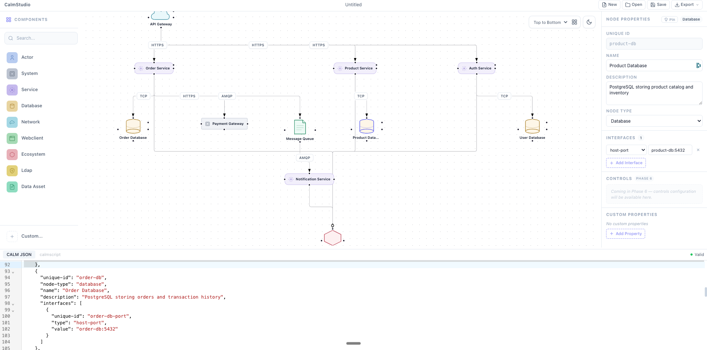

<!-- SPDX-FileCopyrightText: 2024 CalmStudio contributors - see NOTICE file -->
<!-- SPDX-License-Identifier: Apache-2.0 -->

# CalmStudio

**Visual architecture diagrams that produce validated, machine-readable code.**

Draw on a canvas. Get [CALM](https://calm.finos.org) JSON automatically. Let AI generate architectures for you.

[](LICENSE)
[](https://finos.org)
[](https://reuse.software/)
[](https://github.com/finos/calmstudio/actions/workflows/ci.yml)


<p align="center">
  
</p>

## Why CalmStudio?

Architecture diagrams are everywhere — but they rot. They're images no tool can read, no CI can validate, and no AI can generate. CALM (Common Architecture Language Model) fixes this with a JSON schema for architecture-as-code. CalmStudio makes CALM visual.

- **Draw visually** — drag typed nodes onto a canvas, connect them with typed relationships, nest services inside containers
- **Get code automatically** — every diagram change produces valid CALM JSON in real time
- **AI-native** — an MCP server lets Claude Code and other AI assistants create architectures from text descriptions
- **FINOS standard** — outputs validate against `calm validate` from day one

## Features

### Visual Canvas
- 9 CALM node types with distinct shapes (Actor, System, Service, Database, Network, Webclient, Ecosystem, LDAP, Data Asset)
- 5 relationship types with distinct edge styles (connects, interacts, deployed-in, composed-of, options)
- Sub-flow containment for deployed-in and composed-of relationships
- Drag from palette or click to place, multi-select, resize, copy/paste
- ELK.js hierarchical auto-layout with pin support
- Dark mode, keyboard shortcuts, search/filter

### Bidirectional Sync
- CALM JSON code panel with syntax highlighting (CodeMirror)
- Edit the diagram → code updates. Edit the code → diagram updates.
- Direction mutex prevents infinite loops
- Properties panel for editing node metadata, interfaces, and controls

### Import & Export
- Import existing CALM JSON files with automatic ELK layout
- Export as CALM JSON, SVG, or PNG
- Native file system access (open, save, save-as) with dirty state tracking

### MCP Server for AI Integration
- Install: `npx @calmstudio/mcp`
- 21 MCP tools: architecture CRUD, node CRUD, relationship CRUD, validate, render, export/import
- Claude Code creates complete architectures from text descriptions
- Dual transport: stdio (CLI) and streamable HTTP (Claude Cowork)
- Zero config, zero API keys — pure function, AI client does the interpretation

## Quick Start

### Prerequisites

- Node.js >= 20
- pnpm >= 9 (`npm install -g pnpm`)

### Development

```bash
git clone https://github.com/finos/calmstudio.git
cd calmstudio
pnpm install
pnpm build
```

Run the studio:

```bash
pnpm --filter @calmstudio/studio dev
```

Open [http://localhost:5173](http://localhost:5173).

### MCP Server

Use with Claude Code:

```bash
claude mcp add --transport stdio calmstudio -- npx @calmstudio/mcp
```

Then ask Claude: *"Create a microservices architecture with an API gateway, three services, and a database"*

The generated `.json` file opens directly in CalmStudio.

## Project Structure

```
calmstudio/
├── apps/
│   └── studio/              # SvelteKit web app (Svelte 5 + Svelte Flow)
├── packages/
│   ├── calm-core/           # CALM types (CalmNode, CalmRelationship, CalmArchitecture)
│   ├── mcp-server/          # MCP server (21 tools, stdio + HTTP transport)
│   ├── calmscript/          # DSL parser and compiler (coming soon)
│   └── extensions/          # Extension pack system (coming soon)
├── CONTRIBUTING.md
├── CODE_OF_CONDUCT.md
├── SECURITY.md
├── MAINTAINERS.md
└── NOTICE
```

### Tech Stack

| Layer | Technology |
|-------|-----------|
| Framework | Svelte 5 + SvelteKit |
| Canvas | @xyflow/svelte (Svelte Flow) |
| Code editor | CodeMirror 6 |
| Layout | ELK.js (hierarchical, orthogonal routing) |
| MCP | @modelcontextprotocol/sdk |
| Styling | Tailwind CSS |
| Testing | Vitest + Playwright |
| Desktop | Tauri 2 (coming soon) |
| Data format | CALM JSON (FINOS standard) |

## Roadmap

CalmStudio ships in phases. Each delivers a standalone, verifiable capability.

| Phase | Status | What it delivers |
|-------|--------|-----------------|
| 1. Foundation & Governance | Done | Apache 2.0, FINOS files, CI/CD |
| 2. CALM Canvas Core | Done | Typed nodes, edges, containment, UX |
| 3. Properties & Sync | Done | Code panel, properties, bidirectional sync |
| 4. Import/Export/Layout | Done | CALM JSON import, ELK layout, file export |
| 5. MCP Server | Done | 21 AI tools, dual transport, zero config |
| 6. CALM Validation | Next | Real-time schema validation with inline indicators |
| 7. Extension Packs | Planned | AWS, GCP, Azure, Kubernetes, AI/Agentic node types |
| 8. calmscript DSL | Planned | Mermaid-like text format for CALM |
| 9. Desktop App | Planned | Tauri 2 native app (macOS, Windows, Linux) |
| 10. Patterns & Docs | Planned | Architecture templates, Docusaurus site |
| 11. Testing Suite | Planned | London School TDD, E2E, component tests |
| 12. Ecosystem | Planned | VS Code extension, GitHub Action, web component |

## Testing

CalmStudio uses a comprehensive test suite across all packages:

| Package | Threshold | Command |
|---------|-----------|---------|
| calm-core | 90% | `pnpm --filter @calmstudio/calm-core run test:coverage` |
| extensions | 80% | `pnpm --filter @calmstudio/extensions run test:coverage` |
| mcp-server | 80% | `pnpm --filter @calmstudio/mcp-server run test:coverage` |
| studio | 60% | `pnpm --filter @calmstudio/studio run test:coverage` |

**Run all tests:**

```bash
pnpm -r run test
```

**Run with coverage (enforces thresholds):**

```bash
pnpm -r run test:coverage
```

**Run E2E tests** (requires dev server running on port 5173):

```bash
pnpm --filter @calmstudio/studio run test:e2e
```

Coverage reports are uploaded as CI artifacts on every build. E2E tests run automatically on merge to `main`.

## Contributing

We welcome contributions! Please read our [Contributing Guide](CONTRIBUTING.md) for details on:

- Fork and pull request workflow
- DCO sign-off requirements (required on every commit)
- Conventional commit format
- Local development setup

### Development Commands

```bash
pnpm build        # Build all packages
pnpm test         # Run all tests
pnpm typecheck    # TypeScript type check
pnpm lint         # Lint all packages
```

### Commit Convention

This project uses [Conventional Commits](https://www.conventionalcommits.org/) with scoped prefixes:

```
feat(studio): add dark mode toggle
fix(mcp-server): use .json extension for compatibility
docs(calm-core): update type documentation
```

All commits require a DCO sign-off:

```
Signed-off-by: Your Name <your.email@example.com>
```

## Community

- [Code of Conduct](CODE_OF_CONDUCT.md) — Contributor Covenant v2.1
- [Security Policy](SECURITY.md) — Vulnerability disclosure via GitHub Security Advisories
- [Maintainers](MAINTAINERS.md) — Project governance and maintainer list
- [NOTICE](NOTICE) — Third-party attribution

## License

Copyright 2024-2025 CalmStudio contributors — see [NOTICE](NOTICE).

Distributed under the [Apache License, Version 2.0](LICENSE).

See [SPDX](https://spdx.dev/) headers in each file for per-file licensing.
