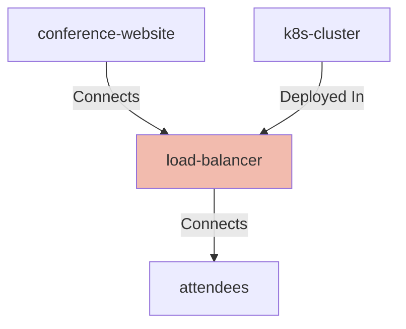
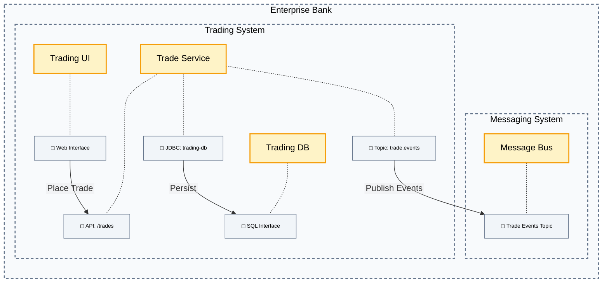
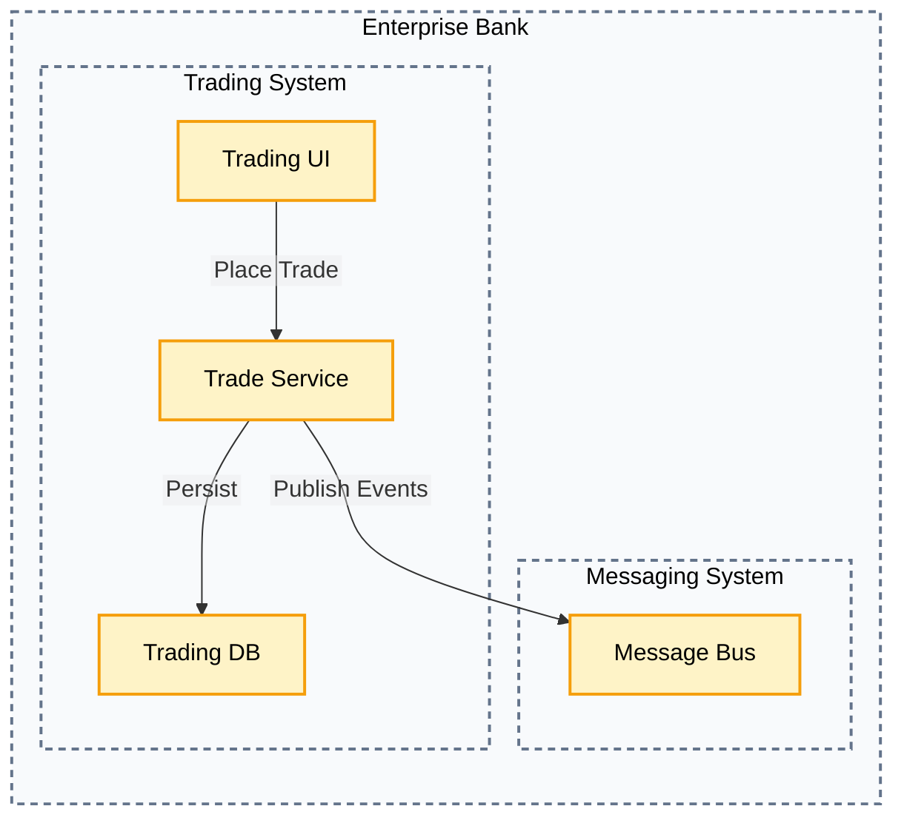

# CALM Widgets Framework

A TypeScript widget system built on Handlebars that provides reusable components for generating Markdown documentation. The framework allows you to create custom widgets.

## 🔧 Built-in Widgets

### Table Widget

Renders data as Markdown tables with support for nested objects and column filtering.

```handlebars
{{!-- Basic table with headers --}}
{{table services}}

{{!-- Table without headers --}}
{{table services headers=false}}

{{!-- Filter specific columns --}}
{{table services columns="name,port,version" key="id"}}

{{!-- Vertical table layout --}}
{{table services orientation='vertical' columns="name,status"}}

{{!-- Using sections to filter columns for CALM nodes --}}
{{table nodes["my-node"] orientation="vertical" sections="overview"}}
{{table nodes["my-node"] orientation="vertical" sections="extended"}}
{{table nodes["my-node"] orientation="vertical" sections="metadata"}}

{{!-- Sections can also be combined into a single table --}}
{{table nodes["my-node"] orientation="vertical" sections="overview,extended,metadata"}}

{{!-- Display message when table is empty --}}
{{table nodes["my-node"] sections="metadata" empty-message="There is no metadata"}}
```

**Options:**
- `orientation` (vertical | horizontal): Table layout (default: horizontal)
- `headers` (boolean): Show/hide table headers (default: true)
- `columns` (string): Comma-separated list of columns to include
- `key` (string): Property to use as unique identifier (default: "unique-id")
- `empty-message` (string): Message to display when the table has no data (renders as `<p class="empty-message">...</p>`)
- `sections` (string): Comma-separated list of section types to include. Valid values:
  - `overview`: Shows core node properties (unique-id, name, description, node-type)
  - `extended`: Shows additional properties, excluding overview columns and schema properties (interfaces, controls, metadata, details)
  - `metadata`: Shows only the metadata property if it exists and has content

**Nested Objects:**
When a cell value is an object or array, the table widget automatically renders it as a nested table, providing recursive display of complex data structures.

### List Widget

Renders arrays as Markdown lists (ordered or unordered).

```handlebars
{{!-- Unordered list --}}
{{list features}}

{{!-- Ordered list --}}
{{list steps ordered=true}}

{{!-- Extract specific property from objects --}}
{{list services property="name"}}
```

**Options:**
- `ordered` (boolean): Create numbered list (default: false)
- `property` (string): Extract specific property from objects

### JSON Viewer Widget
Renders data as formatted JSON blocks.

```handlebars
{{!-- Simple JSON output --}}
{{json-viewer config}}
```

### Flow Sequence Widget

Renders flows (sequence of transitions) as Mermaid sequence diagrams. Use this widget to visualise ordered interactions and connections between nodes defined in a CALM architecture context.

```handlebars
{{!-- Render a flow by its unique-id from the current architecture context --}}
{{flow-sequence flow-id="flow-unique-id"}}

{{!-- Example: when rendering a nested architecture in a node's details.}}
{{#each nodes}}
  {{#if (eq (lookup this 'unique-id') 'frontend-system')}}
    {{flow-sequence (lookup this 'details') flow-id="flow-frontend"}}
  {{/if}}
{{/each}}
```
Options:
- `flow-id` (string, required): The unique-id of the flow to render from the provided architecture context.

Context requirements:
- The context passed to the widget must be a valid CALM core canonical model (or a nested details object containing `nodes`, `relationships`, and `flows`).
- `flows` must include a flow object with the specified `unique-id` and a `transitions` array.
- Each transition must reference an existing relationship by `relationship-unique-id` and include a `sequence-number` (order) and optional `description`.


### Related Nodes Widget

Renders relationships as Mermaid graph diagrams, showing connections between nodes in a CALM architecture. This widget provides contextual filtering to display either all relationships for a specific node or details about a specific relationship.

```handlebars
{{!-- Show all relationships for a specific node --}}
{{related-nodes node-id="load-balancer"}}

{{!-- Show details about a specific relationship --}}
{{related-nodes relationship-id="conference-website-load-balancer"}}

{{!-- Show relationships for a container node (displays deployed services) --}}
{{related-nodes node-id="k8s-cluster"}}
```

**Options:**
- `node-id` (string): Show all relationships involving this node. The node will be highlighted and all its connections (incoming, outgoing, and deployment relationships) will be displayed.
- `relationship-id` (string): Show details about a specific relationship by its unique-id.

**Context requirements:**
- The context must be a valid CALM core canonical model containing `nodes` and `relationships` arrays.
- For `node-id`: The specified node must exist in the `nodes` array.
- For `relationship-id`: The specified relationship must exist in the `relationships` array.

**Supported relationship types:**
- **Interacts**: Actor-to-node interactions (e.g., "User -- Interacts --> Frontend")
- **Connects**: Direct connections between services (e.g., "API -- Connects --> Database")
- **Composed-of**: Container composition relationships (e.g., "System -- Composed Of --> Service")
- **Deployed-in**: Deployment relationships (e.g., "Cluster -- Deployed In --> Service")

**Output behavior:**
- **Node perspective**: When using `node-id`, shows the node highlighted with all its related connections
- **Relationship perspective**: When using `relationship-id`, shows just that specific relationship
- **Container filtering**: Automatically filters relationships based on the focus node (container vs. service perspective)

**Example outputs:**

*Node view (`node-id="load-balancer"`)* - Shows the load balancer and all its connections:



### Block Architecture Widget

Renders a system architecture as a Mermaid flowchart with optional containers (systems), interfaces, highlights, and flow-focused slices.

```handlebars
{{!-- Basic: render entire architecture --}}
{{block-architecture this}}

{{!-- Hide containers (just the services) --}}
{{block-architecture this include-containers="none"}}

{{!-- Show node interfaces as small attachment boxes --}}
{{block-architecture this render-interfaces=true}}

{{!-- Focus specific nodes (comma-separated) and highlight them --}}
{{block-architecture this focus-nodes="trading-system,position-system" highlight-nodes="trade-svc,position-svc"}}

{{!-- Focus one or more flows by unique-id or name (case-insensitive) --}}
{{block-architecture this focus-flows="order-flow"}}

{{!-- Flow focus + hide containers --}}
{{block-architecture this focus-flows="order-flow" include-containers="none"}}

{{!-- Multiple flows --}}
{{block-architecture this focus-flows="order-flow,onboarding-flow"}}

{{!-- Collapse multiple relationships between same source-target pairs --}}
{{block-architecture this collapse-relationships=true}}

{{!-- Render nodes with different shapes based on node-type --}}
{{block-architecture this render-node-type-shapes=true}}

{{!-- Custom node type mapping to built-in shapes --}}
{{block-architecture this render-node-type-shapes=true node-type-map='{"cache": "database", "queue": "messagebus", "proxy": "service"}'}}

{{!-- Use a preset theme for different color palettes --}}
{{block-architecture this theme="dark"}}
{{block-architecture this theme="high-contrast"}}

{{!-- Customize specific colors while keeping preset theme as base --}}
{{block-architecture this theme="dark" theme-colors='{"highlight": {"fill": "#ff6b6b", "stroke": "#ee5a52"}}'}}

{{!-- Provide complete custom theme colors --}}
{{block-architecture this theme-colors='{"boundary": {"fill": "#e3f2fd", "stroke": "#1976d2"}, "node": {"fill": "#fff3e0", "stroke": "#f57c00"}, "iface": {"fill": "#f3e5f5", "stroke": "#7b1fa2"}, "highlight": {"fill": "#ffebee", "stroke": "#c62828"}}'}}
```

**What it shows**
- **Containers (systems)** as Mermaid subgraphs, with contained **nodes (services, dbs, etc.)** inside.
- Optional **interfaces** as dotted attachments to their parent node.
- **Edges** for `connects`/`interacts` relationships, using the relationship **`description`** as the label when present.
- **Highlights** for any nodes listed in `highlight-nodes`.
- Optional **clickable links** per node/interface (via `link-prefix` or `link-map`).

**Options**

| Option                | Type | Default | Description |
|-----------------------|---|---:|---|
| `theme`               | `'light' \| 'dark' \| 'high-contrast'` | `'light'` | Visual theme preset with predefined color palettes for diagram elements. |
| `theme-colors`        | stringified JSON map | — | Custom color overrides or complete theme. Merges with preset theme or replaces it entirely. Must include `boundary`, `node`, `iface`, and `highlight` objects. Each object requires `fill` and `stroke` properties, and optionally `strokeDasharray`, `strokeWidth`, `fontSize`. |
| `focus-nodes`         | string (CSV) | — | Restrict the view to these node IDs (and, if containers are shown, their parent/child context per other options). |
| `focus-relationships` | string (CSV) | — | Restrict view to the specified relationship unique-ids. Only those relationships and the nodes they connect are included (plus containers per settings). |
| `focus-flows`         | string (CSV) | — | Restrict edges to transitions that belong to the given **flow unique-ids or names** (case-insensitive). Only nodes touching those edges are included (plus containers per settings). |
| `focus-controls`      | string (CSV) | — | Restrict view to nodes and relationships linked to the specified control IDs. Only nodes touching those controls are included (plus containers per settings). |
| `focus-interfaces`    | string (CSV) | — | Restrict view to nodes and relationships linked to the specified interface IDs. Only nodes touching those interfaces are included (plus containers per settings). |
| `highlight-nodes`     | string (CSV) | — | Nodes to visually highlight. |
| `render-node-type-shapes` | boolean | `false` | If `true`, render nodes with different Mermaid shapes based on their `node-type`. Supports built-in CALM types: `actor`, `database`, `webclient`, `service`, `system`, `messagebus`. |
| `node-type-map`       | stringified JSON map | — | Custom mapping of node types to built-in shapes, e.g. `{"cache": "database", "queue": "messagebus"}`. Only used when `render-node-type-shapes` is `true`. |
| `render-interfaces`   | boolean | `false` | If `true`, render each node’s `interfaces` as small interface boxes connected by dotted lines. |
| `include-containers`  | `'none' \| 'parents' \| 'all'` | `'all'` | Which containers (systems) to draw. |
| `include-children`    | `'none' \| 'direct' \| 'all'` | `'all'` | When focusing container nodes, include their direct/all descendants. |
| `edges`               | `'connected' \| 'seeded' \| 'all' \| 'none'` | `'connected'` | For non-flow views, expand visible set with directly connected neighbors. When flows are focused, only flow edges are shown. |
| `node-types`          | string (CSV) | — | Only include nodes whose `node-type` is in this list. |
| `direction`           | `'both' \| 'in' \| 'out'` | `'both'` | Reserved (currently not used by the renderer). |
| `edge-labels`         | `'description' \| 'none'` | `'description'` | Use the relationship `description` for edge labels; or hide labels entirely. |
| `collapse-relationships` | boolean                                      |         `false` | If `true`, multiple relationships between same source and destination are collapsed into single edge with combined labels.                                                           |
| `link-prefix`         | string | — | Prefix for clickable `click` links in Mermaid (e.g., `/docs/` makes `/docs/<node-id>`). |
| `link-map`            | stringified JSON map | — | Explicit per-id links, e.g. `{"trade-svc": "/svc/trade"}`. Map entries override `link-prefix`. |

**Built-in Node Type Shapes**

When `render-node-type-shapes` is enabled, the following CALM node types are rendered with distinctive Mermaid shapes:

- `actor` → Circle with person icon 👤
- `database` → Cylinder shape with database icon 🗄️
- `webclient` → Rectangle with web icon 💻
- `service` → Rounded rectangle with gear icon ⚙️
- `system` → Rectangle with system icon 🏢
- `messagebus` → horizontal cylinder with web icon 📨  - this isn't in schema but think we need it

> **Sorting:** Containers and nodes are always sorted **alphabetically by label** for stable layouts.

**Theme Support**

The block architecture widget supports visual themes to customize the appearance of diagram elements. You can use preset themes or provide custom color configurations.

**Preset Themes:**

- **`light`** (default): Clean, light background with subtle borders
  - Boundaries: Light gray with dashed border
  - Nodes: White background with dark gray border
  - Interfaces: Light slate with medium gray border
  - Highlights: Warm yellow with orange border

- **`dark`**: Dark mode optimized for low-light environments
  - Boundaries: Dark charcoal with dashed border
  - Nodes: Medium gray with light borders
  - Interfaces: Slate gray with lighter borders
  - Highlights: Amber with golden borders

- **`high-contrast`**: Accessibility-focused with strong color contrast
  - Boundaries: Black with bold dashed border
  - Nodes: White with black border
  - Interfaces: Light yellow with black border
  - Highlights: Bright yellow with thick black border

**Custom Theme Colors:**

You can customize colors in two ways:

1. **Partial override**: Specify `theme` and `theme-colors` to merge custom colors with a preset theme:
   ```handlebars
   {{block-architecture this theme="dark" theme-colors='{"highlight": {"fill": "#ff6b6b", "stroke": "#ee5a52"}}'}}
   ```

2. **Complete custom theme**: Provide only `theme-colors` with all required properties:
   ```handlebars
   {{block-architecture this theme-colors='{"boundary": {...}, "node": {...}, "iface": {...}, "highlight": {...}}'}}
   ```

**Theme Color Structure:**

Each theme must define four element types: `boundary`, `node`, `iface`, and `highlight`. Each element type can have:

- `fill` (required): Background/fill color (hex format: `#rrggbb`)
- `stroke` (required): Border/stroke color (hex format: `#rrggbb`)
- `strokeDasharray` (optional): Dash pattern for borders (e.g., `"5 4"` for dashed lines)
- `strokeWidth` (optional): Border thickness in pixels (e.g., `"2px"`)
- `fontSize` (optional): Text size (e.g., `"10px"` for interface labels)

**Node type shapes** (when `render-node-type-shapes=true`) can also have custom colors:
- `actor`, `database`, `webclient`, `service`, `system`, `messagebus`

Example complete custom theme:
```json
{
  "boundary": {
    "fill": "#e3f2fd",
    "stroke": "#1976d2",
    "strokeDasharray": "5 4",
    "strokeWidth": "2px"
  },
  "node": {
    "fill": "#fff3e0",
    "stroke": "#f57c00",
    "strokeWidth": "1px"
  },
  "iface": {
    "fill": "#f3e5f5",
    "stroke": "#7b1fa2",
    "strokeWidth": "1px",
    "fontSize": "10px"
  },
  "highlight": {
    "fill": "#ffebee",
    "stroke": "#c62828",
    "strokeWidth": "2px"
  },
  "actor": {
    "fill": "#e8f5e9",
    "stroke": "#388e3c"
  }
}
```

For theme examples, see the test fixtures:
- [Light theme](./test-fixtures/block-architecture-widget/theme-light/)
- [Dark theme](./test-fixtures/block-architecture-widget/theme-dark/)
- [High contrast theme](./test-fixtures/block-architecture-widget/theme-high-contrast/)
- [Custom theme colors](./test-fixtures/block-architecture-widget/theme-custom/)

**Context requirements**
- The context must be a **CALM core canonical model**, e.g. `{ nodes, relationships, flows? }`.
- To use `focus-flows`, `context.flows` must include the target flows. Each flow’s `transitions[*].relationship-unique-id` must point to a relationship in `context.relationships`.

**Example Visual**

For more examples, see the test fixtures:
- [Basic structures](./test-fixtures/block-architecture-widget/basic-structures/)
- [Enterprise trading system](./test-fixtures/block-architecture-widget/enterprise-bank-trading/)
- [Interface variations](./test-fixtures/block-architecture-widget/interface-variations/)
- [Focus flows](./test-fixtures/block-architecture-widget/focus-flows/)
- [Domain interaction](./test-fixtures/block-architecture-widget/domain-interaction/)
- [Node type shapes](./test-fixtures/block-architecture-widget/node-type-shapes/)
- [Custom node type mapping](./test-fixtures/block-architecture-widget/custom-node-type-map/)

#### Example block architecture diagram with interfaces



---

#### Example block architecture diagram without interfaces



## 🛠️ Creating Custom Widgets

### 1. Widget Definition

Create a widget by implementing the `CalmWidget` interface:

```typescript
// src/widgets/my-widget/index.ts
import { CalmWidget } from '@finos/calm-widgets';

export interface MyWidgetContext {
  title: string;
  items: string[];
}

export interface MyWidgetOptions {
  showCount?: boolean;
  prefix?: string;
}

export interface MyWidgetViewModel {
  title: string;
  items: string[];
  count?: number;
  prefix: string;
}

export const MyWidget: CalmWidget<
  MyWidgetContext,
  MyWidgetOptions,
  MyWidgetViewModel
> = {
  id: 'my-widget',
  templatePartial: 'my-widget-template.html',

  // Optional: additional template partials
  partials: ['item-template.html'],

  // Transform input data to view model
  transformToViewModel: (context, options) => {
    const showCount = options?.hash?.showCount ?? false;
    const prefix = options?.hash?.prefix ?? '•';

    return {
      title: context.title,
      items: context.items,
      count: showCount ? context.items.length : undefined,
      prefix
    };
  },
  
  // Validate input context
  validateContext: (context): context is MyWidgetContext => {
    return (
      typeof context === 'object' &&
      context !== null &&
      typeof (context as any).title === 'string' &&
      Array.isArray((context as any).items) &&
      (context as any).items.every((item: any) => typeof item === 'string')
    );
  },
  
  // Optional: register custom helpers
  registerHelpers: () => ({
    upperCase: (str: string) => str.toUpperCase(),
    repeat: (str: string, count: number) => str.repeat(count)
  })
};
```


### 2. Template Files

Create Handlebars templates for your widget:

```handlebars
<!-- src/widgets/my-widget/my-widget-template.html -->
## {{title}}
{{#if count}}
*Total items: {{count}}*
{{/if}}

{{#each items}}
{{../prefix}} {{upperCase this}}
{{/each}}
```

```handlebars
<!-- src/widgets/my-widget/item-template.html -->
{{prefix}} **{{upperCase this}}**
```

### 3. Widget Tests

Create comprehensive tests for your widget:

```typescript
// src/widgets/my-widget/index.spec.ts
import { describe, it, expect } from 'vitest';
import { MyWidget } from './index';

describe('MyWidget', () => {
  describe('validateContext', () => {
    it('accepts valid context', () => {
      const context = {
        title: 'Test Title',
        items: ['item1', 'item2']
      };
      expect(MyWidget.validateContext(context)).toBe(true);
    });

    it('rejects invalid context', () => {
      expect(MyWidget.validateContext(null)).toBe(false);
      expect(MyWidget.validateContext({ title: 123 })).toBe(false);
    });
  });

  describe('transformToViewModel', () => {
    it('transforms context correctly', () => {
      const context = { title: 'Test', items: ['a', 'b'] };
      const options = { hash: { showCount: true, prefix: '-' } };
      
      const result = MyWidget.transformToViewModel!(context, options);
      
      expect(result).toEqual({
        title: 'Test',
        items: ['a', 'b'],
        count: 2,
        prefix: '-'
      });
    });
  });
});
```

### 4. Test Fixtures

Create test fixtures to verify widget output:

```json
// test-fixtures/my-widget/basic-example/context.json
{
  "title": "My Items",
  "items": ["First Item", "Second Item", "Third Item"]
}
```

```handlebars
{{!-- test-fixtures/my-widget/basic-example/template.hbs --}}
{{my-widget . showCount=true prefix="→"}}
```

```markdown
<!-- test-fixtures/my-widget/basic-example/expected.md -->
## My Items
*Total items: 3*

→ FIRST ITEM
→ SECOND ITEM  
→ THIRD ITEM
```

## 🧪 Testing

The framework includes comprehensive testing utilities:

### Running Tests

```bash
# Run all tests
npm test

# Run specific widget tests
npm test -- my-widget

# Run with coverage
npm run test:coverage
```

### Test Fixtures

Use the fixture system for consistent testing:

```typescript
import { FixtureLoader } from './test-utils/fixture-loader';

const fixtures = new FixtureLoader();
const { context, template, expected } = fixtures.loadFixture('my-widget', 'basic-example');

const compiledTemplate = handlebars.compile(template);
const result = compiledTemplate(context);

expect(result.trim()).toBe(expected);
```

### Updating Fixtures

Use the fixture update script to regenerate expected outputs:

```bash
npx tsx src/scripts/update-fixtures.ts
```

## 🔍 Architecture

### Core Components

- **WidgetEngine**: Orchestrates widget registration and setup
- **WidgetRegistry**: Manages widget storage and Handlebars partial registration  
- **WidgetRenderer**: Handles widget rendering with context validation
- **Widget Helpers**: Global Handlebars helpers available to all widgets

### Helper Functions

The framework provides built-in helpers:

- `eq`, `ne`: Equality comparisons
- `lookup`: Property access
- `json`: JSON stringification  
- `kebabToTitleCase`: Convert "api-service" → "Api Service"
- `kebabCase`: Convert "API Service" → "api-service"
- `isObject`, `isArray`: Type checking
- `notEmpty`: Check for non-empty values
- `or`: Logical OR operations
- `currentTimestamp`, `currentDate`: Date utilities
- `instanceOf`: Constructor name checking
- `eachInMap`: Object iteration

### Type Safety

The framework uses TypeScript generics for type-safe widgets:

```typescript
CalmWidget<TContext, TOptions, TViewModel>
```

- `TContext`: Input data type
- `TOptions`: Handlebars options/parameters
- `TViewModel`: Transformed data for template

## 📝 Best Practices

### Widget Design

1. **Keep widgets focused**: Each widget should have a single responsibility
2. **Validate inputs**: Always implement robust `validateContext` 
3. **Transform data**: Use `transformToViewModel` to prepare data for templates
4. **Handle errors gracefully**: Provide meaningful error messages
5. **Test thoroughly**: Include unit tests and integration fixtures

### Template Guidelines

1. **Use semantic markup**: Generate clean, readable Markdown
2. **Handle empty data**: Gracefully handle missing or empty inputs
3. **Be consistent**: Follow established patterns from built-in widgets
4. **Optimize performance**: Avoid complex logic in templates

### Testing Strategy

1. **Unit test widget logic**: Test `validateContext` and `transformToViewModel`
2. **Integration test output**: Use fixtures to verify rendered output
3. **Test edge cases**: Handle null, undefined, and malformed data
4. **Maintain fixtures**: Keep expected outputs up to date

## 🤝 Contributing

1. **Create your widget** following the structure above
2. **Add comprehensive tests** including fixtures
3. **Update documentation** if adding new concepts
4. **Follow code style** using the project's ESLint configuration
5. **Test thoroughly** with `npm test`
