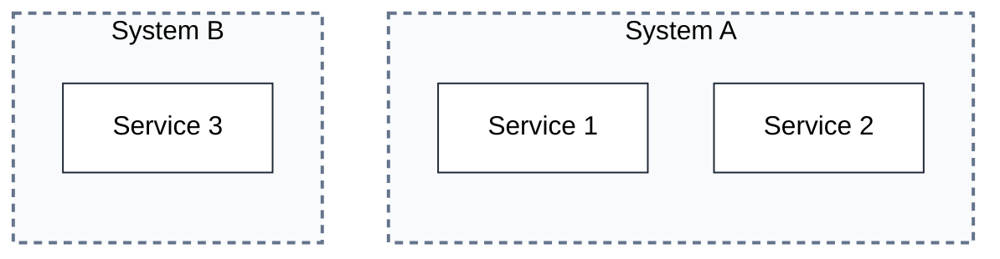
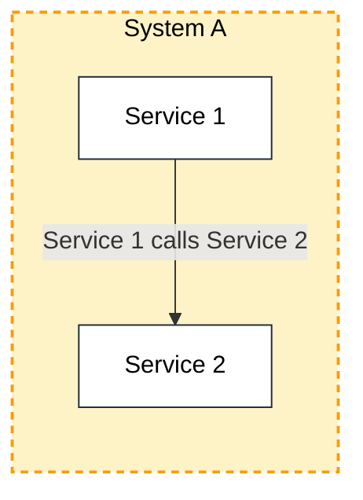
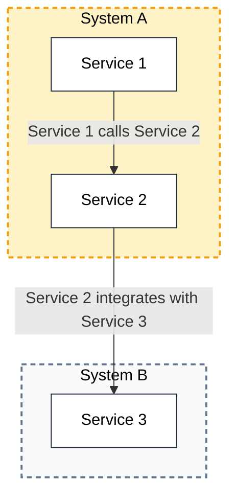
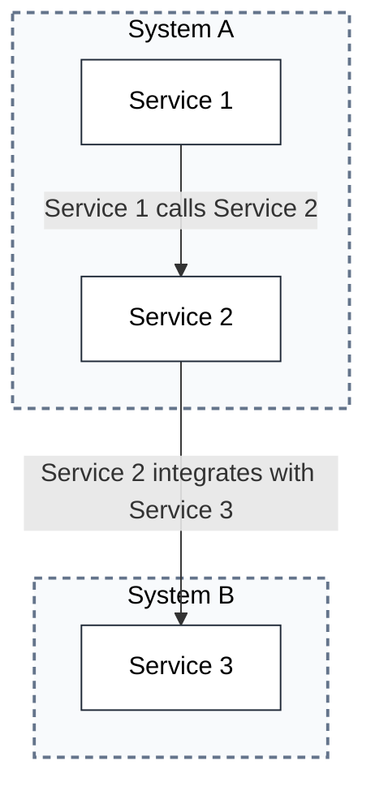

## Container Composition with No Edges [include-containers="all" edges="none"]

## Single System with Seeded Edges [focus-nodes="system-a" include-children="all" edges="seeded"]

## Single System with Connected Edges [focus-nodes="system-a" include-children="all" edges="connected"]

## Multiple Systems with All Connections [include-containers="all" edges="connected"]
