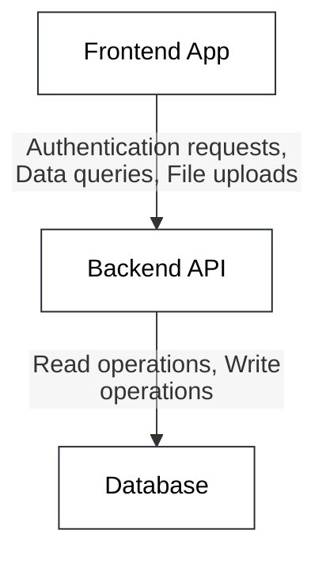

```mermaid
%%{init: {"flowchart": {"htmlLabels": false}}}%%
flowchart TB
classDef boundary fill:#f8fafc,stroke:#64748b,stroke-dasharray: 5 4,stroke-width:2px,color:#000;
classDef node fill:#ffffff,stroke:#1f2937,stroke-width:1px,color:#000;
classDef iface fill:#f1f5f9,stroke:#64748b,stroke-width:1px,font-size:10px,color:#000;
classDef highlight fill:#fef3c7,stroke:#f59e0b,stroke-width:2px,color:#000;


    backend-api["Backend API"]:::node
    database["Database"]:::node
    frontend-app["Frontend App"]:::node

    frontend-app -->|Authentication requests, Data queries, File uploads| backend-api
    backend-api -->|Read operations, Write operations| database


```
