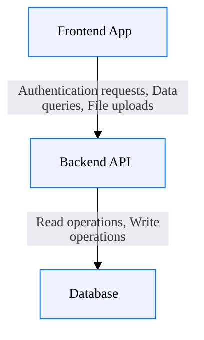

```mermaid
---
config:
  theme: base
  themeVariables:
    fontFamily: -apple-system, BlinkMacSystemFont, 'Segoe WPC', 'Segoe UI', system-ui, 'Ubuntu', sans-serif
    darkMode: false
    fontSize: 14px
    edgeLabelBackground: '#d5d7e1'
    lineColor: '#000000'
---
%%{init: {"flowchart": {"htmlLabels": false}}}%%
flowchart TB
classDef boundary fill:#e1e4f0,stroke:#204485,stroke-dasharray: 5 4,stroke-width:1px,color:#000000;
classDef node fill:#eef1ff,stroke:#007dff,stroke-width:1px,color:#000000;
classDef iface fill:#f0f0f0,stroke:#b6b6b6,stroke-width:1px,font-size:10px,color:#000000;
classDef highlight fill:#fdf7ec,stroke:#f0c060,stroke-width:1px,color:#000000;


    backend-api["Backend API"]:::node
    database["Database"]:::node
    frontend-app["Frontend App"]:::node

    frontend-app -->|Authentication requests, Data queries, File uploads| backend-api
    backend-api -->|Read operations, Write operations| database


```
