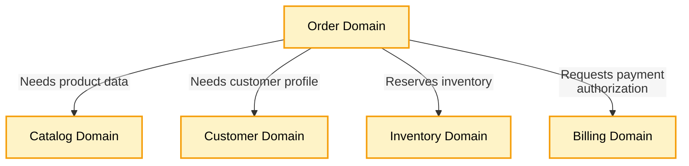
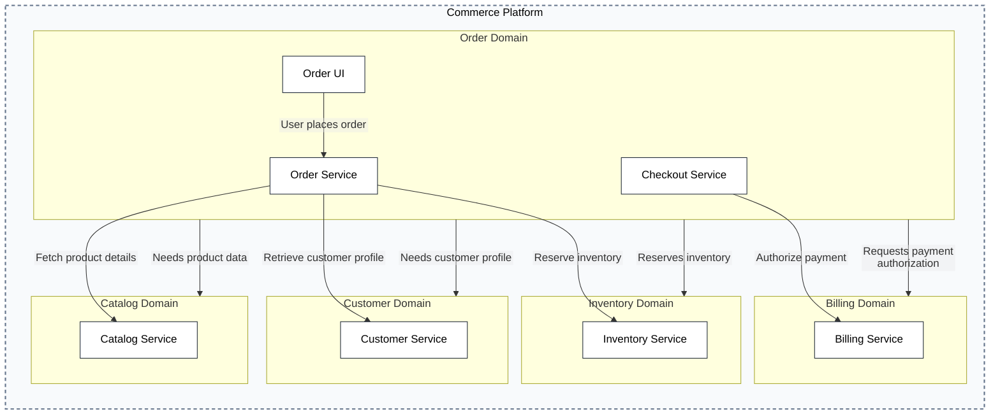

## Domain-Only View [node-types="domain" focus-nodes="order-domain,catalog-domain,customer-domain,inventory-domain,billing-domain"]

## Full Architecture with Containers [include-containers="all" edges="connected"]
