## Enterprise Trading System without Interfaces [render-interfaces=false include-containers="all" edges="connected"]

## Enterprise Trading System with Interfaces [render-interfaces=true include-containers="all" edges="connected"]

```mermaid
%%{init: {"flowchart": {"htmlLabels": false}}}%%
flowchart TB
classDef boundary fill:#f8fafc,stroke:#64748b,stroke-dasharray: 5 4,stroke-width:2px,color:#000;
classDef node fill:#ffffff,stroke:#1f2937,stroke-width:1px,color:#000;
classDef iface fill:#f1f5f9,stroke:#64748b,stroke-width:1px,font-size:10px,color:#000;
classDef highlight fill:#fef3c7,stroke:#f59e0b,stroke-width:2px,color:#000;
classDef actor fill:#e3f2fd,stroke:#1976d2,stroke-width:2px,color:#000;
classDef database fill:#fff3e0,stroke:#f57c00,stroke-width:2px,color:#000;
classDef webclient fill:#f3e5f5,stroke:#7b1fa2,stroke-width:2px,color:#000;
classDef service fill:#e8f5e8,stroke:#388e3c,stroke-width:2px,color:#000;
classDef messagebus fill:#fce4ec,stroke:#c2185b,stroke-width:2px,color:#000;
classDef system fill:#fff8e1,stroke:#f9a825,stroke-width:2px,color:#000;

        subgraph enterprise-bank["Enterprise Bank"]
        direction TB
                subgraph account-system["Account System"]
                direction TB
                    account-svc[/"⚙️ Account Service"/]:::service
                        account-svc__iface__account-api["◻ Account API"]:::iface
                end
                class account-system boundary
                subgraph client-system["Client System"]
                direction TB
                    client-svc[/"⚙️ Client Service"/]:::service
                        client-svc__iface__client-info["◻ Client Info API"]:::iface
                end
                class client-system boundary
                subgraph messaging-system["Messaging System"]
                direction TB
                    message-bus@{shape: h-cyl, label: "📨 Message Bus Kafka"}
                    class message-bus messagebus
                        message-bus__iface__trade-events-topic["◻ Trade Events Topic"]:::iface
                end
                class messaging-system boundary
                subgraph position-system["Position System"]
                direction TB
                    position-svc[/"⚙️ Position Service"/]:::service
                        position-svc__iface__position-api["◻ Position API"]:::iface
                        position-svc__iface__position-updates["◻ Position Updates"]:::iface
                end
                class position-system boundary
                subgraph product-system["Product System"]
                direction TB
                    product-svc[/"⚙️ Product Service"/]:::service
                        product-svc__iface__product-lookup["◻ Product Lookup API"]:::iface
                end
                class product-system boundary
                subgraph reporting-system["Reporting System"]
                direction TB
                    reporting-svc[/"⚙️ Reporting Service"/]:::service
                        reporting-svc__iface__reports["◻ Reports API"]:::iface
                end
                class reporting-system boundary
                subgraph risk-system["Risk System"]
                direction TB
                    risk-svc[/"⚙️ Risk Service"/]:::service
                        risk-svc__iface__risk-check["◻ Risk Check API"]:::iface
                end
                class risk-system boundary
                subgraph trading-system["Trading System"]
                direction TB
                    trade-svc[/"⚙️ Trade Service"/]:::service
                        trade-svc__iface__trade-api["◻ Trade API"]:::iface
                        trade-svc__iface__trade-events["◻ Trade Events Publisher"]:::iface
                    trading-ui[[💻 Trading UI]]:::webclient
                        trading-ui__iface__web-ui["◻ Web Interface"]:::iface
                end
                class trading-system boundary
        end
        class enterprise-bank boundary


    trading-ui__iface__web-ui -->|User places trades| trade-svc__iface__trade-api
    trade-svc__iface__trade-api -->|Update positions sync| position-svc__iface__position-updates
    trade-svc__iface__trade-events -->|Publish TradeEvent| message-bus__iface__trade-events-topic
    message-bus__iface__trade-events-topic -->|TradeEvent → Position| position-svc__iface__position-api
    message-bus__iface__trade-events-topic -->|TradeEvent → Accounting| account-svc__iface__account-api
    message-bus__iface__trade-events-topic -->|TradeEvent → Risk| risk-svc__iface__risk-check
    message-bus__iface__trade-events-topic -->|TradeEvent → Reporting| reporting-svc__iface__reports
    trade-svc__iface__trade-api -->|Validate product| product-svc__iface__product-lookup
    trade-svc__iface__trade-api -->|Fetch client info| client-svc__iface__client-info

    trading-ui -.- trading-ui__iface__web-ui
    trade-svc -.- trade-svc__iface__trade-api
    trade-svc -.- trade-svc__iface__trade-events
    position-svc -.- position-svc__iface__position-api
    position-svc -.- position-svc__iface__position-updates
    account-svc -.- account-svc__iface__account-api
    product-svc -.- product-svc__iface__product-lookup
    client-svc -.- client-svc__iface__client-info
    risk-svc -.- risk-svc__iface__risk-check
    reporting-svc -.- reporting-svc__iface__reports
    message-bus -.- message-bus__iface__trade-events-topic


```
