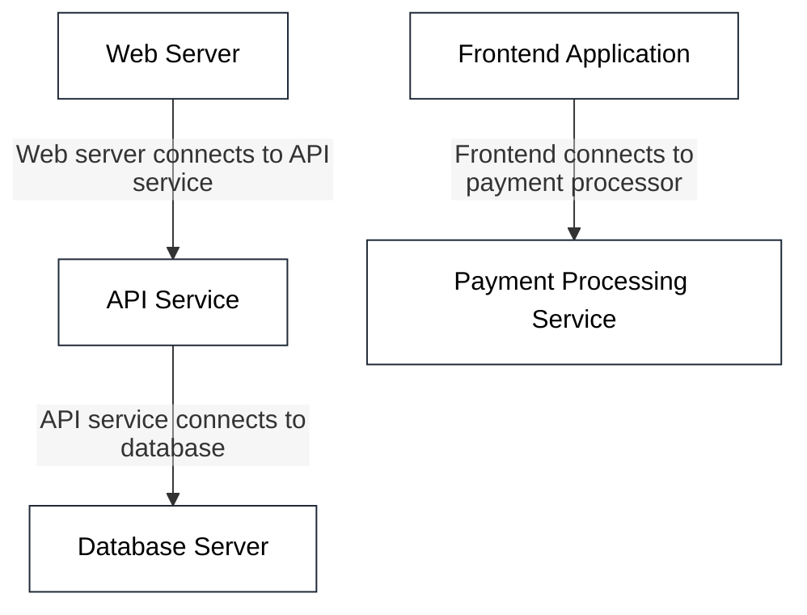
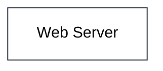
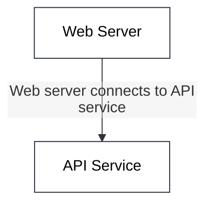
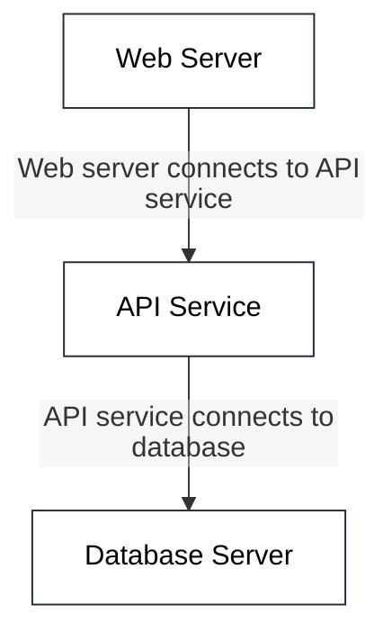
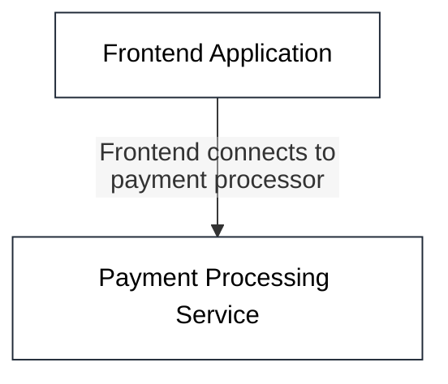
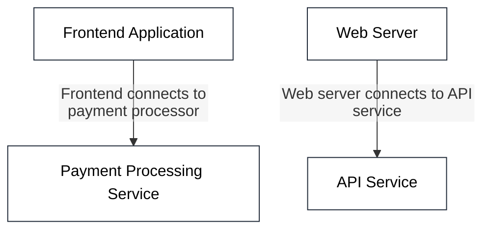

## Default Architecture (No Focus)


## Focus by Exact Control ID with No Edges [focus-controls="security-hardening" edges="none"]


## Focus by Exact Control ID with Connected Edges [focus-controls="security-hardening" edges="connected"]


## Focus by Shared Control [focus-controls="authentication"]


## Focus by Compliance Standard [focus-controls="GDPR"]
```mermaid
%%{init: {"flowchart": {"htmlLabels": false}}}%%
flowchart TB
classDef boundary fill:#f8fafc,stroke:#64748b,stroke-dasharray: 5 4,stroke-width:2px,color:#000;
classDef node fill:#ffffff,stroke:#1f2937,stroke-width:1px,color:#000;
classDef iface fill:#f1f5f9,stroke:#64748b,stroke-width:1px,font-size:10px,color:#000;
classDef highlight fill:#fef3c7,stroke:#f59e0b,stroke-width:2px,color:#000;


```

## Focus by Multiple Relationship Controls [focus-controls="api-gateway-security,data-pipeline-security"]


## Focus by Multiple Text Search [focus-controls="OAuth2,TLS 1.3,enterprise.com"]
