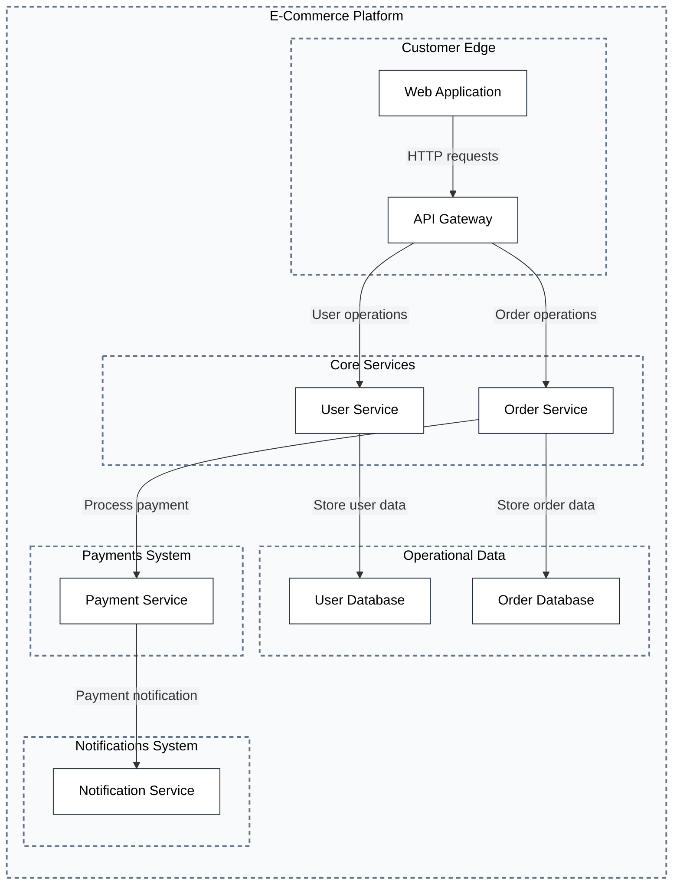
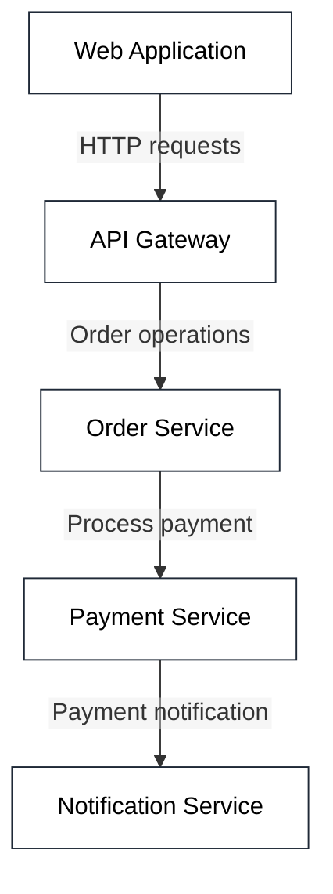
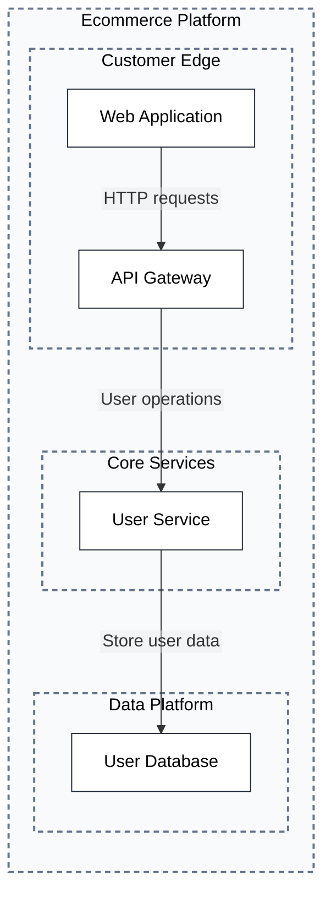
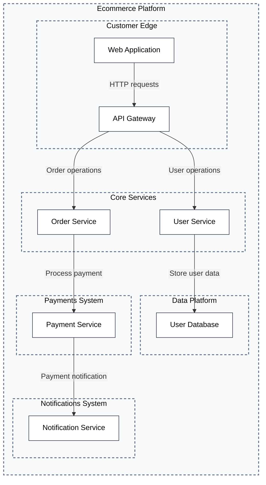

## Default Architecture with All Flows

## Single Flow without Containers [focus-flows="order-flow" include-containers="none"]

## User Flow Focus [focus-flows="user-flow"]

## Multiple Flows Combined [focus-flows="order-flow,user-flow"]
