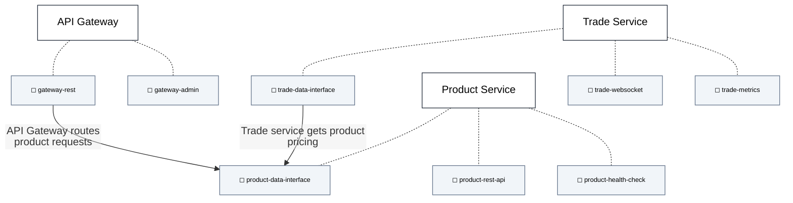
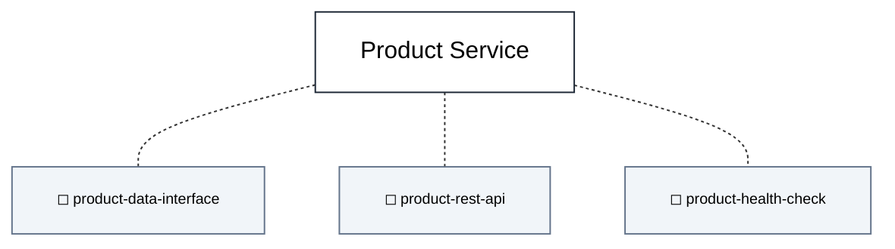
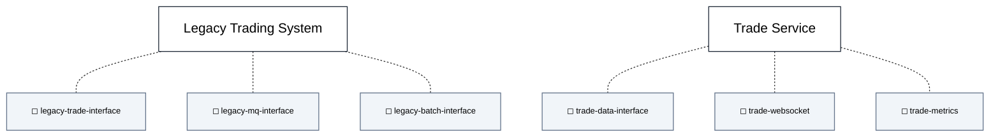

## Focus on All Interfaces [render-interfaces=true]

```mermaid
%%{init: {"flowchart": {"htmlLabels": false}}}%%
flowchart TB
classDef boundary fill:#f8fafc,stroke:#64748b,stroke-dasharray: 5 4,stroke-width:2px,color:#000;
classDef node fill:#ffffff,stroke:#1f2937,stroke-width:1px,color:#000;
classDef iface fill:#f1f5f9,stroke:#64748b,stroke-width:1px,font-size:10px,color:#000;
classDef highlight fill:#fef3c7,stroke:#f59e0b,stroke-width:2px,color:#000;


    account-service["Account Service"]:::node
        account-service__iface__account-data-interface["◻ account-data-interface"]:::iface
        account-service__iface__account-grpc-api["◻ account-grpc-api"]:::iface
    api-gateway["API Gateway"]:::node
        api-gateway__iface__gateway-rest["◻ gateway-rest"]:::iface
        api-gateway__iface__gateway-admin["◻ gateway-admin"]:::iface
    kafka-broker["Event Stream"]:::node
        kafka-broker__iface__kafka-events["◻ kafka-events"]:::iface
        kafka-broker__iface__kafka-connect["◻ kafka-connect"]:::iface
        kafka-broker__iface__kafka-schema-registry["◻ kafka-schema-registry"]:::iface
    legacy-system["Legacy Trading System"]:::node
        legacy-system__iface__legacy-trade-interface["◻ legacy-trade-interface"]:::iface
        legacy-system__iface__legacy-mq-interface["◻ legacy-mq-interface"]:::iface
        legacy-system__iface__legacy-batch-interface["◻ legacy-batch-interface"]:::iface
    product-service["Product Service"]:::node
        product-service__iface__product-data-interface["◻ product-data-interface"]:::iface
        product-service__iface__product-rest-api["◻ product-rest-api"]:::iface
        product-service__iface__product-health-check["◻ product-health-check"]:::iface
    trade-service["Trade Service"]:::node
        trade-service__iface__trade-data-interface["◻ trade-data-interface"]:::iface
        trade-service__iface__trade-websocket["◻ trade-websocket"]:::iface
        trade-service__iface__trade-metrics["◻ trade-metrics"]:::iface

    api-gateway__iface__gateway-rest -->|API Gateway routes product requests| product-service__iface__product-data-interface
    api-gateway__iface__gateway-rest -->|API Gateway routes account requests| account-service__iface__account-data-interface
    api-gateway__iface__gateway-rest -->|API Gateway routes trade requests| trade-service__iface__trade-data-interface
    trade-service__iface__trade-data-interface -->|Trade service publishes execution events| kafka-broker__iface__kafka-events
    account-service__iface__account-data-interface -->|Account service publishes update events| kafka-broker__iface__kafka-events
    legacy-system__iface__legacy-trade-interface -->|Legacy system publishes trades via adapter| kafka-broker__iface__kafka-events
    trade-service__iface__trade-data-interface -->|Trade service validates account balance| account-service__iface__account-data-interface
    trade-service__iface__trade-data-interface -->|Trade service gets product pricing| product-service__iface__product-data-interface

    product-service -.- product-service__iface__product-data-interface
    product-service -.- product-service__iface__product-rest-api
    product-service -.- product-service__iface__product-health-check
    account-service -.- account-service__iface__account-data-interface
    account-service -.- account-service__iface__account-grpc-api
    trade-service -.- trade-service__iface__trade-data-interface
    trade-service -.- trade-service__iface__trade-websocket
    trade-service -.- trade-service__iface__trade-metrics
    legacy-system -.- legacy-system__iface__legacy-trade-interface
    legacy-system -.- legacy-system__iface__legacy-mq-interface
    legacy-system -.- legacy-system__iface__legacy-batch-interface
    api-gateway -.- api-gateway__iface__gateway-rest
    api-gateway -.- api-gateway__iface__gateway-admin
    kafka-broker -.- kafka-broker__iface__kafka-events
    kafka-broker -.- kafka-broker__iface__kafka-connect
    kafka-broker -.- kafka-broker__iface__kafka-schema-registry


```

## Focus on Data Definition Interfaces [focus-interfaces="https://calm.finos.org/release/1.0/interface-definition/data-element" edges="none"]

```mermaid
%%{init: {"flowchart": {"htmlLabels": false}}}%%
flowchart TB
classDef boundary fill:#f8fafc,stroke:#64748b,stroke-dasharray: 5 4,stroke-width:2px,color:#000;
classDef node fill:#ffffff,stroke:#1f2937,stroke-width:1px,color:#000;
classDef iface fill:#f1f5f9,stroke:#64748b,stroke-width:1px,font-size:10px,color:#000;
classDef highlight fill:#fef3c7,stroke:#f59e0b,stroke-width:2px,color:#000;


    account-service["Account Service"]:::node
        account-service__iface__account-data-interface["◻ account-data-interface"]:::iface
        account-service__iface__account-grpc-api["◻ account-grpc-api"]:::iface
    legacy-system["Legacy Trading System"]:::node
        legacy-system__iface__legacy-trade-interface["◻ legacy-trade-interface"]:::iface
        legacy-system__iface__legacy-mq-interface["◻ legacy-mq-interface"]:::iface
        legacy-system__iface__legacy-batch-interface["◻ legacy-batch-interface"]:::iface
    product-service["Product Service"]:::node
        product-service__iface__product-data-interface["◻ product-data-interface"]:::iface
        product-service__iface__product-rest-api["◻ product-rest-api"]:::iface
        product-service__iface__product-health-check["◻ product-health-check"]:::iface
    trade-service["Trade Service"]:::node
        trade-service__iface__trade-data-interface["◻ trade-data-interface"]:::iface
        trade-service__iface__trade-websocket["◻ trade-websocket"]:::iface
        trade-service__iface__trade-metrics["◻ trade-metrics"]:::iface


    product-service -.- product-service__iface__product-data-interface
    product-service -.- product-service__iface__product-rest-api
    product-service -.- product-service__iface__product-health-check
    account-service -.- account-service__iface__account-data-interface
    account-service -.- account-service__iface__account-grpc-api
    trade-service -.- trade-service__iface__trade-data-interface
    trade-service -.- trade-service__iface__trade-websocket
    trade-service -.- trade-service__iface__trade-metrics
    legacy-system -.- legacy-system__iface__legacy-trade-interface
    legacy-system -.- legacy-system__iface__legacy-mq-interface
    legacy-system -.- legacy-system__iface__legacy-batch-interface


```

## Focus on Product Data Interface [focus-interfaces="product-data-interface" edges="connected"]

## Focus on Product Data Interface [focus-interfaces="product-data-interface" edges="seeded"]

## Focus on Trade-Related Data Interfaces [focus-interfaces="trade-data-interface,legacy-trade-interface"]
