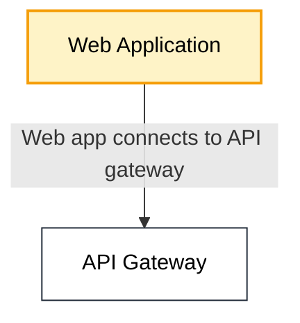
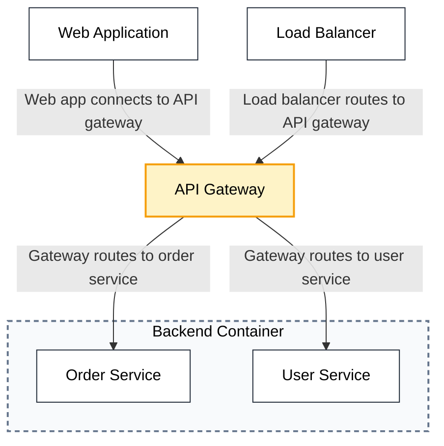
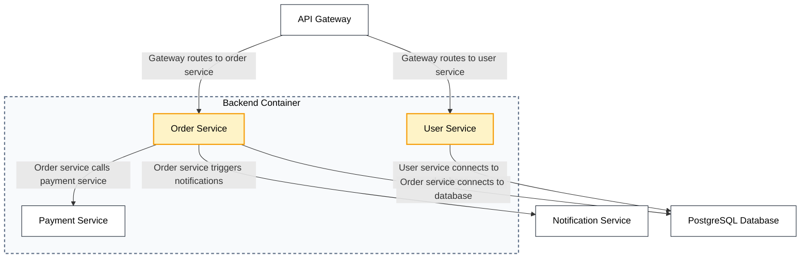
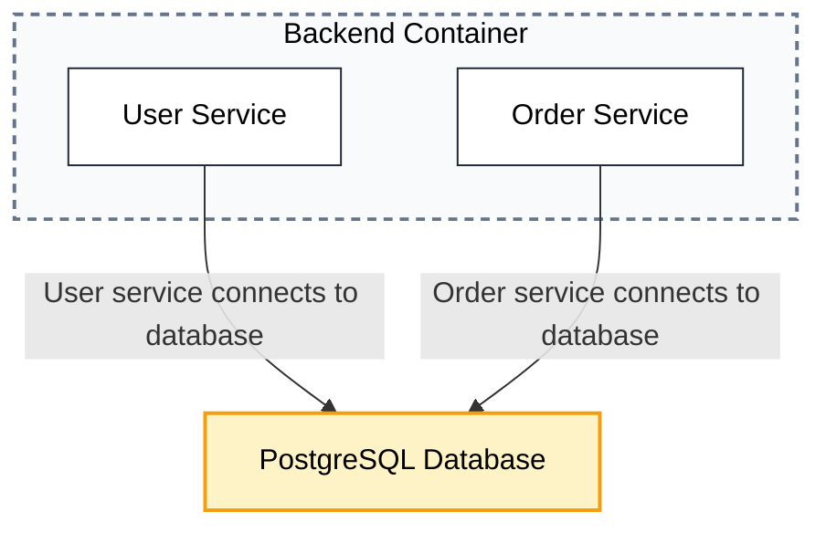
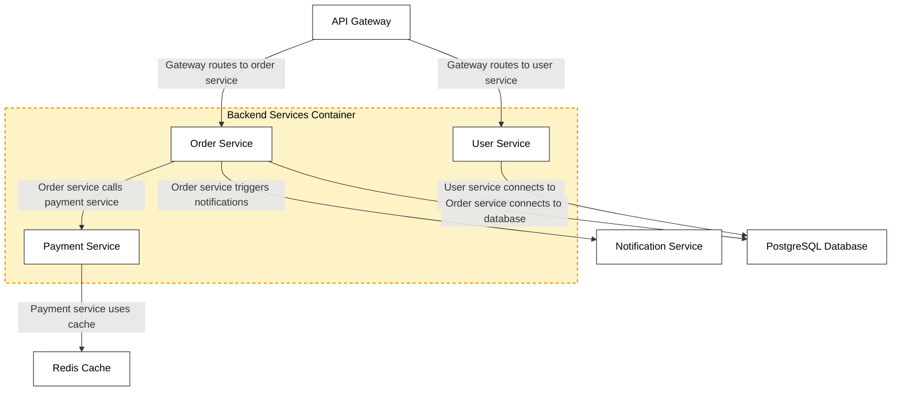

## Single Node Focus [focus-nodes="web-app"]

## Gateway Node with All Connections [focus-nodes="api-gateway"]

## Multiple Services Focus [focus-nodes="user-service,order-service"]

## Database with All Connected Services [focus-nodes="database"]

## Container Hierarchy with Children [focus-nodes="backend-container" include-children="all"]
