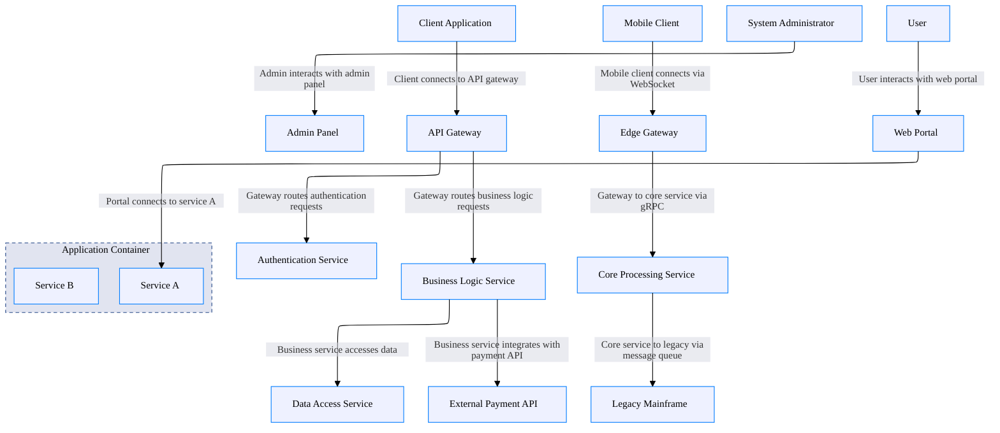
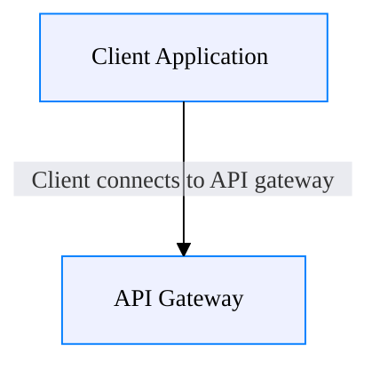
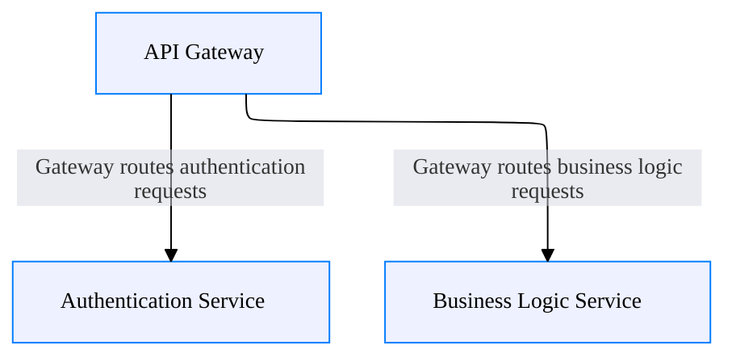
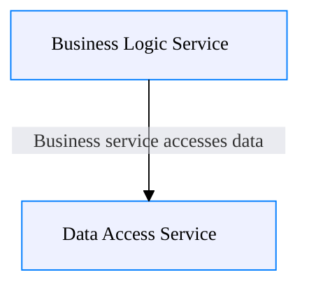
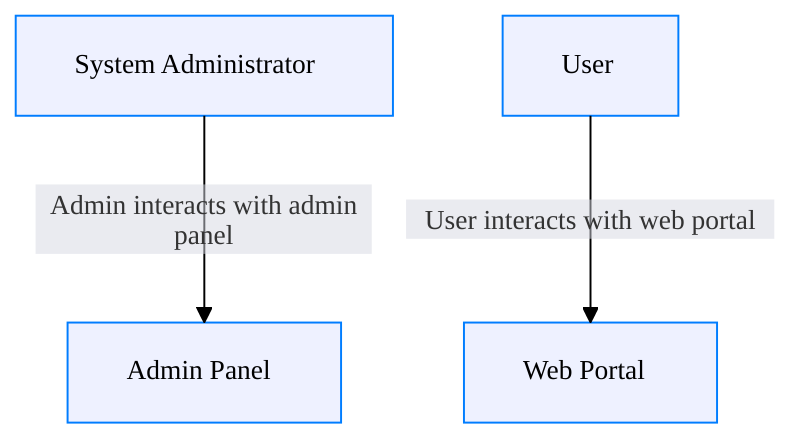
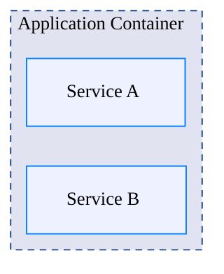

## Default Architecture (No Focus)

## Single Relationship Focus [focus-relationships="client-gateway-connection"]

## Multiple Related Relationships [focus-relationships="gateway-auth-route,gateway-business-route"]

## Relationship with Connected Edges [focus-relationships="business-data-connection" edges="connected"]

## Actor Interactions [focus-relationships="user-interacts-portal,admin-interacts-panel"]

## Container Deployment [focus-relationships="services-deployed-container"]
