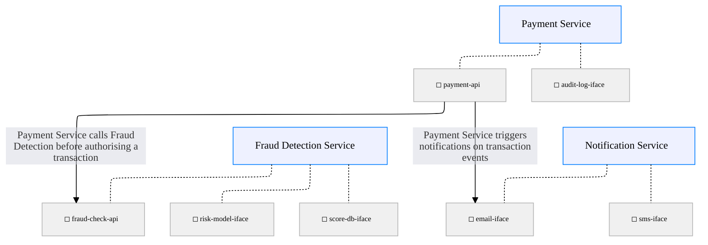
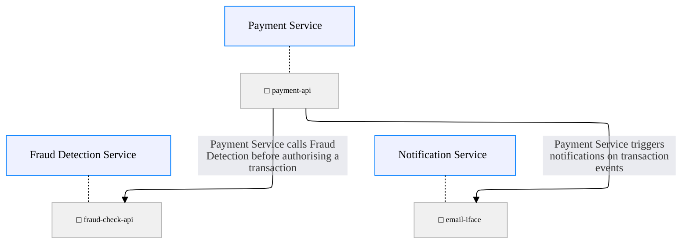

## Focus on payment-api with all interfaces rendered [focus-interfaces="payment-api" edges="connected" render-interfaces=true]

## Focus on payment-api ignoring connected node interfaces [focus-interfaces="payment-api" edges="connected" render-interfaces=true ignore-connected-interfaces=true]
