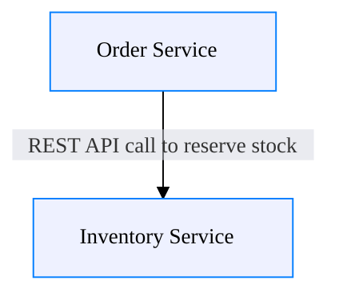
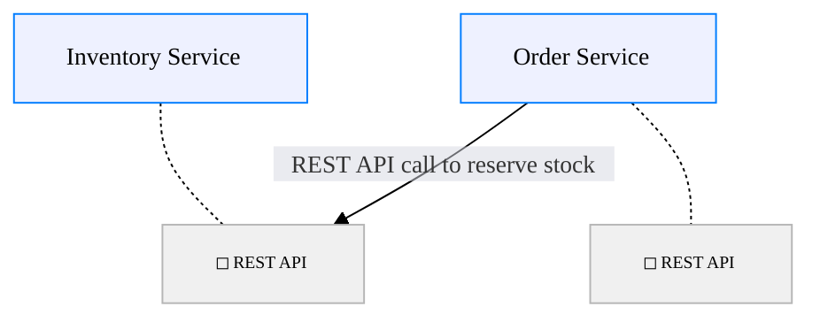
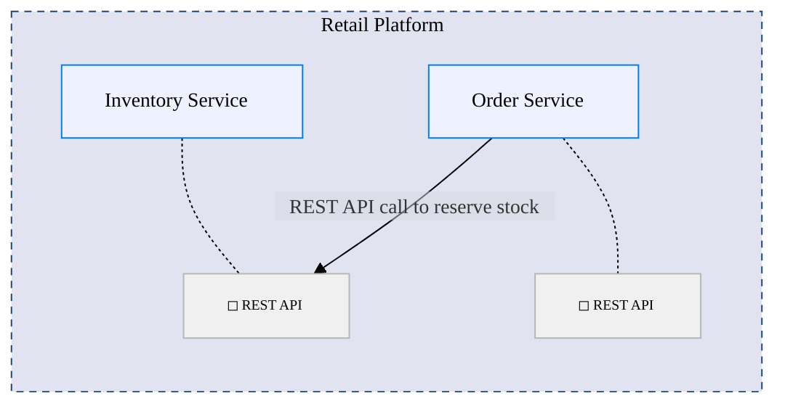

## Node-to-Node Connections without Interfaces [render-interfaces=false include-containers="none" edges="connected"]

## Interface-to-Interface Connections [render-interfaces=true include-containers="none" edges="connected"]

## Interfaces with Container Context [render-interfaces=true include-containers="all"]
