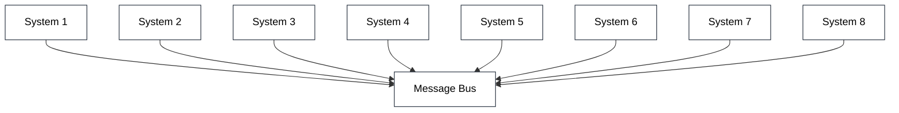

## Large Topology Performance Test

```mermaid
%%{init: {"flowchart": {"htmlLabels": false}}}%%
flowchart TB
classDef boundary fill:#f8fafc,stroke:#64748b,stroke-dasharray: 5 4,stroke-width:2px,color:#000;
classDef node fill:#ffffff,stroke:#1f2937,stroke-width:1px,color:#000;
classDef iface fill:#f1f5f9,stroke:#64748b,stroke-width:1px,font-size:10px,color:#000;
classDef highlight fill:#fef3c7,stroke:#f59e0b,stroke-width:2px,color:#000;


    msg-bus["Message Bus"]:::node
    sys1["System 1"]:::node
    sys2["System 2"]:::node
    sys3["System 3"]:::node
    sys4["System 4"]:::node
    sys5["System 5"]:::node
    sys6["System 6"]:::node
    sys7["System 7"]:::node
    sys8["System 8"]:::node

    sys1 --> msg-bus
    sys2 --> msg-bus
    sys3 --> msg-bus
    sys4 --> msg-bus
    sys5 --> msg-bus
    sys6 --> msg-bus
    sys7 --> msg-bus
    sys8 --> msg-bus


```