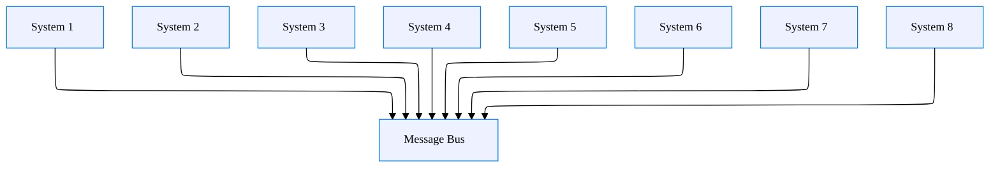

## Large Topology Performance Test

```mermaid
---
config:
  theme: base
  themeVariables:
    fontFamily: -apple-system, BlinkMacSystemFont, 'Segoe WPC', 'Segoe UI', system-ui, 'Ubuntu', sans-serif
    darkMode: false
    fontSize: 14px
    edgeLabelBackground: '#d5d7e1'
    lineColor: '#000000'
---
%%{init: {"layout": "elk", "flowchart": {"htmlLabels": false}}}%%
flowchart TB
classDef boundary fill:#e1e4f0,stroke:#204485,stroke-dasharray: 5 4,stroke-width:1px,color:#000000;
classDef node fill:#eef1ff,stroke:#007dff,stroke-width:1px,color:#000000;
classDef iface fill:#f0f0f0,stroke:#b6b6b6,stroke-width:1px,font-size:10px,color:#000000;
classDef highlight fill:#fdf7ec,stroke:#f0c060,stroke-width:1px,color:#000000;


    msg-bus["Message Bus"]:::node
    sys1["System 1"]:::node
    sys2["System 2"]:::node
    sys3["System 3"]:::node
    sys4["System 4"]:::node
    sys5["System 5"]:::node
    sys6["System 6"]:::node
    sys7["System 7"]:::node
    sys8["System 8"]:::node

    sys1 --> msg-bus
    sys2 --> msg-bus
    sys3 --> msg-bus
    sys4 --> msg-bus
    sys5 --> msg-bus
    sys6 --> msg-bus
    sys7 --> msg-bus
    sys8 --> msg-bus


```