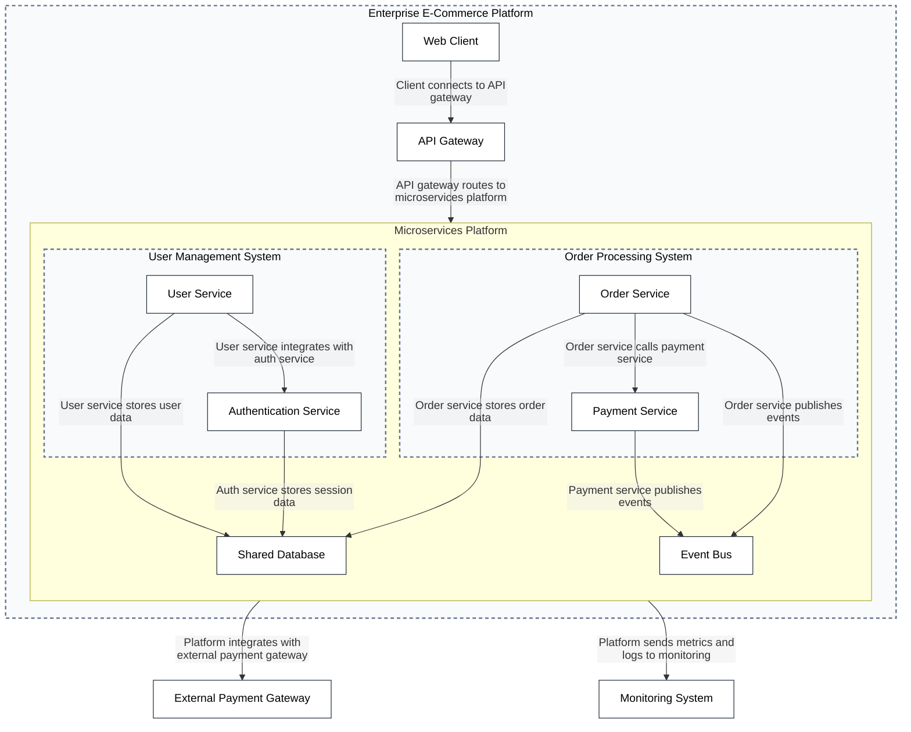
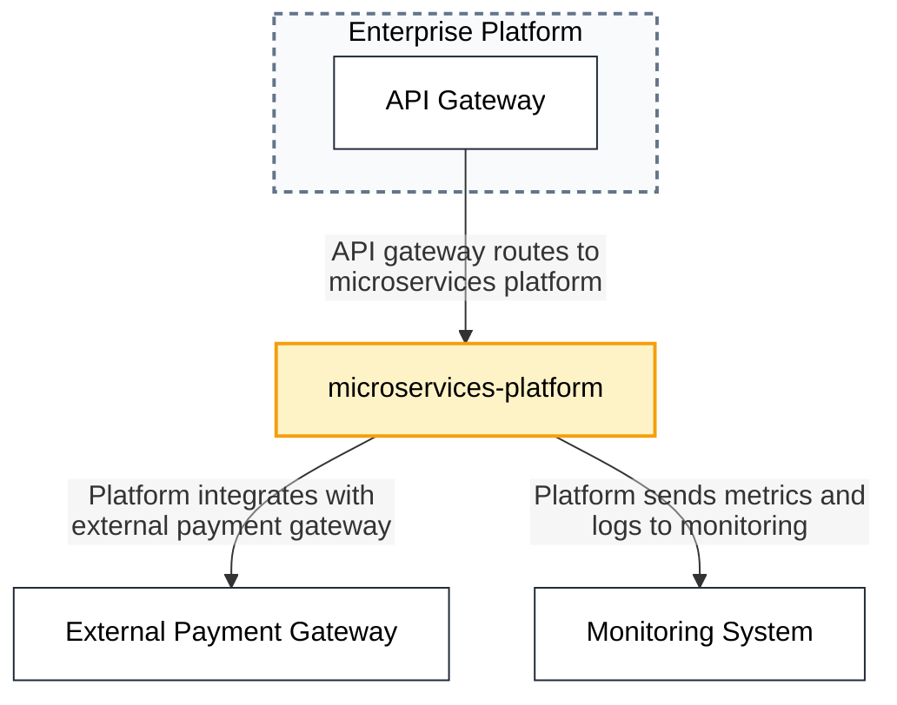

## Nested Architecture Collapsed View

```mermaid
%%{init: {"flowchart": {"htmlLabels": false}}}%%
flowchart TB
classDef boundary fill:#f8fafc,stroke:#64748b,stroke-dasharray: 5 4,stroke-width:2px,color:#000;
classDef node fill:#ffffff,stroke:#1f2937,stroke-width:1px,color:#000;
classDef iface fill:#f1f5f9,stroke:#64748b,stroke-width:1px,font-size:10px,color:#000;
classDef highlight fill:#fef3c7,stroke:#f59e0b,stroke-width:2px,color:#000;

        subgraph enterprise-platform["Enterprise E-Commerce Platform"]
        direction TB
            api-gateway["API Gateway"]:::node
            web-client["Web Client"]:::node
                subgraph microservices-platform["Microservices Platform"]
                direction TB
                    message-bus["Event Bus"]:::node
                    internal-db["Shared Database"]:::node
                        subgraph order-processing-system["Order Processing System"]
                        direction TB
                            order-service["Order Service"]:::node
                            payment-service["Payment Service"]:::node
                        end
                        class order-processing-system boundary
                        subgraph user-management-system["User Management System"]
                        direction TB
                            auth-service["Authentication Service"]:::node
                            user-service["User Service"]:::node
                        end
                        class user-management-system boundary
                end
                class microservices-platform boundary
        end
        class enterprise-platform boundary

    external-payment-gateway["External Payment Gateway"]:::node
    monitoring-system["Monitoring System"]:::node

    web-client -->|Client connects to API gateway| api-gateway
    api-gateway -->|API gateway routes to microservices platform| microservices-platform
    microservices-platform -->|Platform integrates with external payment gateway| external-payment-gateway
    microservices-platform -->|Platform sends metrics and logs to monitoring| monitoring-system
    user-service -->|User service stores user data| internal-db
    auth-service -->|Auth service stores session data| internal-db
    order-service -->|Order service stores order data| internal-db
    order-service -->|Order service calls payment service| payment-service
    payment-service -->|Payment service publishes events| message-bus
    order-service -->|Order service publishes events| message-bus
    user-service -->|User service integrates with auth service| auth-service


```

## Focus on Microservices Platform with Children [focus-nodes="microservices-platform" include-children="all"]

```mermaid
%%{init: {"flowchart": {"htmlLabels": false}}}%%
flowchart TB
classDef boundary fill:#f8fafc,stroke:#64748b,stroke-dasharray: 5 4,stroke-width:2px,color:#000;
classDef node fill:#ffffff,stroke:#1f2937,stroke-width:1px,color:#000;
classDef iface fill:#f1f5f9,stroke:#64748b,stroke-width:1px,font-size:10px,color:#000;
classDef highlight fill:#fef3c7,stroke:#f59e0b,stroke-width:2px,color:#000;

        subgraph enterprise-platform["Enterprise Platform"]
        direction TB
            api-gateway["API Gateway"]:::node
        end
        class enterprise-platform boundary

    external-payment-gateway["External Payment Gateway"]:::node
    monitoring-system["Monitoring System"]:::node

    api-gateway -->|API gateway routes to microservices platform| microservices-platform
    microservices-platform -->|Platform integrates with external payment gateway| external-payment-gateway
    microservices-platform -->|Platform sends metrics and logs to monitoring| monitoring-system


    class microservices-platform highlight

```