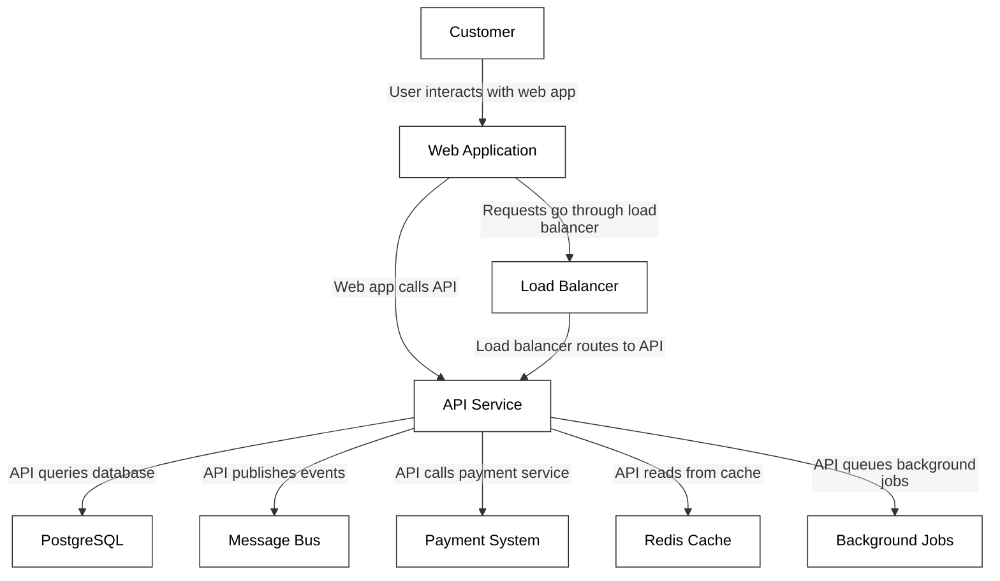
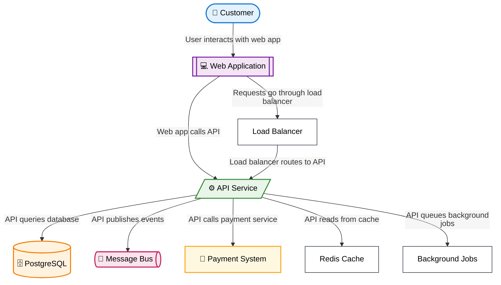
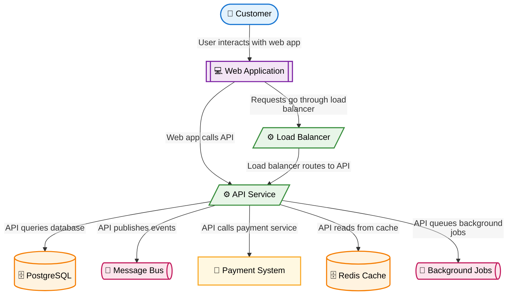

## Classic Mode (Default)

```mermaid
%%{init: {"flowchart": {"htmlLabels": false}}}%%
flowchart TB
classDef boundary fill:#f8fafc,stroke:#64748b,stroke-dasharray: 5 4,stroke-width:2px,color:#000;
classDef node fill:#ffffff,stroke:#1f2937,stroke-width:1px,color:#000;
classDef iface fill:#f1f5f9,stroke:#64748b,stroke-width:1px,font-size:10px,color:#000;
classDef highlight fill:#fef3c7,stroke:#f59e0b,stroke-width:2px,color:#000;


    api-service["API Service"]:::node
    worker-queue["Background Jobs"]:::node
    user["Customer"]:::node
    load-balancer["Load Balancer"]:::node
    message-bus["Message Bus"]:::node
    payment-system["Payment System"]:::node
    database["PostgreSQL"]:::node
    redis-cache["Redis Cache"]:::node
    web-app["Web Application"]:::node

    user -->|User interacts with web app| web-app
    web-app -->|Web app calls API| api-service
    api-service -->|API queries database| database
    api-service -->|API publishes events| message-bus
    api-service -->|API calls payment service| payment-system
    api-service -->|API reads from cache| redis-cache
    web-app -->|Requests go through load balancer| load-balancer
    load-balancer -->|Load balancer routes to API| api-service
    api-service -->|API queues background jobs| worker-queue


```

## Node Type Shapes Mode [render-node-type-shapes=true]

```mermaid
%%{init: {"flowchart": {"htmlLabels": false}}}%%
flowchart TB
classDef boundary fill:#f8fafc,stroke:#64748b,stroke-dasharray: 5 4,stroke-width:2px,color:#000;
classDef node fill:#ffffff,stroke:#1f2937,stroke-width:1px,color:#000;
classDef iface fill:#f1f5f9,stroke:#64748b,stroke-width:1px,font-size:10px,color:#000;
classDef highlight fill:#fef3c7,stroke:#f59e0b,stroke-width:2px,color:#000;
classDef actor fill:#e3f2fd,stroke:#1976d2,stroke-width:2px,color:#000;
classDef database fill:#fff3e0,stroke:#f57c00,stroke-width:2px,color:#000;
classDef webclient fill:#f3e5f5,stroke:#7b1fa2,stroke-width:2px,color:#000;
classDef service fill:#e8f5e8,stroke:#388e3c,stroke-width:2px,color:#000;
classDef messagebus fill:#fce4ec,stroke:#c2185b,stroke-width:2px,color:#000;
classDef system fill:#fff8e1,stroke:#f9a825,stroke-width:2px,color:#000;


    api-service[/"⚙️ API Service"/]:::service
    worker-queue["Background Jobs"]:::node
    user([👤 Customer]):::actor
    load-balancer["Load Balancer"]:::node
    message-bus@{shape: h-cyl, label: "📨 Message Bus"}
    class message-bus messagebus
    payment-system[🏢 Payment System]:::system
    database[(🗄️ PostgreSQL)]:::database
    redis-cache["Redis Cache"]:::node
    web-app[[💻 Web Application]]:::webclient

    user -->|User interacts with web app| web-app
    web-app -->|Web app calls API| api-service
    api-service -->|API queries database| database
    api-service -->|API publishes events| message-bus
    api-service -->|API calls payment service| payment-system
    api-service -->|API reads from cache| redis-cache
    web-app -->|Requests go through load balancer| load-balancer
    load-balancer -->|Load balancer routes to API| api-service
    api-service -->|API queues background jobs| worker-queue


```

## Custom Node Type Mapping [render-node-type-shapes=true node-type-map]

```mermaid
%%{init: {"flowchart": {"htmlLabels": false}}}%%
flowchart TB
classDef boundary fill:#f8fafc,stroke:#64748b,stroke-dasharray: 5 4,stroke-width:2px,color:#000;
classDef node fill:#ffffff,stroke:#1f2937,stroke-width:1px,color:#000;
classDef iface fill:#f1f5f9,stroke:#64748b,stroke-width:1px,font-size:10px,color:#000;
classDef highlight fill:#fef3c7,stroke:#f59e0b,stroke-width:2px,color:#000;
classDef actor fill:#e3f2fd,stroke:#1976d2,stroke-width:2px,color:#000;
classDef database fill:#fff3e0,stroke:#f57c00,stroke-width:2px,color:#000;
classDef webclient fill:#f3e5f5,stroke:#7b1fa2,stroke-width:2px,color:#000;
classDef service fill:#e8f5e8,stroke:#388e3c,stroke-width:2px,color:#000;
classDef messagebus fill:#fce4ec,stroke:#c2185b,stroke-width:2px,color:#000;
classDef system fill:#fff8e1,stroke:#f9a825,stroke-width:2px,color:#000;


    api-service[/"⚙️ API Service"/]:::service
    worker-queue@{shape: h-cyl, label: "📨 Background Jobs"}
    class worker-queue messagebus
    user([👤 Customer]):::actor
    load-balancer[/"⚙️ Load Balancer"/]:::service
    message-bus@{shape: h-cyl, label: "📨 Message Bus"}
    class message-bus messagebus
    payment-system[🏢 Payment System]:::system
    database[(🗄️ PostgreSQL)]:::database
    redis-cache[(🗄️ Redis Cache)]:::database
    web-app[[💻 Web Application]]:::webclient

    user -->|User interacts with web app| web-app
    web-app -->|Web app calls API| api-service
    api-service -->|API queries database| database
    api-service -->|API publishes events| message-bus
    api-service -->|API calls payment service| payment-system
    api-service -->|API reads from cache| redis-cache
    web-app -->|Requests go through load balancer| load-balancer
    load-balancer -->|Load balancer routes to API| api-service
    api-service -->|API queues background jobs| worker-queue


```