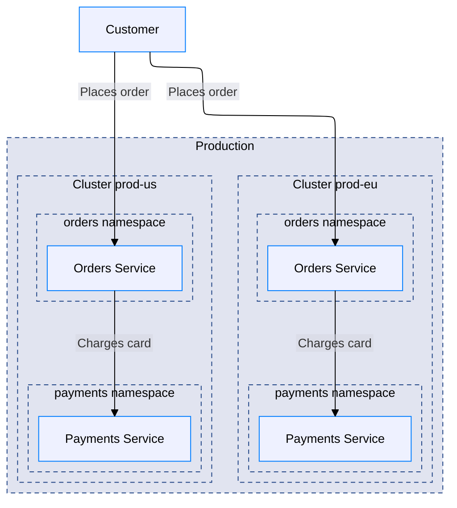

## Namespaces shared by every cluster in an environment [include-containers="all" link-prefix="#"]

```mermaid
---
config:
  theme: base
  themeVariables:
    fontFamily: -apple-system, BlinkMacSystemFont, 'Segoe WPC', 'Segoe UI', system-ui, 'Ubuntu', sans-serif
    darkMode: false
    fontSize: 14px
    edgeLabelBackground: '#d5d7e1'
    lineColor: '#000000'
---
%%{init: {"layout": "elk", "flowchart": {"htmlLabels": false}}}%%
flowchart TB
classDef boundary fill:#e1e4f0,stroke:#204485,stroke-dasharray: 5 4,stroke-width:1px,color:#000000;
classDef node fill:#eef1ff,stroke:#007dff,stroke-width:1px,color:#000000;
classDef iface fill:#f0f0f0,stroke:#b6b6b6,stroke-width:1px,font-size:10px,color:#000000;
classDef highlight fill:#fdf7ec,stroke:#f0c060,stroke-width:1px,color:#000000;

        subgraph prod["Production"]
        direction TB
                subgraph prod-eu["Cluster prod-eu"]
                direction TB
                        subgraph ns-orders__in__prod-eu["orders namespace"]
                        direction TB
                            orders-svc__in__ns-orders__in__prod-eu["Orders Service"]:::node
                        end
                        class ns-orders__in__prod-eu boundary
                        subgraph ns-payments__in__prod-eu["payments namespace"]
                        direction TB
                            payments-svc__in__ns-payments__in__prod-eu["Payments Service"]:::node
                        end
                        class ns-payments__in__prod-eu boundary
                end
                class prod-eu boundary
                subgraph prod-us["Cluster prod-us"]
                direction TB
                        subgraph ns-orders__in__prod-us["orders namespace"]
                        direction TB
                            orders-svc__in__ns-orders__in__prod-us["Orders Service"]:::node
                        end
                        class ns-orders__in__prod-us boundary
                        subgraph ns-payments__in__prod-us["payments namespace"]
                        direction TB
                            payments-svc__in__ns-payments__in__prod-us["Payments Service"]:::node
                        end
                        class ns-payments__in__prod-us boundary
                end
                class prod-us boundary
        end
        class prod boundary

    customer["Customer"]:::node

    customer -->|Places order| orders-svc__in__ns-orders__in__prod-eu
    customer -->|Places order| orders-svc__in__ns-orders__in__prod-us
    orders-svc__in__ns-orders__in__prod-eu -->|Charges card| payments-svc__in__ns-payments__in__prod-eu
    orders-svc__in__ns-orders__in__prod-us -->|Charges card| payments-svc__in__ns-payments__in__prod-us


        click prod "#prod" "Jump to Production"
            
        
            click prod-eu "#prod-eu" "Jump to Cluster prod-eu"
                
            
                click ns-orders__in__prod-eu "#ns-orders" "Jump to orders namespace"
                    
                click orders-svc__in__ns-orders__in__prod-eu "#orders-svc" "Jump to Orders Service"
                    
                click ns-payments__in__prod-eu "#ns-payments" "Jump to payments namespace"
                    
                click payments-svc__in__ns-payments__in__prod-eu "#payments-svc" "Jump to Payments Service"
                    
            click prod-us "#prod-us" "Jump to Cluster prod-us"
                
            
                click ns-orders__in__prod-us "#ns-orders" "Jump to orders namespace"
                    
                click orders-svc__in__ns-orders__in__prod-us "#orders-svc" "Jump to Orders Service"
                    
                click ns-payments__in__prod-us "#ns-payments" "Jump to payments namespace"
                    
                click payments-svc__in__ns-payments__in__prod-us "#payments-svc" "Jump to Payments Service"
                    
        click customer "#customer" "Jump to Customer"
            
        

```