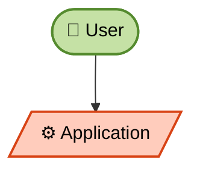

## Custom Theme Colors

```mermaid
%%{init: {"flowchart": {"htmlLabels": false}}}%%
flowchart TB
classDef boundary fill:#e0f7fa,stroke:#00838f,stroke-dasharray: 5 4,stroke-width:2px,color:#000;
classDef node fill:#ffffff,stroke:#01579b,stroke-width:1px,color:#000;
classDef iface fill:#b3e5fc,stroke:#01579b,stroke-width:1px,font-size:10px,color:#000;
classDef highlight fill:#fff9c4,stroke:#f57f17,stroke-width:2px,color:#000;
classDef actor fill:#c5e1a5,stroke:#558b2f,stroke-width:2px,color:#000;
classDef database fill:#fff3e0,stroke:#f57c00,stroke-width:2px,color:#000;
classDef webclient fill:#f3e5f5,stroke:#7b1fa2,stroke-width:2px,color:#000;
classDef service fill:#ffccbc,stroke:#d84315,stroke-width:2px,color:#000;
classDef messagebus fill:#fce4ec,stroke:#c2185b,stroke-width:2px,color:#000;
classDef system fill:#fff8e1,stroke:#f9a825,stroke-width:2px,color:#000;


    app[/"⚙️ Application"/]:::service
    user([👤 User]):::actor

    user --> app


```
