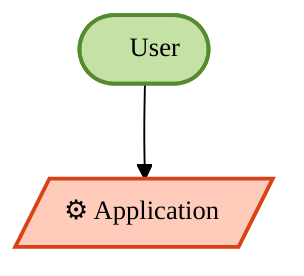

## Custom Theme Colors

```mermaid
---
config:
  theme: base
  themeVariables:
    fontFamily: -apple-system, BlinkMacSystemFont, 'Segoe WPC', 'Segoe UI', system-ui, 'Ubuntu', sans-serif
    darkMode: false
    fontSize: 14px
    edgeLabelBackground: '#d5d7e1'
    lineColor: '#000000'
---
%%{init: {"flowchart": {"htmlLabels": false}}}%%
flowchart TB
classDef boundary fill:#e0f7fa,stroke:#00838f,stroke-dasharray: 5 4,stroke-width:2px,color:#000000;
classDef node fill:#ffffff,stroke:#01579b,stroke-width:1px,color:#000000;
classDef iface fill:#b3e5fc,stroke:#01579b,stroke-width:1px,font-size:10px,color:#000000;
classDef highlight fill:#fff9c4,stroke:#f57f17,stroke-width:2px,color:#000000;
classDef actor fill:#c5e1a5,stroke:#558b2f,stroke-width:2px,color:#000000;
classDef database fill:#eef1ff,stroke:#2052a2,stroke-width:1px,color:#000000;
classDef webclient fill:#eef1ff,stroke:#156edf,stroke-width:1px,color:#000000;
classDef service fill:#ffccbc,stroke:#d84315,stroke-width:2px,color:#000000;
classDef messagebus fill:#eef1ff,stroke:#1c60c0,stroke-width:1px,color:#000000;
classDef system fill:#eef1ff,stroke:#204485,stroke-width:1px,color:#000000;


    app[/"⚙️ Application"/]:::service
    user([👤 User]):::actor

    user --> app


```
