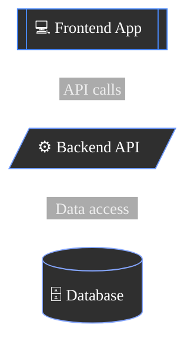

## Dark Theme

```mermaid
---
config:
  theme: base
  themeVariables:
    fontFamily: -apple-system, BlinkMacSystemFont, 'Segoe WPC', 'Segoe UI', system-ui, 'Ubuntu', sans-serif
    darkMode: true
    fontSize: 14px
    edgeLabelBackground: '#585858'
    lineColor: '#ffffff'
---
%%{init: {"flowchart": {"htmlLabels": false}}}%%
flowchart TB
classDef boundary fill:#434343,stroke:#9cb4ff,stroke-dasharray: 5 4,stroke-width:1px,color:#ffffff;
classDef node fill:#2f2f2f,stroke:#007dff,stroke-width:1px,color:#ffffff;
classDef iface fill:#343641,stroke:#9e9fa5,stroke-width:1px,font-size:10px,color:#ffffff;
classDef highlight fill:#5a4929,stroke:#f0c060,stroke-width:1px,color:#ffffff;
classDef actor fill:#2f2f2f,stroke:#007dff,stroke-width:1px,color:#ffffff;
classDef database fill:#2f2f2f,stroke:#85a6ff,stroke-width:1px,color:#ffffff;
classDef webclient fill:#2f2f2f,stroke:#4a8aff,stroke-width:1px,color:#ffffff;
classDef service fill:#2f2f2f,stroke:#6b98ff,stroke-width:1px,color:#ffffff;
classDef messagebus fill:#2f2f2f,stroke:#6b98ff,stroke-width:1px,color:#ffffff;
classDef system fill:#2f2f2f,stroke:#9cb4ff,stroke-width:1px,color:#ffffff;


    backend[/"⚙️ Backend API"/]:::service
    db[(🗄️ Database)]:::database
    frontend[[💻 Frontend App]]:::webclient

    frontend -->|API calls| backend
    backend -->|Data access| db


```
