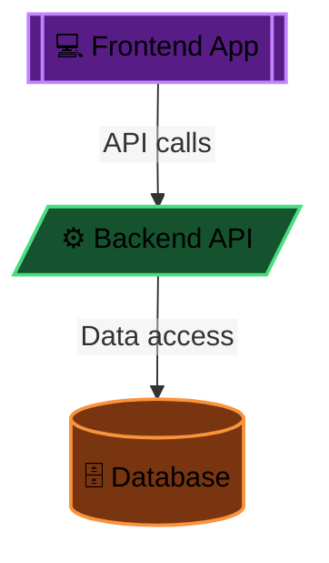

## Dark Theme

```mermaid
%%{init: {"flowchart": {"htmlLabels": false}}}%%
flowchart TB
classDef boundary fill:#1e293b,stroke:#94a3b8,stroke-dasharray: 5 4,stroke-width:2px,color:#000;
classDef node fill:#0f172a,stroke:#cbd5e1,stroke-width:1px,color:#000;
classDef iface fill:#334155,stroke:#94a3b8,stroke-width:1px,font-size:10px,color:#000;
classDef highlight fill:#854d0e,stroke:#fbbf24,stroke-width:2px,color:#000;
classDef actor fill:#1e3a8a,stroke:#60a5fa,stroke-width:2px,color:#000;
classDef database fill:#78350f,stroke:#fb923c,stroke-width:2px,color:#000;
classDef webclient fill:#581c87,stroke:#c084fc,stroke-width:2px,color:#000;
classDef service fill:#14532d,stroke:#4ade80,stroke-width:2px,color:#000;
classDef messagebus fill:#831843,stroke:#f472b6,stroke-width:2px,color:#000;
classDef system fill:#713f12,stroke:#fbbf24,stroke-width:2px,color:#000;


    frontend[[💻 Frontend App]]:::webclient
    backend[/"⚙️ Backend API"/]:::service
    db[(🗄️ Database)]:::database

    frontend -->|API calls| backend
    backend -->|Data access| db


```
