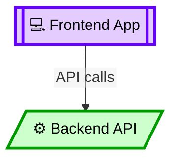

## High Contrast Theme

```mermaid
%%{init: {"flowchart": {"htmlLabels": false}}}%%
flowchart TB
classDef boundary fill:#ffffff,stroke:#000000,stroke-dasharray: 5 4,stroke-width:3px,color:#000;
classDef node fill:#ffffff,stroke:#000000,stroke-width:2px,color:#000;
classDef iface fill:#e0e0e0,stroke:#000000,stroke-width:2px,font-size:10px,color:#000;
classDef highlight fill:#ffff00,stroke:#000000,stroke-width:3px,color:#000;
classDef actor fill:#cce5ff,stroke:#0000ff,stroke-width:3px,color:#000;
classDef database fill:#ffe5cc,stroke:#ff6600,stroke-width:3px,color:#000;
classDef webclient fill:#e5ccff,stroke:#6600ff,stroke-width:3px,color:#000;
classDef service fill:#ccffcc,stroke:#009900,stroke-width:3px,color:#000;
classDef messagebus fill:#ffccee,stroke:#cc0066,stroke-width:3px,color:#000;
classDef system fill:#ffffcc,stroke:#cc9900,stroke-width:3px,color:#000;


    backend[/"⚙️ Backend API"/]:::service
    frontend[[💻 Frontend App]]:::webclient

    frontend -->|API calls| backend


```
