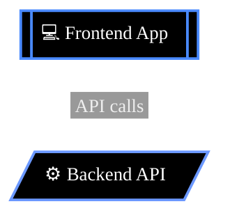

## High Contrast Theme

```mermaid
---
config:
  theme: base
  themeVariables:
    fontFamily: -apple-system, BlinkMacSystemFont, 'Segoe WPC', 'Segoe UI', system-ui, 'Ubuntu', sans-serif
    darkMode: true
    fontSize: 14px
    edgeLabelBackground: '#353535'
    lineColor: '#ffffff'
---
%%{init: {"flowchart": {"htmlLabels": false}}}%%
flowchart TB
classDef boundary fill:#1e1e1e,stroke:#9cb4ff,stroke-dasharray: 5 4,stroke-width:2px,color:#ffffff;
classDef node fill:#000000,stroke:#007dff,stroke-width:2px,color:#ffffff;
classDef iface fill:#0f111c,stroke:#8a8b91,stroke-width:2px,font-size:10px,color:#ffffff;
classDef highlight fill:#2f2719,stroke:#f0c060,stroke-width:2px,color:#ffffff;
classDef actor fill:#000000,stroke:#007dff,stroke-width:2px,color:#ffffff;
classDef database fill:#000000,stroke:#85a6ff,stroke-width:2px,color:#ffffff;
classDef webclient fill:#000000,stroke:#4a8aff,stroke-width:2px,color:#ffffff;
classDef service fill:#000000,stroke:#6b98ff,stroke-width:2px,color:#ffffff;
classDef messagebus fill:#000000,stroke:#6b98ff,stroke-width:2px,color:#ffffff;
classDef system fill:#000000,stroke:#9cb4ff,stroke-width:2px,color:#ffffff;


    backend[/"⚙️ Backend API"/]:::service
    frontend[[💻 Frontend App]]:::webclient

    frontend -->|API calls| backend


```
