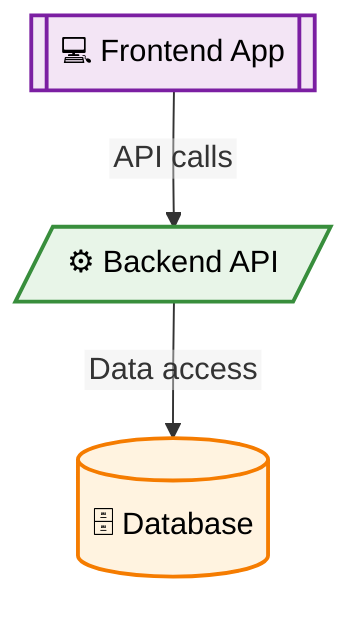

## Light Theme (Default)

```mermaid
%%{init: {"flowchart": {"htmlLabels": false}}}%%
flowchart TB
classDef boundary fill:#f8fafc,stroke:#64748b,stroke-dasharray: 5 4,stroke-width:2px,color:#000;
classDef node fill:#ffffff,stroke:#1f2937,stroke-width:1px,color:#000;
classDef iface fill:#f1f5f9,stroke:#64748b,stroke-width:1px,font-size:10px,color:#000;
classDef highlight fill:#fef3c7,stroke:#f59e0b,stroke-width:2px,color:#000;
classDef actor fill:#e3f2fd,stroke:#1976d2,stroke-width:2px,color:#000;
classDef database fill:#fff3e0,stroke:#f57c00,stroke-width:2px,color:#000;
classDef webclient fill:#f3e5f5,stroke:#7b1fa2,stroke-width:2px,color:#000;
classDef service fill:#e8f5e8,stroke:#388e3c,stroke-width:2px,color:#000;
classDef messagebus fill:#fce4ec,stroke:#c2185b,stroke-width:2px,color:#000;
classDef system fill:#fff8e1,stroke:#f9a825,stroke-width:2px,color:#000;


    backend[/"⚙️ Backend API"/]:::service
    db[(🗄️ Database)]:::database
    frontend[[💻 Frontend App]]:::webclient

    frontend -->|API calls| backend
    backend -->|Data access| db


```

## Light Theme (Explicit)

```mermaid
%%{init: {"flowchart": {"htmlLabels": false}}}%%
flowchart TB
classDef boundary fill:#f8fafc,stroke:#64748b,stroke-dasharray: 5 4,stroke-width:2px,color:#000;
classDef node fill:#ffffff,stroke:#1f2937,stroke-width:1px,color:#000;
classDef iface fill:#f1f5f9,stroke:#64748b,stroke-width:1px,font-size:10px,color:#000;
classDef highlight fill:#fef3c7,stroke:#f59e0b,stroke-width:2px,color:#000;
classDef actor fill:#e3f2fd,stroke:#1976d2,stroke-width:2px,color:#000;
classDef database fill:#fff3e0,stroke:#f57c00,stroke-width:2px,color:#000;
classDef webclient fill:#f3e5f5,stroke:#7b1fa2,stroke-width:2px,color:#000;
classDef service fill:#e8f5e8,stroke:#388e3c,stroke-width:2px,color:#000;
classDef messagebus fill:#fce4ec,stroke:#c2185b,stroke-width:2px,color:#000;
classDef system fill:#fff8e1,stroke:#f9a825,stroke-width:2px,color:#000;


    backend[/"⚙️ Backend API"/]:::service
    db[(🗄️ Database)]:::database
    frontend[[💻 Frontend App]]:::webclient

    frontend -->|API calls| backend
    backend -->|Data access| db


```
