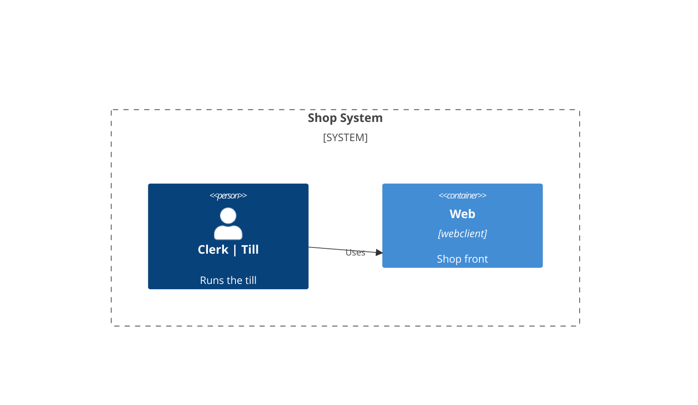

```mermaid
C4Container
    System_Boundary(shop, "Shop System") {
        Person(clerk, "Clerk | Till", "Runs the till")
        Container(web, "Web", "webclient", "Shop front")
    }
    Rel(clerk, web, "Uses")
```

| Element | Conflict |
| --- | --- |
| Clerk \| Till | A person inside software-system "Shop System" |
