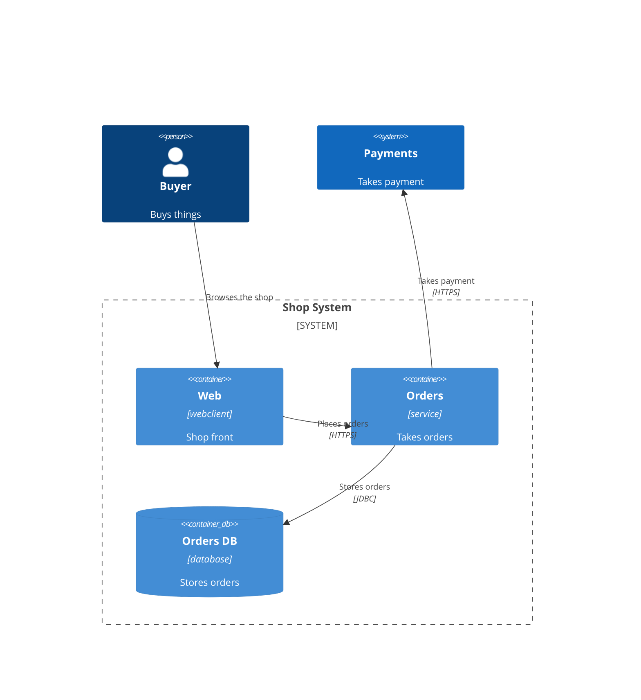

```mermaid
C4Container
    System_Boundary(shop, "Shop System") {
        Container(web, "Web", "webclient", "Shop front")
        Container(orders, "Orders", "service", "Takes orders")
        ContainerDb(orders_db, "Orders DB", "database", "Stores orders")
    }
    Person(buyer, "Buyer", "Buys things")
    System(payments, "Payments", "Takes payment")
    Rel(buyer, web, "Browses the shop")
    Rel(web, orders, "Places orders", "HTTPS")
    Rel(orders, orders_db, "Stores orders", "JDBC")
    Rel(orders, payments, "Takes payment", "HTTPS")
```