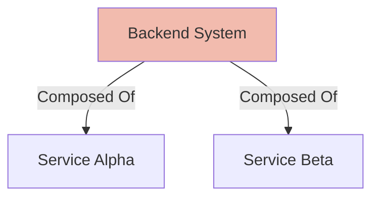

```mermaid
graph TD;
system-c[Backend System]:::highlight;
system-c[Backend System] -- Composed Of --> svc-a[Service Alpha];
system-c[Backend System] -- Composed Of --> svc-b[Service Beta];
classDef highlight fill:#f2bbae;
```
