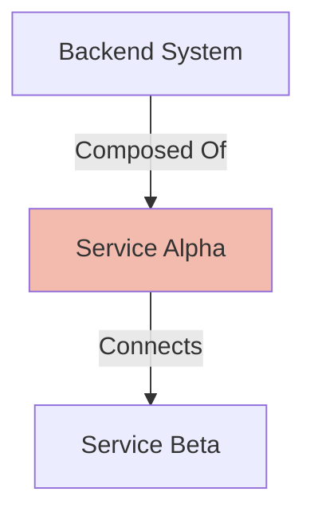

```mermaid
graph TD;
svc-a[Service Alpha]:::highlight;
svc-a[Service Alpha] -- Connects --> svc-b[Service Beta];
system-c[Backend System] -- Composed Of --> svc-a[Service Alpha];
classDef highlight fill:#f2bbae;
```
