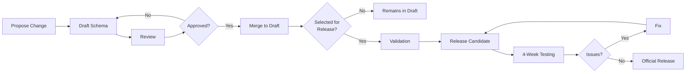

# Common Architecture Language Model

The Common Architecture Language Model (CALM) is a specification for defining system architectures in a machine and human-readable format.

The intention of CALM is to enable a common language for describing system architectures, and to enable tooling to support the creation, validation, and visualization of architectures.

CALM is being developed by the [Architecture as Code Community](https://devops.finos.org/docs/working-groups/aasc/).

## Schema Governance

The CALM JSON Meta Schema is governed through a structured process to ensure stability, transparency, and compatibility with CALM tooling.

**Key Steps:**
1. **Propose** - Create issue with schema change proposal
2. **Draft** - Implement in `calm/draft/#issue-number` with prototype examples
3. **Review** - Get approval from [`calm-schema-governance`](https://github.com/orgs/finos/teams/calm-schema-governance) team
4. **Validate** - Test with CALM tools when selected for release
5. **Release** - After successful testing period, publish official release

### Change Management Process

#### Drafting New Schema Changes
- Proposed schema changes are made in the `calm/draft/#issue-number` folder
- Changes to draft schemas are allowed without restrictions to encourage iteration
- Examples demonstrating the changes should be provided in the `calm/draft/#issue-number/prototype` folder

#### Change Proposals & Discussion
- Schema changes should be proposed via GitHub Issues and Pull Requests
- Schema changes should use the [Schema Change Proposal template](https://github.com/finos/architecture-as-code/issues/new?template=Schema_change_proposal.md)

#### Review & Approval
- Each PR requires review and approval by at least one member of the [`calm-schema-governance`](https://github.com/orgs/finos/teams/calm-schema-governance) group
- Acceptance as a draft is not a guarantee that it will be incorporated into the schema

### Release Process

#### Minor & Major Version Adoption
- Minor and major version releases can be proposed at any time by the [`calm-schema-governance`](https://github.com/orgs/finos/teams/calm-schema-governance) group
- Selected drafts undergo full validation including schema linting, compatibility testing, and backward-compatibility checks

#### Release Candidate Process
- Once validated, a Release Candidate (RC) is published in a dedicated `releases/` folder
- The community tests the RC for four weeks before finalization
- If no major issues are found, the RC is promoted to an official release

#### Final Release & Versioning
- Minor releases include backward-compatible improvements
- Major releases introduce breaking changes and require migration guides
- Each release is tagged and published in the `releases/` directory

### Tooling Integration & Testing
- Before finalizing a schema release, it must pass tests against CALM CLI and CALM Hub
- Maintainers ensure all tools are updated and compatible before the release date

### Governance Roles
- **[Calm-Schema-Governance](https://github.com/orgs/finos/teams/calm-schema-governance)**: Approve schema changes, ensure consistency, enforce governance
- **Tooling Maintainers**: Validate compatibility with CLI and CALM Hub UI
- **Community Contributors**: Propose, discuss, and review schema updates

### Communication & Transparency
- All changes are tracked in GitHub issues
- Schema changes are discussed in the FINOS Architecture as Code working group
- Each release includes a changelog documenting changes and migration steps

For more detailed information on the governance process, see [GitHub issue #893](https://github.com/finos/architecture-as-code/issues/893).

