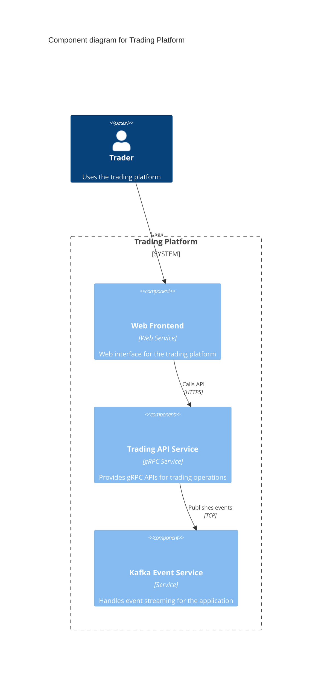

# User Extensible Interfaces for CALM

## Overview

This draft proposal introduces a modular interface model to CALM, allowing interfaces to be defined external to the core schema. This enables domain-specific interfaces to be created without modifying the CALM meta-schema.

## Motivation

Interfaces in CALM were previously statically defined within the CALM meta-schema (`interface.json`), creating a tight coupling between the core schema and specific interface definitions. This design limited extensibility and required core schema changes to introduce new types of interfaces.

By introducing a modular interface model, similar to `control-requirement`, we enable:

1. Domain-specific interfaces (e.g., Kafka, MQTT, gRPC) to be defined without modifying the CALM core schema
2. Independent versioning of interface types
3. Validation of inline interface configurations against extensible schemas
4. Reduced maintenance burden on the CALM core schema

## Schema Changes

### interface.json

Added a new `interface-definition` structure that includes:

- `unique-id`: A unique identifier for the interface instance
- `interface-definition-url`: A URI pointing to the external JSON Schema that defines the interface-type
- `configuration`: An inline object that conforms to the external schema

### core.json

Modified the `interfaces` array in node properties to use `anyOf` allowing either:

- Legacy `interface-type` definitions (backward compatibility)
- New `interface-definition` references to external schemas

## Example Architecture

The following C4 diagram represents the example architecture defined in `example-architecture.json`:



This diagram shows the three components defined in our example and their relationships, including interface details.

## External Interface Schemas

Introduced two example interface schemas in the prototype folder:

1. **Kafka Topic Interface** - Defines properties for Kafka topic connections
2. **gRPC Service Interface** - Defines properties for gRPC service endpoints

## Migration Guide

### For Existing CALM Models

Existing CALM models using the legacy `interface-type` references will continue to work without changes. The schema changes are backward compatible.

### For New CALM Models

New interfaces can be defined in one of two ways:

1. **Legacy Method** - Continue using the predefined interface types

```json
{
  "unique-id": "int-http-001",
  "hostname": "trading.example.com"
}
```

2. **New Method** - Reference external interface schemas

```json
{
  "unique-id": "int-kafka-001",
  "interface-definition-url": "https://calm.finos.org/draft/1083/interfaces/kafka-topic",
  "configuration": {
    "topic": "trade-events",
    "host": "kafka.internal.local",
    "port": 9092
  }
}
```

## Tooling Considerations

Tools that process CALM schemas need to be updated to:

1. Resolve and fetch external interface schemas referenced by `interface-definition-url`
2. Validate the `configuration` object against the resolved schema
3. Support both legacy and new interface formats

## Future Considerations

- A registry of commonly used interface schemas could be established
- Tooling to generate interface schemas from other formats (e.g., OpenAPI, Protocol Buffers)
- Future CALM versions may deprecate the legacy `interface-type` in favor of `interface-definition`