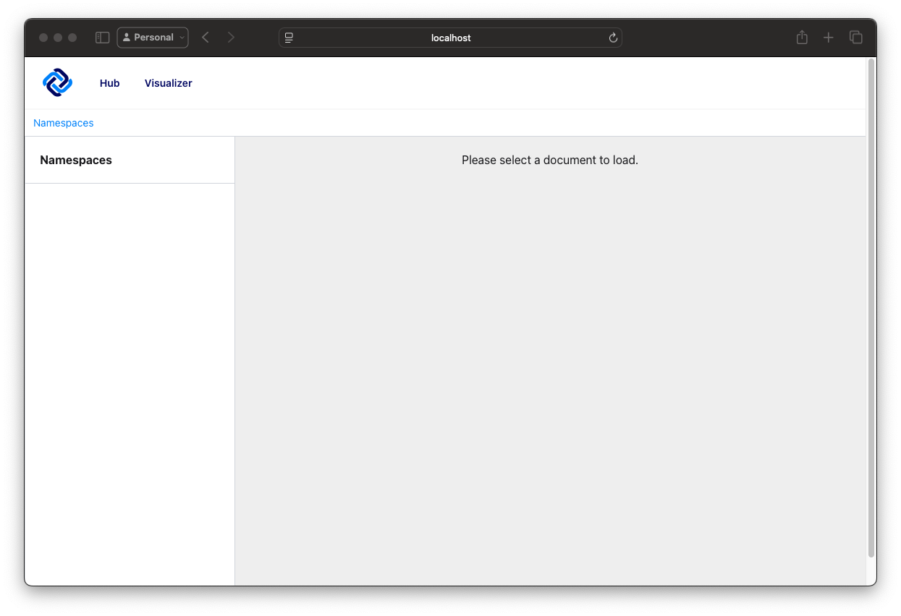
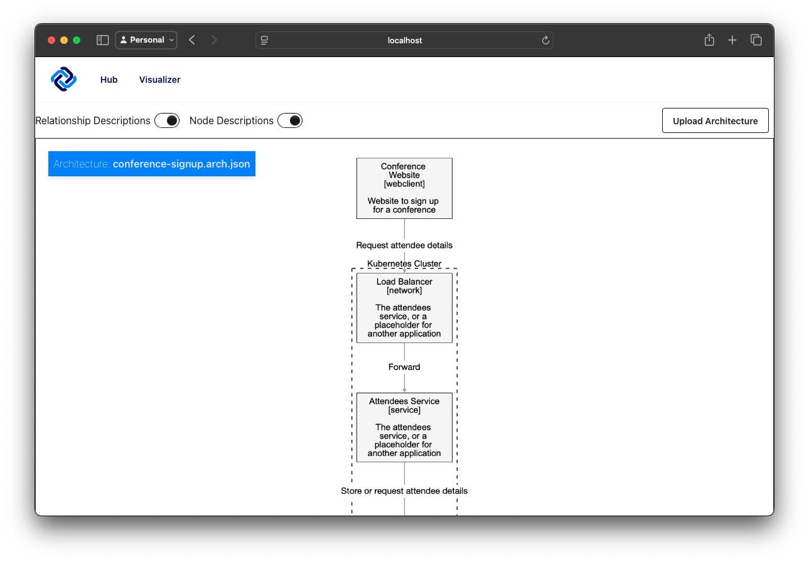
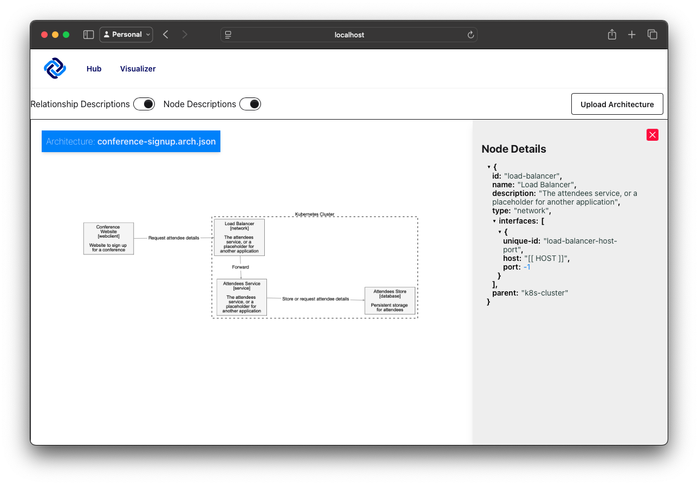
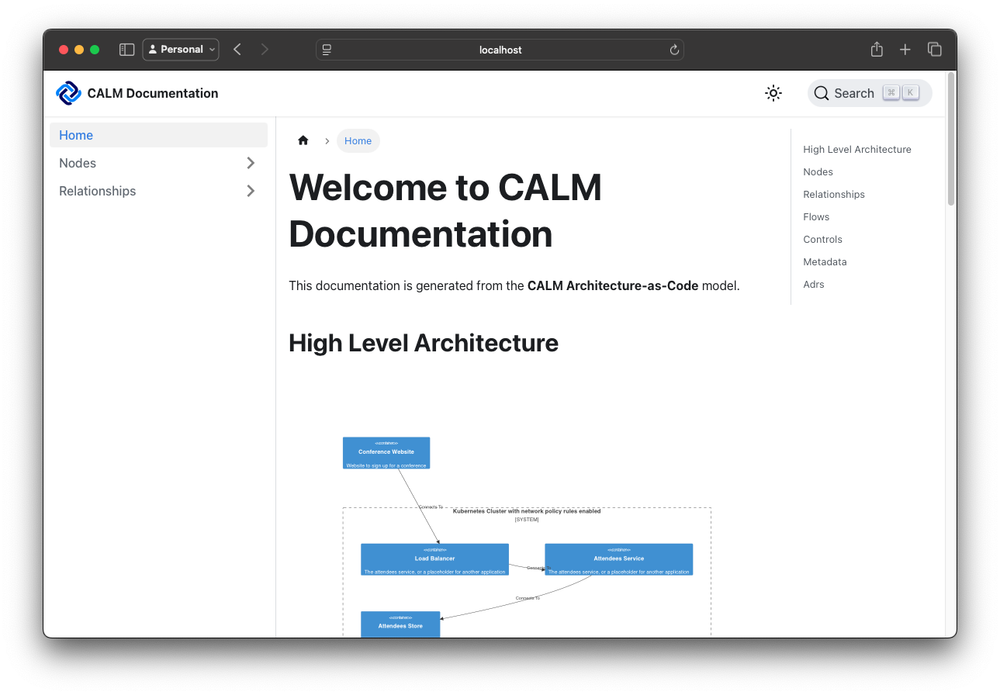
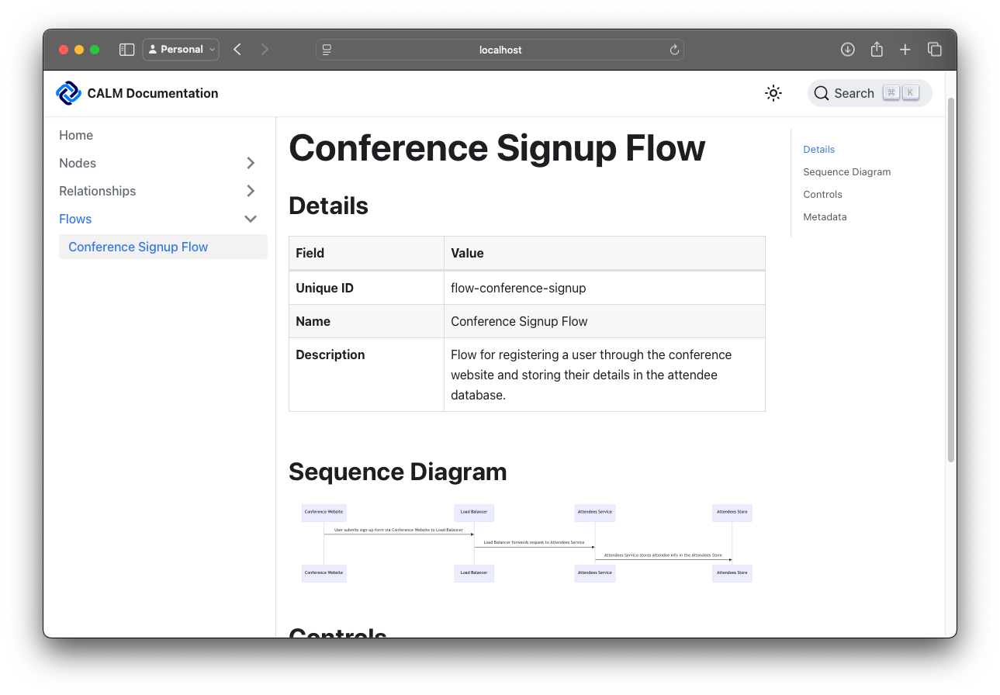

# CALM: Get Started in 5 Minutes

This demo showcases the **CALM** approach in action. Designed to help you get started with CALM in just 5 minutes.

## 💡 What You'll Learn

- Run CALM Hub locally
- Install the CALM CLI
- Generate a concrete architecture from a pattern
- Visualise your architecture using CALM Hub
- Docify Your Architecture

## ⚙ Prerequisites

* Java 21 or higher
* Maven 3.8.6 or higher
* Node.js 20 or higher
* NPM
* Have a clone of the [architecture-as-code repository](https://github.com/finos/architecture-as-code)

All commands in this guide are run from the `root` directory of the clone.

To start lets build all the projects in the repository.

```shell
./mvnw clean install
```

Assuming all went well, you will see a message like this:

```
[INFO] ------------------------------------------------------------------------
[INFO] Reactor Summary:
[INFO] 
[INFO] parent 1.0.0-SNAPSHOT .............................. SUCCESS [  0.278 s]
[INFO] calm-hub 0.7.6 ..................................... SUCCESS [02:37 min]
[INFO] cli 1.0.0-SNAPSHOT ................................. SUCCESS [  0.021 s]
[INFO] calm 1.0.0-SNAPSHOT ................................ SUCCESS [  0.016 s]
[INFO] docs 1.0.0-SNAPSHOT ................................ SUCCESS [  0.016 s]
[INFO] shared 1.0.0-SNAPSHOT .............................. SUCCESS [  0.019 s]
[INFO] ------------------------------------------------------------------------
[INFO] BUILD SUCCESS
[INFO] ------------------------------------------------------------------------
[INFO] Total time:  02:40 min
[INFO] Finished at: 2025-08-21T13:24:41+01:00
[INFO] ------------------------------------------------------------------------
```

## 💾 Running CALM Hub Locally

To start CALM Hub locally in standalone mode, run the following:

```shell
./mvnw -pl calm-hub quarkus:dev -Dcalm.database.mode=standalone
```

You should see output indicating that the application has started successfully, including a message like:

```
Listening for transport dt_socket at address: 5005
__  ____  __  _____   ___  __ ____  ______
 --/ __ \/ / / / _ | / _ \/ //_/ / / / __/
 -/ /_/ / /_/ / __ |/ , _/ ,< / /_/ /\ \
--\___\_\____/_/ |_/_/|_/_/|_|\____/___/
2025-08-21 14:19:52,408 INFO  [io.quarkus] (Quarkus Main Thread) calm-hub 0.7.6 on JVM (powered by Quarkus 3.23.0) started in 1.690s. Listening on: http://localhost:8080
2025-08-21 14:19:52,411 INFO  [io.quarkus] (Quarkus Main Thread) Profile dev activated. Live Coding activated.
2025-08-21 14:19:52,411 INFO  [io.quarkus] (Quarkus Main Thread) Installed features: [cdi, compose, hibernate-validator, mongodb-client, oidc, resteasy, resteasy-jsonb, security, smallrye-context-propagation, smallrye-openapi, swagger-ui, vertx]

--
Tests paused
Press [e] to edit command line args (currently ''), [r] to resume testing, [o] Toggle test output, [:] for the terminal, [h] for more options>
```

Open a browser and navigate to http://localhost:8080 to access the CALM Hub UI. You should see the CALM Hub interface,
ready for use like below.

Great, you now have a local instance of CALM Hub running!

## 📦 How to install the CALM CLI

The CALM CLI is a command-line tool that allows you to interact with CALM documents. To install the CLI, run the
following command:

```shell
npm install -g @finos/calm-cli
```

Verify the installation.

```shell
calm --version
```

This getting started has been verified to work against 1.0.0 of the cli.

---

## 🛠️ How to generate a concrete architecture instantiation from a pattern

Use the CALM CLI to generate an architecture instantiation from a predefined pattern:

```shell
calm generate \
  --pattern ./calm/getting-started/conference-signup.pattern.json \
  --output ./calm/getting-started/conference-signup.arch.json
```

This step expands the reusable pattern into a concrete architecture model. You should see output like this:

```
info [file-system-document-loader]:     ./calm/getting-started/conference-signup.pattern.json exists, loading as file...
info [calm-generate]:     Generating a CALM architecture...
info [calm-generate]:     Successfully generated architecture to [./calm/getting-started/conference-signup.arch.json]
---
```

Now that we have an architecture, we can vaidate it against the pattern schema to ensure it is valid. Run the following
command:

```shell
calm validate \
  --pattern ./calm/getting-started/conference-signup.pattern.json \
  --architecture ./calm/getting-started/conference-signup.arch.json
```

You should see output like this:

```
info [file-system-document-loader]:     ./calm/getting-started/conference-signup.arch.json exists, loading as file...
info [file-system-document-loader]:     ./calm/getting-started/conference-signup.pattern.json exists, loading as file...
info [calm-validate]:     Formatting output as json
{
    "jsonSchemaValidationOutputs": [],
    "spectralSchemaValidationOutputs": [
        {
            "code": "architecture-has-no-placeholder-properties-string",
            "severity": "warning",
            "message": "String placeholder detected in architecture.",
            "path": "/nodes/0/interfaces/0/url",
            "schemaPath": "",
            "line_start": 0,
            "line_end": 0,
            "character_start": 206,
            "character_end": 217
        },
        {
            "code": "architecture-has-no-placeholder-properties-string",
            "severity": "warning",
            "message": "String placeholder detected in architecture.",
            "path": "/nodes/1/interfaces/0/host",
            "schemaPath": "",
            "line_start": 0,
            "line_end": 0,
            "character_start": 435,
            "character_end": 447
        },
        {
            "code": "architecture-has-no-placeholder-properties-numerical",
            "severity": "warning",
            "message": "Numerical placeholder (-1) detected in architecture.",
            "path": "/nodes/1/interfaces/0/port",
            "schemaPath": "",
            "line_start": 0,
            "line_end": 0,
            "character_start": 455,
            "character_end": 457
        },
        {
            "code": "architecture-has-no-placeholder-properties-string",
            "severity": "warning",
            "message": "String placeholder detected in architecture.",
            "path": "/nodes/2/interfaces/0/image",
            "schemaPath": "",
            "line_start": 0,
            "line_end": 0,
            "character_start": 668,
            "character_end": 681
        },
        {
            "code": "architecture-has-no-placeholder-properties-numerical",
            "severity": "warning",
            "message": "Numerical placeholder (-1) detected in architecture.",
            "path": "/nodes/2/interfaces/1/port",
            "schemaPath": "",
            "line_start": 0,
            "line_end": 0,
            "character_start": 720,
            "character_end": 722
        },
        {
            "code": "architecture-has-no-placeholder-properties-string",
            "severity": "warning",
            "message": "String placeholder detected in architecture.",
            "path": "/nodes/3/interfaces/0/image",
            "schemaPath": "",
            "line_start": 0,
            "line_end": 0,
            "character_start": 906,
            "character_end": 919
        },
        {
            "code": "architecture-has-no-placeholder-properties-numerical",
            "severity": "warning",
            "message": "Numerical placeholder (-1) detected in architecture.",
            "path": "/nodes/3/interfaces/1/port",
            "schemaPath": "",
            "line_start": 0,
            "line_end": 0,
            "character_start": 957,
            "character_end": 959
        }
    ],
    "hasErrors": false,
    "hasWarnings": true
}
```

In this case the warnings are related to placeholder values in the architecture, which is expected since we used a
pattern with placeholders and haven't replaced them with real values. You can safely ignore these warnings for now.

## 💻 How to visualise your architecture using CALM Hub

Looking at JSON is never easy, wouldn't it be great if we could visualise your architecture? Let's head back to CALM Hub
and navigate to the Visualizer tab.

Click on the `Upload Architecture` button and select the `conference-signup.arch.json` file you just generated.
You should see your architecture visualised like below.

You can now drag around the boxes to rearrange them, zoom in and out, and click on the boxes to see more details about
each component.

CALM Hub is a bit like Maven Central or NPM for your architecture documents, to learn more about developing CALM Hub,
check out the [CALM Hub README](https://github.com/finos/architecture-as-code/tree/main/calm-hub)

## 📖 How to docify your architecture

CALM Hub is a great tool for visualising your architecture, but sometimes you want to generate documentation that you
can share with others. For this, we can use the `docify` command from the CALM CLI.
To generate documentation from your architecture, run the following command:

```shell
calm docify \
  --architecture ./calm/getting-started/conference-signup.arch.json \
  --output ./calm/getting-started/website
```

You'll see output like this:

```
info [_TemplateProcessor]:     Using TemplateBundleFileLoader for bundle
info [_TemplateBundleFileLoader]:     📥 Loading index.json from /home/mark/.nvm/versions/node/v22.17.0/lib/node_modules/@finos/calm-cli/dist/template-bundles/docusaurus/index.json
info [_TemplateBundleFileLoader]:     ✅ Successfully loaded template bundle: docusaurus-docs
info [_TemplateBundleFileLoader]:     📂 Loading template files from: /home/mark/.nvm/versions/node/v22.17.0/lib/node_modules/@finos/calm-cli/dist/template-bundles/docusaurus
info [_TemplateBundleFileLoader]:     🎯 Total Templates Loaded: 21
info [_TemplateProcessor]:     📂 Creating output directory: /home/mark/architecture-as-code/calm/getting-started/website
info [_TemplateProcessor]:     🔍 Loading transformer as JavaScript: /home/mark/.nvm/versions/node/v22.17.0/lib/node_modules/@finos/calm-cli/dist/template-bundles/docusaurus/docusaurus-transformer.js
info [_HttpReferenceResolver]:     Fetching reference via HTTP: https://calm.finos.org/getting-started/controls/micro-segmentation.requirement.json
info [_HttpReferenceResolver]:     Fetching reference via HTTP: https://calm.finos.org/getting-started/controls/micro-segmentation.config.json
info [_HttpReferenceResolver]:     Fetching reference via HTTP: https://calm.finos.org/getting-started/controls/permitted-connection.requirement.json
info [_HttpReferenceResolver]:     Fetching reference via HTTP: https://calm.finos.org/getting-started/controls/permitted-connection.requirement.json
info [_HttpReferenceResolver]:     Fetching reference via HTTP: https://calm.finos.org/getting-started/controls/permitted-connection.requirement.json
info [_HttpReferenceResolver]:     Fetching reference via HTTP: https://calm.finos.org/getting-started/controls/permitted-connection-http.config.json
info [_HttpReferenceResolver]:     Fetching reference via HTTP: https://calm.finos.org/getting-started/controls/permitted-connection-http.config.json
info [_HttpReferenceResolver]:     Fetching reference via HTTP: https://calm.finos.org/getting-started/controls/permitted-connection-jdbc.config.json
info [_TemplateEngine]:     ✅ Compiled 21 Templates
info [_TemplateEngine]:     🔧 Registering Handlebars Helpers...
info [_TemplateEngine]:     ✅ Registered helper: eq
info [_TemplateEngine]:     ✅ Registered helper: lookup
info [_TemplateEngine]:     ✅ Registered helper: json
info [_TemplateEngine]:     ✅ Registered helper: instanceOf
info [_TemplateEngine]:     ✅ Registered helper: kebabToTitleCase
info [_TemplateEngine]:     ✅ Registered helper: kebabCase
info [_TemplateEngine]:     ✅ Registered helper: isObject
info [_TemplateEngine]:     ✅ Registered helper: isArray
info [_TemplateEngine]:     ✅ Registered helper: notEmpty
info [_TemplateEngine]:     ✅ Registered helper: or
info [_TemplateEngine]:     ✅ Registered helper: eachInMap
info [_TemplateEngine]:     
🔹 Starting Template Generation...
info [_TemplateEngine]:     ✅ Registering partial template: controls.hbs
info [_TemplateEngine]:     ✅ Registering partial template: relationships.hbs
info [_TemplateEngine]:     ✅ Registering partial template: table-template.html
info [_TemplateEngine]:     ✅ Registering partial template: row-template.html
info [_TemplateEngine]:     ✅ Registering partial template: metadata.hbs
info [_TemplateEngine]:     ✅ Generated: /home/mark/architecture-as-code/calm/getting-started/website/docs/nodes/conference-website.md
info [_TemplateEngine]:     ✅ Generated: /home/mark/architecture-as-code/calm/getting-started/website/docs/nodes/load-balancer.md
info [_TemplateEngine]:     ✅ Generated: /home/mark/architecture-as-code/calm/getting-started/website/docs/nodes/attendees.md
info [_TemplateEngine]:     ✅ Generated: /home/mark/architecture-as-code/calm/getting-started/website/docs/nodes/attendees-store.md
info [_TemplateEngine]:     ✅ Generated: /home/mark/architecture-as-code/calm/getting-started/website/docs/nodes/k8s-cluster.md
info [_TemplateEngine]:     ✅ Registering partial template: controls.hbs
info [_TemplateEngine]:     ✅ Registering partial template: relationships.hbs
info [_TemplateEngine]:     ✅ Registering partial template: table-template.html
info [_TemplateEngine]:     ✅ Registering partial template: row-template.html
info [_TemplateEngine]:     ✅ Registering partial template: metadata.hbs
info [_TemplateEngine]:     ✅ Generated: /home/mark/architecture-as-code/calm/getting-started/website/docs/relationships/conference-website-load-balancer.md
info [_TemplateEngine]:     ✅ Generated: /home/mark/architecture-as-code/calm/getting-started/website/docs/relationships/load-balancer-attendees.md
info [_TemplateEngine]:     ✅ Generated: /home/mark/architecture-as-code/calm/getting-started/website/docs/relationships/attendees-attendees-store.md
info [_TemplateEngine]:     ✅ Generated: /home/mark/architecture-as-code/calm/getting-started/website/docs/relationships/deployed-in-k8s-cluster.md
info [_TemplateEngine]:     ✅ Generated: /home/mark/architecture-as-code/calm/getting-started/website/sidebars.js
info [_TemplateEngine]:     ✅ Generated: /home/mark/architecture-as-code/calm/getting-started/website/docusaurus.config.js
info [_TemplateEngine]:     ✅ Generated: /home/mark/architecture-as-code/calm/getting-started/website/static/img/2025_CALM_Icon.svg
info [_TemplateEngine]:     ✅ Generated: /home/mark/architecture-as-code/calm/getting-started/website/src/remark/remark-replace-links.js
info [_TemplateEngine]:     ✅ Generated: /home/mark/architecture-as-code/calm/getting-started/website/static/css/custom.css
info [_TemplateEngine]:     ✅ Registering partial template: c4-container.hbs
info [_TemplateEngine]:     ✅ Registering partial template: table-template.html
info [_TemplateEngine]:     ✅ Registering partial template: metadata.hbs
info [_TemplateEngine]:     ✅ Generated: /home/mark/architecture-as-code/calm/getting-started/website/docs/index.md
info [_TemplateEngine]:     ✅ Generated: /home/mark/architecture-as-code/calm/getting-started/website/package.json
info [_TemplateEngine]:     ✅ Generated: /home/mark/architecture-as-code/calm/getting-started/website/docs/controls/security-001.md
info [_TemplateEngine]:     ✅ Generated: /home/mark/architecture-as-code/calm/getting-started/website/docs/controls/security-002.md
info [_TemplateEngine]:     ✅ Generated: /home/mark/architecture-as-code/calm/getting-started/website/docs/controls/security-002.md
info [_TemplateEngine]:     ✅ Generated: /home/mark/architecture-as-code/calm/getting-started/website/docs/controls/security-003.md
info [_TemplateEngine]:     ✅ Generated: /home/mark/architecture-as-code/calm/getting-started/website/docs/control-requirements/micro-segmentation.requirement.json.md
info [_TemplateEngine]:     ✅ Generated: /home/mark/architecture-as-code/calm/getting-started/website/docs/control-requirements/permitted-connection.requirement.json.md
info [_TemplateEngine]:     ✅ Generated: /home/mark/architecture-as-code/calm/getting-started/website/docs/control-requirements/permitted-connection.requirement.json.md
info [_TemplateEngine]:     ✅ Generated: /home/mark/architecture-as-code/calm/getting-started/website/docs/control-requirements/permitted-connection.requirement.json.md
info [_TemplateEngine]:     ✅ Registering partial template: controls.hbs
info [_TemplateEngine]:     ✅ Registering partial template: flow-sequence.hbs
info [_TemplateEngine]:     ✅ Registering partial template: table-template.html
info [_TemplateEngine]:     ✅ Registering partial template: row-template.html
warn [_TemplateEngine]:     ⚠️ Expected array for repeated output, but found non-array for flow.mdx.hbs
info [_TemplateEngine]:     
✅ Template Generation Completed!
info [_TemplateProcessor]:     
✅ Template Generation Completed!
```

Now let's run up our documentation website.

```shell
npm install --prefix ./calm/getting-started/website 
npm start --prefix ./calm/getting-started/website
```

Give it a few seconds to start up, and then open your browser to http://localhost:3000. You should see the documentation
website with your architecture visualised like below.


## 🌐 Capturing business flows
You now have a fully functional documentation website for your architecture, generated from CALM. This shows you your logical architecture and the non-functional requirements, modelling in CALM by the Controls. But systems have business flows which inform the requirements, how can we capture those?

Let's take a look at the architecture file which you generated. Open it in your favourite editor, and with the top level sections collapsed, you should see the following:

```json
{
  "$schema": "https://calm.finos.org/getting-started/conference-signup.pattern.json"
  "nodes": [
  ],
  "relationships": [
  ],
  "metadata": [
  ]
}
```
Add a new array called `flows` with a single flow in, we've provided you with it below to copy and paste into your architecture:
```json
{
  "$schema": "https://calm.finos.org/getting-started/conference-signup.pattern.json"
  "nodes": [
  ],
  "relationships": [
  ],
  "metadata": [
  ],
  "flows": [
    {
      "$schema": "https://calm.finos.org/release/1.0-rc1/meta/flow.json",
      "$id": "https://calm.finos.org/getting-started/flows/conference-signup.flow.json",
      "unique-id": "flow-conference-signup",
      "name": "Conference Signup Flow",
      "description": "Flow for registering a user through the conference website and storing their details in the attendee database.",
      "transitions": [
        {
          "relationship-unique-id": "conference-website-load-balancer",
          "sequence-number": 1,
          "summary": "User submits sign-up form via Conference Website to Load Balancer"
        },
        {
          "relationship-unique-id": "load-balancer-attendees",
          "sequence-number": 2,
          "summary": "Load Balancer forwards request to Attendees Service"
        },
        {
          "relationship-unique-id": "attendees-attendees-store",
          "sequence-number": 3,
          "summary": "Attendees Service stores attendee info in the Attendees Store"
        }
      ]
    }
  ]
}
```
Save the file and then run the `docify` command again to regenerate the documentation:

```shell
calm docify \
  --architecture ./calm/getting-started/conference-signup.arch.json \
  --output ./calm/getting-started/website
```


Congratulations! You have now:
- Installed and run CALM Hub locally
- Installed the CALM CLI
- Generated a concrete architecture from a pattern
- Visualised your architecture using CALM Hub
- Docified your architecture
- Captured business flows in your architecture
- Generated documentation for your architecture including business flows

## 🎉 Get Involved!
If you found this demo useful, please consider contributing to the CALM project. 
