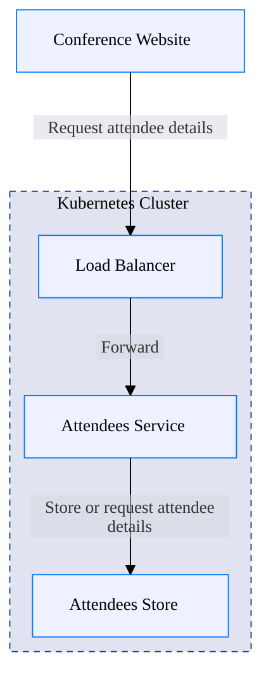

# Welcome to CALM Documentation

This documentation is generated from the **CALM Architecture-as-Code** model.

## High Level Architecture

## Nodes
- [Conference Website](nodes/conference-website)
- [Load Balancer](nodes/load-balancer)
- [Attendees Service](nodes/attendees)
- [Attendees Store](nodes/attendees-store)
- [Kubernetes Cluster](nodes/k8s-cluster)

## Relationships
- [Conference Website Load Balancer](relationships/conference-website-load-balancer)
- [Load Balancer Attendees](relationships/load-balancer-attendees)
- [Attendees Attendees Store](relationships/attendees-attendees-store)
- [Deployed In K8s Cluster](relationships/deployed-in-k8s-cluster)

## Flows
_No flows defined._

## Metadata

    <table>
        <thead>
        <tr>
            <th>Key</th>
            <th>Value</th>
        </tr>
        </thead>
        <tbody>
        <tr>
            <th>Kubernetes</th>
            <td>
                <table class="nested-table">
                        <tbody>
                        <tr>
                            <td><b>Namespace</b></td>
                            <td>
                                conference
                                    </td>
                        </tr>
                        </tbody>
                    </table>        </td>
        </tr>
        </tbody>
    </table>

## ADRs
_No ADRs defined._
