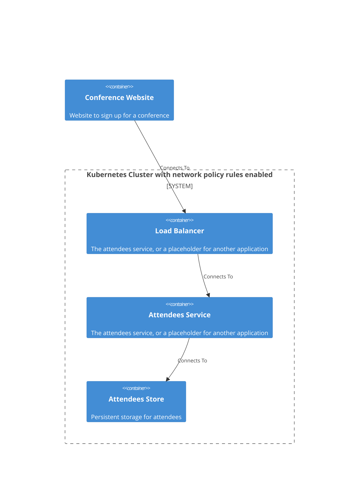

# Welcome to CALM Documentation

This documentation is generated from the **CALM Architecture-as-Code** model.

## High Level Architecture

## Nodes
    - [Conference Website](nodes/conference-website)
    - [Load Balancer](nodes/load-balancer)
    - [Attendees Service](nodes/attendees)
    - [Attendees Store](nodes/attendees-store)
    - [Kubernetes Cluster](nodes/k8s-cluster)

## Relationships
    - [Conference Website Load Balancer](relationships/conference-website-load-balancer)
    - [Load Balancer Attendees](relationships/load-balancer-attendees)
    - [Attendees Attendees Store](relationships/attendees-attendees-store)
    - [Deployed In K8s Cluster](relationships/deployed-in-k8s-cluster)

## Flows
     _No flows defined._

## Controls
| ID    | Name             | Description                  | Domain    | Scope        | Applied To                |
|-------|------------------|------------------------------|-----------|--------------|---------------------------|
|security-001|Micro-segmentation of Kubernetes Cluster|Micro-segmentation in place to prevent lateral movement outside of permitted flows|security|Node|k8s-cluster|
|security-002|Permitted Connection|Permits a connection on a relationship specified in the architecture|security|Relationship|conference-website-load-balancer|
|security-002|Permitted Connection|Permits a connection on a relationship specified in the architecture|security|Relationship|load-balancer-attendees|
|security-003|Permitted Connection|Permits a connection on a relationship specified in the architecture|security|Relationship|attendees-attendees-store|

## Metadata
  

      <table>
          <thead>
          <tr>
              <th>Key</th>
              <th>Value</th>
          </tr>
          </thead>
          <tbody>
          <tr>
              <td>
                  <b>Kubernetes</b>
              </td>
              <td>
                  

                      <table>
                          <thead>
                          <tr>
                              <th>Key</th>
                              <th>Value</th>
                          </tr>
                          </thead>
                          <tbody>
                          <tr>
                              <td>
                                  <b>Namespace</b>
                              </td>
                              <td>
                                  conference
                                      </td>
                          </tr>
                          </tbody>
                      </table>
                  

              </td>
          </tr>
          </tbody>
      </table>
  

## Adrs
  _No Adrs defined._
