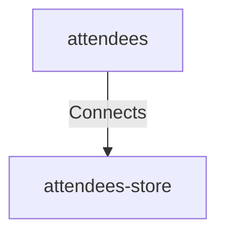

## Details

| Field               | Value                    |
|---------------------|--------------------------|
| **Unique ID**       | attendees-attendees-store                   |
| **Description**      |  Store or request attendee details   |

## Related Nodes

## Controls

        ### Security

        Security Controls for the connection

            

                <table>
                    <thead>
                    <tr>
                        <th>Key</th>
                        <th>Value</th>
                    </tr>
                    </thead>
                    <tbody>
                    <tr>
                        <td>
                            <b>$schema</b>
                        </td>
                        <td>
                            https://calm.finos.org/getting-started/controls/permitted-connection.requirement.json
                                </td>
                    </tr>
                    <tr>
                        <td>
                            <b>Control Id</b>
                        </td>
                        <td>
                            security-003
                                </td>
                    </tr>
                    <tr>
                        <td>
                            <b>Name</b>
                        </td>
                        <td>
                            Permitted Connection
                                </td>
                    </tr>
                    <tr>
                        <td>
                            <b>Description</b>
                        </td>
                        <td>
                            Permits a connection on a relationship specified in the architecture
                                </td>
                    </tr>
                    <tr>
                        <td>
                            <b>Reason</b>
                        </td>
                        <td>
                            Permitted to allow the connection between application and database
                                </td>
                    </tr>
                    <tr>
                        <td>
                            <b>Protocol</b>
                        </td>
                        <td>
                            JDBC
                                </td>
                    </tr>
                    </tbody>
                </table>
            

## Metadata
  _No Metadata defined._
