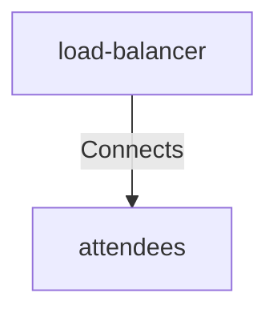

# Load Balancer Attendees

## Details

    <table>
        <tbody>
        <tr>
            <th>Unique Id</th>
            <td>load-balancer-attendees</td>
        </tr>
        <tr>
            <th>Description</th>
            <td>Forward</td>
        </tr>
        <tr>
            <th>Protocol</th>
            <td>mTLS</td>
        </tr>
        </tbody>
    </table>

## Related Nodes

## Controls
### Security

Security Controls for the connection

    <table>
        <thead>
        <tr>
            <th>Key</th>
            <th>Value</th>
        </tr>
        </thead>
        <tbody>
        <tr>
            <td><b>Security 002</b></td>
            <td>
                <table class="nested-table">
                        <tbody>
                        <tr>
                            <td><b>Requirement Url</b></td>
                            <td>
                                https://calm.finos.org/getting-started/controls/permitted-connection.requirement.json
                                    </td>
                        </tr>
                        <tr>
                            <td><b>$schema</b></td>
                            <td>
                                https://calm.finos.org/getting-started/controls/permitted-connection.requirement.json
                                    </td>
                        </tr>
                        <tr>
                            <td><b>Control Id</b></td>
                            <td>
                                security-002
                                    </td>
                        </tr>
                        <tr>
                            <td><b>Name</b></td>
                            <td>
                                Permitted Connection
                                    </td>
                        </tr>
                        <tr>
                            <td><b>Description</b></td>
                            <td>
                                Permits a connection on a relationship specified in the architecture
                                    </td>
                        </tr>
                        <tr>
                            <td><b>Reason</b></td>
                            <td>
                                Required to enable flow between architecture components
                                    </td>
                        </tr>
                        <tr>
                            <td><b>Protocol</b></td>
                            <td>
                                HTTP
                                    </td>
                        </tr>
                        </tbody>
                    </table>
            </td>
        </tr>
        </tbody>
    </table>

## Metadata

No metadata defined.

