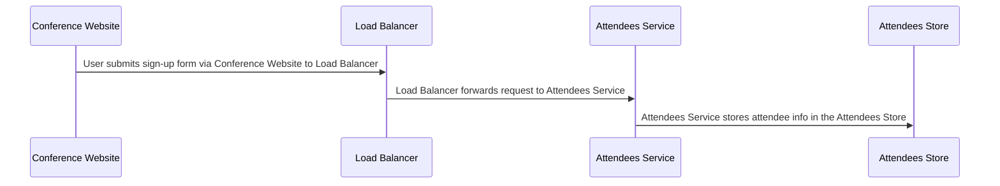

## Details

| Field               | Value                    |
|---------------------|--------------------------|
| **Unique ID**       | flow-conference-signup                   |
| **Name**            | Conference Signup Flow                 |
| **Description**     | Flow for registering a user through the conference website and storing their details in the attendee database.          |

## Sequence Diagram

## Controls
    _No controls defined._

## Metadata
  _No Metadata defined._
