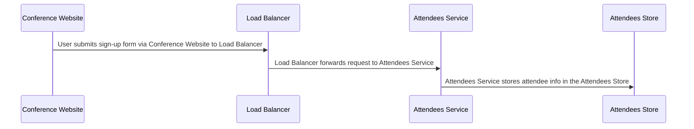

# Conference Signup Flow

## Details

    <table>
        <tbody>
        <tr>
            <th>Unique Id</th>
            <td>flow-conference-signup</td>
        </tr>
        <tr>
            <th>Name</th>
            <td>Conference Signup Flow</td>
        </tr>
        <tr>
            <th>Description</th>
            <td>Flow for registering a user through the conference website and storing their details in the attendee database.</td>
        </tr>
        </tbody>
    </table>

## Sequence Diagram

## Controls
_No controls defined._

## Metadata

No metadata defined.

