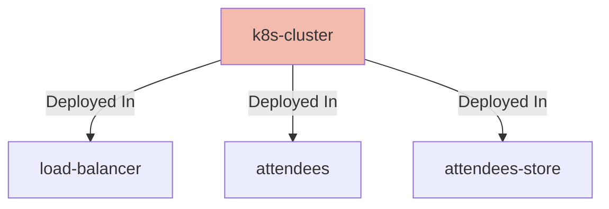

## Details

| Field               | Value                    |
|---------------------|--------------------------|
| **Unique ID**       | k8s-cluster                   |
| **Node Type**       | system             |
| **Name**            | Kubernetes Cluster                 |
| **Description**     | Kubernetes Cluster with network policy rules enabled          |

## Interfaces
    _No interfaces defined._

## Related Nodes

## Controls

        ### Security

        Security requirements for the Kubernetes cluster

        

            <table>
                <thead>
                <tr>
                    <th>Requirement URL</th>
                    <th>Config</th>
                </tr>
                </thead>
                <tbody>
                    <tr>
                        <td>
                                <a href="https://calm.finos.org/getting-started/controls/micro-segmentation.requirement.json" target="_blank">
                                    https://calm.finos.org/getting-started/controls/micro-segmentation.requirement.json
                                </a>
                        </td>

                        <td>
                                <a href="https://calm.finos.org/getting-started/controls/micro-segmentation.config.json" target="_blank">
                                    https://calm.finos.org/getting-started/controls/micro-segmentation.config.json
                                </a>

                        </td>
                    </tr>
                </tbody>
            </table>
        

## Metadata
  _No Metadata defined._
