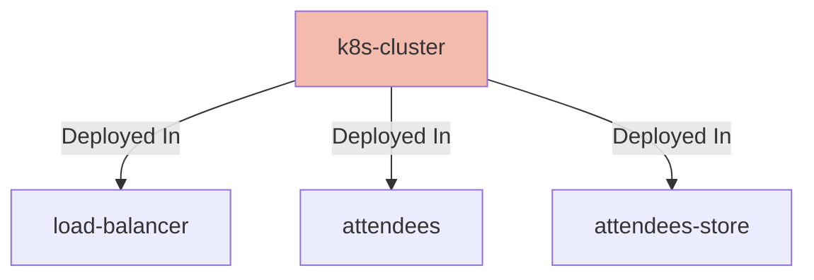

## Details

| Field               | Value                    |
|---------------------|--------------------------|
| **Unique ID**       | k8s-cluster                   |
| **Node Type**       | system             |
| **Name**            | Kubernetes Cluster                 |
| **Description**     | Kubernetes Cluster with network policy rules enabled          |
| **Data Classification** |  |
| **Run As**          |                 |

## Interfaces
    _No interfaces defined._

## Related Nodes

## Controls

        ### Security

        Security requirements for the Kubernetes cluster

            

                <table>
                    <thead>
                    <tr>
                        <th>Key</th>
                        <th>Value</th>
                    </tr>
                    </thead>
                    <tbody>
                    <tr>
                        <td>
                            <b>$schema</b>
                        </td>
                        <td>
                            https://calm.finos.org/getting-started/controls/micro-segmentation.requirement.json
                                </td>
                    </tr>
                    <tr>
                        <td>
                            <b>$id</b>
                        </td>
                        <td>
                            https://calm.finos.org/getting-started/controls/micro-segmentation.config.json
                                </td>
                    </tr>
                    <tr>
                        <td>
                            <b>Control Id</b>
                        </td>
                        <td>
                            security-001
                                </td>
                    </tr>
                    <tr>
                        <td>
                            <b>Name</b>
                        </td>
                        <td>
                            Micro-segmentation of Kubernetes Cluster
                                </td>
                    </tr>
                    <tr>
                        <td>
                            <b>Description</b>
                        </td>
                        <td>
                            Micro-segmentation in place to prevent lateral movement outside of permitted flows
                                </td>
                    </tr>
                    <tr>
                        <td>
                            <b>Permit Ingress</b>
                        </td>
                        <td>
                            true
                                </td>
                    </tr>
                    <tr>
                        <td>
                            <b>Permit Egress</b>
                        </td>
                        <td>
                            false
                                </td>
                    </tr>
                    </tbody>
                </table>
            

## Metadata
  _No Metadata defined._
